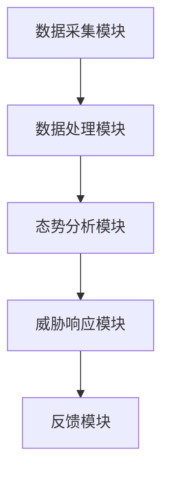
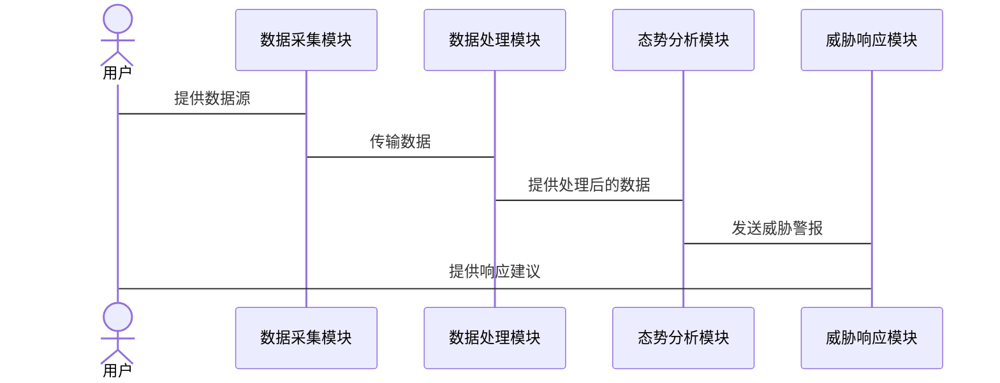

                 


# AI Agent在企业网络安全态势感知与威胁响应中的应用

---

## 关键词：  
AI Agent, 网络安全, 态势感知, 威胁响应, 企业安全, 人工智能

---

## 摘要：  
随着企业网络环境的复杂化和网络攻击的智能化，传统的网络安全防护手段已难以应对日益复杂的威胁。本文探讨了AI Agent在企业网络安全态势感知与威胁响应中的应用，重点分析了AI Agent的核心概念、技术原理、系统架构以及实际应用场景。通过详细阐述AI Agent在数据收集与分析、异常检测、自动响应等方面的优势，本文展示了如何利用AI Agent提升企业网络安全的智能化水平，实现对网络安全态势的实时感知和快速响应。

---

## 第一部分：AI Agent在企业网络安全态势感知与威胁响应中的应用概述

### 第1章：企业网络安全态势感知与威胁响应的背景与挑战

#### 1.1 当前企业网络安全的现状与挑战  
企业网络环境日益复杂，网络攻击手段不断进化，传统的基于规则的防护手段已难以应对未知威胁。企业需要一种更加智能化、动态化的安全解决方案来应对这些挑战。

##### 1.1.1 当前企业网络安全的主要威胁  
- 网络攻击：如勒索软件、钓鱼攻击、DDoS攻击等。  
- 内部威胁：如员工误操作或恶意行为。  
- 高级持续性威胁（APT）：通过长期潜伏和隐蔽的手段窃取企业信息。  

##### 1.1.2 传统网络安全防护的局限性  
- 依赖静态规则，难以应对未知威胁。  
- 响应速度慢，无法及时应对复杂攻击。  
- 数据孤岛问题，难以实现全网联动防护。  

##### 1.1.3 网络安全态势感知的重要性  
网络安全态势感知通过整合多源数据，分析网络安全状态，预测潜在威胁，从而实现对网络安全的整体把控和动态防护。

#### 1.2 AI Agent在网络安全中的作用  
AI Agent是一种能够自主感知环境、分析问题并采取行动的智能体，其在网络安全中的应用为态势感知和威胁响应提供了新的解决方案。

##### 1.2.1 AI Agent的基本概念与特点  
- **定义**：AI Agent是一种具备感知、决策和执行能力的智能体，能够自主完成特定任务。  
- **特点**：自主性、反应性、目标导向、协作性。  

##### 1.2.2 AI Agent在网络安全中的优势  
- **智能化**：能够学习和适应新的威胁模式。  
- **实时性**：能够快速响应动态变化的网络环境。  
- **协作性**：能够与其他智能体协同工作，实现全网联动防护。  

##### 1.2.3 企业网络安全中AI Agent的应用场景  
- **威胁检测**：通过AI算法识别异常流量和潜在威胁。  
- **态势分析**：整合多源数据，分析网络安全状态。  
- **自动响应**：根据威胁等级自动触发防护措施。  

---

### 第2章：AI Agent的核心概念与技术原理

#### 2.1 AI Agent的定义与分类  
AI Agent根据功能和应用场景可以分为多种类型，以下是常见的分类：

##### 2.1.1 基于功能的分类  
- **监视型AI Agent**：负责收集和分析网络数据。  
- **决策型AI Agent**：负责分析数据并做出决策。  
- **执行型AI Agent**：负责执行具体的防护动作。  

##### 2.1.2 基于应用场景的分类  
- **网络层AI Agent**：专注于网络流量分析和异常检测。  
- **主机层AI Agent**：专注于主机行为分析和威胁检测。  
- **应用层AI Agent**：专注于应用程序的安全监控与防护。  

#### 2.2 网络安全态势感知的定义与框架  
网络安全态势感知是一个动态、持续的过程，通过整合多源数据，分析网络安全状态，预测潜在威胁，并制定相应的防护策略。

##### 2.2.1 网络安全态势感知的定义  
网络安全态势感知是通过收集、分析和整合多源数据，评估网络安全状态，并预测未来威胁趋势的过程。

##### 2.2.2 网络安全态势感知的框架与流程  
1. **数据收集**：从网络设备、主机、应用程序等来源收集数据。  
2. **数据预处理**：清洗、标准化和整合数据。  
3. **态势分析**：通过机器学习算法分析数据，识别潜在威胁。  
4. **威胁预测**：基于历史数据和当前状态，预测未来威胁趋势。  
5. **态势评估**：根据分析结果，评估当前网络安全状态。  

##### 2.2.3 网络安全态势感知的关键技术  
- **大数据分析**：整合多源异构数据，进行实时分析。  
- **机器学习**：通过训练模型识别异常行为和潜在威胁。  
- **知识图谱**：构建网络安全知识图谱，辅助威胁分析与决策。  

#### 2.3 威胁响应的基本原理与实现方式  
威胁响应是指在检测到威胁后，系统采取的防护措施，以降低威胁的影响。

##### 2.3.1 威胁响应的基本原理  
威胁响应基于威胁的严重性和影响范围，采取相应的防护措施。  
- **自动响应**：根据预设规则或模型预测结果，自动触发防护动作。  
- **人工干预**：在复杂或高风险情况下，需要人工决策。  

##### 2.3.2 威胁响应的实现方式  
1. **基于规则的响应**：根据预定义的规则采取行动。  
2. **基于模型的响应**：根据机器学习模型的预测结果采取行动。  
3. **动态响应**：根据实时威胁情况动态调整响应策略。  

---

### 第3章：AI Agent在网络安全态势感知中的应用

#### 3.1 数据收集与预处理  
数据收集是网络安全态势感知的基础，预处理是确保数据质量的关键步骤。

##### 3.1.1 数据收集的来源与类型  
- **网络流量数据**：包括IP地址、端口号、流量特征等。  
- **主机行为数据**：包括进程创建、文件操作、注册表修改等。  
- **应用程序日志**：包括应用程序的运行状态和错误信息。  
- **安全事件日志**：包括防火墙、入侵检测系统等的安全事件记录。  

##### 3.1.2 数据预处理的方法与流程  
1. **数据清洗**：去除噪声数据和冗余信息。  
2. **数据标准化**：将不同来源的数据格式统一。  
3. **数据整合**：将多源数据整合到统一的数据库中。  
4. **数据增强**：通过特征工程提取有用的信息。  

##### 3.1.3 数据质量与清洗的注意事项  
- 数据清洗时需要注意保留原始数据的完整性和准确性。  
- 数据增强需要结合领域知识，提取有意义的特征。  

#### 3.2 网络安全态势分析与建模  
态势分析是通过分析数据，识别网络安全状态和潜在威胁的过程。

##### 3.2.1 网络安全态势分析的基本方法  
1. **基于统计的方法**：通过统计分析发现异常模式。  
2. **基于机器学习的方法**：通过训练模型识别异常行为。  
3. **基于知识图谱的方法**：通过构建知识图谱辅助分析。  

##### 3.2.2 网络安全态势建模的常用技术  
- **时间序列分析**：用于分析网络安全状态的变化趋势。  
- **聚类分析**：用于识别相似的攻击行为模式。  
- **分类算法**：用于识别特定的威胁类型。  

##### 3.2.3 网络安全态势分析的案例分析  
以DDoS攻击为例，通过机器学习算法识别异常流量模式，预测攻击趋势，并制定相应的防护策略。

#### 3.3 基于AI的异常检测与威胁发现  
异常检测是通过识别偏离正常行为模式的数据，发现潜在威胁的重要手段。

##### 3.3.1 异常检测的基本原理  
异常检测基于统计学或机器学习方法，识别偏离正常模式的数据。

##### 3.3.2 基于AI的威胁发现技术  
1. **基于监督学习的威胁发现**：通过训练分类器识别特定类型的威胁。  
2. **基于无监督学习的威胁发现**：通过聚类分析发现未知威胁。  
3. **基于强化学习的威胁发现**：通过强化学习优化威胁发现模型。  

##### 3.3.3 异常检测与威胁发现的案例分析  
以勒索软件为例，通过训练深度学习模型识别勒索软件的行为特征，提前发现并阻止勒索软件的传播。

---

### 第4章：AI Agent在威胁响应中的应用

#### 4.1 威胁响应的流程与策略  
威胁响应需要根据威胁的严重性和影响范围，制定相应的响应策略。

##### 4.1.1 威胁响应的基本流程  
1. **威胁检测**：通过AI Agent检测到潜在威胁。  
2. **威胁评估**：评估威胁的严重性和影响范围。  
3. **响应决策**：根据评估结果制定响应策略。  
4. **响应执行**：执行响应策略，阻止或缓解威胁。  
5. **响应结果反馈**：记录响应结果，并更新威胁响应模型。  

##### 4.1.2 威胁响应的策略与原则  
- **最小化破坏原则**：优先采取能够最小化威胁影响的响应措施。  
- **快速响应原则**：在尽可能短的时间内采取响应措施。  
- **动态调整原则**：根据威胁变化动态调整响应策略。  

##### 4.1.3 威胁响应的优先级与分类  
威胁响应的优先级取决于威胁的严重性和影响范围，常见的分类包括：  
- **紧急响应**：针对高危威胁，立即采取行动。  
- **重要响应**：针对中危威胁，优先处理。  
- **一般响应**：针对低危威胁，后续处理。  

#### 4.2 基于AI的自动响应机制  
AI Agent可以通过自动响应机制，快速应对网络安全威胁。

##### 4.2.1 自动响应的基本原理  
自动响应基于预设规则或机器学习模型的预测结果，自动触发防护措施。

##### 4.2.2 基于AI的自动响应技术  
1. **基于规则的自动响应**：根据预定义的规则自动执行响应动作。  
2. **基于模型的自动响应**：根据机器学习模型的预测结果自动执行响应动作。  
3. **动态自动响应**：根据实时威胁情况动态调整自动响应策略。  

##### 4.2.3 自动响应的实现案例  
以DDoS攻击为例，AI Agent可以通过自动流量清洗、自动封禁攻击源等措施，快速响应并阻止攻击。

#### 4.3 威胁响应的效果评估与优化  
威胁响应的效果评估是优化威胁响应策略的重要步骤。

##### 4.3.1 威胁响应效果的评估指标  
- **响应时间**：从检测到威胁到采取响应措施的时间。  
- **响应成功率**：威胁响应的实际效果，如是否成功阻止威胁。  
- **响应成本**：响应措施的资源消耗和潜在影响。  

##### 4.3.2 威胁响应的优化方法  
1. **优化响应规则**：根据实际效果调整预定义规则。  
2. **优化响应模型**：根据新数据重新训练机器学习模型。  
3. **优化响应流程**：简化响应流程，提高响应效率。  

##### 4.3.3 威胁响应的持续改进策略  
通过持续监控和分析威胁响应的效果，不断优化威胁响应策略，提升威胁响应能力。

---

### 第5章：系统架构与实现方案

#### 5.1 系统架构设计  
系统架构设计是实现AI Agent在企业网络安全中的应用的关键。

##### 5.1.1 问题场景介绍  
企业网络环境复杂，需要一种智能化的网络安全解决方案，实现对网络安全态势的实时感知和快速响应。

##### 5.1.2 项目介绍  
本项目旨在开发一种基于AI Agent的企业网络安全态势感知与威胁响应系统，实现对企业网络的实时监控和动态防护。

##### 5.1.3 系统功能设计  
- **数据采集模块**：负责收集网络流量、主机行为、应用程序日志等多源数据。  
- **数据处理模块**：对收集到的数据进行清洗、标准化和整合。  
- **态势分析模块**：通过机器学习算法分析数据，识别潜在威胁。  
- **威胁响应模块**：根据威胁评估结果，采取相应的响应措施。  

##### 5.1.4 系统架构设计  
以下是系统的整体架构图：



##### 5.1.5 系统接口设计  
- **数据采集接口**：与网络设备、主机和应用程序日志源对接。  
- **数据处理接口**：与数据存储系统对接。  
- **态势分析接口**：与机器学习模型对接。  
- **威胁响应接口**：与安全防护设备对接。  

##### 5.1.6 系统交互设计  
以下是系统的交互流程图：



#### 5.2 核心算法实现与代码示例  

##### 5.2.1 异常检测算法实现  
以下是一个基于Isolation Forest算法的异常检测代码示例：

```python
from sklearn.ensemble import IsolationForest
import numpy as np

# 生成正常数据
normal_data = np.random.normal(0, 1, size=(100, 2))
# 生成异常数据
outlier_data = np.random.uniform(10, 20, size=(20, 2))

# 训练异常检测模型
model = IsolationForest(n_estimators=100, contamination=0.05)
model.fit(normal_data)

# 预测异常数据
outlier_labels = model.predict(outlier_data)
print("异常检测结果：", outlier_labels)
```

##### 5.2.2 威胁响应算法实现  
以下是一个基于强化学习的威胁响应策略示例：

```python
import numpy as np

# 定义状态空间
states = ['low', 'medium', 'high']
# 定义动作空间
actions = ['block', 'allow', 'monitor']

# 定义奖励函数
def reward_function(current_state, action):
    if action == 'block' and current_state == 'high':
        return 1
    elif action == 'allow' and current_state == 'low':
        return 1
    else:
        return 0

# 强化学习模型训练
# （此处省略具体训练代码）
```

---

## 总结  
通过本文的分析，我们可以看到AI Agent在企业网络安全态势感知与威胁响应中的巨大潜力。AI Agent不仅可以提高网络安全防护的智能化水平，还能通过实时数据分析和动态响应，显著提升企业的网络安全能力。未来，随着AI技术的不断进步，AI Agent在网络安全中的应用将更加广泛，为企业提供更加智能化、动态化的安全解决方案。

---

## 作者：AI天才研究院/AI Genius Institute & 禅与计算机程序设计艺术 /Zen And The Art of Computer Programming

