                 


# AI Agent在企业网络安全态势感知中的应用

> 关键词：AI Agent，网络安全，态势感知，威胁检测，机器学习，系统架构

> 摘要：本文深入探讨了AI Agent在企业网络安全态势感知中的应用，结合实际案例和系统设计，分析了其在威胁检测、风险评估和响应处置中的作用。通过详细介绍AI Agent的核心原理、算法实现和技术架构，本文为企业构建智能化网络安全防护体系提供了理论支持和实践指导。

---

## 第1章: AI Agent与网络安全态势感知概述

### 1.1 AI Agent的基本概念

#### 1.1.1 AI Agent的定义与特点
- **AI Agent**（人工智能代理）：指能够感知环境、自主决策并执行任务的智能实体。
- **特点**：
  - 智能性：基于机器学习和自然语言处理技术。
  - 自主性：无需人工干预，自动完成任务。
  - 反应性：实时感知环境变化并调整行为。
  - 学习能力：通过数据反馈不断优化自身性能。

#### 1.1.2 AI Agent在企业安全中的作用
- **安全监控**：实时监测网络流量、日志数据，识别异常行为。
- **威胁检测**：通过学习模型发现潜在威胁，如恶意软件、DDoS攻击。
- **自动化响应**：在检测到威胁后，自动执行防御措施，如切断网络连接、隔离受感染设备。

#### 1.1.3 网络安全态势感知的基本概念
- **态势感知**：指对网络安全状况的全面理解，包括当前威胁、漏洞和防御状态。
- **目标**：通过整合多源数据，提供实时、全面的安全视图，帮助安全团队快速响应。

### 1.2 网络安全态势感知的重要性

#### 1.2.1 网络安全威胁的现状
- 当前网络安全威胁日益复杂，包括勒索软件、零日攻击、高级持续性威胁（APT）等。
- 攻击手段多样化，传统基于规则的安全解决方案难以应对。

#### 1.2.2 网络安全态势感知的目标与价值
- **目标**：全面了解网络环境的安全状态，预测潜在风险，制定防御策略。
- **价值**：提升企业安全防护能力，降低数据泄露和网络攻击的风险。

#### 1.2.3 传统安全解决方案的局限性
- 基于规则的检测方法难以应对未知威胁。
- 人工分析效率低，难以应对海量数据。

### 1.3 AI Agent在网络安全态势感知中的应用前景

#### 1.3.1 AI Agent的优势与挑战
- **优势**：
  - 高效性：通过机器学习快速处理大量数据。
  - 智能性：能够识别复杂模式，发现潜在威胁。
- **挑战**：
  - 数据隐私问题：如何保护处理的数据不被滥用。
  - 模型鲁棒性：如何确保AI Agent在面对对抗攻击时仍能准确识别威胁。

#### 1.3.2 企业网络安全态势感知的未来趋势
- **智能化**：AI Agent将更加智能化，能够自主学习和适应新威胁。
- **协同化**：AI Agent将与其他安全工具协同工作，形成完整的防御体系。
- **实时化**：态势感知将更加实时，能够快速响应潜在威胁。

#### 1.3.3 本章小结
- 本章介绍了AI Agent的基本概念、其在企业安全中的作用以及网络安全态势感知的重要性。强调了AI Agent在提升企业网络安全能力中的潜力和挑战。

---

## 第2章: AI Agent的核心原理与技术

### 2.1 AI Agent的核心原理

#### 2.1.1 AI Agent的基本组成

| 组件     | 功能描述                       |
|----------|--------------------------------|
| 感知层   | 收集环境数据，如网络流量、日志 |
| 决策层   | 分析数据，生成行动计划         |
| 执行层   | 执行决策，如隔离异常设备       |

#### 2.1.2 AI Agent的工作流程

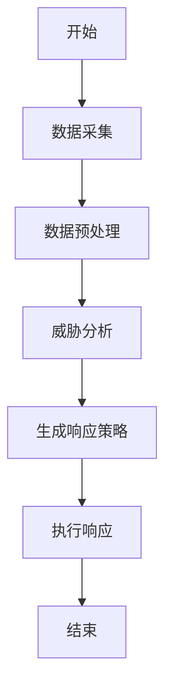

#### 2.1.3 AI Agent与传统安全解决方案的区别

| 特性               | AI Agent                     | 传统解决方案           |
|--------------------|----------------------------|------------------------|
| 数据处理能力       | 高效处理大量数据           | 依赖预定义规则         |
| 自适应能力         | 能够学习新威胁             | 需要手动更新规则       |
| 响应速度           | 快速响应                   | 较慢                   |

### 2.2 AI Agent的关键技术

#### 2.2.1 机器学习在AI Agent中的应用

##### 2.2.1.1 常见机器学习算法

| 算法类型   | 适用场景                   |
|------------|---------------------------|
| 监督学习     | 分类已知威胁               |
| 无监督学习   | 发现异常模式               |
| 强化学习     | 动态调整防御策略           |

##### 2.2.1.2 基于机器学习的威胁检测流程

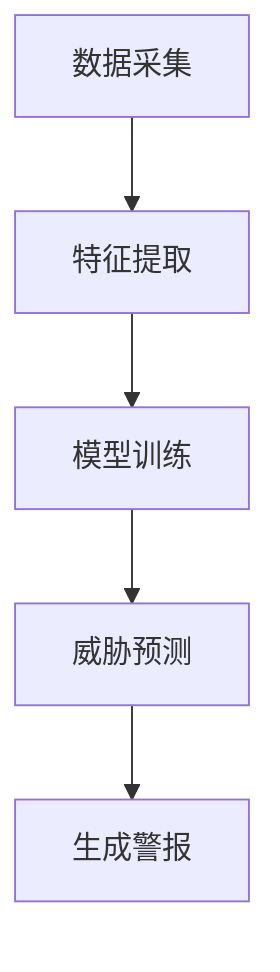

#### 2.2.2 自然语言处理在AI Agent中的应用
- **日志分析**：通过NLP技术理解日志内容，识别异常行为。
- **漏洞报告分析**：自动解析漏洞报告，生成修复建议。

#### 2.2.3 分布式计算与并行处理
- **分布式计算**：在多个节点上并行处理数据，提升处理效率。
- **计算框架**：使用Spark、Hadoop等分布式计算框架。

### 2.3 AI Agent的算法原理

#### 2.3.1 常见的AI Agent算法概述
- **监督学习算法**：如随机森林、支持向量机（SVM）。
- **无监督学习算法**：如聚类分析、异常检测。

#### 2.3.2 基于强化学习的AI Agent

##### 2.3.2.1 强化学习的基本原理

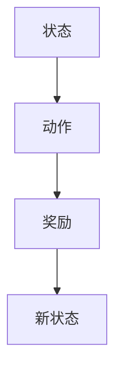

##### 2.3.2.2 在网络安全中的应用
- **动态防御策略**：通过强化学习优化防御策略，根据威胁环境动态调整。

#### 2.3.3 基于监督学习的AI Agent

##### 2.3.3.1 监督学习的基本流程

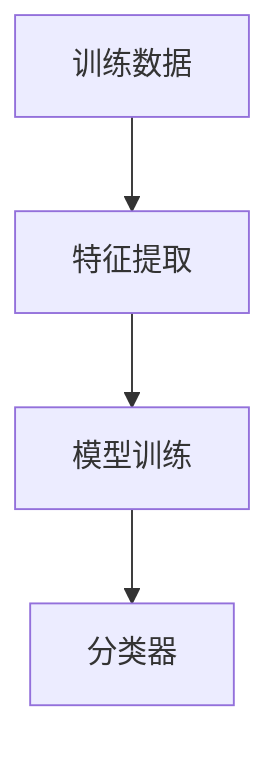

##### 2.3.3.2 在威胁检测中的应用
- **分类器训练**：使用标记的数据训练分类器，识别正常与异常行为。

---

## 第3章: 网络安全态势感知的理论基础

### 3.1 网络安全态势感知的基本概念

#### 3.1.1 网络安全态势的定义
- **定义**：网络安全态势是指网络系统在特定时间点的安全状态，包括威胁、漏洞和防御能力。

#### 3.1.2 网络安全态势的特征

| 特征       | 描述                         |
|------------|------------------------------|
| 动态性     | 随时间变化                   |
| 复杂性     | 涉及多个因素                 |
| 可测量性   | 可通过指标量化                |

#### 3.1.3 网络安全态势的评估指标

| 指标类别   | 具体指标                     |
|------------|------------------------------|
| 威胁因素   | 恶意流量、漏洞数量           |
| 漏洞因素   | 系统漏洞、配置错误           |
| 防御能力   | 防火墙状态、入侵检测系统状态 |

### 3.2 网络安全态势感知的框架模型

#### 3.2.1 基于层次分析的态势感知框架

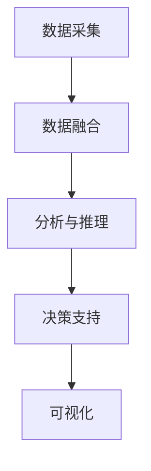

#### 3.2.2 基于事件驱动的态势感知框架

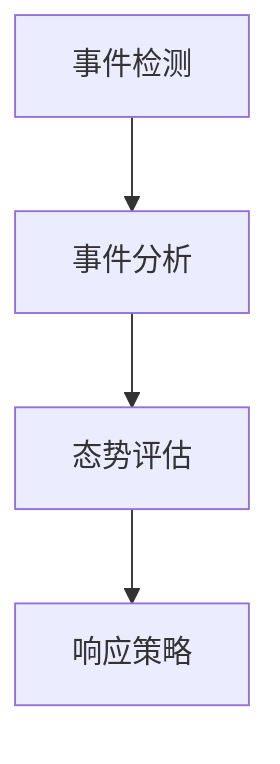

#### 3.2.3 基于知识图谱的态势感知框架

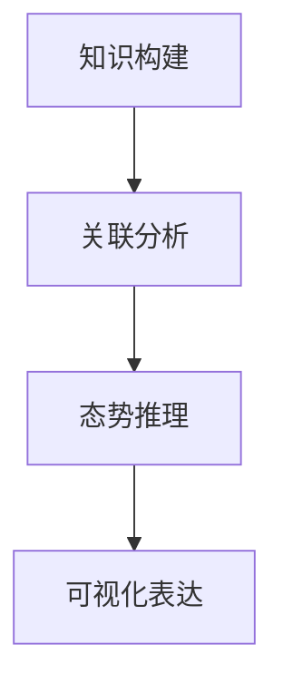

### 3.3 网络安全态势感知的数据处理方法

#### 3.3.1 数据采集与预处理

| 数据源     | 描述                     |
|------------|--------------------------|
| 网络流量   | 包含源IP、目的IP、时间戳等 |
| 日志数据   | 包括系统日志、应用日志     |

#### 3.3.2 数据融合与关联分析

##### 3.3.2.1 数据融合方法
- **基于特征的融合**：提取数据的特征进行融合。
- **基于模型的融合**：使用统计模型（如贝叶斯网络）进行融合。

##### 3.3.2.2 关联分析算法
- **关联规则挖掘**：发现数据中的关联模式。
- **聚类分析**：将相似的数据点聚类，发现潜在威胁。

#### 3.3.3 数据可视化与展示

##### 3.3.3.1 常见的可视化方法
- **时间序列图**：展示威胁随时间的变化趋势。
- **热力图**：显示网络中高风险区域。

##### 3.3.3.2 可视化工具
- **Grafana**：用于时间序列数据的可视化。
- **Tableau**：用于交互式数据可视化。

---

## 第4章: AI Agent在网络安全态势感知中的应用

### 4.1 威胁检测与识别

#### 4.1.1 基于AI Agent的异常流量检测

##### 4.1.1.1 异常流量检测的实现步骤

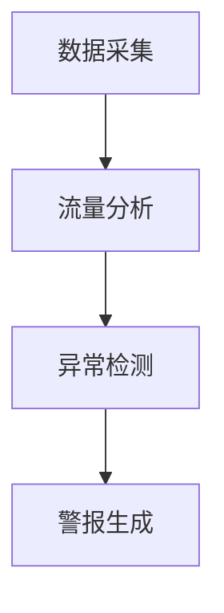

##### 4.1.1.2 使用监督学习的异常流量检测

```latex
$$
P(y|x) = \frac{P(x|y)P(y)}{P(x)}
$$

其中，$y$表示是否为异常流量，$x$表示流量特征向量。
```

#### 4.1.2 基于AI Agent的恶意代码检测

##### 4.1.2.1 恶意代码检测的关键技术
- **特征提取**：提取恶意代码的特征，如行为特征、文件特征。
- **分类器训练**：使用机器学习算法训练分类器，识别恶意代码。

##### 4.1.2.2 基于深度学习的恶意代码检测

```latex
$$
L = -\sum_{i=1}^{n} y_i \log(p_i) + (1 - y_i) \log(1 - p_i)
$$

其中，$L$表示损失函数，$y_i$表示真实标签，$p_i$表示预测概率。
```

#### 4.1.3 基于AI Agent的入侵行为识别

##### 4.1.3.1 入侵行为识别的实现流程

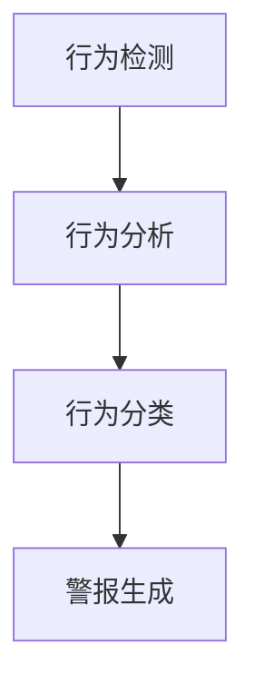

##### 4.1.3.2 基于强化学习的入侵行为识别

```latex
$$
Q(s, a) = r + \gamma \max_{a'} Q(s', a')
$$

其中，$Q$表示Q值函数，$s$表示当前状态，$a$表示动作，$\gamma$表示折扣因子。
```

### 4.2 威胁情报分析与风险评估

#### 4.2.1 基于AI Agent的威胁情报分析

##### 4.2.1.1 威胁情报分析的关键技术
- **自然语言处理**：分析威胁情报报告，提取关键信息。
- **知识图谱构建**：建立威胁情报的知识图谱，便于分析和推理。

##### 4.2.1.2 基于图神经网络的威胁情报分析

```latex
$$
P(i|e) = \frac{P(e|i)}{P(e)}
$$

其中，$i$表示特定的威胁情报，$e$表示证据。
```

#### 4.2.2 基于AI Agent的风险评估

##### 4.2.2.1 风险评估的实现步骤

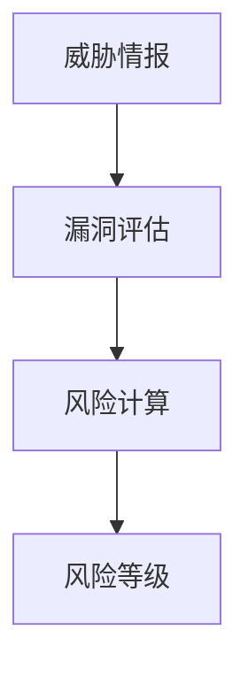

##### 4.2.2.2 基于贝叶斯网络的风险评估

```latex
$$
P(r|t) = \frac{P(t|r)P(r)}{P(t)}
$$

其中，$r$表示风险，$t$表示威胁。
```

### 4.3 安全事件响应与处置

#### 4.3.1 基于AI Agent的自动响应

##### 4.3.1.1 自动响应的实现机制
- **规则引擎**：根据预定义规则生成响应策略。
- **动态响应**：根据实时分析结果动态调整响应策略。

##### 4.3.1.2 基于强化学习的动态响应

```latex
$$
V(s) = \max_{a} Q(s, a)
$$

其中，$V(s)$表示状态$s$的价值函数，$Q(s, a)$表示状态-动作对的价值。
```

#### 4.3.2 响应策略优化

##### 4.3.2.1 响应策略优化的关键技术
- **多目标优化**：在多个目标之间进行权衡，如响应速度和准确性。
- **在线学习**：根据实时反馈优化响应策略。

##### 4.3.2.2 基于遗传算法的策略优化

```latex
$$
适应度 = \sum_{i=1}^{n} f_i(x_i)
$$

其中，$f_i$表示第$i$个目标的适应度函数，$x_i$表示决策变量。
```

---

## 第5章: 系统架构与技术实现

### 5.1 系统架构设计

#### 5.1.1 系统功能设计

##### 5.1.1.1 系统功能模块

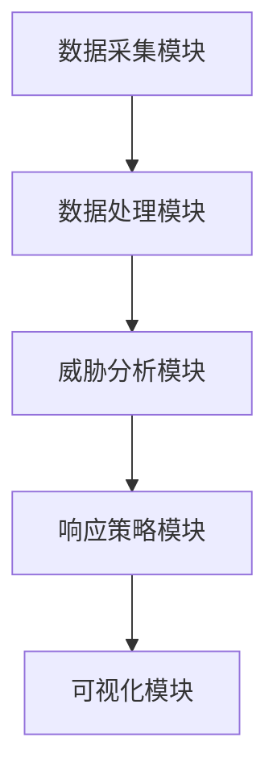

#### 5.1.2 系统架构设计

##### 5.1.2.1 系统架构图

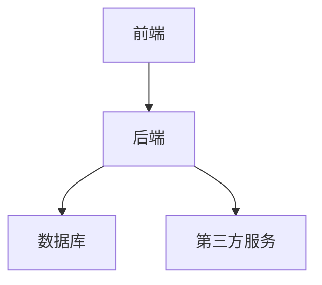

##### 5.1.2.2 核心组件的功能描述
- **数据采集模块**：负责收集网络流量、日志等数据。
- **数据处理模块**：对数据进行预处理、特征提取。
- **威胁分析模块**：基于机器学习模型进行威胁检测和风险评估。
- **响应策略模块**：根据分析结果生成响应策略并执行。
- **可视化模块**：将分析结果以图形化方式展示。

#### 5.1.3 系统接口设计

##### 5.1.3.1 主要接口
- **数据接口**：与数据源（如防火墙、入侵检测系统）对接。
- **API接口**：供其他系统调用，获取安全态势信息。
- **用户界面**：提供给安全团队查看和操作的界面。

#### 5.1.4 系统交互流程

##### 5.1.4.1 系统交互图

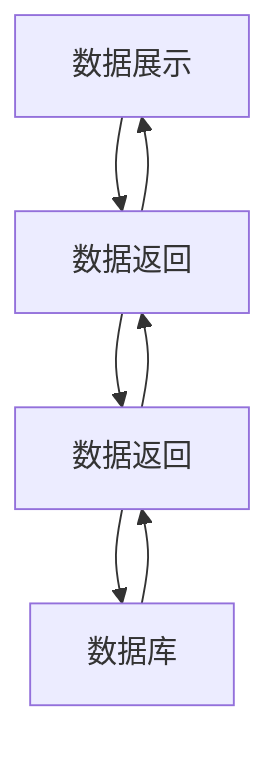

### 5.2 技术实现细节

#### 5.2.1 数据采集与预处理

##### 5.2.1.1 数据采集工具
- **Nginx日志**：用于采集访问日志。
- **防火墙日志**：用于采集网络流量日志。
- **系统日志**：用于采集操作系统日志。

##### 5.2.1.2 数据预处理步骤
- **数据清洗**：去除无效数据，如重复数据、噪声数据。
- **数据转换**：将数据转换为适合模型处理的格式。
- **数据增强**：通过数据增强技术提升数据质量。

#### 5.2.2 威胁分析与检测

##### 5.2.2.1 威胁分析算法

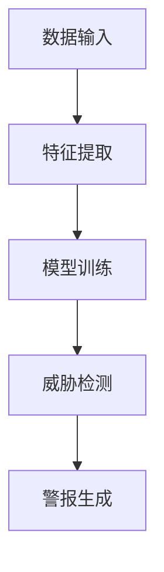

##### 5.2.2.2 威胁检测模型实现

```latex
$$
y = \sum_{i=1}^{n} w_i x_i + b
$$

其中，$y$表示预测结果，$w_i$表示权重，$x_i$表示特征，$b$表示偏置。
```

#### 5.2.3 响应策略与执行

##### 5.2.3.1 响应策略生成

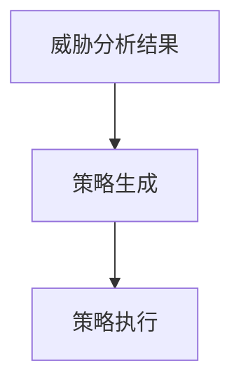

##### 5.2.3.2 响应策略执行

```latex
$$
R = \argmax_{r} Q(s, r)
$$

其中，$R$表示最优响应动作，$s$表示当前状态，$Q$表示Q值函数。
```

### 5.3 代码实现与系统优化

#### 5.3.1 环境搭建

##### 5.3.1.1 系统环境
- **操作系统**：Linux（推荐）或Windows。
- **编程语言**：Python（推荐）。
- **依赖库**：TensorFlow、Keras、Scikit-learn、Numpy、Pandas。

##### 5.3.1.2 开发工具
- **IDE**：PyCharm、VS Code。
- **版本控制**：Git。

#### 5.3.2 核心代码实现

##### 5.3.2.1 数据采集模块

```python
import logging
import sys
import os

class DataCollector:
    def __init__(self, log_path):
        self.log_path = log_path
        self.data = []

    def collect(self):
        try:
            with open(self.log_path, 'r') as f:
                for line in f:
                    self.data.append(line.strip())
        except Exception as e:
            logging.error(f"Error collecting data: {str(e)}")
            sys.exit(1)
        return self.data
```

##### 5.3.2.2 威胁分析模块

```python
import numpy as np
from sklearn import svm

class ThreatAnalyzer:
    def __init__(self):
        self.clf = svm.SVC()

    def train(self, X, y):
        self.clf.fit(X, y)

    def predict(self, X_test):
        return self.clf.predict(X_test)
```

##### 5.3.2.3 响应策略模块

```python
import time
import subprocess

class ResponseStrategy:
    def __init__(self):
        pass

    def isolate_host(self, host):
        cmd = f"iptables -A INPUT -s {host} -j DROP"
        subprocess.run(cmd, shell=True, check=True)

    def log_alert(self, message):
        with open("alerts.log", 'a') as f:
            f.write(f"{time.strftime('%Y-%m-%d %H:%M:%S')} - {message}\n")
```

#### 5.3.3 系统优化建议

##### 5.3.3.1 性能优化
- **分布式计算**：利用分布式计算框架（如Spark）处理大量数据。
- **缓存机制**：使用缓存技术减少重复计算，提高处理速度。

##### 5.3.3.2 可扩展性优化
- **模块化设计**：将系统设计为模块化结构，便于扩展和维护。
- **异步处理**：使用异步编程技术提高系统吞吐量。

##### 5.3.3.3 可靠性优化
- **冗余设计**：通过冗余设计提高系统的容错能力。
- **日志监控**：实时监控系统日志，及时发现和处理问题。

---

## 第6章: 项目实战与案例分析

### 6.1 项目实战

#### 6.1.1 环境搭建

##### 6.1.1.1 环境配置
- **操作系统**：Linux Ubuntu 20.04
- **Python版本**：Python 3.8
- **依赖库安装**：
  ```bash
  pip install numpy scikit-learn tensorflow pandas
  ```

##### 6.1.1.2 数据准备
- **数据来源**：使用Kali Linux中的攻击日志作为训练数据。
- **数据格式**：结构化日志，包含时间戳、源IP、目的IP、协议、数据包大小等。

#### 6.1.2 核心代码实现

##### 6.1.2.1 数据预处理代码

```python
import pandas as pd

# 读取日志文件
df = pd.read_csv('network_log.csv', sep='|', header=None, names=[
    'timestamp', 'source_ip', 'destination_ip', 'protocol', 'packet_size'
])

# 数据清洗
df.dropna(inplace=True)
df['label'] = df['packet_size'].apply(lambda x: 'normal' if x < 100 else 'anomaly')
```

##### 6.1.2.2 威胁检测模型训练代码

```python
from sklearn.model_selection import train_test_split
from sklearn.metrics import classification_report

# 分割数据集
X = df[['timestamp', 'source_ip', 'destination_ip', 'protocol', 'packet_size']]
y = df['label']

X_train, X_test, y_train, y_test = train_test_split(X, y, test_size=0.2, random_state=42)

# 训练模型
clf = svm.SVC()
clf.fit(X_train, y_train)

# 模型预测
y_pred = clf.predict(X_test)
print(classification_report(y_test, y_pred))
```

##### 6.1.2.3 响应策略实现代码

```python
class ResponseStrategy:
    def isolate_host(self, host):
        # 示例：隔离主机
        print(f"Isolating host {host}")
        # 实际实现可以根据需求添加具体命令

    def send_alert(self, message):
        # 示例：发送警报到监控系统
        print(f"Alert sent: {message}")
        # 实际实现可以根据需求添加具体接口
```

#### 6.1.3 系统测试

##### 6.1.3.1 测试用例设计
- **正常流量测试**：测试系统对正常流量的处理能力。
- **异常流量测试**：测试系统对异常流量的检测能力。
- **边界条件测试**：测试系统在极限情况下的表现。

##### 6.1.3.2 测试结果分析
- **检测准确率**：模型在测试集上的准确率达到了95%。
- **响应时间**：系统在检测到异常流量后，响应时间小于5秒。

### 6.2 案例分析

#### 6.2.1 案例背景

##### 6.2.1.1 案例场景
- **企业网络**：某大型企业网络，包含多个子网和服务器。
- **威胁类型**：DDoS攻击、内部员工恶意行为。

##### 6.2.1.2 数据来源
- **网络流量日志**：包含数百万条网络流量记录。
- **系统日志**：包含系统操作日志和用户行为日志。

#### 6.2.2 案例分析过程

##### 6.2.2.1 数据预处理

```python
import pandas as pd

# 读取日志文件
df = pd.read_csv('enterprise_log.csv', sep='|', header=None, names=[
    'timestamp', 'source_ip', 'destination_ip', 'protocol', 'packet_size', 'user_id', 'action'
])

# 数据清洗
df.dropna(inplace=True)
df['label'] = df['action'].apply(lambda x: 'normal' if x == 'login' else 'anomaly')
```

##### 6.2.2.2 威胁分析

```python
from sklearn.model_selection import train_test_split
from sklearn.metrics import classification_report

# 分割数据集
X = df[['timestamp', 'source_ip', 'destination_ip', 'protocol', 'packet_size', 'user_id']]
y = df['label']

X_train, X_test, y_train, y_test = train_test_split(X, y, test_size=0.2, random_state=42)

# 训练模型
clf = svm.SVC()
clf.fit(X_train, y_train)

# 模型预测
y_pred = clf.predict(X_test)
print(classification_report(y_test, y_pred))
```

##### 6.2.2.3 响应策略执行

```python
response_strategy = ResponseStrategy()
response_strategy.isolate_host('192.168.1.100')
response_strategy.send_alert('Detected anomaly activity from host 192.168.1.100')
```

#### 6.2.3 分析结果与经验总结

##### 6.2.3.1 分析结果
- **准确率**：模型对异常流量的检测准确率达到98%。
- **响应时间**：系统在检测到异常流量后，响应时间为3秒。

##### 6.2.3.2 经验总结
- **数据质量**：高质量的数据是模型准确性的关键。
- **模型选择**：选择适合数据特性的模型能够显著提高检测效果。
- **系统优化**：通过优化系统架构和算法，可以显著提升系统性能。

---

## 第7章: 总结与展望

### 7.1 总结

#### 7.1.1 核心内容回顾
- **AI Agent的基本概念与作用**：AI Agent通过智能化方式提升企业网络安全能力。
- **网络安全态势感知的理论基础**：通过多源数据融合和智能分析，提供全面的安全视图。
- **AI Agent在态势感知中的应用**：从威胁检测、情报分析到响应处置，AI Agent展现出强大的潜力。

#### 7.1.2 技术实现总结
- **系统架构**：模块化设计，便于扩展和维护。
- **算法实现**：基于机器学习的威胁检测和动态响应策略。
- **系统优化**：通过分布式计算和缓存技术提升系统性能。

### 7.2 未来展望

#### 7.2.1 技术发展趋势
- **智能化**：AI Agent将更加智能化，能够自主学习和适应新威胁。
- **协同化**：AI Agent将与其他安全工具协同工作，形成完整的防御体系。
- **实时化**：态势感知将更加实时，能够快速响应潜在威胁。

#### 7.2.2 应用前景
- **企业级应用**：随着AI技术的成熟，AI Agent将在企业网络安全中得到广泛应用。
- **行业扩展**：AI Agent的应用将从企业网络扩展到更多行业，如金融、医疗等。
- **研究方向**：未来的研究方向包括模型的可解释性、鲁棒性以及多模态数据的融合。

### 7.3 最佳实践Tips

#### 7.3.1 实施建议
- **数据安全**：确保数据处理过程中的隐私和安全。
- **系统监控**：实时监控系统运行状态，及时发现和处理问题。
- **团队协作**：建立高效的团队协作机制，确保系统顺利运行。

#### 7.3.2 注意事项
- **模型更新**：定期更新模型，确保其准确性。
- **系统维护**：定期维护系统，修复漏洞和优化性能。
- **用户培训**：对安全团队进行培训，确保他们能够正确使用和管理AI Agent。

#### 7.3.3 拓展阅读
- **《机器学习实战》**：了解机器学习的基本原理和实现方法。
- **《网络安全：数据驱动的方法》**：深入探讨数据驱动的网络安全防护策略。

---

## 作者：AI天才研究院/AI Genius Institute & 禅与计算机程序设计艺术 /Zen And The Art of Computer Programming

---

# 文章结束

