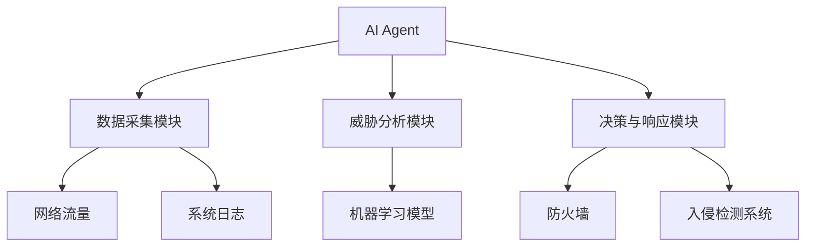
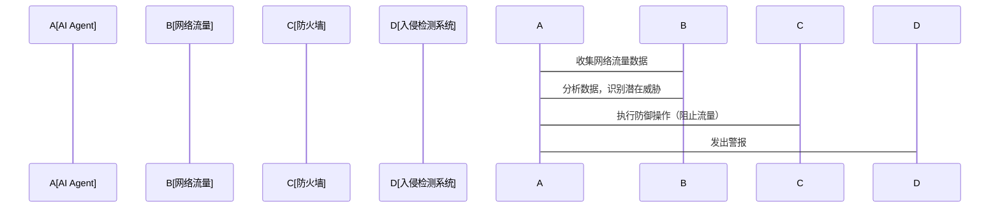

                 


# AI Agent在企业网络安全防御中的前沿应用

> 关键词：AI Agent, 企业网络安全, 机器学习, 强化学习, 智能防御系统, 网络威胁检测

> 摘要：随着网络安全威胁的日益复杂化，传统基于规则的防御系统逐渐显现出其局限性。AI Agent作为一种新兴的智能防御技术，通过结合机器学习、自然语言处理和强化学习等技术，能够实现对企业网络安全的实时监控、智能分析和自主响应。本文将深入探讨AI Agent在企业网络安全防御中的前沿应用，包括其核心概念、算法原理、系统架构设计、项目实战以及实际案例分析。

---

## 第1章 引言

### 1.1 背景介绍

#### 1.1.1 问题背景
随着企业数字化转型的加速，网络安全威胁也在不断进化。传统的基于规则的安全防御系统难以应对未知的、复杂的新型威胁。攻击者利用零日漏洞、高级持续性威胁（APT）等手段，对企业网络发起攻击，传统防御手段显得力不从心。

#### 1.1.2 问题描述
企业网络安全防御系统需要具备以下能力：
- 实时监控网络流量
- 智能识别异常行为
- 自动响应和修复威胁
- 持续优化防御策略

然而，传统的基于规则的系统在以下方面存在明显缺陷：
1. **静态规则**：难以应对动态变化的威胁。
2. **响应延迟**：人工干预和固定规则导致防御响应不够及时。
3. **复杂性**：面对多维度、多层次的攻击，传统系统难以有效应对。

#### 1.1.3 问题解决
AI Agent通过引入智能算法，能够动态分析网络流量，实时识别潜在威胁，并自主执行防御操作。它能够显著提升企业网络安全的主动防御能力。

#### 1.1.4 边界与外延
AI Agent的应用范围不仅限于网络安全，还包括企业运维自动化、数据安全等多个领域。然而，本文仅聚焦于其在企业网络安全防御中的应用。

---

### 1.2 核心概念与联系

#### 1.2.1 核心概念
AI Agent是一种智能代理，具备以下核心特征：
- **自主性**：能够自主决策和行动。
- **反应性**：能够实时感知环境并做出响应。
- **学习能力**：能够通过经验改进自身的防御策略。

#### 1.2.2 核心概念对比
以下是AI Agent与传统安全防御系统的对比：

| 对比维度         | AI Agent                      | 传统安全防御系统                |
|------------------|-------------------------------|--------------------------------|
| 决策方式         | 基于机器学习和实时数据       | 基于固定规则和预定义策略        |
| 响应速度         | 实时响应                     | 延迟响应（需人工干预或固定规则） |
| 适应能力         | 能够自适应新威胁             | 无法有效应对未知威胁             |
| 智能性           | 高度智能化                   | 依赖人工规则                   |

---

## 第2章 AI Agent的核心概念与技术原理

### 2.1 AI Agent的核心概念

#### 2.1.1 AI Agent的组成结构
AI Agent的典型组成包括：
1. **感知层**：负责数据采集和环境感知。
2. **决策层**：基于感知数据进行分析和决策。
3. **执行层**：根据决策结果执行防御操作。

#### 2.1.2 AI Agent的工作原理
AI Agent通过以下步骤实现网络安全防御：
1. **数据采集**：收集网络流量、日志等数据。
2. **特征提取**：对采集的数据进行特征提取。
3. **威胁分析**：基于机器学习模型分析潜在威胁。
4. **决策与响应**：根据分析结果自主执行防御操作。

#### 2.1.3 AI Agent的分类
AI Agent可以根据应用场景分为以下几类：
- **网络层AI Agent**：专注于网络流量分析和入侵检测。
- **应用层AI Agent**：用于应用程序的安全监控和异常检测。
- **数据层AI Agent**：专注于数据加密和数据安全保护。

---

### 2.2 AI Agent的关键技术

#### 2.2.1 机器学习算法在AI Agent中的应用
机器学习是AI Agent的核心技术之一。以下是几种常用的机器学习算法及其应用：

##### 1. 监督学习
- **应用场景**：用于分类已知威胁。
- **算法流程**：
  1. 数据预处理。
  2. 模型训练。
  3. 模型评估。
  4. 预测与分类。

##### 2. 无监督学习
- **应用场景**：用于发现未知威胁。
- **算法流程**：
  1. 数据聚类。
  2. 异常检测。
  3. 威胁识别。

##### 3. 强化学习
- **应用场景**：用于动态调整防御策略。
- **算法流程**：
  1. 状态定义。
  2. 动作选择。
  3. 奖励机制。
  4. 策略优化。

#### 2.2.2 自然语言处理在AI Agent中的应用
自然语言处理（NLP）技术在AI Agent中的应用主要体现在威胁情报分析和日志解读。

##### 1. �威脅情报分析
- **技术手段**：通过NLP技术分析威胁情报报告，提取关键信息。
- **应用场景**：实时更新防御规则。

##### 2. 日志解读
- **技术手段**：利用NLP技术解析系统日志，识别异常行为。
- **应用场景**：自动化日志分析和威胁检测。

#### 2.2.3 强化学习在AI Agent中的应用
强化学习是一种通过试错机制优化决策的技术，非常适合用于动态威胁环境下的防御策略优化。

##### 1. 基于强化学习的威胁响应
- **技术手段**：定义状态空间、动作空间和奖励函数，训练AI Agent在不同状态下的最优响应策略。
- **应用场景**：动态调整防火墙规则、入侵检测系统响应策略等。

---

### 2.3 AI Agent与其他技术的对比分析

#### 2.3.1 AI Agent与传统规则引擎的对比
| 对比维度         | AI Agent                      | 传统规则引擎                  |
|------------------|-------------------------------|-----------------------------|
| 决策依据         | 基于机器学习模型              | 基于预定义规则                |
| 适应能力         | 能够自适应新威胁             | 无法有效应对未知威胁          |
| 响应速度         | 实时响应                     | 延迟响应（需人工干预）        |

#### 2.3.2 AI Agent与入侵检测系统（IDS）的对比
| 对比维度         | AI Agent                      | IDS                          |
|------------------|-------------------------------|-----------------------------|
| 数据分析能力     | 强大的机器学习能力            | 基于规则的模式匹配能力        |
| 响应方式         | 自主执行防御操作             | 发出警报，需人工处理          |
| 适应能力         | 能够自适应新威胁             | 无法有效应对未知威胁          |

---

## 第3章 AI Agent的算法原理与数学模型

### 3.1 基于机器学习的AI Agent算法

#### 3.1.1 机器学习的基本概念
机器学习是一种通过数据训练模型，使其能够做出预测或决策的技术。常用的机器学习算法包括支持向量机（SVM）、随机森林（Random Forest）和神经网络等。

#### 3.1.2 常见的机器学习算法在AI Agent中的应用
##### 1. 支持向量机（SVM）
- **应用场景**：用于分类已知威胁类型。
- **算法流程**：
  1. 数据预处理。
  2. 模型训练。
  3. 模型评估。
  4. 分类预测。

##### 2. 神经网络
- **应用场景**：用于深度学习模型的威胁检测。
- **算法流程**：
  1. 数据预处理。
  2. 构建神经网络模型。
  3. 模型训练。
  4. 模型部署。

#### 3.1.3 基于监督学习的威胁检测算法
##### 1. 数据预处理
- 数据清洗：去除噪声数据。
- 特征提取：提取关键特征，如IP地址、端口号、流量大小等。
- 数据标准化：对数据进行标准化处理，确保模型训练的准确性。

##### 2. 模型训练
- 使用训练数据训练模型。
- 采用交叉验证方法评估模型性能。

##### 3. 模型评估
- 使用测试数据评估模型的准确率、召回率和F1值。

---

### 3.2 基于强化学习的AI Agent算法

#### 3.2.1 强化学习的基本概念
强化学习是一种通过试错机制优化决策的技术。强化学习的核心要素包括状态、动作、奖励和策略。

#### 3.2.2 基于强化学习的威胁响应算法
##### 1. 状态定义
- 状态：网络当前的安全状态，如是否有异常流量、是否有未识别的IP地址等。

##### 2. 动作选择
- 动作：AI Agent可以执行的动作，如允许流量、阻止流量、发出警报等。

##### 3. 奖励机制
- 奖励：根据动作的结果给予奖励或惩罚，优化AI Agent的决策策略。

##### 4. 策略优化
- 使用Q-learning算法优化AI Agent的决策策略。

---

### 3.3 基于生成对抗网络的AI Agent算法

#### 3.3.1 生成对抗网络的基本概念
生成对抗网络（GAN）由生成器和判别器两部分组成，通过对抗训练生成逼真的数据。

#### 3.3.2 基于GAN的威胁生成与防御算法
##### 1. 威胁生成
- 使用生成器生成模拟的网络攻击流量。

##### 2. 威胁检测
- 使用判别器检测生成的攻击流量。

##### 3. 模型优化
- 通过对抗训练优化生成器和判别器，提升威胁检测能力。

---

## 第4章 AI Agent的系统架构与设计

### 4.1 系统架构设计

#### 4.1.1 系统功能设计
AI Agent的系统功能包括：
- **数据采集**：收集网络流量、日志等数据。
- **威胁分析**：分析数据，识别潜在威胁。
- **决策与响应**：根据分析结果执行防御操作。

#### 4.1.2 系统架构图


#### 4.1.3 系统接口设计
- **数据接口**：与网络设备、日志系统等对接，获取数据。
- **防御接口**：与防火墙、入侵检测系统等对接，执行防御操作。

#### 4.1.4 系统交互流程图


---

## 第5章 AI Agent的项目实战

### 5.1 环境安装

#### 5.1.1 系统环境
- 操作系统：Linux（推荐 Ubuntu 20.04）
- 开发工具：Python 3.8以上版本、Jupyter Notebook
- 依赖库：numpy、pandas、scikit-learn、tensorflow、pytorch

#### 5.1.2 安装步骤
```bash
pip install numpy pandas scikit-learn tensorflow pytorch
```

### 5.2 核心实现

#### 5.2.1 数据采集模块
```python
import requests
import json

def collect_data():
    # 收集网络流量数据
    response = requests.get('http://localhost:8080/flow_data')
    data = json.loads(response.text)
    return data
```

#### 5.2.2 威胁分析模块
```python
from sklearn import svm

def train_model(X_train, y_train):
    # 训练SVM模型
    model = svm.SVC()
    model.fit(X_train, y_train)
    return model

def predict威胁类型(model, X_test):
    # 预测威胁类型
    y_pred = model.predict(X_test)
    return y_pred
```

#### 5.2.3 决策与响应模块
```python
def execute_defense(action):
    # 执行防御操作
    if action == 'block':
        requests.post('http://localhost:8080/block_ip', json={'ip': '192.168.1.100'})
    elif action == 'alert':
        requests.post('http://localhost:8080/send_alert', json={'message': 'Detected suspicious activity'})
```

### 5.3 案例分析

#### 5.3.1 案例场景
某企业网络遭受DDoS攻击，AI Agent通过实时监控网络流量，识别出异常流量，并自主执行防火墙规则阻止攻击。

#### 5.3.2 分析过程
1. 数据采集模块收集网络流量数据。
2. 威胁分析模块通过SVM模型识别出异常流量。
3. 决策与响应模块执行防火墙规则阻止攻击。

### 5.4 项目小结
通过该项目，我们验证了AI Agent在企业网络安全防御中的有效性。AI Agent能够实时监控网络流量，准确识别潜在威胁，并自主执行防御操作，显著提升了企业的网络安全防护能力。

---

## 第6章 总结与展望

### 6.1 总结
AI Agent作为一种新兴的智能防御技术，通过结合机器学习、自然语言处理和强化学习等技术，能够实现对企业网络安全的实时监控、智能分析和自主响应。本文深入探讨了AI Agent的核心概念、算法原理、系统架构设计、项目实战以及实际案例分析。

### 6.2 展望
未来，随着AI技术的不断发展，AI Agent在企业网络安全防御中的应用将更加广泛。以下是未来发展的几个方向：
1. **多模态学习**：结合视觉、听觉等多种模态信息，提升威胁检测能力。
2. **自适应防御**：基于实时威胁情报，动态调整防御策略。
3. **人机协作**：结合人类专家的知识，提升AI Agent的决策能力。

---

## 作者信息

作者：AI天才研究院/AI Genius Institute & 禅与计算机程序设计艺术 /Zen And The Art of Computer Programming

