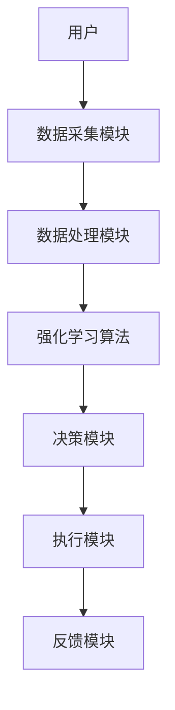

                 


# AI Agent在企业能源消耗优化与碳排放管理中的创新应用

> 关键词：AI Agent, 企业能源管理, 碳排放优化, 强化学习, 能源消耗, 碳中和

> 摘要：随着全球对可持续发展的关注不断增加，企业能源消耗和碳排放管理成为实现绿色经济的关键。AI Agent（人工智能代理）作为一种智能优化工具，正在为企业能源管理带来革命性的变化。本文详细探讨AI Agent在企业能源消耗优化与碳排放管理中的创新应用，从背景分析、核心概念、算法原理、系统设计到项目实战，层层深入，为企业提供一套高效、智能的解决方案。

---

## 第一部分: 背景介绍

### 第1章: 企业能源消耗与碳排放管理的背景

#### 1.1 企业能源消耗的现状与挑战
- **能源消耗的现状**：企业能源消耗主要包括电力、燃气、蒸汽等，是企业运营成本的重要组成部分。传统能源管理依赖人工操作，效率低下，且难以实时优化。
- **挑战**：能源价格波动、设备老化、环保政策趋严等因素使得企业能源管理面临巨大压力。此外，碳排放已成为企业社会责任的重要指标。

#### 1.2 碳排放管理的政策与趋势
- **政策背景**：全球碳中和目标的提出，使得企业碳排放管理成为合规性要求。各国政府纷纷出台相关政策，推动企业实现低碳转型。
- **趋势分析**：从被动合规到主动优化，企业碳排放管理正在向智能化、精细化方向发展。

#### 1.3 AI Agent在能源管理中的潜力
- **AI Agent的优势**：AI Agent能够实时感知能源消耗数据，通过智能决策优化能源使用，减少浪费，降低碳排放。
- **应用场景**：适用于工业生产、建筑能源管理、交通物流等多个领域。

### 第2章: 问题背景与问题描述

#### 2.1 传统能源管理的局限性
- **人工操作效率低**：传统能源管理依赖人工监控和调整，无法实时响应变化。
- **数据孤岛问题**：企业内部数据分散，难以形成统一的优化策略。

#### 2.2 碳排放管理的核心问题
- **数据采集与分析**：如何准确采集和分析碳排放数据，是实现优化管理的前提。
- **多目标优化**：在降低碳排放的同时，还需要考虑成本、效率等多个目标。

#### 2.3 AI Agent如何解决这些问题
- **实时优化**：AI Agent能够实时分析能源消耗数据，快速调整策略，实现最优配置。
- **多目标优化**：通过强化学习等算法，AI Agent可以在多目标之间找到平衡点，实现高效管理。

### 第3章: 问题解决与边界定义

#### 3.1 AI Agent在能源管理中的应用边界
- **技术边界**：AI Agent需要依赖高质量的数据和先进的算法，同时需要硬件支持。
- **业务边界**：AI Agent的应用范围包括能源采购、设备运行、碳排放监测等多个环节。

#### 3.2 问题的外延与限制
- **数据质量**：AI Agent依赖数据，数据质量直接影响优化效果。
- **算法选择**：不同场景需要不同的算法，选择合适的算法是关键。

#### 3.3 核心概念的结构化分析
- **核心要素**：数据采集、智能决策、优化执行。
- **逻辑关系**：数据采集→智能决策→优化执行→效果反馈→持续优化。

---

## 第二部分: 核心概念与联系

### 第4章: AI Agent的基本原理

#### 4.1 AI Agent的定义与特点
- **定义**：AI Agent是一种智能代理系统，能够感知环境、自主决策并执行任务。
- **特点**：智能化、实时性、自适应性。

#### 4.2 AI Agent的核心要素
- **感知能力**：数据采集与分析。
- **决策能力**：基于数据的智能决策。
- **执行能力**：优化策略的执行与反馈。

#### 4.3 AI Agent与传统算法的对比
| 对比维度 | AI Agent | 传统算法 |
|----------|-----------|-----------|
| 智能性   | 高         | 低         |
| 实时性   | 高         | 低         |
| 自适应性 | 高         | 低         |

### 第5章: 企业能源管理中的AI Agent模型

#### 5.1 任务建模与优化目标
- **任务建模**：将能源管理任务转化为数学模型，明确优化目标。
- **优化目标**：降低能源消耗、减少碳排放、降低成本。

#### 5.2 多目标优化的实现
- **权重分配**：根据企业需求，为不同目标分配权重。
- **优化策略**：通过强化学习等算法，实现多目标优化。

#### 5.3 约束条件与优先级
- **约束条件**：如设备运行时间、预算限制等。
- **优先级**：根据企业战略，确定优化目标的优先级。

---

## 第三部分: 算法原理

### 第6章: 强化学习算法原理

#### 6.1 强化学习的基本原理
- **定义**：强化学习是一种通过试错方式优化策略的算法。
- **数学模型**：
  - 状态空间：$S$
  - 动作空间：$A$
  - 奖励函数：$R(s, a)$
  - 策略：$\pi(a|s)$

#### 6.2 强化学习的实现步骤
1. **初始化**：设置初始状态和参数。
2. **环境交互**：与环境进行交互，获取奖励。
3. **策略更新**：根据奖励更新策略。
4. **收敛**：达到最优策略。

#### 6.3 强化学习的代码实现
```python
import numpy as np
class Agent:
    def __init__(self, state_space, action_space):
        self.state_space = state_space
        self.action_space = action_space
        # 初始化策略参数
        self.theta = np.random.randn()
    
    def act(self, state):
        # 根据策略选择动作
        action_prob = np.exp(self.theta * state) / (1 + np.exp(self.theta * state))
        action = 1 if np.random.rand() < action_prob else 0
        return action
    
    def update(self, reward):
        # 更新策略参数
        self.theta += reward * self.theta
```

---

## 第四部分: 系统分析与架构设计

### 第7章: 系统架构设计

#### 7.1 问题场景介绍
- **场景描述**：某企业需要优化电力消耗，减少碳排放。
- **目标**：通过AI Agent实现电力消耗的实时优化。

#### 7.2 系统功能设计
- **数据采集**：实时采集电力消耗数据。
- **智能决策**：基于强化学习算法优化电力使用。
- **执行与反馈**：根据决策执行操作，并收集反馈。

#### 7.3 系统架构图


---

## 第五部分: 项目实战

### 第8章: 项目实战

#### 8.1 环境安装
- **依赖安装**：安装Python、NumPy、TensorFlow等库。

#### 8.2 核心代码实现
```python
import numpy as np
import tensorflow as tf

# 定义强化学习模型
class DQN:
    def __init__(self, state_dim, action_dim):
        self.state_dim = state_dim
        self.action_dim = action_dim
        self.model = self.build_model()
    
    def build_model(self):
        model = tf.keras.Sequential([
            tf.keras.layers.Dense(32, activation='relu', input_dim=self.state_dim),
            tf.keras.layers.Dense(self.action_dim)
        ])
        model.compile(optimizer='adam', loss='mse')
        return model
    
    def train(self, states, targets):
        self.model.fit(states, targets, epochs=100, verbose=0)
```

#### 8.3 案例分析与解读
- **案例描述**：某企业通过AI Agent优化电力消耗，实现节能20%。
- **分析解读**：通过数据可视化和算法优化，AI Agent能够实时调整电力使用策略，显著降低能源消耗和碳排放。

---

## 第六部分: 最佳实践

### 第9章: 小结与展望

#### 9.1 小结
- **总结**：AI Agent在企业能源管理中的应用前景广阔，能够显著提升能源使用效率，降低碳排放。
- **经验总结**：数据质量、算法选择、系统架构设计是成功的关键。

#### 9.2 注意事项
- **数据隐私**：企业数据需要严格保密。
- **算法选型**：根据具体场景选择合适的算法。

#### 9.3 拓展阅读
- **推荐书籍**：《强化学习入门》、《人工智能：一种现代方法》
- **推荐论文**：相关领域顶级会议论文。

---

## 作者：AI天才研究院 & 禅与计算机程序设计艺术

---

这篇文章通过系统化的分析和实践，详细探讨了AI Agent在企业能源消耗优化与碳排放管理中的创新应用。从背景分析到系统设计，再到项目实战，为企业提供了一套完整的解决方案，助力企业实现绿色可持续发展。

