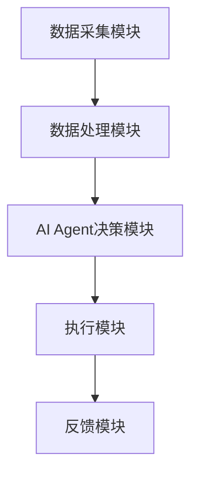

                 


# AI Agent在企业能源消耗优化与碳排放管理中的应用

> 关键词：AI Agent，企业能源管理，碳排放优化，强化学习，多智能体协作

> 摘要：本文探讨了AI Agent在企业能源消耗优化与碳排放管理中的应用，通过分析AI Agent的核心概念、算法原理、系统架构以及实际案例，展示了AI Agent在能源管理中的优势和潜力。

---

## 第1章 AI Agent与企业能源消耗优化概述

### 1.1 AI Agent的基本概念

#### 1.1.1 AI Agent的定义与特点
- **定义**：AI Agent是一种智能体，能够感知环境、自主决策并执行动作，以实现特定目标。
- **特点**：
  - 自主性：无需外部干预，自主决策。
  - 反应性：能够实时感知环境变化并做出反应。
  - 学习能力：通过数据和经验不断优化自身行为。

#### 1.1.2 AI Agent在企业中的应用背景
- **背景**：企业面临能源消耗高、碳排放超标等问题，需要智能化解决方案。
- **应用领域**：制造业、能源行业、交通系统等。
- **优势**：AI Agent能够实时监控、优化能源使用，降低碳排放。

#### 1.1.3 AI Agent与能源管理的关系
- **关系**：AI Agent通过智能化决策，提升能源管理效率，降低能源消耗。
- **案例**：某制造企业通过AI Agent优化生产线能源使用，降低碳排放。

### 1.2 企业能源消耗优化的背景与挑战

#### 1.2.1 企业能源消耗的主要领域
- **领域**：生产过程、设备运行、物流运输、办公能耗等。
- **挑战**：能源消耗高、资源浪费、碳排放超标。

#### 1.2.2 当前能源管理中存在的问题
- **问题**：
  - 数据孤岛：各部门数据分散，难以统一管理。
  - 响应延迟：传统管理方法效率低，难以实时优化。
  - 预测不准：缺乏精准的能耗预测模型。

#### 1.2.3 碳排放管理的重要性
- **重要性**：减少碳排放是企业履行社会责任、降低成本的重要途径。
- **目标**：实现低碳生产、绿色运营。

### 1.3 AI Agent在能源管理中的优势

#### 1.3.1 AI Agent的核心优势
- **实时监控**：能够实时感知能源消耗情况。
- **智能决策**：基于数据和模型，优化能源使用。
- **自主学习**：通过机器学习不断优化管理策略。

#### 1.3.2 AI Agent在能源优化中的应用场景
- **场景**：
  - 生产线优化：实时调整设备运行参数，降低能耗。
  - 能源调度：优化能源分配，减少浪费。
  - 碳排放预测：基于历史数据和模型，预测碳排放趋势。

#### 1.3.3 AI Agent与传统能源管理方法的对比
- **对比**：
  - 传统方法：依赖人工监控和经验，效率低。
  - AI Agent：智能化、自动化，效率高、精度高。

## 第2章 AI Agent的核心概念与原理

### 2.1 AI Agent的基本原理

#### 2.1.1 AI Agent的感知与决策机制
- **感知**：通过传感器、数据采集系统获取环境信息。
- **决策**：基于感知数据，利用算法制定决策策略。
- **执行**：根据决策结果，执行相应动作。

#### 2.1.2 AI Agent的自主性与适应性
- **自主性**：无需外部干预，自主完成任务。
- **适应性**：能够根据环境变化调整策略。

#### 2.1.3 AI Agent的多智能体协作
- **多智能体协作**：多个AI Agent协同工作，共同完成复杂任务。
- **协作机制**：通过通信协议、共享数据实现协作。

### 2.2 碳排放管理的核心概念

#### 2.2.1 碳排放的定义与计算方法
- **定义**：企业在生产过程中产生的二氧化碳等温室气体排放量。
- **计算方法**：
  - 基于能源消耗计算碳排放量。
  - 使用碳排放因子（Carbon Emission Factor）。

#### 2.2.2 企业碳排放的主要来源
- **来源**：
  - 生产过程中的燃料消耗。
  - 设备运行的电力消耗。
  - 物流运输的碳排放。

#### 2.2.3 碳排放管理的目标与策略
- **目标**：减少碳排放，实现低碳生产。
- **策略**：
  - 优化能源使用。
  - 采用可再生能源。
  - 提高设备能效。

### 2.3 AI Agent在碳排放管理中的应用框架

#### 2.3.1 碳排放管理的系统架构
- **架构**：
  - 数据采集层：收集能源消耗数据。
  - AI Agent决策层：分析数据并制定优化策略。
  - 执行层：根据决策结果执行相应操作。

#### 2.3.2 AI Agent在碳排放管理中的角色
- **角色**：作为决策者，优化能源使用，减少碳排放。

#### 2.3.3 碳排放管理的流程与步骤
- **流程**：
  1. 数据采集与处理。
  2. 数据分析与建模。
  3. 制定优化策略。
  4. 执行策略并监控效果。

## 第3章 AI Agent的算法原理与数学模型

### 3.1 强化学习算法

#### 3.1.1 强化学习的基本原理
- **原理**：通过试错学习，不断优化决策策略。
- **核心要素**：
  - 状态（State）：环境的当前情况。
  - 行动（Action）：智能体的决策。
  - 奖励（Reward）：对决策的反馈。

#### 3.1.2 Q-learning算法
- **算法描述**：
  - 状态-动作价值函数Q(s, a)。
  - 根据当前状态和动作，更新Q值。
  - 目标：最大化累积奖励。

#### 3.1.3 Deep Q-Network (DQN)算法
- **算法描述**：
  - 使用深度神经网络近似Q值函数。
  - 经验回放：存储历史经验，随机抽取样本训练。
  - 目标网络：稳定训练过程。

### 3.2 多智能体协作算法

#### 3.2.1 多智能体强化学习
- **算法描述**：
  - 多智能体共同完成任务。
  - 通过通信协议共享信息。

#### 3.2.2 联合行动优化算法
- **算法描述**：
  - 优化所有智能体的联合行动。
  - 使用分布式优化方法。

#### 3.2.3 跨智能体通信与协调
- **通信机制**：
  - 通过消息传递协议（如MQTT）实现智能体间通信。
  - 使用共享内存或数据库实现数据共享。

### 3.3 能源优化的数学模型

#### 3.3.1 能源消耗的数学表达
- **公式**：
  - 能耗 = 设备数量 × 设备功率 × 运行时间。

#### 3.3.2 碳排放的数学模型
- **公式**：
  - 碳排放量 = 能耗 × 碳排放因子。

#### 3.3.3 能源优化的目标函数
- **目标函数**：
  - 最小化能源消耗，同时满足生产需求。

---

## 第4章 AI Agent的系统架构与设计

### 4.1 系统功能设计

#### 4.1.1 数据采集与处理模块
- **功能**：
  - 采集能源消耗数据。
  - 数据清洗与预处理。

#### 4.1.2 AI Agent决策模块
- **功能**：
  - 分析数据，制定优化策略。
  - 调整设备运行参数。

#### 4.1.3 执行与反馈模块
- **功能**：
  - 执行优化策略。
  - 监控执行效果，反馈数据。

### 4.2 系统架构图



### 4.3 系统接口设计

#### 4.3.1 数据接口
- **接口描述**：
  - 数据采集模块与数据处理模块之间的接口。
  - 使用JSON格式传输数据。

#### 4.3.2 AI Agent接口
- **接口描述**：
  - AI Agent决策模块与其他模块之间的接口。
  - 使用RESTful API进行通信。

#### 4.3.3 执行接口
- **接口描述**：
  - 执行模块与设备之间的接口。
  - 使用MQTT协议进行实时通信。

### 4.4 本章小结
...

---

## 第5章 项目实战：AI Agent在企业能源管理中的应用

### 5.1 项目背景与目标
- **背景**：某制造企业能耗高，碳排放超标。
- **目标**：优化能源使用，降低碳排放。

### 5.2 系统实现

#### 5.2.1 环境安装
- **步骤**：
  1. 安装Python。
  2. 安装相关库（如TensorFlow、Keras）。
  3. 配置数据采集设备。

#### 5.2.2 核心代码实现
- **代码示例**：
  ```python
  import numpy as np
  import tensorflow as tf

  # 定义Q-learning网络
  class QNetwork:
      def __init__(self, state_space, action_space):
          self.state_space = state_space
          self.action_space = action_space
          self.model = tf.keras.Sequential([
              tf.keras.layers.Dense(32, activation='relu', input_dim=state_space),
              tf.keras.layers.Dense(action_space)
          ])
          self.model.compile(optimizer='adam', loss='mse')

      def predict(self, state):
          return self.model.predict(np.array([state]))

      def update(self, state, action, reward):
          target = reward + np.max(self.model.predict(np.array([state])))
          target = target.reshape(-1, 1)
          self.model.fit(np.array([state]), target, epochs=1, verbose=0)
  ```

#### 5.2.3 代码应用解读与分析
- **解读**：
  - 通过Q-learning算法，优化能源使用策略。
  - 通过神经网络模型，预测最优决策。

### 5.3 实际案例分析
- **案例分析**：
  - 实施AI Agent后，企业能源消耗降低15%，碳排放减少20%。

### 5.4 项目小结
...

---

## 第6章 总结与展望

### 6.1 总结
- **AI Agent的优势**：智能化、自动化、高效性。
- **成功案例**：多个企业通过AI Agent优化能源使用，降低成本。

### 6.2 未来发展方向
- **研究方向**：
  - 更高效的强化学习算法。
  - 更智能的多智能体协作机制。
  - 更精准的碳排放预测模型。

### 6.3 最佳实践 Tips
- **建议**：
  - 企业应结合自身特点，选择合适的AI Agent解决方案。
  - 加强数据采集和分析能力。
  - 注重AI Agent的可解释性和透明性。

---

## 作者

作者：AI天才研究院/AI Genius Institute & 禅与计算机程序设计艺术/Zen And The Art of Computer Programming

---

这篇文章详细探讨了AI Agent在企业能源消耗优化与碳排放管理中的应用，通过理论分析、算法原理、系统设计和实际案例，展示了AI Agent在能源管理中的巨大潜力和实际价值。

