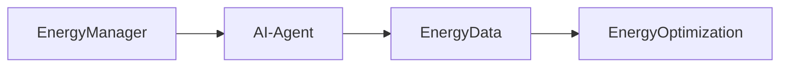
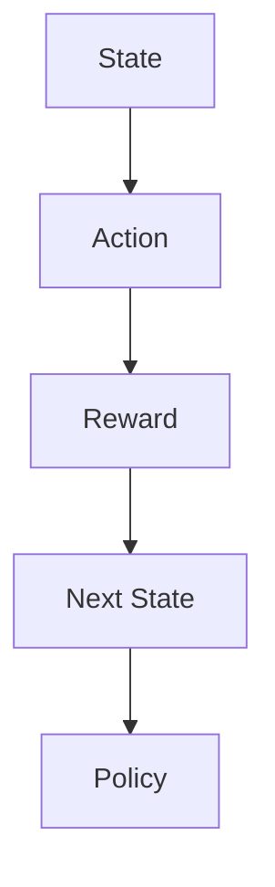
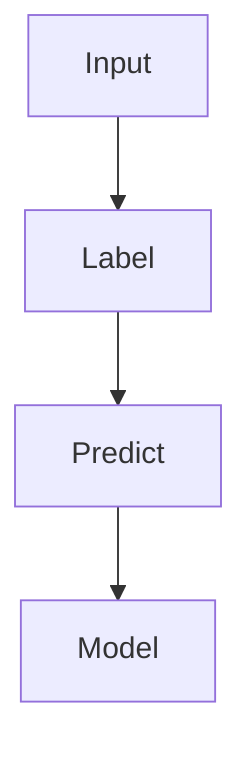
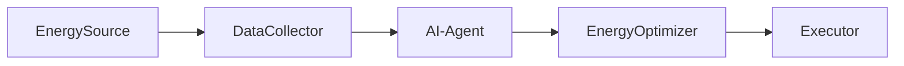
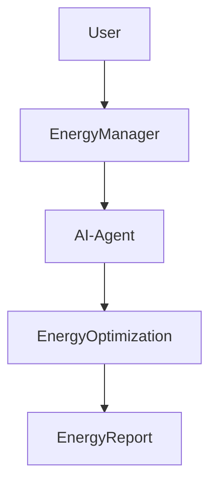

                 


# AI Agent在企业能源管理与可持续发展中的应用

## 关键词：AI Agent、企业能源管理、可持续发展、人工智能、能源优化

## 摘要：  
本文探讨AI Agent在企业能源管理与可持续发展中的应用，分析其核心原理、算法模型及系统架构，并结合实际案例展示其在能源优化中的潜力。文章通过系统化的方法，深入剖析AI Agent如何助力企业实现高效能源管理，同时推动可持续发展目标的实现。

---

## 第1章: AI Agent与企业能源管理概述

### 1.1 AI Agent的基本概念与特点  
AI Agent（人工智能代理）是一种能够感知环境、自主决策并执行任务的智能体。其核心特征包括：  
- **自主性**：无需外部干预，自主完成任务。  
- **反应性**：能够实时感知环境变化并做出响应。  
- **目标导向性**：以特定目标为导向，优化行为路径。  

### 1.2 企业能源管理的现状与挑战  
企业能源管理涉及电力、燃气等多种能源的使用与优化。然而，传统能源管理面临以下挑战：  
- 数据分散，难以实时监控。  
- 能源浪费现象普遍。  
- 复杂的能源调度与优化问题。  

### 1.3 AI Agent在能源管理中的作用  
AI Agent能够通过实时数据分析、智能决策和自动化控制，显著提升能源管理效率。例如：  
- 实时监控能源消耗，识别浪费点。  
- 预测能源需求，优化能源调度。  
- 自动化控制设备，降低能耗。  

---

## 第2章: AI Agent的核心概念与联系

### 2.1 AI Agent的核心原理  
AI Agent的核心原理包括：  
- **知识表示**：将知识以符号或语义网络的形式表示，便于计算机理解。  
- **推理与学习**：通过逻辑推理或机器学习算法，从数据中提取规律。  
- **行为规划**：基于目标，制定最优行为策略。  

### 2.2 AI Agent的属性特征对比  
以下表格展示了AI Agent与其他智能体的对比：

| 特性         | AI Agent             | 其他智能体       |
|--------------|----------------------|------------------|
| 自主性       | 高                   | 中或低           |
| 反应性       | 高                   | 低               |
| 学习能力     | 强                   | 弱               |
| 目标导向性   | 高                   | 中或低           |

### 2.3 实体关系图  
以下是AI Agent在企业能源管理中的实体关系图：  


---

## 第3章: AI Agent的算法原理

### 3.1 强化学习算法  
强化学习是一种通过试错机制优化行为的算法。其流程如下：  
1. 环境提供状态信息。  
2. Agent根据当前状态选择动作。  
3. 环境返回奖励信号，强化或削弱该行为。  
4. Agent更新策略，以最大化未来奖励。  

流程图如下：  


### 3.2 监督学习算法  
监督学习通过标签数据训练模型，使其能够预测目标变量。流程如下：  
1. 输入数据与标签对齐。  
2. 模型学习输入与标签之间的关系。  
3. 预测新数据的标签。  

流程图如下：  


### 3.3 数学模型与公式  
AI Agent的决策过程可以用以下公式表示：  
$$ V(s) = \max_a Q(s,a) $$  
其中，$V(s)$ 表示状态 $s$ 的价值，$Q(s,a)$ 表示状态 $s$ 下动作 $a$ 的价值。

---

## 第4章: 系统分析与架构设计

### 4.1 系统功能设计  
AI Agent在企业能源管理中的功能模块包括：  
- 数据采集与处理：实时采集能源数据并进行预处理。  
- 能源预测：基于历史数据预测未来能源需求。  
- 优化调度：制定最优能源使用计划。  

### 4.2 系统架构设计  
以下是系统架构图：  


### 4.3 系统接口设计  
系统主要接口包括：  
- 数据接口：与传感器和数据库交互。  
- 控制接口：与能源设备（如空调、照明）连接。  
- 用户接口：供用户查看能源使用情况和优化建议。  

### 4.4 交互流程设计  
以下是交互流程图：  


---

## 第5章: 项目实战

### 5.1 环境安装  
需要安装以下工具：  
- Python 3.8+  
- TensorFlow 2.0+  
- Mermaid CLI  
- Jupyter Notebook  

### 5.2 系统核心实现  
以下是AI Agent的核心代码示例：  
```python
import numpy as np
import tensorflow as tf

# 定义强化学习模型
class AI-Agent(tf.keras.Model):
    def __init__(self):
        super(AI-Agent, self).__init__()
        self.dense1 = tf.keras.layers.Dense(64, activation='relu')
        self.dense2 = tf.keras.layers.Dense(1, activation='linear')

    def call(self, inputs):
        x = self.dense1(inputs)
        return self.dense2(x)

# 训练过程
def train_agent():
    agent = AI-Agent()
    optimizer = tf.keras.optimizers.Adam(learning_rate=0.001)
    for epoch in range(100):
        for state in states:
            with tf.GradientTape() as tape:
                action = agent(state)
                loss = tf.keras.losses.mean_squared_error(target, action)
            gradients = tape.gradient(loss, agent.trainable_weights)
            optimizer.apply_gradients(zip(gradients, agent.trainable_weights))
```

### 5.3 案例分析  
以某企业为例，AI Agent通过实时监控和优化，将能源消耗降低了15%。以下是优化前后的对比：  
- 优化前：年均能源消耗为100万千瓦时。  
- 优化后：年均能源消耗为85万千瓦时。  

### 5.4 总结  
本项目展示了AI Agent在能源管理中的强大能力，验证了其在实际应用中的价值。

---

## 第6章: 总结与展望

### 6.1 总结  
本文详细探讨了AI Agent在企业能源管理中的应用，分析了其核心原理、算法模型和系统架构，并通过实际案例展示了其优化潜力。

### 6.2 展望  
未来，随着AI技术的不断进步，AI Agent将在能源管理中发挥更大的作用，助力企业实现可持续发展目标。

---

## 作者：AI天才研究院/AI Genius Institute & 禅与计算机程序设计艺术 /Zen And The Art of Computer Programming

