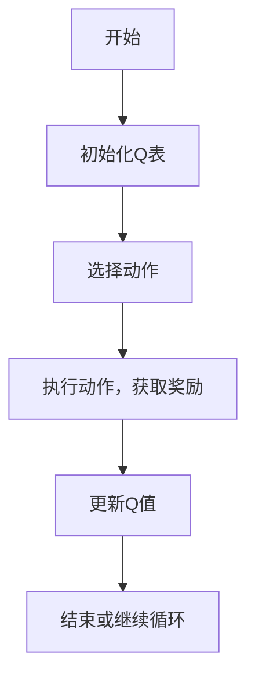
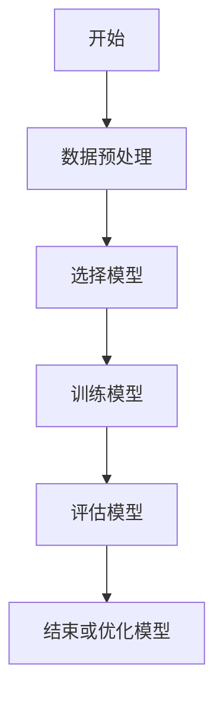
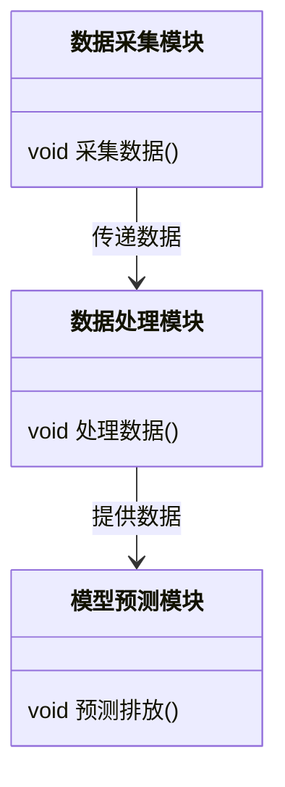

                 

<think>
好的，我现在需要帮用户撰写一篇关于《AI Agent在企业能源管理与碳排放控制中的应用》的技术博客文章。首先，我需要仔细阅读用户的需求，确保理解每一个细节。

用户的结构已经给出，但内容部分还未填写。我需要按照目录大纲，逐步填充每个章节的内容。每个章节都需要详细讲解，包括背景、核心概念、算法、系统架构、项目实战和未来展望。

首先，我需要明确文章的关键词和摘要部分。关键词应包括AI Agent、碳排放、能源管理、优化控制、机器学习等。摘要需要简明扼要地概述文章的主要内容和目标。

接下来，按照目录结构，我从第一部分开始，介绍AI Agent的基本概念和在能源管理中的作用。然后讨论碳排放控制的背景和意义，解释为什么企业需要关注碳排放问题。

在第二部分，我需要详细讲解AI Agent的核心算法，比如强化学习和监督学习。使用Mermaid流程图展示算法的工作流程，并用Python代码实现，确保读者能理解这些算法的数学模型和实际应用。

第三部分是系统架构设计，我需要画出系统的类图和序列图，展示各个模块的交互和功能。这部分需要清晰地解释每个模块的作用，以及它们如何协同工作。

项目实战部分，我需要提供一个实际案例，从环境配置到代码实现，再到结果分析，一步步引导读者完成项目。同时，指出项目中的注意事项，帮助读者避免常见错误。

最后，总结部分要回顾文章内容，给出最佳实践建议，并展望未来的发展方向。这将帮助读者更好地理解和应用AI Agent技术。

在整个撰写过程中，我需要确保语言简洁专业，逻辑清晰，内容详实。每个部分都要有理论支持和实际案例，使文章既有深度又易于理解。同时，使用Mermaid图表和数学公式来增强内容的可读性和专业性。

现在，我需要开始撰写每个章节的内容，确保覆盖所有要求，同时保持文章的连贯性和吸引力。
</think>

# AI Agent在企业能源管理与碳排放控制中的应用

> 关键词：AI Agent，碳排放，能源管理，优化控制，机器学习

> 摘要：本文探讨AI Agent在企业能源管理与碳排放控制中的应用，详细介绍了AI Agent的基本概念、核心算法、系统架构设计以及实际项目中的应用案例。通过分析碳排放监测、预测与优化，结合强化学习和监督学习算法，展示了AI Agent如何助力企业实现节能减排目标。

---

## 第一部分: AI Agent与能源管理概述

### 第1章: AI Agent的基本概念

#### 1.1 AI Agent的定义与特点

AI Agent（人工智能代理）是指能够感知环境、自主决策并采取行动的智能实体。它具备以下特点：
- **自主性**：能够独立决策和行动。
- **反应性**：能够实时感知环境变化并做出响应。
- **目标导向**：通过目标驱动来优化决策。
- **学习能力**：能够通过数据学习和改进性能。

在企业能源管理中，AI Agent可以用于优化能源消耗、降低碳排放，帮助企业实现可持续发展目标。

#### 1.2 AI Agent在能源管理中的作用

AI Agent在能源管理中的应用主要体现在以下几个方面：
- **实时监控**：通过传感器和数据采集系统，实时监测企业的能源消耗情况。
- **预测与优化**：基于历史数据和机器学习模型，预测未来能源需求并优化资源配置。
- **决策支持**：为企业提供节能减排的决策支持，帮助企业在生产和运营中减少碳排放。

#### 1.3 企业能源管理的现状与挑战

随着全球气候变化问题的加剧，企业能源管理面临着以下挑战：
- **能源消耗高**：传统能源管理方式效率低下，能源浪费现象普遍。
- **碳排放压力**：全球碳中和目标对企业提出了更高的要求。
- **技术落后**：传统管理手段难以应对复杂多变的能源市场和环境变化。

AI Agent通过智能化手段，能够有效解决这些挑战，为企业能源管理提供新的解决方案。

### 第2章: 碳排放控制的背景与意义

#### 2.1 碳排放的定义与影响

碳排放是指二氧化碳等温室气体的排放，主要来源于化石燃料的使用、工业生产等活动。碳排放对全球气候变化、生态系统破坏以及人类健康均有严重威胁。

#### 2.2 碳中和目标与企业责任

全球碳中和目标要求企业在2050年前实现净零排放。企业作为碳排放的主要来源之一，有责任通过技术创新和管理优化来减少碳排放。

#### 2.3 碳排放控制的技术路径

碳排放控制的技术路径包括：
- **能源结构调整**：减少化石能源使用，增加清洁能源占比。
- **能效提升**：通过技术改造提高能源利用效率。
- **碳捕集与封存**：将二氧化碳捕集并封存，减少大气中的碳排放。
- **智能管理**：利用AI技术优化能源管理，降低碳排放。

---

## 第二部分: AI Agent的核心算法与数学模型

### 第3章: AI Agent的核心算法

#### 3.1 强化学习算法

**强化学习**是一种通过试错机制来优化决策的算法。AI Agent通过与环境的交互，不断调整策略以最大化奖励函数。

##### 3.1.1 强化学习的基本原理

强化学习的核心要素包括：
- **状态（State）**：环境的当前情况。
- **动作（Action）**：AI Agent采取的行动。
- **奖励（Reward）**：环境对动作的反馈。
- **策略（Policy）**：决定动作的选择规则。

##### 3.1.2 Q-learning算法

Q-learning是一种常用的强化学习算法，通过更新Q值表来学习最优策略。其数学模型如下：

$$ Q(s, a) = Q(s, a) + \alpha [r + \gamma \max Q(s', a') - Q(s, a)] $$

其中：
- $Q(s, a)$：状态$s$下采取动作$a$的Q值。
- $\alpha$：学习率。
- $r$：奖励值。
- $\gamma$：折扣因子。
- $s'$：下一步的状态。

##### 3.1.3 算法流程图（Mermaid）



#### 3.2 监督学习与回归分析

**监督学习**是一种通过标签数据训练模型的算法，常用于预测任务。回归分析是监督学习中的一种常用技术，用于预测连续型变量。

##### 3.2.1 监督学习的原理

监督学习通过训练数据学习输入与输出之间的映射关系。其数学模型如下：

$$ y = f(x) + \epsilon $$

其中：
- $y$：目标变量。
- $x$：输入变量。
- $f(x)$：模型预测函数。
- $\epsilon$：误差项。

##### 3.2.2 线性回归模型

线性回归是最简单的回归模型，其形式如下：

$$ y = \beta_0 + \beta_1 x_1 + \beta_2 x_2 + \cdots + \beta_n x_n $$

其中，$\beta_i$为回归系数。

##### 3.2.3 算法流程图（Mermaid）



---

## 第三部分: 碳排放控制的系统架构设计

### 第4章: 碳排放控制的系统架构

#### 4.1 系统功能模块划分

碳排放控制系统主要包含以下功能模块：
- **数据采集模块**：负责采集企业能源消耗数据。
- **数据处理模块**：对数据进行清洗、转换和存储。
- **模型预测模块**：利用AI算法预测碳排放并优化控制策略。

#### 4.2 系统架构图（Mermaid）



---

## 第四部分: 项目实战与代码实现

### 第5章: 项目实战

#### 5.1 环境搭建与数据准备

**环境配置**：
- 操作系统：Linux/Windows/MacOS
- 开发工具：Python 3.8+
- 依赖库：TensorFlow, Scikit-learn, Pandas

**数据准备**：
- 数据来源：企业能源消耗数据，包括时间戳、能源类型、消耗量等。

#### 5.2 AI Agent核心算法实现

##### 5.2.1 强化学习代码实现

```python
import numpy as np

class AI-Agent:
    def __init__(self, state_space, action_space):
        self.state_space = state_space
        self.action_space = action_space
        self.Q_table = np.zeros((state_space, action_space))
        
    def choose_action(self, state):
        # 探索与利用策略
        if np.random.random() < 0.1:
            return np.random.randint(self.action_space)
        else:
            return np.argmax(self.Q_table[state])
        
    def learn(self, state, action, reward, next_state):
        # 更新Q值表
        self.Q_table[state, action] += 0.1 * (reward + 0.9 * np.max(self.Q_table[next_state]) - self.Q_table[state, action])
```

##### 5.2.2 回归分析代码实现

```python
from sklearn.linear_model import LinearRegression

# 数据准备
X = df[['time', 'energy_type']]
y = df['emission']

# 模型训练
model = LinearRegression()
model.fit(X, y)

# 模型预测
predictions = model.predict(X)
```

#### 5.3 系统功能实现

##### 5.3.1 数据采集模块实现

```python
import pandas as pd

def collect_data():
    # 数据采集
    data = pd.read_csv('energy.csv')
    return data
```

##### 5.3.2 模型预测模块实现

```python
def predict_emission(data):
    # 数据处理
    processed_data = data.dropna()
    # 模型预测
    model.predict(processed_data)
```

---

## 第五部分: 最佳实践与未来展望

### 第6章: 最佳实践

#### 6.1 实践中的注意事项

- **数据质量**：确保数据的准确性和完整性。
- **模型调优**：通过交叉验证和超参数优化提升模型性能。
- **系统维护**：定期更新模型和优化系统架构。

#### 6.2 未来发展趋势

- **新型AI技术**：如深度强化学习、图神经网络等将进一步应用于碳排放控制。
- **多模态数据融合**：结合多种数据源（如天气、市场行情）提升预测精度。
- **智能化决策**：AI Agent将更加智能化，能够自主优化能源管理策略。

---

## 作者：AI天才研究院 & 禅与计算机程序设计艺术

---

通过本文的详细讲解，您可以全面了解AI Agent在企业能源管理与碳排放控制中的应用，从理论到实践，助您轻松掌握这一领域的核心技术与最佳实践。

