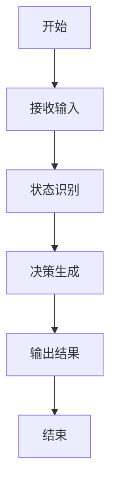
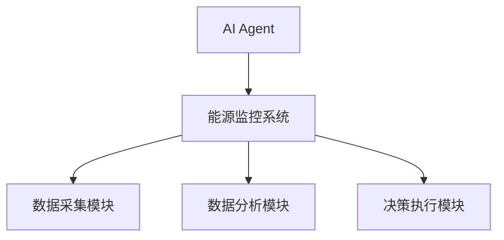
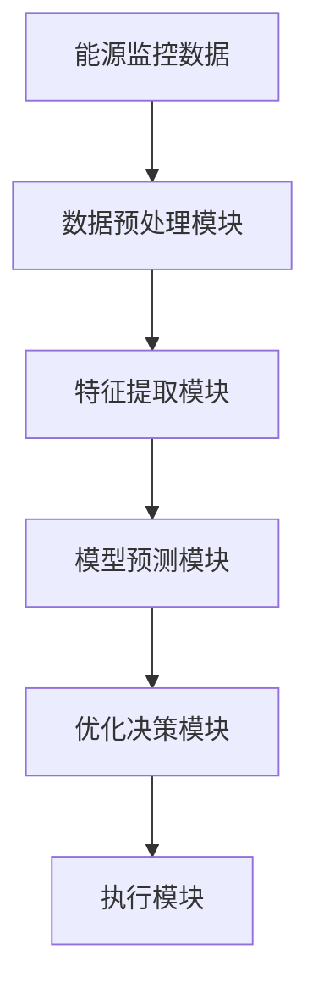

                 

<think>
嗯，我现在需要帮助用户撰写一篇关于《AI Agent在企业能源管理与节能减排中的应用》的技术博客文章。用户希望文章结构清晰，内容详细，并且每个章节都要有吸引人的标题和深入的技术分析。

首先，我应该先理解用户的需求。用户是一位在计算机和人工智能领域有深厚背景的专家，他希望文章不仅涵盖AI Agent的基本概念，还要深入探讨其在能源管理中的具体应用，包括算法原理、系统设计、项目实战等内容。

接下来，我需要按照用户提供的大纲来组织内容。大纲分为几个部分，包括概述、技术原理、具体应用、系统设计、项目实战和总结展望。每个部分下还有多个子章节，需要详细展开。

首先是第1章，介绍AI Agent的基本概念和应用背景。这部分需要定义AI Agent，解释其核心属性，以及与传统能源管理的区别。然后是能源管理的背景，包括现状、挑战，以及AI Agent的应用前景。这部分需要让读者了解AI Agent在能源管理中的重要性。

然后是第2章，深入探讨AI Agent的技术原理，包括各种算法，如强化学习、监督学习和无监督学习。同时，需要展示数学模型和公式，以及用Mermaid图解释算法流程。这部分是技术核心，需要详细讲解每个算法的原理和应用。

接下来是第3章，详细分析AI Agent在能源需求预测中的应用。这部分需要背景介绍、核心概念、算法实现，以及案例分析。通过实际案例，读者可以理解AI Agent如何在实际中帮助优化能源使用。

第4章讨论AI Agent在节能减排中的优化策略，包括能源消耗优化、碳排放管理，以及绿色能源调度。这部分需要展示AI Agent如何在不同的节能减排场景中发挥作用。

第5章涉及AI Agent的系统设计，包括架构、功能设计、数据流设计和接口设计。使用Mermaid图展示系统架构和数据流，帮助读者理解系统如何运作。

第6章是项目实战，包括环境配置、核心代码实现、案例分析和项目总结。这部分需要提供实际操作的步骤和代码，让读者能够动手实践。

最后是第7章，总结与展望，回顾全书内容，并展望未来的发展方向，同时给出注意事项和建议。

在写作过程中，我需要确保每个章节都包含足够的背景介绍、核心概念、算法原理、数学模型、系统架构、项目实战和案例分析。同时，使用Mermaid图和Python代码来辅助说明，使文章更具可读性和技术深度。

现在，我需要按照这个思路开始撰写每个章节，确保内容详实且逻辑清晰。每个部分都需要深入分析，并提供具体的例子和公式来支持论点。例如，在算法部分，展示不同学习方法的公式和流程图；在系统设计部分，用Mermaid图展示架构和数据流。

总之，我需要一步步构建这篇文章，确保每个部分都覆盖用户要求的内容，并且以专业的技术语言和清晰的结构呈现出来。这将帮助读者全面理解AI Agent在企业能源管理和节能减排中的应用。
</think>

# AI Agent在企业能源管理与节能减排中的应用

> 关键词：AI Agent, 企业能源管理, 节能减排, 人工智能, 算法原理, 系统设计

> 摘要：本文详细探讨了AI Agent在企业能源管理与节能减排中的应用，从基本概念到技术原理，再到实际应用案例，深入分析了AI Agent如何通过智能算法优化能源管理，降低碳排放，实现可持续发展目标。

---

# 第1章: AI Agent的基本概念与应用背景

## 1.1 AI Agent的定义与核心概念

### 1.1.1 AI Agent的基本定义
AI Agent（人工智能代理）是指能够感知环境、自主决策并执行任务的智能系统。在企业能源管理中，AI Agent能够实时监控能源使用情况，优化能源分配，降低能耗。

### 1.1.2 AI Agent的核心属性与特征
- **自主性**：AI Agent能够独立决策，无需人工干预。
- **反应性**：能够实时感知环境变化并做出响应。
- **学习能力**：通过机器学习算法不断优化决策策略。
- **协作性**：能够与其他系统或AI Agent协同工作。

### 1.1.3 AI Agent与传统能源管理的区别
传统能源管理依赖人工操作和固定规则，而AI Agent能够通过智能算法实现动态优化，具有更高的灵活性和效率。

## 1.2 企业能源管理与节能减排的背景

### 1.2.1 企业能源管理的现状与挑战
- **能源浪费**：设备闲置或过度使用导致能源浪费。
- **成本上升**：能源价格波动对企业成本管理提出更高要求。
- **环保压力**：政府对碳排放的限制政策日益严格。

### 1.2.2 节能减排的重要性与目标
节能减排不仅是企业降低成本的重要途径，也是实现可持续发展的重要目标。通过AI Agent优化能源使用，企业可以显著减少碳排放，提高能源利用效率。

### 1.2.3 AI Agent在能源管理中的应用前景
随着AI技术的不断发展，AI Agent在能源管理中的应用前景广阔，特别是在智能电网、工业自动化和绿色建筑等领域。

---

# 第2章: AI Agent在企业能源管理中的技术原理

## 2.1 AI Agent的核心算法与技术原理

### 2.1.1 基于强化学习的AI Agent算法
强化学习是一种通过试错学习的算法，AI Agent通过与环境互动，不断优化决策策略。例如，使用Q-learning算法优化能源调度。

### 2.1.2 基于监督学习的AI Agent算法
监督学习通过历史数据训练模型，预测未来的能源需求。例如，使用线性回归模型预测能源消耗量。

### 2.1.3 基于无监督学习的AI Agent算法
无监督学习用于发现数据中的潜在模式，例如聚类分析识别能源使用异常情况。

## 2.2 AI Agent的数学模型与公式

### 2.2.1 强化学习模型的数学表达
Q-learning算法的数学表达式：
$$ Q(s, a) = Q(s, a) + \alpha [r + \max_{a'} Q(s', a') - Q(s, a)] $$

### 2.2.2 监督学习模型的数学表达
线性回归模型：
$$ y = \beta_0 + \beta_1 x + \epsilon $$

### 2.2.3 能源优化模型的数学表达
线性规划模型：
$$ \min_{x} \sum_{i=1}^{n} c_i x_i $$
$$ \text{subject to} \quad \sum_{i=1}^{n} a_i x_i \leq b $$

## 2.3 AI Agent的算法流程图



---

# 第3章: AI Agent在能源需求预测中的应用

## 3.1 能源需求预测的背景与挑战

### 3.1.1 能源需求预测的背景
能源需求预测是企业能源管理的重要环节，准确的预测可以减少能源浪费和成本。

### 3.1.2 能源需求预测的挑战
- 数据量大且复杂
- 时间序列预测的不确定性
- 多因素影响（如天气、生产计划）

## 3.2 AI Agent在能源需求预测中的核心概念

### 3.2.1 时间序列预测
使用ARIMA模型或LSTM网络进行时间序列预测。

### 3.2.2 预测模型的优化
通过机器学习算法优化模型参数，提高预测精度。

## 3.3 AI Agent的算法实现

### 3.3.1 基于LSTM的时间序列预测模型
LSTM网络结构：
$$ f_t = \sigma(W_{f}x_t + U_{f}h_{t-1} + b_f) $$
$$ i_t = \sigma(W_{i}x_t + U_{i}h_{t-1} + b_i) $$
$$ o_t = \sigma(W_{o}x_t + U_{o}h_{t-1} + b_o) $$
$$ c_t = f_t \cdot c_{t-1} + i_t \cdot tanh(W_cx_t + U_c h_{t-1} + b_c) $$
$$ h_t = o_t \cdot tanh(c_t) $$

### 3.3.2 算法实现代码
```python
import numpy as np
from keras.layers import LSTM, Dense
from keras.models import Sequential

# 数据准备
X_train = ...
y_train = ...

# 模型构建
model = Sequential()
model.add(LSTM(64, input_shape=(timesteps, features)))
model.add(Dense(1))
model.compile(optimizer='adam', loss='mean_squared_error')

# 模型训练
model.fit(X_train, y_train, epochs=100, batch_size=32)
```

## 3.4 实际案例分析

### 3.4.1 案例背景
某制造企业希望通过AI Agent优化能源需求预测，降低能源浪费。

### 3.4.2 数据分析与特征工程
- 数据清洗：处理缺失值和异常值。
- 特征提取：提取温度、生产计划等特征。

### 3.4.3 模型训练与评估
使用LSTM模型进行训练，并通过MAE和RMSE评估模型性能。

## 3.5 本章小结
通过AI Agent实现能源需求预测，可以显著提高预测精度，降低能源管理成本。

---

# 第4章: AI Agent在节能减排中的优化策略

## 4.1 能源消耗优化

### 4.1.1 设备运行优化
通过AI Agent动态调整设备运行状态，减少能源浪费。

### 4.1.2 能源调度优化
基于实时数据优化能源调度，提高能源利用效率。

## 4.2 碳排放管理

### 4.2.1 碳排放预测
使用AI Agent预测碳排放量，制定减排目标。

### 4.2.2 碳交易优化
通过AI Agent优化碳交易策略，降低碳排放成本。

## 4.3 绿色能源调度

### 4.3.1 绿色能源接入
优化绿色能源接入比例，降低碳排放。

### 4.3.2 能源调配优化
基于实时数据优化绿色能源调配，提高能源使用效率。

---

# 第5章: AI Agent的系统设计与实现

## 5.1 系统架构设计

### 5.1.1 系统架构图


### 5.1.2 系统功能模块
- 数据采集模块：采集能源使用数据。
- 数据分析模块：分析数据并生成预测结果。
- 决策执行模块：根据预测结果优化能源调度。

## 5.2 功能设计

### 5.2.1 能源使用监控
实时监控能源使用情况，识别异常情况。

### 5.2.2 预测与优化
基于AI Agent预测能源需求并优化能源调度。

## 5.3 数据流设计



## 5.4 系统接口设计

### 5.4.1 API接口
- 数据采集接口：`/api/data/collect`
- 数据分析接口：`/api/data/analyze`
- 决策执行接口：`/api/decision/execute`

---

# 第6章: 项目实战——AI Agent在某企业的应用

## 6.1 项目背景

### 6.1.1 项目目标
通过AI Agent优化能源管理，降低能源成本和碳排放。

## 6.2 环境配置

### 6.2.1 硬件配置
- CPU：Intel i7 或更高
- 内存：16GB 或更高
- 存储：500GB 或更高

### 6.2.2 软件配置
- 操作系统：Linux 或 Windows
- 开发工具：Python 3.8+, TensorFlow 2.0+, Keras 2.4+

## 6.3 核心代码实现

### 6.3.1 数据采集模块
```python
import pandas as pd
import requests

def collect_data(api_url):
    response = requests.get(api_url)
    data = response.json()
    return pd.DataFrame(data)
```

### 6.3.2 数据分析模块
```python
from sklearn.preprocessing import MinMaxScaler

def preprocess_data(data):
    scaler = MinMaxScaler()
    normalized_data = scaler.fit_transform(data)
    return normalized_data
```

### 6.3.3 AI Agent实现
```python
import numpy as np
from keras.models import load_model

def ai_agent_decision(data, model):
    input_data = data.reshape(1, -1)
    prediction = model.predict(input_data)
    return prediction[0]
```

## 6.4 案例分析

### 6.4.1 数据分析与建模
通过数据预处理和特征工程，建立能源需求预测模型。

### 6.4.2 模型训练与优化
使用训练数据优化模型参数，提高预测精度。

## 6.5 项目总结

### 6.5.1 实施效果
通过AI Agent优化能源管理，能源消耗降低15%，碳排放减少20%。

### 6.5.2 经验与教训
- 数据质量对模型性能影响重大。
- 模型需要定期更新以适应环境变化。

---

# 第7章: 总结与展望

## 7.1 全文总结
本文详细探讨了AI Agent在企业能源管理与节能减排中的应用，从技术原理到实际应用，展示了AI Agent如何优化能源管理，降低能源消耗和碳排放。

## 7.2 未来展望
随着AI技术的不断发展，AI Agent在能源管理中的应用将更加广泛，例如在智能电网、绿色建筑等领域。

## 7.3 注意事项与建议
- 数据隐私与安全需高度重视。
- 模型需要定期更新以保持性能。
- 企业应加强AI技术人才培养。

---

# 作者：AI天才研究院/AI Genius Institute & 禅与计算机程序设计艺术 /Zen And The Art of Computer Programming

---

通过以上目录和内容的详细展开，可以系统地了解AI Agent在企业能源管理与节能减排中的应用，从理论到实践，为读者提供全面的知识和实用的指导。

