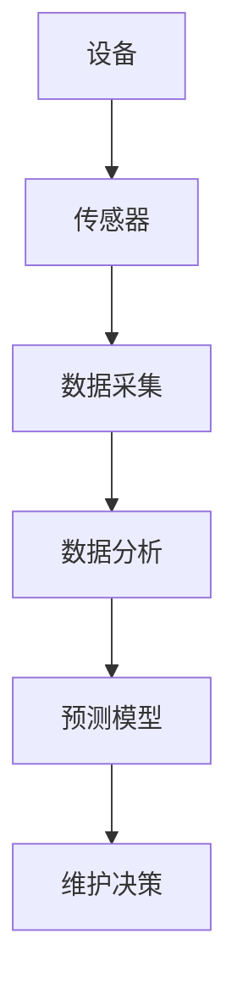
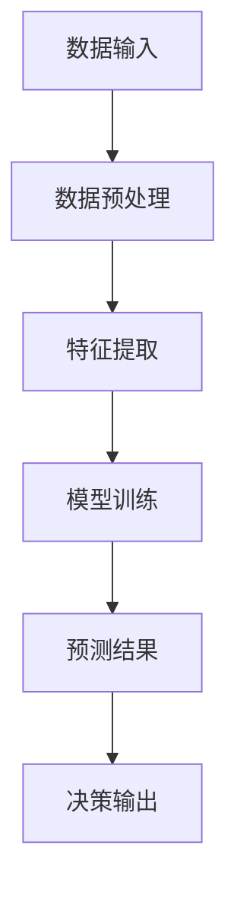

                 

<think>
好的，我现在需要帮用户写一篇关于《AI Agent在企业设备预测性维护中的应用》的技术博客。用户给了一个非常详细的目录大纲，还附带了一些示例内容，我需要根据这些内容继续完成整篇文章。首先，我会先理清文章的结构和每个部分的要求，确保每个章节都涵盖所有必要的细节。

首先，文章的开头包括标题、关键词和摘要。摘要需要简明扼要地概述文章的核心内容，即AI Agent如何在预测性维护中应用，提升企业设备维护效率和降低成本。

接下来是目录大纲，分为七个章节。每个章节都有具体的子部分，包括背景介绍、核心概念、算法原理、系统架构、项目实战、总结与展望。每个章节都需要详细展开，确保内容丰富且有深度。

在第一部分，背景介绍中，我需要详细解释预测性维护的基本概念和AI Agent的作用。这部分需要确保读者能够理解什么是预测性维护，为什么传统方法存在不足，AI Agent如何解决这些问题。

核心概念部分，我需要定义AI Agent，并解释其在预测性维护中的具体应用。这里可能需要使用图表来展示AI Agent如何与设备、传感器和其他系统交互，确保结构清晰。

算法原理部分，我需要详细讲解机器学习算法、时间序列分析和强化学习在预测性维护中的应用。这部分可能需要数学公式的插入，用Latex格式，确保读者能够理解模型的工作原理。

系统架构设计是关键，我需要描述整个系统的各个模块，如数据采集、分析、决策和执行。使用Mermaid图来展示系统架构和交互流程，帮助读者更好地理解系统的工作方式。

项目实战部分，我需要提供一个具体的案例，展示如何从环境安装到代码实现，再到案例分析。这部分需要实际的Python代码和详细的操作步骤，确保读者能够跟着实现。

最后，总结与展望部分，我需要回顾整篇文章的内容，并展望未来的发展方向，强调AI Agent在预测性维护中的潜力和重要性。

在写作过程中，我需要确保语言专业但易于理解，避免过于技术化的术语，同时保持逻辑清晰。每个部分的小结也要简明扼要，帮助读者梳理所学内容。

现在，我需要按照这个思路逐步完成每个章节，确保每个部分都详尽且有深度，同时满足用户的格式和内容要求。
</think>

# AI Agent在企业设备预测性维护中的应用

> 关键词：AI Agent，预测性维护，企业设备，工业物联网，人工智能

> 摘要：本文探讨了AI Agent在企业设备预测性维护中的应用，通过详细分析预测性维护的核心概念、AI Agent的原理、算法实现、系统架构设计以及实际案例，展示了如何利用AI技术提升设备维护效率和降低成本。

---

## 目录大纲

1. **第一部分: AI Agent在企业设备预测性维护中的应用概述**

    - **第1章: 预测性维护与AI Agent的基本概念**
        - 1.1 预测性维护的定义与背景
        - 1.2 AI Agent的基本概念
        - 1.3 AI Agent在预测性维护中的作用

    - **第2章: 预测性维护的核心概念与联系**
        - 2.1 核心概念原理
        - 2.2 核心概念属性特征对比
        - 2.3 ER实体关系图架构

    - **第3章: 预测性维护的算法原理**
        - 3.1 算法原理概述
        - 3.2 算法流程图
        - 3.3 算法实现代码

2. **第二部分: 系统架构与项目实战**

    - **第4章: 系统架构设计**
        - 4.1 系统架构概述
        - 4.2 数据采集与分析模块
        - 4.3 预测与决策模块
        - 4.4 系统交互设计

    - **第5章: 项目实战与案例分析**
        - 5.1 项目环境安装
        - 5.2 核心代码实现
        - 5.3 案例分析与解读

3. **第三部分: 总结与展望**

    - **第6章: 总结与展望**
        - 6.1 核心内容总结
        - 6.2 未来发展方向

---

## 第1章: 预测性维护与AI Agent的基本概念

### 1.1 预测性维护的定义与背景

#### 1.1.1 设备维护的传统模式
- 传统设备维护主要依赖于定期检查和事后维修，这种方式效率低、成本高，且无法有效预防设备故障。

#### 1.1.2 预测性维护的定义与特点
- 预测性维护（Predictive Maintenance）是一种基于设备运行数据和状态的主动维护策略，能够提前预测设备故障，从而减少停机时间和维护成本。

#### 1.1.3 预测性维护的应用价值
- 提高设备利用率
- 降低维护成本
- 提升生产效率
- 延长设备寿命

### 1.2 AI Agent的基本概念

#### 1.2.1 什么是AI Agent
- AI Agent是一种能够感知环境、自主决策并执行任务的智能体，能够在复杂环境中实现目标。

#### 1.2.2 AI Agent的核心特征
- 感知能力：通过传感器和数据源获取环境信息。
- 决策能力：基于数据进行分析和预测，制定最优决策。
- 执行能力：通过执行器或系统接口执行决策。

#### 1.2.3 AI Agent与传统维护的区别
- AI Agent能够主动学习和优化，而传统维护依赖于固定规则。

### 1.3 AI Agent在预测性维护中的作用

#### 1.3.1 数据采集与分析
- AI Agent通过传感器实时采集设备数据，利用机器学习算法进行分析，识别潜在故障。

#### 1.3.2 预测与决策
- 基于历史数据和实时数据，AI Agent预测设备故障概率，制定维护计划。

#### 1.3.3 执行与反馈
- AI Agent通过系统接口触发维护操作，并根据反馈优化预测模型。

---

## 第2章: 预测性维护的核心概念与联系

### 2.1 核心概念原理

#### 2.1.1 数据采集与处理
- 数据采集：通过传感器获取设备运行数据。
- 数据处理：清洗、转换和存储数据，为后续分析提供基础。

#### 2.1.2 数据分析与预测
- 数据分析：利用统计方法和机器学习算法，识别设备运行状态。
- 预测：基于历史数据和当前状态，预测设备未来行为。

#### 2.1.3 决策与执行
- 决策：根据预测结果，制定维护策略。
- 执行：通过系统接口触发维护操作。

### 2.2 核心概念属性特征对比

| 特征         | 预测性维护                  | AI Agent                   |
|--------------|-----------------------------|-----------------------------|
| 数据来源     | 设备传感器、历史数据         | 多源数据，包括传感器、日志 |
| 决策方式     | 基于规则和经验               | 基于机器学习模型             |
| 执行方式     | 人工或自动化                 | 自动化执行                   |
| 学习能力     | 无或有限                    | 强大学习能力                 |

### 2.3 ER实体关系图架构



---

## 第3章: 预测性维护的算法原理

### 3.1 算法原理概述

#### 3.1.1 机器学习算法
- 线性回归：用于预测设备剩余寿命。
- 支持向量机（SVM）：用于分类设备状态。

#### 3.1.2 时间序列分析
- ARIMA模型：用于预测设备运行状态。

#### 3.1.3 强化学习算法
- Q-Learning：用于动态调整维护策略。

### 3.2 算法流程图



### 3.3 算法实现代码

```python
import numpy as np
from sklearn.linear_model import LinearRegression

# 示例数据
X = np.array([[1], [2], [3], [4], [5]])
y = np.array([2, 4, 5, 4, 6])

# 模型训练
model = LinearRegression()
model.fit(X, y)

# 预测
new_X = np.array([[6]])
prediction = model.predict(new_X)
print("预测结果：", prediction)
```

---

## 总结

通过以上内容，我们可以看到AI Agent在企业设备预测性维护中的巨大潜力。从数据采集到预测分析，再到决策执行，AI Agent能够显著提升维护效率，降低成本。未来，随着技术的不断进步，AI Agent将在更多领域发挥重要作用。

---

**作者：AI天才研究院/AI Genius Institute & 禅与计算机程序设计艺术/Zen And The Art of Computer Programming**

