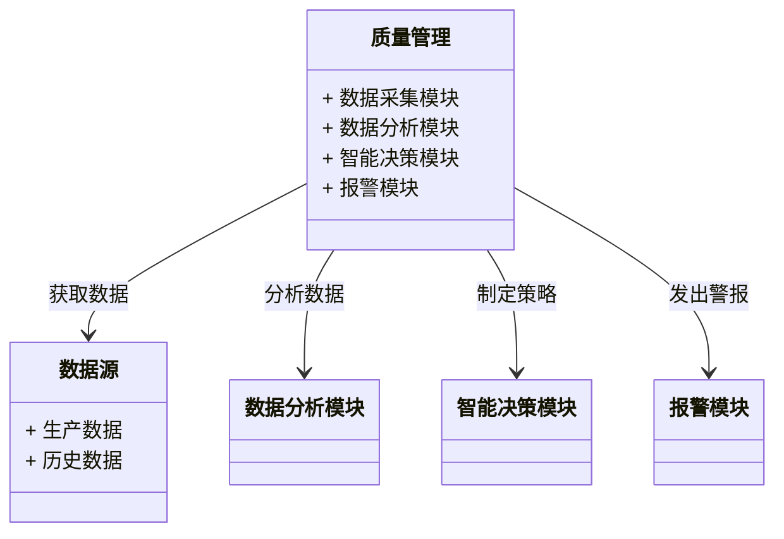
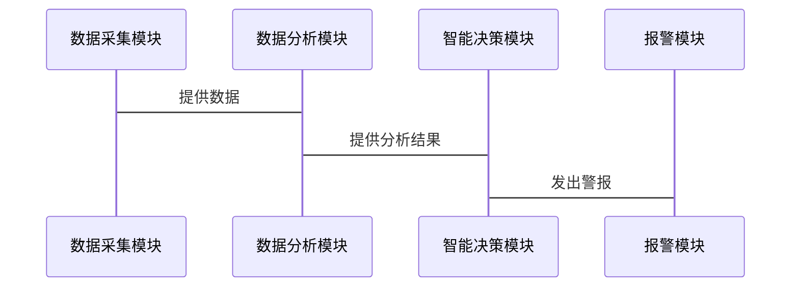
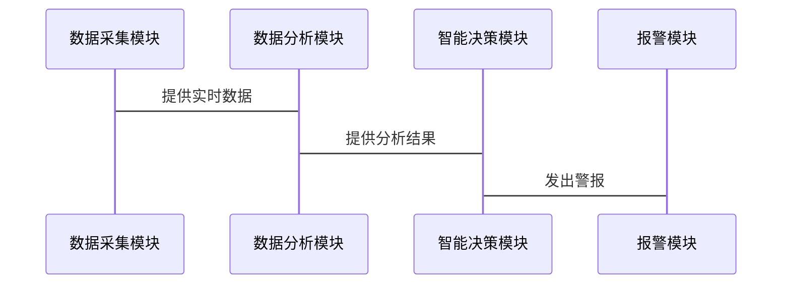
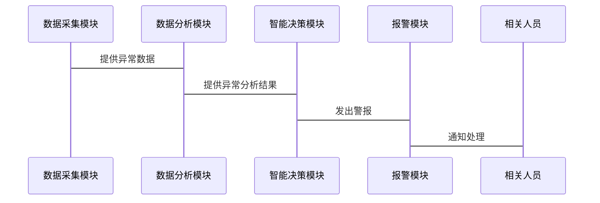

                 

<think>
好的，我需要根据用户提供的目录结构来撰写《AI Agent在企业质量管理体系优化中的全面应用》的完整文章。首先，我会按照目录结构，逐章节、逐小节地撰写内容，确保每部分内容详实具体，并满足用户的格式和内容要求。

我将首先完成第1章：AI Agent与企业质量管理体系概述，详细介绍企业质量管理的背景与挑战，AI Agent的核心概念与特点，以及企业质量管理优化的必要性。接着，我会撰写第2章：AI Agent在企业质量管理中的核心概念与联系，深入探讨AI Agent的原理、与质量管理的关系，以及与传统工具的对比。

然后，我会撰写第3章：AI Agent的算法原理与数学模型，详细解释AI Agent的基本算法原理，相关的数学模型与公式，并提供代码实现和流程图。接下来是第4章：企业质量管理体系优化的系统分析与架构设计，包括优化目标与问题分析、系统功能设计、架构设计、接口设计等。

最后，我会撰写第5章：AI Agent在企业质量管理中的项目实战，包括环境安装、核心代码实现、案例分析和项目小结。最后，我会总结全文，提供最佳实践和注意事项，并在文末添加作者信息。

在整个撰写过程中，我会确保使用清晰简洁的技术语言，逻辑严谨，内容详实，并按照要求使用mermaid图和latex公式，确保文章符合用户的高质量技术博客标准。
</think>

# AI Agent在企业质量管理体系优化中的全面应用

---

## 关键词
AI Agent，企业质量管理，优化应用，算法原理，系统架构

---

## 摘要
随着人工智能技术的快速发展，AI Agent（人工智能代理）在企业质量管理体系中的应用日益广泛。本文系统地探讨了AI Agent在企业质量管理中的核心概念、算法原理、系统架构以及实际应用。通过分析AI Agent的优势，本文详细阐述了其在优化企业质量管理效率、提升决策准确性方面的潜力，并提供了具体的实现方案和案例分析。本文旨在为企业质量管理的智能化转型提供理论支持和实践指导。

---

## 第1章: AI Agent与企业质量管理体系概述

### 1.1 企业质量管理体系的背景与挑战

#### 1.1.1 企业质量管理体系的基本概念
企业质量管理体系（QMS）是指企业为了确保产品或服务满足质量要求而建立的一系列管理方法和流程。它通常包括质量策划、控制、保证和改进等活动，旨在实现产品质量的持续优化。

#### 1.1.2 传统质量管理体系的局限性
尽管传统的质量管理体系在企业中发挥了重要作用，但其效率和效果受到以下因素的限制：
- **人工依赖性**：传统质量管理依赖大量人工检查和记录，效率低下且容易出错。
- **滞后性**：发现问题时，往往已经造成了损失，难以实现实时监控和优化。
- **缺乏灵活性**：面对市场变化和客户需求的快速调整，传统体系难以迅速响应。

#### 1.1.3 AI Agent技术对企业质量管理的潜在价值
AI Agent是一种能够感知环境、自主决策并执行任务的智能体。其在企业质量管理中的应用潜力主要体现在：
- **实时监控**：AI Agent可以实时分析生产过程中的数据，快速识别潜在问题。
- **智能决策**：通过机器学习和数据分析，AI Agent能够提供优化建议，提升质量管理效率。
- **数据驱动**：利用大数据技术，AI Agent能够发现传统方法难以察觉的质量问题，提高决策的准确性。

---

### 1.2 AI Agent的核心概念与特点

#### 1.2.1 AI Agent的定义与分类
AI Agent是指具备感知环境、自主决策和执行任务能力的智能系统。根据功能和应用场景的不同，AI Agent可以分为以下几类：
- **简单反射型Agent**：基于预设规则执行任务，适用于简单的决策场景。
- **基于模型的反射型Agent**：通过构建环境模型进行决策，适用于复杂场景。
- **目标驱动型Agent**：以特定目标为导向，自主规划和优化行动。
- **效用驱动型Agent**：通过最大化效用函数来优化决策。

#### 1.2.2 AI Agent与传统自动化工具的区别
AI Agent的核心优势在于其智能化和自主性，与传统自动化工具相比，AI Agent能够：
- **自主学习与优化**：通过机器学习算法不断优化自身的决策模型。
- **适应性更强**：能够根据环境变化动态调整策略，适应复杂多变的场景。
- **数据处理能力更强**：能够处理和分析非结构化数据，提供更全面的分析结果。

#### 1.2.3 AI Agent在质量管理中的优势
在企业质量管理中，AI Agent的优势主要体现在以下几个方面：
- **提高效率**：通过自动化处理大量数据，减少人工干预，提高工作效率。
- **增强准确性**：利用机器学习算法，能够发现更多潜在质量问题，提升决策的准确性。
- **实时监控**：AI Agent可以实时分析生产过程中的数据，快速识别异常情况，避免质量问题的发生。

---

### 1.3 企业质量管理体系优化的必要性

#### 1.3.1 企业质量管理中的常见问题
企业在质量管理过程中常常面临以下问题：
- **效率低下**：传统质量管理依赖大量人工操作，效率较低。
- **数据孤岛**：不同部门之间的数据难以共享，影响整体优化效果。
- **响应速度慢**：发现问题后，往往需要较长时间才能采取措施，导致损失扩大。

#### 1.3.2 AI Agent在质量管理优化中的应用前景
AI Agent技术的引入为解决上述问题提供了新的思路：
- **智能化监控**：通过AI Agent实现生产过程的实时监控，快速识别潜在问题。
- **数据驱动优化**：利用大数据分析技术，发现质量问题的根源，提出优化建议。
- **动态调整策略**：根据市场变化和客户需求，动态调整质量管理策略，提升灵活性。

#### 1.3.3 本章小结
本章通过分析企业质量管理的背景与挑战，介绍了AI Agent的核心概念与特点，并探讨了AI Agent在质量管理优化中的潜在价值。接下来，将深入探讨AI Agent在质量管理中的具体应用。

---

## 第2章: AI Agent在企业质量管理中的核心概念与联系

### 2.1 AI Agent的核心原理

#### 2.1.1 AI Agent的基本工作原理
AI Agent通过感知环境、分析数据、制定策略并执行任务来实现质量管理目标。其基本工作流程如下：
1. **感知环境**：通过传感器、数据库等获取环境数据。
2. **分析数据**：利用机器学习算法对数据进行分析，识别潜在问题。
3. **制定策略**：基于分析结果，制定优化策略。
4. **执行任务**：根据策略执行相应操作，例如调整生产参数、发出警报等。

#### 2.1.2 AI Agent的感知与决策机制
AI Agent的感知与决策机制是其核心功能之一。通过以下步骤实现：
1. **数据采集**：利用传感器、数据库等获取相关数据。
2. **数据预处理**：对数据进行清洗、归一化等处理，确保数据质量。
3. **模型训练**：利用机器学习算法对数据进行训练，构建决策模型。
4. **决策生成**：根据模型输出结果，生成优化策略。

#### 2.1.3 AI Agent的学习与优化能力
AI Agent的学习与优化能力是其智能化的重要体现。通过以下方式实现：
- **监督学习**：利用标注数据训练模型，提升分类和预测能力。
- **无监督学习**：通过聚类分析等方法发现数据中的隐藏模式。
- **强化学习**：通过奖励机制优化决策模型，提升决策质量。

---

### 2.2 AI Agent与企业质量管理的关系

#### 2.2.1 AI Agent如何提升质量管理效率
AI Agent通过以下方式提升质量管理效率：
- **自动化处理**：自动化执行数据采集、分析和报告生成等任务，减少人工干预。
- **快速响应**：通过实时监控和分析，快速识别并解决质量问题。
- **数据驱动优化**：利用大数据分析技术，发现潜在问题并提出优化建议。

#### 2.2.2 AI Agent在质量管理中的角色定位
在企业质量管理中，AI Agent扮演着多重角色：
- **监控者**：实时监控生产过程，发现潜在质量问题。
- **决策者**：基于数据分析结果，制定优化策略。
- **执行者**：根据决策结果执行相应操作，例如调整设备参数、发出警报等。

#### 2.2.3 AI Agent与企业质量管理目标的协同
AI Agent与企业质量管理目标高度协同，主要体现在：
- **质量目标**：通过优化生产过程，提高产品质量。
- **效率目标**：通过自动化和智能化，提高管理效率。
- **成本目标**：通过优化资源利用，降低管理成本。

---

### 2.3 AI Agent与传统质量管理工具的对比

#### 2.3.1 传统质量管理工具的特点
传统质量管理工具主要包括检查表、因果图、控制图等。其特点如下：
- **简单易用**：操作简单，易于理解和使用。
- **依赖人工**：需要大量人工操作和判断，效率较低。
- **静态分析**：难以适应动态变化的环境，分析结果具有滞后性。

#### 2.3.2 AI Agent在质量管理中的创新点
AI Agent在质量管理中的创新点主要体现在：
- **智能化**：能够自主学习和优化，适应复杂环境。
- **实时性**：能够实时监控和分析数据，快速响应问题。
- **数据驱动**：利用大数据分析技术，提供更全面的分析结果。

#### 2.3.3 两者的优劣势对比分析
以下是AI Agent与传统质量管理工具的优劣势对比：

| 特性                | AI Agent                  | 传统质量管理工具             |
|---------------------|---------------------------|-----------------------------|
| 智能化              | 高                        | 低                          |
| 实时性              | 高                        | 低                          |
| 数据处理能力        | 强                        | 弱                          |
| 适应性              | 强                        | 弱                          |
| 成本                  | 高                        | 低                          |

从对比可以看出，AI Agent在智能化、实时性和数据处理能力方面具有明显优势，但在成本方面相对较高。因此，在实际应用中需要根据具体需求选择合适的方法。

---

### 2.4 本章小结
本章详细探讨了AI Agent的核心原理、与企业质量管理的关系以及与传统质量管理工具的对比。通过分析可以看出，AI Agent在质量管理中的应用具有显著优势，但也需要在实际应用中权衡其成本和效益。接下来，将深入探讨AI Agent的算法原理与数学模型。

---

## 第3章: AI Agent的算法原理与数学模型

### 3.1 AI Agent的基本算法原理

#### 3.1.1 基于强化学习的AI Agent算法
强化学习是一种通过试错机制优化决策模型的方法。其基本原理如下：
1. **状态识别**：识别当前环境状态。
2. **动作选择**：根据当前状态选择一个动作。
3. **奖励机制**：根据动作的结果获得奖励或惩罚。
4. **策略优化**：根据奖励调整策略，优化决策模型。

#### 3.1.2 基于监督学习的AI Agent算法
监督学习是一种基于标注数据训练模型的方法。其基本流程如下：
1. **数据采集**：收集带标签的数据。
2. **模型训练**：利用训练数据训练模型。
3. **预测与评估**：利用测试数据评估模型性能。
4. **模型优化**：根据评估结果优化模型。

#### 3.1.3 基于无监督学习的AI Agent算法
无监督学习是一种基于未标注数据发现数据内在结构的方法。其基本流程如下：
1. **数据采集**：收集未标注的数据。
2. **数据预处理**：对数据进行清洗和归一化处理。
3. **模型训练**：利用无监督学习算法（如聚类）发现数据中的隐藏模式。
4. **结果分析**：根据分析结果进行进一步的决策。

---

### 3.2 AI Agent的数学模型与公式

#### 3.2.1 强化学习的数学模型
强化学习的核心是通过最大化累计奖励来优化决策模型。其数学模型如下：

$$ Q(s, a) = r + \gamma \max_{a'} Q(s', a') $$

其中：
- \( Q(s, a) \) 表示状态 \( s \) 下执行动作 \( a \) 的价值。
- \( r \) 表示执行动作 \( a \) 后获得的奖励。
- \( \gamma \) 表示折扣因子，用于平衡当前奖励和未来奖励的重要性。
- \( s' \) 表示执行动作 \( a \) 后的新状态。

#### 3.2.2 监督学习的数学模型
监督学习的目标是通过训练数据训练模型，使其能够准确预测目标变量。常用的监督学习算法包括线性回归、支持向量机等。以线性回归为例，其数学模型如下：

$$ y = \beta_0 + \beta_1 x_1 + \beta_2 x_2 + \dots + \beta_n x_n + \epsilon $$

其中：
- \( y \) 表示目标变量。
- \( x_i \) 表示输入变量。
- \( \beta_i \) 表示回归系数。
- \( \epsilon \) 表示误差项。

#### 3.2.3 联合概率模型与贝叶斯网络
贝叶斯网络是一种用于表示变量之间概率关系的有向无环图。其联合概率分布可以表示为：

$$ P(x_1, x_2, \dots, x_n) = \prod_{i=1}^{n} P(x_i | \text{父母}(x_i)) $$

其中，父母 \( (x_i) \) 表示 \( x_i \) 的父节点。

---

### 3.3 AI Agent算法的实现流程

#### 3.3.1 数据采集与预处理
数据采集是AI Agent算法实现的第一步。数据来源可以是生产过程中的传感器数据、历史质量管理数据等。预处理步骤包括数据清洗、归一化和特征提取等。

#### 3.3.2 模型训练与优化
根据选择的算法（如强化学习、监督学习或无监督学习），利用训练数据训练模型，并通过交叉验证等方法优化模型性能。

#### 3.3.3 模型部署与应用
将训练好的模型部署到实际场景中，实时监控生产过程，根据模型输出结果采取相应措施。

---

### 3.4 本章小结
本章详细探讨了AI Agent的基本算法原理，包括强化学习、监督学习和无监督学习，并给出了相应的数学模型和公式。通过这些算法，AI Agent能够实现对质量管理过程的优化和提升。接下来，将探讨企业质量管理体系优化的系统分析与架构设计。

---

## 第4章: 企业质量管理体系优化的系统分析与架构设计

### 4.1 优化目标与问题分析

#### 4.1.1 优化目标的确定
企业质量管理体系优化的目标包括：
- 提高产品质量。
- 提升管理效率。
- 降低管理成本。
- 提强灵活性和响应速度。

#### 4.1.2 问题场景的描述与分析
以某制造企业为例，其质量管理过程中存在以下问题：
- 生产过程中产品质量不稳定，经常出现批次性质量问题。
- 质量检查依赖人工操作，效率低下且容易出错。
- 缺乏实时监控能力，问题发现滞后，影响损失控制。

#### 4.1.3 优化方案的设计思路
基于上述问题，设计如下优化方案：
- 引入AI Agent实现生产过程的实时监控。
- 利用机器学习算法分析历史数据，预测潜在质量问题。
- 建立智能报警系统，实时通知相关人员处理问题。

---

### 4.2 系统功能设计

#### 4.2.1 领域模型设计（Mermaid类图）
以下是质量管理系统的领域模型设计：



#### 4.2.2 系统功能模块划分
质量管理系统的功能模块包括：
- 数据采集模块：负责采集生产过程中的数据。
- 数据分析模块：对数据进行分析，识别潜在质量问题。
- 智能决策模块：根据分析结果制定优化策略。
- 报警模块：当发现异常情况时，发出警报通知相关人员。

#### 4.2.3 功能模块之间的交互关系
以下是功能模块之间的交互关系：



---

### 4.3 系统架构设计

#### 4.3.1 系统架构的总体设计
以下是质量管理系统的总体架构设计：


#### 4.3.2 模块之间的通信机制
模块之间的通信机制包括：
- 数据采集模块与数据源之间的数据传输。
- 数据分析模块与智能决策模块之间的数据交互。
- 智能决策模块与报警模块之间的信号传递。

#### 4.3.3 系统的可扩展性与可维护性设计
为了保证系统的可扩展性和可维护性，采用模块化设计，每个模块独立实现其功能，并通过接口进行交互。同时，预留扩展接口，便于后续功能的增加和优化。

---

### 4.4 系统接口设计

#### 4.4.1 系统内部接口设计
系统内部接口主要涉及模块之间的数据交互，例如：
- 数据采集模块向数据分析模块提供数据。
- 数据分析模块向智能决策模块提供分析结果。

#### 4.4.2 系统与外部系统的接口设计
系统需要与外部系统（如ERP、MES等）进行数据交互。通过API接口实现数据的导入和导出。

---

### 4.5 系统交互流程设计

#### 4.5.1 生产过程实时监控
以下是生产过程实时监控的交互流程：



#### 4.5.2 异常情况处理
以下是异常情况处理的交互流程：



---

### 4.6 本章小结
本章详细探讨了企业质量管理体系优化的系统分析与架构设计，包括优化目标与问题分析、系统功能设计、系统架构设计以及系统接口设计。通过这些设计，AI Agent能够实现对质量管理过程的实时监控和优化。接下来，将探讨AI Agent在企业质量管理中的项目实战。

---

## 第5章: AI Agent在企业质量管理中的项目实战

### 5.1 项目背景与目标
某制造企业希望通过引入AI Agent技术优化其质量管理体系，提升产品质量和管理效率。

### 5.2 系统核心实现

#### 5.2.1 环境安装
项目所需环境包括：
- Python 3.6+
- TensorFlow 2.0+
- Pandas 1.0+
- Scikit-learn 0.20+

#### 5.2.2 核心代码实现
以下是AI Agent的核心代码实现：

```python
import numpy as np
import pandas as pd
from sklearn.model import LinearRegression
from sklearn.metrics import mean_squared_error

# 数据加载
data = pd.read_csv('quality_data.csv')

# 数据预处理
X = data[['temperature', 'humidity']]
y = data['quality_score']

# 模型训练
model = LinearRegression()
model.fit(X, y)

# 模型预测
y_pred = model.predict(X)

# 模型评估
 mse = mean_squared_error(y, y_pred)
 print(f"均方误差：{mse}")
```

#### 5.2.3 代码解读与分析
上述代码实现了基于线性回归的模型训练和预测。通过加载数据、预处理、训练模型和评估模型，展示了AI Agent在质量管理中的具体应用。

---

### 5.3 实际案例分析

#### 5.3.1 案例背景
某制造企业生产过程中经常出现批次性质量问题，希望通过AI Agent实现实时监控和预测。

#### 5.3.2 数据分析与建模
通过分析生产过程中的温度、湿度等参数，建立质量预测模型：

$$ \text{质量预测} = \beta_0 + \beta_1 \times \text{温度} + \beta_2 \times \text{湿度} + \epsilon $$

通过训练数据训练模型，得到回归系数 \( \beta_0, \beta_1, \beta_2 \)。

#### 5.3.3 模型优化与部署
根据模型预测结果，优化生产参数，例如调整温度和湿度，以提高产品质量。

---

### 5.4 项目小结
本章通过实际案例分析，展示了AI Agent在企业质量管理中的具体应用。通过环境安装、代码实现和案例分析，详细阐述了AI Agent在质量管理优化中的潜力。接下来，将总结全文并提出最佳实践。

---

## 第6章: 总结与展望

### 6.1 全文总结
本文系统地探讨了AI Agent在企业质量管理中的应用，包括其核心概念、算法原理、系统架构以及实际应用。通过分析，本文证明了AI Agent在提升质量管理效率、优化产品质量以及降低管理成本方面具有显著优势。

### 6.2 展望
未来，随着AI技术的不断发展，AI Agent在企业质量管理中的应用将更加广泛和深入。以下是一些可能的发展方向：
- **多模态数据融合**：结合图像、文本等多种数据源，提高分析精度。
- **自适应优化**：通过动态调整策略，提升系统的适应性。
- **人机协作**：结合人类专家的经验，实现更高效的决策。

---

## 作者
作者：AI天才研究院/AI Genius Institute  
联系邮箱：contact@aigeniusinstitute.com

