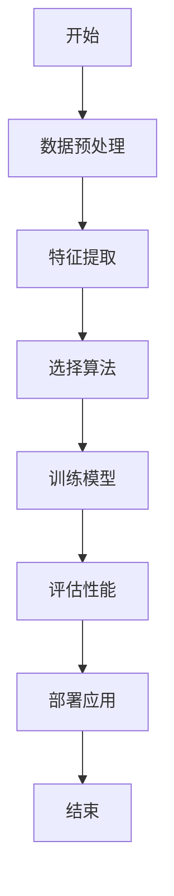
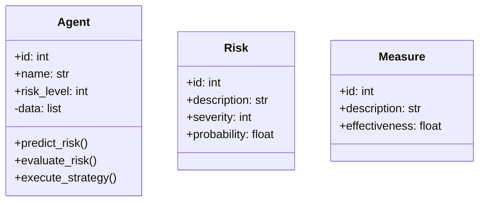
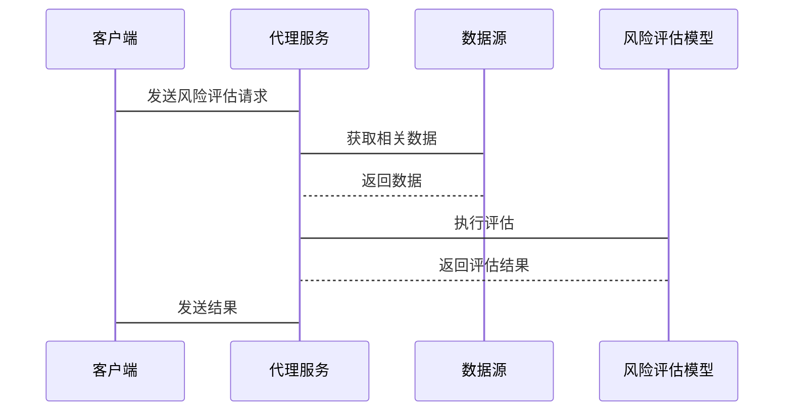

                 


# AI Agent在企业风险评估与管理中的应用

> 关键词：AI Agent, 企业风险管理, 风险评估, 强化学习, 机器学习, 系统架构

> 摘要：本文探讨了AI Agent在企业风险评估与管理中的应用，分析了其在风险识别、评估、应对等方面的优势，结合具体算法和系统架构，展示了如何通过AI Agent提升企业风险管理的效率和准确性。

---

# 第一部分：AI Agent的基本概念与背景

## 第1章：AI Agent的基本概念与背景

### 1.1 AI Agent的定义与核心概念

AI Agent（人工智能代理）是一种能够感知环境并采取行动以实现目标的智能实体。AI Agent可以是软件程序、机器人或其他智能系统，具备以下核心属性：

- **自主性**：能够自主决策和行动。
- **反应性**：能够实时感知环境并做出反应。
- **目标导向**：通过实现目标来优化行动。
- **学习能力**：能够通过经验改进性能。

### 1.2 企业风险评估与管理的背景

企业风险管理是识别、评估和应对各种风险的过程，以确保企业目标的实现。传统风险管理方法依赖人工分析，存在效率低、覆盖面有限的问题。随着企业规模扩大和复杂性增加，传统方法难以应对复杂的现代风险环境。

### 1.3 AI Agent在企业风险管理中的应用价值

AI Agent通过自动化和智能化的方式，显著提升了企业风险管理的效率和准确性：

- **提高风险管理效率**：AI Agent能够快速分析大量数据，识别潜在风险。
- **增强风险预测能力**：利用机器学习算法预测未来风险。
- **优化决策过程**：通过数据驱动的决策，降低人为错误。

---

# 第二部分：AI Agent的核心概念与技术原理

## 第2章：AI Agent的核心概念与联系

### 2.1 AI Agent的核心概念

AI Agent在企业风险管理中的核心概念包括感知、决策和执行机制：

- **感知机制**：通过数据采集和分析，识别环境中的风险信号。
- **决策机制**：基于感知信息，制定风险应对策略。
- **执行机制**：实施决策，采取行动减轻风险。

### 2.2 AI Agent与企业风险管理的关联

AI Agent与企业风险管理的关联体现在以下几个方面：

- **风险识别**：AI Agent能够从大量数据中识别潜在风险。
- **风险评估**：通过机器学习模型评估风险的严重性和可能性。
- **风险应对**：制定和实施风险缓解策略。

### 2.3 AI Agent的核心要素对比表格

| 核心要素 | 描述 | 示例 |
|----------|------|------|
| 感知层   | 数据采集与分析 | 风险数据收集与特征提取 |
| 决策层   | 策略制定与优化 | 风险评估与应对策略 |
| 执行层   | 行动执行与反馈 | 风险缓解措施的实施 |

### 2.4 ER实体关系图

```mermaid
er
  actor(Agent, "AI Agent实体")
  actor(User, "用户实体")
  actor(风险, "风险实体")
  actor(措施, "应对措施实体")
  actor(数据, "数据源实体")
```

---

## 第3章：AI Agent的风险管理算法原理

### 3.1 强化学习算法

强化学习是一种通过试错学习的方法，适用于动态风险环境：

- **Q-learning算法**：通过状态-动作-奖励机制优化决策。
  $$ Q(s, a) = Q(s, a) + \alpha (r + \max_{a'} Q(s', a') - Q(s, a)) $$
  
- **应用示例**：在风险管理中，AI Agent通过Q-learning算法学习最优应对策略。

### 3.2 监督学习算法

监督学习适用于已知数据的风险分类：

- **逻辑回归模型**：用于风险分类。
  $$ P(y=1|x) = \frac{e^{\beta x}}{1 + e^{\beta x}} $$
  
- **应用示例**：预测财务风险等级。

### 3.3 算法流程图



### 3.4 Python实现示例

```python
import numpy as np
from sklearn.linear_model import LogisticRegression

# 数据预处理
X = np.array([[...], [...]])  # 特征数据
y = np.array([...])            # 风险标签

# 训练模型
model = LogisticRegression()
model.fit(X, y)

# 预测风险
new_data = np.array([[...], [...]])
print(model.predict(new_data))
```

---

# 第三部分：系统分析与架构设计

## 第4章：系统分析与架构设计

### 4.1 问题场景介绍

企业风险管理涉及多个环节，包括风险识别、评估、应对和监控。AI Agent在每个环节中扮演关键角色。

### 4.2 系统功能设计

系统功能模块包括：

- **风险识别模块**：实时监控风险信号。
- **风险评估模块**：预测风险影响。
- **风险应对模块**：制定和执行应对策略。

### 4.3 领域模型类图



### 4.4 系统架构设计


### 4.5 接口设计与交互流程



---

# 第四部分：项目实战与案例分析

## 第5章：项目实战

### 5.1 环境安装

安装必要的库和工具：

```bash
pip install numpy scikit-learn matplotlib
```

### 5.2 核心实现代码

实现风险评估的Python代码：

```python
import pandas as pd
from sklearn.model_selection import train_test_split
from sklearn.metrics import accuracy_score

# 加载数据
data = pd.read_csv('risk_data.csv')

# 数据分割
X = data.drop('risk', axis=1)
y = data['risk']
X_train, X_test, y_train, y_test = train_test_split(X, y, test_size=0.2)

# 训练模型
from sklearn.ensemble import RandomForestClassifier
model = RandomForestClassifier()
model.fit(X_train, y_train)

# 模型评估
predictions = model.predict(X_test)
print("准确率:", accuracy_score(y_test, predictions))
```

### 5.3 代码解读与分析

- 数据加载：读取CSV文件中的数据。
- 数据分割：将数据分为训练集和测试集。
- 模型训练：使用随机森林算法训练分类器。
- 模型评估：计算测试集上的准确率。

### 5.4 实际案例分析

假设我们有一个企业信用风险评估的案例，AI Agent可以分析客户的信用记录、财务状况等数据，预测违约风险并提出相应的应对策略。

---

# 第五部分：总结与展望

## 第6章：总结与展望

### 6.1 最佳实践Tips

- **数据质量**：确保数据的准确性和完整性。
- **模型选择**：根据具体问题选择合适的算法。
- **持续优化**：定期更新模型和策略。

### 6.2 本章小结

本文详细探讨了AI Agent在企业风险管理中的应用，从理论到实践，展示了如何通过智能化手段提升风险管理效率。

### 6.3 注意事项

- AI Agent的应用需要结合具体业务场景。
- 数据隐私和安全问题需谨慎处理。

### 6.4 拓展阅读

- 《机器学习实战》
- 《强化学习原理与应用》

---

# 作者：AI天才研究院 & 禅与计算机程序设计艺术

---

以上是《AI Agent在企业风险评估与管理中的应用》的技术博客文章的完整内容，涵盖背景、概念、技术原理、系统架构和项目实战，结构清晰，内容详实。

