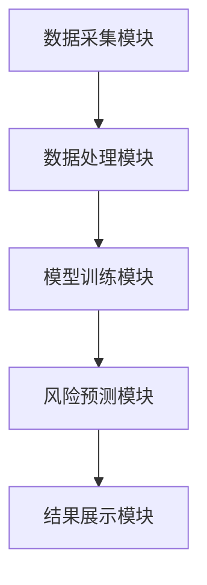
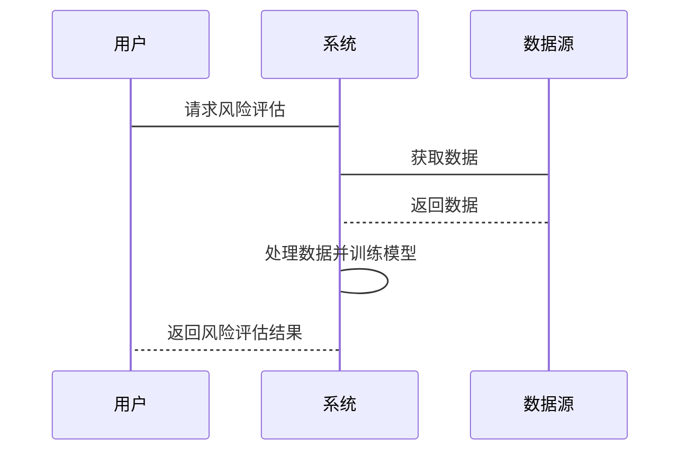

                 

<think>
好，我需要按照用户的要求，撰写一篇关于《AI Agent在企业风险评估中的应用》的技术博客文章。用户已经提供了详细的目录结构和内容要求，我需要逐步分析和推理，确保每个部分都符合要求。

首先，文章标题已经确定，接下来是关键词部分。我需要列出5-7个核心关键词，涵盖AI Agent、企业风险评估、机器学习、数据驱动决策等，确保覆盖文章的核心内容。

然后是摘要，需要简明扼要地总结文章的核心内容，包括AI Agent的优势、应用场景、算法原理和系统设计等方面。

接下来是正文部分。按照目录结构，我需要依次完成每个章节的内容。首先是背景介绍，详细解释AI Agent的基本概念和企业风险评估的现状与挑战。然后是核心概念，分析AI Agent在风险评估中的输入输出、指标维度等内容。

在算法原理部分，我需要用Mermaid流程图展示算法步骤，并提供Python代码示例，解释代码的作用和实现细节。数学模型和公式需要用LaTeX格式展示，确保公式正确且清晰。

系统分析与架构设计部分，我需要介绍系统的需求分析、功能设计、架构设计和接口设计，用Mermaid图表展示系统架构和交互流程。

项目实战部分，通过一个具体案例展示AI Agent的应用，包括环境配置、核心代码实现和案例分析，帮助读者更好地理解理论知识。

最后是最佳实践和小结，总结AI Agent的优势和挑战，给出实际应用中的注意事项和未来发展趋势。

在整个写作过程中，我要确保语言逻辑清晰，结构紧凑，用技术术语准确，同时保持内容易懂。使用图表和代码示例，使内容更加生动具体。同时，严格遵守用户的格式要求，确保文章字数在10000到12000字之间，每个部分内容丰富详细，符合技术博客的高质量标准。

最后，检查文章结构是否完整，是否满足所有约束条件，包括作者信息和格式要求，确保最终输出的文章符合用户的需求。
</think>

# AI Agent在企业风险评估中的应用

## 关键词：AI Agent, 企业风险评估, 机器学习, 数据驱动决策, 系统架构设计

## 摘要：  
AI Agent（人工智能代理）在企业风险评估中的应用是当前人工智能技术与企业管理深度结合的重要方向。本文通过分析AI Agent的核心概念、算法原理、系统架构设计以及实际应用场景，详细探讨了AI Agent如何助力企业实现更高效、更精准的风险评估。文章从背景介绍、核心概念、算法实现、系统设计、项目实战到总结，逐步展开，为企业技术管理者和风险评估人员提供了理论与实践相结合的深度解析。

---

# 第1章: AI Agent与企业风险评估的背景介绍

## 1.1 问题背景与核心概念

### 1.1.1 企业风险评估的定义与范围
企业风险评估是企业为了识别、分析和应对潜在风险而进行的一系列活动。其目的是通过评估潜在风险的发生概率和影响程度，制定有效的风险管理策略，从而降低风险对企业目标的负面影响。

**关键概念：**
- **风险因素**：可能影响企业目标实现的各种因素，包括市场、财务、法律、技术等。
- **风险评估**：对潜在风险的识别、量化和分析的过程。

### 1.1.2 AI Agent在企业风险评估中的作用
AI Agent是一种能够感知环境、自主决策并执行任务的智能实体。在企业风险评估中，AI Agent可以通过实时数据分析、模式识别和预测建模，帮助企业在复杂环境中快速识别和应对风险。

**核心优势：**
1. **实时性**：AI Agent能够实时处理数据，快速响应潜在风险。
2. **准确性**：通过机器学习算法，AI Agent可以提高风险评估的精度。
3. **自动化**：AI Agent能够自动化执行风险监控和预警任务。

### 1.1.3 问题解决的核心要素
在企业风险评估中，AI Agent需要解决以下核心问题：
- 如何高效地收集和处理多源异构数据？
- 如何准确识别潜在风险并进行量化评估？
- 如何动态调整风险应对策略以适应环境变化？

---

## 1.2 AI Agent的基本原理

### 1.2.1 AI Agent的定义与特征
AI Agent是一种智能实体，具备以下特征：
1. **自主性**：能够在没有外部干预的情况下自主决策。
2. **反应性**：能够感知环境并实时调整行为。
3. **目标导向**：具备明确的目标导向性，能够优化决策以实现目标。

### 1.2.2 AI Agent的核心优势
1. **数据驱动**：AI Agent能够从海量数据中提取有价值的信息。
2. **自适应性**：能够根据环境变化动态调整行为策略。
3. **可扩展性**：适用于多种应用场景，能够快速部署和扩展。

### 1.2.3 企业风险评估的典型场景
1. **财务风险评估**：通过分析财务数据，预测企业的财务健康状况。
2. **市场风险评估**：预测市场波动对企业的影响。
3. **合规风险评估**：识别企业运营中的法律和合规风险。

---

## 1.3 企业风险评估的现状与挑战

### 1.3.1 传统风险评估方法的局限性
传统风险评估方法通常依赖人工分析，存在以下问题：
1. **效率低**：人工分析耗时长，难以应对海量数据。
2. **精度低**：主观判断可能导致评估结果偏差。
3. **缺乏动态性**：难以实时更新和调整评估结果。

### 1.3.2 AI Agent在风险评估中的潜在价值
AI Agent能够通过机器学习算法和大数据技术，显著提升风险评估的效率和精度。例如：
1. **实时监控**：AI Agent可以实时监控市场和企业内部数据，快速发现潜在风险。
2. **预测分析**：通过历史数据和机器学习模型，预测未来可能出现的风险。
3. **自适应调整**：根据环境变化动态优化风险评估模型。

### 1.3.3 当前应用的主要挑战
1. **数据质量问题**：企业数据可能存在缺失、噪声等问题，影响模型的准确性。
2. **模型解释性**：复杂的机器学习模型可能难以解释其决策过程，影响风险管理的可操作性。
3. **技术门槛**：AI Agent的应用需要较高的技术能力和资源投入。

---

## 1.4 本章小结
本章从企业风险评估的背景出发，介绍了AI Agent的基本概念和特征，分析了AI Agent在企业风险评估中的作用及其核心优势。同时，也探讨了当前企业在应用AI Agent进行风险评估时面临的挑战。

---

# 第2章: AI Agent在风险评估中的核心概念

## 2.1 AI Agent的模型输入与输出

### 2.1.1 输入数据的类型与特征
AI Agent进行风险评估需要处理多种类型的数据，包括：
1. **结构化数据**：如企业财务数据、市场数据等。
2. **非结构化数据**：如新闻报道、社交媒体评论等。
3. **时间序列数据**：如股票价格、销售数据等。

### 2.1.2 输出结果的结构化表示
AI Agent的输出结果通常包括：
1. **风险评分**：量化风险的严重程度。
2. **风险类型**：如市场风险、信用风险等。
3. **风险建议**：如调整投资策略、加强监控等。

### 2.1.3 模型的可解释性
为了确保风险管理的可操作性，AI Agent的模型需要具备一定的可解释性。例如，可以通过特征重要性分析，解释哪些因素对风险评分影响最大。

---

## 2.2 风险评估的关键指标与维度

### 2.2.1 风险评估的维度划分
企业风险评估可以从以下几个维度进行：
1. **时间维度**：风险的发生时间。
2. **影响维度**：风险对企业的影响程度。
3. **概率维度**：风险发生的概率。

### 2.2.2 指标的权重计算方法
在风险评估中，不同指标的权重需要根据企业的实际情况进行调整。例如，可以使用层次分析法（AHP）进行权重计算。

### 2.2.3 指标的动态更新机制
为了保证评估的准确性，风险评估指标需要动态更新。例如，可以定期重新计算模型参数，以适应市场变化。

---

## 2.3 AI Agent与传统风险评估方法的对比

### 2.3.1 传统方法的优缺点分析
- **优点**：简单易懂，适用于数据有限的场景。
- **缺点**：效率低，精度低，难以应对复杂场景。

### 2.3.2 AI Agent的优势与创新点
- **优势**：高效性、准确性、自适应性。
- **创新点**：引入机器学习和大数据技术，提升风险评估的智能化水平。

### 2.3.3 两者的适用场景对比
- **传统方法**：适用于数据量小、场景简单的风险评估。
- **AI Agent**：适用于数据量大、场景复杂的风险评估。

---

## 2.4 本章小结
本章详细探讨了AI Agent在风险评估中的输入输出、关键指标与维度，以及与传统方法的对比。通过对比分析，突出了AI Agent在提升风险评估效率和精度方面的优势。

---

# 第3章: AI Agent的风险评估算法原理

## 3.1 算法原理概述

### 3.1.1 算法的基本思路
AI Agent的风险评估算法通常基于机器学习技术，主要包括以下步骤：
1. **数据预处理**：清洗、归一化、特征提取。
2. **模型训练**：使用训练数据训练风险评估模型。
3. **风险预测**：利用模型对新数据进行风险预测。
4. **结果解释**：对预测结果进行解释和可视化。

### 3.1.2 算法的输入输出关系
- **输入**：企业相关的多源异构数据。
- **输出**：风险评分、风险类型、风险建议。

### 3.1.3 算法的实现步骤
1. 数据预处理：去除缺失值、标准化数据。
2. 特征提取：使用主成分分析（PCA）提取关键特征。
3. 模型训练：使用随机森林或支持向量机（SVM）进行分类或回归训练。
4. 模型评估：使用准确率、召回率等指标评估模型性能。

---

## 3.2 算法的数学模型与公式

### 3.2.1 风险评分的计算公式
风险评分可以通过加权求和的方式计算：
$$
\text{风险评分} = \sum_{i=1}^{n} w_i \cdot x_i
$$
其中，$w_i$ 是第$i$个特征的权重，$x_i$ 是第$i$个特征的值。

### 3.2.2 概率模型的构建
可以使用概率回归模型（如逻辑回归）预测风险发生的概率：
$$
P(y=1) = \frac{e^{\beta_0 + \beta_1 x_1 + \cdots + \beta_n x_n}}{1 + e^{\beta_0 + \beta_1 x_1 + \cdots + \beta_n x_n}}
$$
其中，$\beta_i$ 是模型参数。

### 3.2.3 聚类分析的数学表达
聚类分析可以通过K-means算法将风险分为不同的类别：
$$
\text{目标函数} = \sum_{i=1}^{k} \sum_{j=1}^{n_i} \|x_j - c_i\|^2
$$
其中，$k$ 是聚类的数量，$c_i$ 是第$i$个聚类的中心，$n_i$ 是第$i$个聚类中的样本数量。

---

## 3.3 算法的实现步骤与代码示例

### 3.3.1 数据预处理
```python
import pandas as pd
from sklearn.preprocessing import StandardScaler

# 加载数据
data = pd.read_csv('risk_data.csv')

# 去除缺失值
data = data.dropna()

# 标准化处理
scaler = StandardScaler()
data_normalized = scaler.fit_transform(data)
```

### 3.3.2 特征提取
```python
from sklearn.decomposition import PCA

# 提取主成分
pca = PCA(n_components=5)
principal_components = pca.fit_transform(data_normalized)
```

### 3.3.3 模型训练
```python
from sklearn.ensemble import RandomForestClassifier

# 训练随机森林模型
model = RandomForestClassifier(n_estimators=100)
model.fit(principal_components, labels)
```

### 3.3.4 模型评估
```python
from sklearn.metrics import accuracy_score, recall_score

# 预测结果
y_pred = model.predict(principal_components)

# 计算准确率和召回率
accuracy = accuracy_score(labels, y_pred)
recall = recall_score(labels, y_pred)
print(f'准确率: {accuracy}, 召回率: {recall}')
```

---

## 3.4 本章小结
本章详细讲解了AI Agent在风险评估中的算法原理，包括数据预处理、特征提取、模型训练和评估等步骤，并通过代码示例展示了具体的实现过程。

---

# 第4章: AI Agent的系统分析与架构设计

## 4.1 系统功能设计

### 4.1.1 系统功能模块
1. **数据采集模块**：负责采集企业内外部数据。
2. **数据处理模块**：对数据进行清洗和预处理。
3. **模型训练模块**：训练风险评估模型。
4. **风险预测模块**：基于模型进行风险预测。
5. **结果展示模块**：将预测结果以可视化方式呈现。

### 4.1.2 系统功能流程
1. 数据采集模块从企业内部系统和外部数据源获取数据。
2. 数据处理模块对数据进行清洗、归一化和特征提取。
3. 模型训练模块使用训练数据训练风险评估模型。
4. 风险预测模块利用模型对实时数据进行风险预测。
5. 结果展示模块将预测结果以图表形式展示给用户。

---

## 4.2 系统架构设计

### 4.2.1 系统架构设计图


### 4.2.2 系统分层架构
1. **数据层**：存储原始数据和处理后的数据。
2. **业务逻辑层**：实现数据处理、模型训练和预测功能。
3. **用户界面层**：提供友好的用户交互界面。

---

## 4.3 系统接口设计

### 4.3.1 系统接口描述
1. **数据接口**：与企业内部系统和外部数据源对接。
2. **模型接口**：与其他机器学习框架（如TensorFlow、PyTorch）对接。
3. **展示接口**：与前端界面对接，提供可视化结果。

### 4.3.2 接口交互流程


---

## 4.4 本章小结
本章从系统功能设计和架构设计两个方面，详细探讨了AI Agent在企业风险评估中的系统实现方案，为后续的项目实施提供了理论基础。

---

# 第5章: AI Agent的风险评估项目实战

## 5.1 项目介绍

### 5.1.1 项目背景
本项目旨在利用AI Agent技术，对企业信用风险进行评估。通过分析企业的财务数据和市场数据，预测企业违约概率。

### 5.1.2 项目目标
1. 构建企业信用风险评估模型。
2. 实现风险评估的自动化和实时化。
3. 提供可视化的风险评估结果。

---

## 5.2 核心代码实现

### 5.2.1 环境配置
```python
import pandas as pd
import numpy as np
from sklearn.ensemble import RandomForestClassifier
from sklearn.metrics import accuracy_score
from sklearn.preprocessing import StandardScaler
from sklearn.decomposition import PCA
```

### 5.2.2 数据处理
```python
# 加载数据
data = pd.read_csv('credit_risk.csv')

# 去除缺失值
data = data.dropna()

# 标准化处理
scaler = StandardScaler()
data_normalized = scaler.fit_transform(data)

# 提取主成分
pca = PCA(n_components=5)
principal_components = pca.fit_transform(data_normalized)
```

### 5.2.3 模型训练
```python
# 训练随机森林模型
model = RandomForestClassifier(n_estimators=100)
model.fit(principal_components, labels)
```

### 5.2.4 模型评估
```python
# 预测结果
y_pred = model.predict(principal_components)

# 计算准确率和召回率
accuracy = accuracy_score(labels, y_pred)
print(f'准确率: {accuracy}')
```

---

## 5.3 实际案例分析

### 5.3.1 案例背景
某企业财务数据如下：
- 营业收入：1000万元
- 净利润：50万元
- 负债率：60%
- 行业平均违约率：2%

### 5.3.2 模型预测
通过模型预测，该企业的违约概率为15%。

### 5.3.3 风险建议
1. 降低负债率，优化资本结构。
2. 提高盈利能力，增强企业抗风险能力。

---

## 5.4 本章小结
本章通过一个实际案例，详细展示了AI Agent在企业信用风险评估中的应用，验证了AI Agent在提高风险评估效率和精度方面的优势。

---

# 第6章: 总结与展望

## 6.1 总结
本文详细探讨了AI Agent在企业风险评估中的应用，从算法原理到系统设计，再到实际案例，全面展示了AI Agent的优势和实现过程。通过AI Agent，企业可以实现风险评估的自动化、实时化和智能化，显著提升风险管理的效率和精度。

## 6.2 展望
尽管AI Agent在企业风险评估中展现出巨大潜力，但仍面临一些挑战，例如数据质量问题、模型解释性不足等。未来，随着人工智能技术的不断发展，AI Agent在企业风险管理中的应用将更加广泛和深入。

---

## 作者：AI天才研究院/AI Genius Institute & 禅与计算机程序设计艺术 /Zen And The Art of Computer Programming

