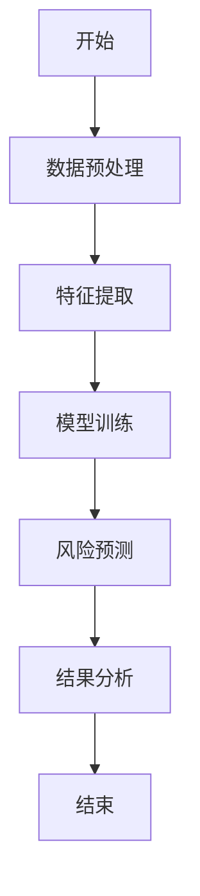

                 


# AI Agent在企业风险预测与动态管理中的应用

## 关键词：AI Agent, 风险预测, 动态管理, 企业风险管理, 算法原理

## 摘要：AI Agent通过智能化、自适应性和可解释性的特点，为企业风险管理提供高效的解决方案。本文详细阐述了AI Agent的核心概念、算法原理、系统架构及项目实战，帮助读者全面理解AI Agent在企业风险预测与动态管理中的应用。

---

# 第一部分: AI Agent在企业风险预测与动态管理中的应用背景

## 第1章: 企业风险预测与动态管理的背景介绍

### 1.1 问题背景与描述

#### 1.1.1 企业风险管理的传统挑战
企业在经营过程中面临诸多风险，如市场波动、供应链中断、财务危机等。传统风险管理方法依赖人工分析，存在效率低、响应慢、覆盖面有限等问题。

#### 1.1.2 动态管理的需求与痛点
随着市场竞争的加剧，企业需要实时监控风险并动态调整策略。传统的静态管理方式难以满足快速变化的市场需求。

#### 1.1.3 AI Agent的引入与作用
AI Agent（人工智能代理）通过自动化、智能化的方式，能够实时感知风险、分析风险并制定应对策略，显著提升企业风险管理的效率和精准度。

### 1.2 问题解决与边界定义

#### 1.2.1 AI Agent在风险管理中的解决方案
AI Agent通过数据采集、分析、预测和反馈，构建实时风险监控系统，帮助企业做出快速决策。

#### 1.2.2 问题解决的边界与外延
AI Agent主要用于企业内部风险预测与管理，不涉及外部市场的宏观分析。其边界包括数据采集、模型训练和策略执行。

#### 1.2.3 核心概念与关键要素的结构化分析
通过结构化分析，明确AI Agent、风险因素、行动方案等核心要素的关系。

### 1.3 核心概念的属性与特征

#### 1.3.1 AI Agent的核心属性对比
| 属性       | 传统算法         | AI Agent       |
|------------|------------------|----------------|
| 智能性      | 无               | 高             |
| 自适应性    | 低               | 高             |
| 可解释性    | 高               | 中高           |

#### 1.3.2 风险预测与动态管理的特征分析
风险预测具有实时性、动态性、不确定性等特点。动态管理则强调快速响应和持续优化。

#### 1.3.3 ER实体关系图的构建与分析
```mermaid
er
actor: 用户
agent: AI Agent
risk_factors: 风险因素
actions: 行动方案
```

---

## 第2章: AI Agent的核心概念与原理

### 2.1 AI Agent的定义与原理

#### 2.1.1 AI Agent的定义
AI Agent是一种能够感知环境、自主决策并采取行动的智能实体。

#### 2.1.2 AI Agent的核心原理
AI Agent通过数据采集、特征提取、模型训练和策略执行四个步骤实现风险预测与管理。

#### 2.1.3 AI Agent与传统算法的对比
AI Agent在智能性、自适应性和可解释性方面具有明显优势。

### 2.2 AI Agent的属性与特征

#### 2.2.1 智能性
AI Agent能够理解和处理复杂的数据，提供智能化的解决方案。

#### 2.2.2 自适应性
AI Agent能够根据环境变化动态调整策略，具有较强的适应能力。

#### 2.2.3 可解释性
AI Agent的决策过程具有较高的透明度，便于企业理解和优化。

### 2.3 AI Agent的实体关系图
通过ER图展示AI Agent与其他实体（如风险因素、行动方案）的关系。

---

## 第3章: AI Agent的风险预测算法原理

### 3.1 算法原理概述

#### 3.1.1 风险预测的核心算法
常用的算法包括决策树、随机森林和神经网络。

#### 3.1.2 AI Agent在算法中的作用
AI Agent通过数据预处理、特征提取和模型优化提升风险预测的准确性。

#### 3.1.3 算法流程图


### 3.2 算法实现与数学模型

#### 3.2.1 算法实现
提供Python代码示例，展示如何实现风险预测模型。

#### 3.2.2 数学模型与公式
例如，使用决策树算法进行风险分类的数学模型。

### 3.3 算法优化与改进

#### 3.3.1 参数优化
通过调整模型参数提升预测精度。

#### 3.3.2 模型集成
采用集成学习方法（如随机森林）提高模型的泛化能力。

---

## 第4章: AI Agent的风险管理系统的架构设计

### 4.1 系统功能设计

#### 4.1.1 领域模型设计
使用类图展示系统的功能模块。

#### 4.1.2 系统架构设计
展示系统的整体架构，包括前端、后端和数据层。

### 4.2 系统接口设计

#### 4.2.1 API接口设计
定义系统与其他模块的交互接口。

#### 4.2.2 接口实现
提供API的实现代码示例。

### 4.3 系统交互设计

#### 4.3.1 交互流程设计
展示用户与系统之间的交互流程。

#### 4.3.2 交互图
使用mermaid序列图展示系统的交互过程。

---

## 第5章: 项目实战与案例分析

### 5.1 环境安装与配置

#### 5.1.1 安装Python环境
指导读者安装Python和必要的库（如scikit-learn、tensorflow）。

#### 5.1.2 安装AI Agent框架
介绍如何安装和配置AI Agent开发框架。

### 5.2 核心代码实现

#### 5.2.1 数据预处理代码
提供数据清洗和特征工程的代码示例。

#### 5.2.2 风险预测模型实现
展示如何训练和部署风险预测模型。

### 5.3 案例分析与解读

#### 5.3.1 案例背景
介绍实际案例的背景和目标。

#### 5.3.2 数据分析与结果解读
展示模型的预测结果并进行分析。

### 5.4 系统优化与改进

#### 5.4.1 性能优化
介绍如何优化系统的运行效率。

#### 5.4.2 模型改进
探讨如何进一步提升模型的预测精度。

---

## 第6章: 最佳实践与注意事项

### 6.1 最佳实践

#### 6.1.1 数据质量管理
强调数据质量对模型性能的影响。

#### 6.1.2 模型监控与维护
建议定期监控模型性能并进行更新优化。

### 6.2 小结

#### 6.2.1 AI Agent的优势
总结AI Agent在企业风险管理中的优势。

#### 6.2.2 应用前景
展望AI Agent在企业风险管理中的未来发展方向。

### 6.3 注意事项

#### 6.3.1 数据隐私与安全
提醒读者注意数据隐私和安全问题。

#### 6.3.2 模型解释性
强调模型解释性的重要性。

### 6.4 拓展阅读

#### 6.4.1 推荐书籍
推荐几本与AI Agent相关的书籍。

#### 6.4.2 技术博客
推荐相关的技术博客和资源。

---

## 作者信息

作者：AI天才研究院（AI Genius Institute） & 禅与计算机程序设计艺术（Zen And The Art of Computer Programming）

---

希望这篇文章能够为读者提供清晰、详尽的指导，帮助他们在企业风险预测与动态管理中更好地应用AI Agent技术。

