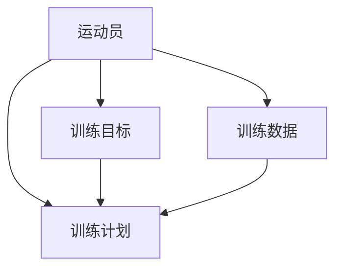
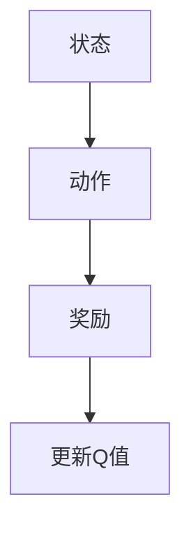
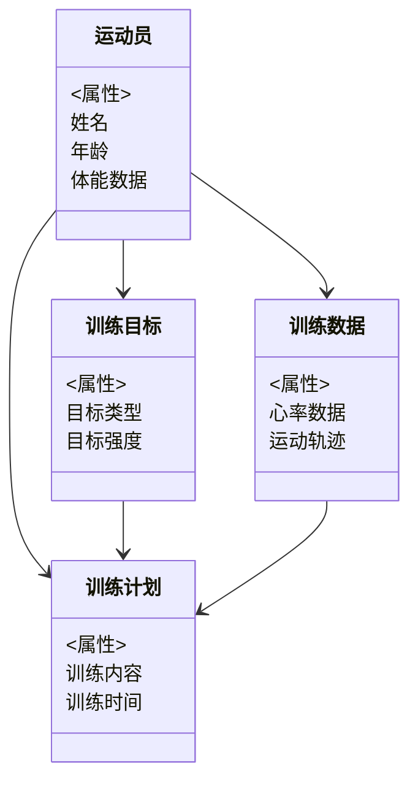
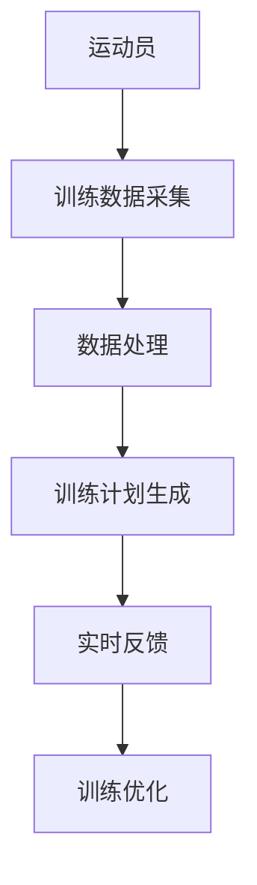
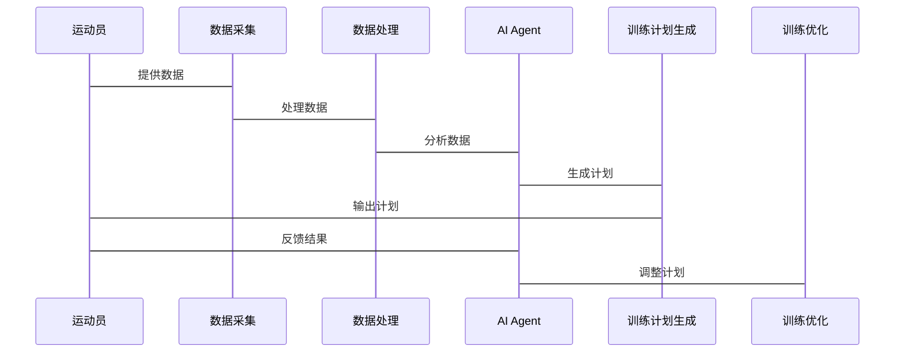

                 


# AI Agent在体育训练中的应用：个性化训练计划制定

## 关键词：
AI Agent，体育训练，个性化训练，人工智能，算法原理，系统架构

## 摘要：
本文探讨了AI Agent在体育训练中的应用，特别是如何通过AI技术制定个性化训练计划。文章从背景介绍、核心概念、算法原理、系统架构到实际案例，详细分析了AI Agent在体育训练中的潜力和实现方法。通过对比传统训练方式，展示了AI技术如何提高训练效率和效果，为运动员和教练提供科学的决策支持。

---

# 第一部分: AI Agent在体育训练中的应用背景

## 第1章: AI Agent与体育训练概述

### 1.1 AI Agent的基本概念
#### 1.1.1 AI Agent的定义
AI Agent（人工智能代理）是指能够感知环境并采取行动以实现目标的智能实体。在体育训练中，AI Agent可以作为辅助工具，帮助制定和优化训练计划。

#### 1.1.2 AI Agent的核心特征
- **自主性**：AI Agent能够自主决策和行动。
- **反应性**：能够实时感知环境变化并作出反应。
- **学习能力**：通过数据学习和优化。

#### 1.1.3 AI Agent在体育训练中的应用潜力
AI Agent可以分析大量数据，制定个性化训练计划，实时调整训练策略，提高训练效率和效果。

### 1.2 体育训练中的问题背景
#### 1.2.1 传统体育训练的局限性
传统训练计划通常基于经验，缺乏科学性和个性化，难以满足不同运动员的需求。

#### 1.2.2 个性化训练的需求
运动员的体能、技术、心理状态各不相同，需要个性化的训练计划。

#### 1.2.3 AI技术在体育训练中的优势
AI技术能够处理大量数据，提供科学的训练建议，实时调整训练计划。

---

## 第2章: AI Agent在体育训练中的问题分析

### 2.1 个性化训练计划的制定需求
#### 2.1.1 运动员的个体差异
运动员的身体条件、技术水平、恢复能力各不相同，需要个性化的训练方案。

#### 2.1.2 训练目标的多样性
不同运动员有不同的训练目标，如提高耐力、力量或速度。

#### 2.1.3 训练计划的动态调整
运动员的状态和环境可能会变化，训练计划需要实时调整。

### 2.2 当前训练计划制定的挑战
#### 2.2.1 数据收集的困难
传统方法难以全面收集和分析运动员的数据。

#### 2.2.2 训练计划的科学性不足
缺乏科学的数据支持，训练计划可能不够有效。

#### 2.2.3 个性化与效率的平衡
如何在个性化和效率之间找到平衡是当前的挑战。

---

## 第3章: AI Agent解决体育训练问题的思路

### 3.1 AI Agent的核心功能
#### 3.1.1 数据收集与分析
AI Agent通过传感器和数据分析技术，收集运动员的生理数据、动作数据等。

#### 3.1.2 训练计划生成
基于分析数据，AI Agent生成个性化的训练计划，包括训练内容、强度和频率。

#### 3.1.3 实时反馈与调整
根据运动员的实时表现和反馈，AI Agent动态调整训练计划。

### 3.2 AI Agent在体育训练中的应用场景
#### 3.2.1 个性化训练计划制定
AI Agent根据运动员的数据，制定最适合的训练计划。

#### 3.2.2 实时训练监控
通过实时数据分析，AI Agent监控训练过程，及时发现问题。

#### 3.2.3 数据驱动的训练优化
利用大数据分析，AI Agent优化训练策略，提高训练效果。

---

# 第二部分: AI Agent的核心概念与技术原理

## 第4章: AI Agent的核心概念与原理

### 4.1 AI Agent的理论基础
#### 4.1.1 强化学习与监督学习
- **强化学习**：AI Agent通过试错学习，选择最优动作。
- **监督学习**：基于标记数据，学习训练计划的制定。

#### 4.1.2 知识表示与推理
AI Agent通过知识表示和逻辑推理，分析运动员的状态和需求。

#### 4.1.3 多智能体协作
在复杂的训练环境中，多个AI Agent协作完成任务。

### 4.2 AI Agent在体育训练中的实体关系图


---

## 第5章: AI Agent的算法原理与数学模型

### 5.1 基于强化学习的训练计划生成
#### 5.1.1 强化学习的基本原理
AI Agent通过与环境交互，学习最优策略。

#### 5.1.2 Q-learning算法在训练计划中的应用
Q-learning算法用于动态调整训练计划。

#### 5.1.3 算法流程图


#### 5.1.4 算法实现代码
```python
import numpy as np

class AIAgent:
    def __init__(self, state_space, action_space):
        self.q_table = np.zeros((state_space, action_space))
    
    def choose_action(self, state, epsilon=0.1):
        if np.random.random() < epsilon:
            return np.random.randint(0, action_space)
        else:
            return np.argmax(self.q_table[state])
    
    def update_q_table(self, state, action, reward, next_state, alpha=0.1):
        self.q_table[state, action] = self.q_table[state, action] + alpha * (reward + np.max(self.q_table[next_state]) - self.q_table[state, action])
```

#### 5.1.5 数学模型和公式
Q-learning算法的更新公式为：
$$ Q(s, a) = Q(s, a) + \alpha (r + \max Q(s', a') - Q(s, a)) $$

---

## 第6章: 系统分析与架构设计方案

### 6.1 系统功能设计
#### 6.1.1 领域模型图


### 6.2 系统架构设计
#### 6.2.1 系统架构图


### 6.3 系统接口设计
- **输入接口**：接收运动员的数据和目标。
- **输出接口**：生成训练计划和实时反馈。

### 6.4 系统交互流程


---

## 第7章: 项目实战

### 7.1 环境安装
需要安装Python、NumPy、Mermaid等工具。

### 7.2 核心代码实现
#### 7.2.1 数据采集代码
```python
import pandas as pd

def collect_data():
    data = pd.DataFrame({
        '姓名': ['运动员A'],
        '年龄': [25],
        '体能数据': [85],
        '训练目标': ['力量提升']
    })
    return data
```

#### 7.2.2 数据处理代码
```python
def process_data(data):
    processed_data = data.copy()
    processed_data['建议强度'] = processed_data['体能数据'] * 0.8
    return processed_data
```

#### 7.2.3 AI Agent实现
```python
class AIAssistant:
    def generate_plan(self, data):
        plan = {
            '训练内容': '力量训练',
            '训练时间': '30分钟',
            '训练强度': '中等'
        }
        return plan
```

### 7.3 案例分析
以一名力量型运动员为例，AI Agent根据其体能数据和目标，制定个性化的训练计划。

### 7.4 项目小结
通过实际案例展示了AI Agent在个性化训练计划制定中的应用，验证了其有效性和科学性。

---

## 第8章: 最佳实践与总结

### 8.1 最佳实践
- **数据质量**：确保数据的准确性和全面性。
- **算法选择**：根据具体需求选择合适的算法。
- **实时反馈**：及时调整训练计划。

### 8.2 小结
AI Agent在体育训练中的应用前景广阔，能够显著提高训练效率和效果。

### 8.3 注意事项
- 数据隐私保护
- 算法的可解释性
- 系统的稳定性

### 8.4 拓展阅读
推荐相关书籍和论文，深入学习AI Agent的应用。

---

# 作者：AI天才研究院 & 禅与计算机程序设计艺术

