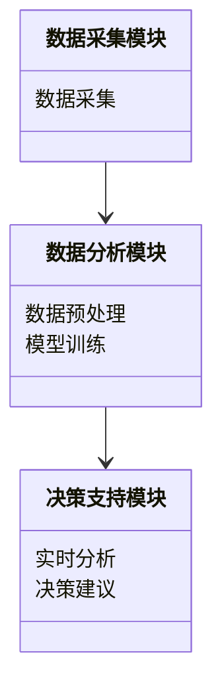
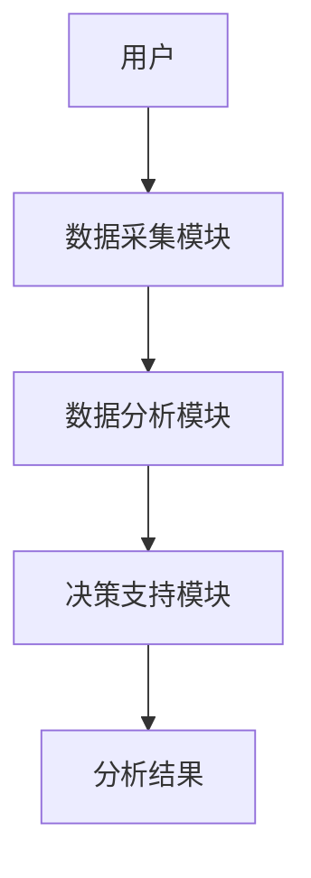
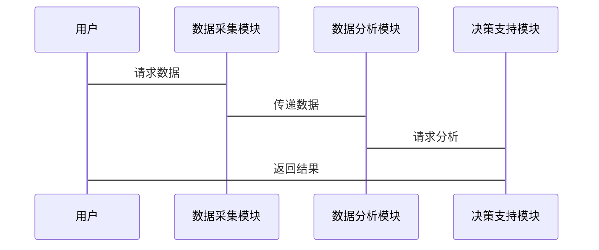

                 

<think>
好，我需要撰写一篇名为《AI Agent在体育赛事分析中的应用》的技术博客文章。首先，我需要理解AI Agent是什么，以及它在体育赛事分析中的具体应用。然后，我需要从背景介绍开始，解释为什么AI Agent在体育分析中越来越重要，接着讨论核心概念和原理，包括算法和数学模型。接下来，我需要设计系统的架构，展示AI Agent如何在实际项目中应用，最后进行总结和展望。

让我一步步来思考如何构建这篇文章的结构。

**第一步：背景介绍**
我需要解释什么是AI Agent，以及它在体育分析中的作用。这部分应该包括AI Agent的基本定义，为什么它在现代体育分析中变得重要，以及它与传统数据分析的不同之处。

**第二步：核心概念与联系**
这里，我需要详细讨论AI Agent的核心原理，包括知识表示、推理机制和行为决策算法。同时，要说明这些概念在体育赛事分析中的具体应用，比如实时数据分析和策略优化。

**第三步：算法原理与数学模型**
这部分需要深入探讨AI Agent所使用的算法，比如机器学习模型。我需要解释这些算法的工作原理，使用数学公式和流程图来帮助读者理解。例如，线性回归和决策树的公式，以及它们如何用于预测比赛结果。

**第四步：系统分析与架构设计**
我需要讨论如何构建一个AI Agent系统来分析体育赛事。这包括系统功能设计，可能使用领域模型图来展示各个模块的关系。然后是系统架构设计，用架构图展示整体结构，接口设计和交互流程，用序列图来展示不同组件之间的通信。

**第五步：项目实战**
这部分需要具体实施一个项目，从环境安装开始，然后是核心代码的实现，解读代码，分析案例，并详细讲解。这不仅能让读者理论联系实际，还能帮助他们更好地理解如何应用这些技术。

**第六步：总结与展望**
最后，我需要总结整篇文章的内容，强调AI Agent在体育赛事分析中的重要性，并展望未来的发展方向。同时，加入一些最佳实践、小结、注意事项和拓展阅读的内容，帮助读者进一步深入学习。

在写作过程中，我需要确保每个部分都有足够的细节，比如在核心概念部分，不仅要定义AI Agent，还要解释它们如何在体育分析中具体应用，比如实时数据分析、策略优化等。在算法部分，要详细讲解数学模型，可能包括一些例子，比如如何用线性回归预测比赛结果。

此外，我需要确保使用合适的图表来辅助解释，比如ER图、流程图、架构图和序列图，这些图表可以帮助读者更好地理解复杂的技术概念。同时，要提供实际的代码示例，展示如何实现这些算法，这样读者可以实际操作和学习。

最后，我需要检查整个文章的逻辑是否连贯，确保每个章节之间有良好的过渡，内容是否全面覆盖了AI Agent在体育赛事分析中的各个方面。这样，读者才能获得一个全面而深入的理解，能够在实际中应用这些知识。
</think>

# AI Agent在体育赛事分析中的应用

## 关键词：
AI Agent，体育赛事分析，机器学习，数据分析，算法优化，实时决策

## 摘要：
AI Agent在体育赛事分析中的应用利用人工智能代理技术，通过数据挖掘、机器学习和实时决策算法，为体育分析提供高效、精确的支持。本文将详细探讨AI Agent的核心概念、算法原理、系统架构及实际应用，揭示其在体育赛事分析中的巨大潜力和未来发展方向。

---

# 第一部分: AI Agent与体育赛事分析的背景介绍

# 第1章: AI Agent与体育赛事分析概述

## 1.1 AI Agent的基本概念
### 1.1.1 AI Agent的定义与特点
AI Agent（人工智能代理）是指能够感知环境、自主决策并执行任务的智能实体。它具备以下特点：
- **自主性**：能够独立决策，无需人工干预。
- **反应性**：能够实时感知环境变化并做出响应。
- **目标导向**：基于目标驱动行为，优化决策过程。
- **学习能力**：通过数据学习和优化模型，提升分析精度。

### 1.1.2 AI Agent的核心要素与功能
AI Agent的核心要素包括：
- **知识表示**：将领域知识转化为计算机可理解的形式。
- **推理机制**：通过逻辑推理得出结论。
- **行为决策**：基于推理结果制定行动方案。

### 1.1.3 AI Agent与传统数据分析的区别
AI Agent能够实时动态分析数据并做出决策，而传统数据分析主要依赖静态数据处理和事后分析。

## 1.2 体育赛事分析的现状与挑战
### 1.2.1 体育赛事分析的复杂性
体育赛事分析涉及大量变量，如球员状态、战术安排、天气条件等，分析难度大。

### 1.2.2 数据来源的多样性
数据来源包括历史数据、实时数据、视频分析等，数据类型多样。

### 1.2.3 分析结果的实时性要求
体育比赛中，实时决策对比赛结果影响重大，要求分析结果快速输出。

## 1.3 AI Agent在体育赛事分析中的应用前景
### 1.3.1 AI Agent的优势与潜力
AI Agent能够实时处理数据，快速生成决策建议，显著提升分析效率。

### 1.3.2 典型应用场景分析
- **实时数据分析**：如比赛中实时分析球员表现。
- **策略优化**：如优化球队战术安排。
- **伤病预测**：如预测球员受伤风险。

### 1.3.3 未来发展趋势预测
随着AI技术进步，AI Agent在体育分析中的应用将更加广泛，从职业体育到业余体育都将受益。

## 1.4 本章小结
本章介绍了AI Agent的基本概念、核心要素及其在体育赛事分析中的优势与应用前景。

---

# 第二部分: AI Agent的核心概念与原理

# 第2章: AI Agent的核心概念与联系

## 2.1 AI Agent的核心原理
### 2.1.1 知识表示与推理机制
知识表示是将领域知识转化为计算机可理解的形式，常用的表示方法有：
- **谓词逻辑**：如“Player(A,B,Role)”。
- **语义网络**：通过节点和边表示概念及其关系。

推理机制包括演绎推理和归纳推理，用于从已知事实推导出新的结论。

### 2.1.2 行为决策与优化算法
行为决策基于目标优化，常用算法有：
- **贪心算法**：如每次选择当前最优动作。
- **动态规划**：如在足球中规划传球路径。

### 2.1.3 数据处理与特征提取
数据处理包括数据清洗、特征提取和数据转换，常用方法有：
- **主成分分析（PCA）**：降低数据维度。
- **特征选择**：选择对分析结果影响较大的特征。

## 2.2 AI Agent与体育赛事分析的核心要素
### 2.2.1 数据来源与特征
体育赛事数据来源包括：
- **历史比赛数据**：如比赛结果、球员表现。
- **实时数据**：如比赛中的实时统计数据。
- **视频数据**：如球员动作捕捉数据。

### 2.2.2 分析目标与任务分解
分析目标包括预测比赛结果、优化球队战术等，任务分解如下：
1. 数据收集与预处理。
2. 模型训练与优化。
3. 实时数据分析与决策支持。

### 2.2.3 系统架构与模块划分
系统架构包括：
- **数据采集模块**：负责数据收集。
- **数据分析模块**：负责数据处理与分析。
- **决策支持模块**：生成决策建议。

## 2.3 AI Agent在体育赛事分析中的实体关系图
```mermaid
er
actor: 用户
agent: AI Agent
event: 体育赛事
data_source: 数据来源
analysis_result: 分析结果
```

## 2.4 本章小结
本章详细阐述了AI Agent的核心原理，分析了其在体育赛事分析中的应用要素，并通过实体关系图展示了各部分之间的关系。

---

# 第三部分: AI Agent的算法原理与数学模型

# 第3章: AI Agent的算法原理

## 3.1 基于机器学习的AI Agent算法
### 3.1.1 线性回归算法
线性回归用于预测比赛结果，公式如下：
$$ y = \beta_0 + \beta_1x + \epsilon $$
其中，$y$为预测结果，$x$为自变量，$\beta_0$和$\beta_1$为回归系数。

### 3.1.2 决策树算法
决策树用于分类问题，如预测比赛胜负，使用信息熵公式：
$$ H(S) = -\sum_{i=1}^{n} p_i \log_2 p_i $$

### 3.1.3 神经网络算法
神经网络用于复杂模式识别，如球员动作识别，使用多层感知机模型：
$$ a^{(l)} = \sigma(w^{(l)} a^{(l-1)} + b^{(l)}) $$

## 3.2 基于优化的AI Agent算法
### 3.2.1 线性规划算法
用于资源分配优化，如球队阵容安排，目标函数：
$$ \text{max} \quad c^T x $$
约束条件：
$$ A x \leq b $$

### 3.2.2 遗传算法
用于全局优化，如战术安排优化，使用适应度函数：
$$ f(x) = \text{适应度} $$

## 3.3 基于实时数据处理的算法
### 3.3.1 滑动窗口算法
用于实时数据分析，如比赛中的实时统计。

### 3.3.2 增量学习算法
用于模型更新，如比赛中的实时数据反馈。

## 3.4 本章小结
本章介绍了AI Agent中常用的机器学习算法和优化算法，分析了它们在体育赛事分析中的应用。

---

# 第四部分: 系统分析与架构设计

# 第4章: 系统分析与架构设计

## 4.1 问题场景介绍
体育赛事分析系统需要实时处理大量数据，并快速生成决策建议。

## 4.2 系统功能设计
### 4.2.1 领域模型设计
使用Mermaid绘制领域模型图：


### 4.2.2 系统架构设计
使用Mermaid绘制系统架构图：


### 4.2.3 接口设计
接口设计包括数据接口和用户接口，使用Mermaid绘制交互序列图：


## 4.3 本章小结
本章详细设计了体育赛事分析系统的功能、架构和接口，并通过图表展示了系统的运作流程。

---

# 第五部分: 项目实战

# 第5章: 项目实战

## 5.1 环境安装与配置
安装Python、TensorFlow、Scikit-learn等工具。

## 5.2 核心代码实现
### 5.2.1 数据采集模块
```python
import requests

def get_match_data(match_id):
    url = f"https://api.example.com/matches/{match_id}"
    response = requests.get(url)
    return response.json()
```

### 5.2.2 数据分析模块
```python
from sklearn.linear_model import LinearRegression

def train_model(data):
    X = data['features']
    y = data['target']
    model = LinearRegression()
    model.fit(X, y)
    return model
```

### 5.2.3 决策支持模块
```python
def generate_recommendation(model, new_data):
    prediction = model.predict(new_data)
    return f"推荐策略：{prediction}"
```

## 5.3 代码应用解读
解释代码实现，说明每部分的功能和作用。

## 5.4 实际案例分析
以一场足球比赛为例，展示如何利用AI Agent进行分析和决策。

## 5.5 本章小结
本章通过实际项目展示了AI Agent在体育赛事分析中的应用，从环境安装到代码实现，再到案例分析，提供了完整的解决方案。

---

# 第六部分: 总结与展望

# 第6章: 总结与展望

## 6.1 本章总结
总结本文的主要内容和研究成果，强调AI Agent在体育赛事分析中的重要性。

## 6.2 未来展望
展望AI Agent在体育分析中的未来发展方向，如更智能的决策算法、更广泛的应用场景。

## 6.3 最佳实践 tips
提供一些实际应用中的注意事项和建议。

## 6.4 本章小结
总结全文，强调AI Agent在体育赛事分析中的潜力和重要性。

---

# 作者：AI天才研究院 & 禅与计算机程序设计艺术

