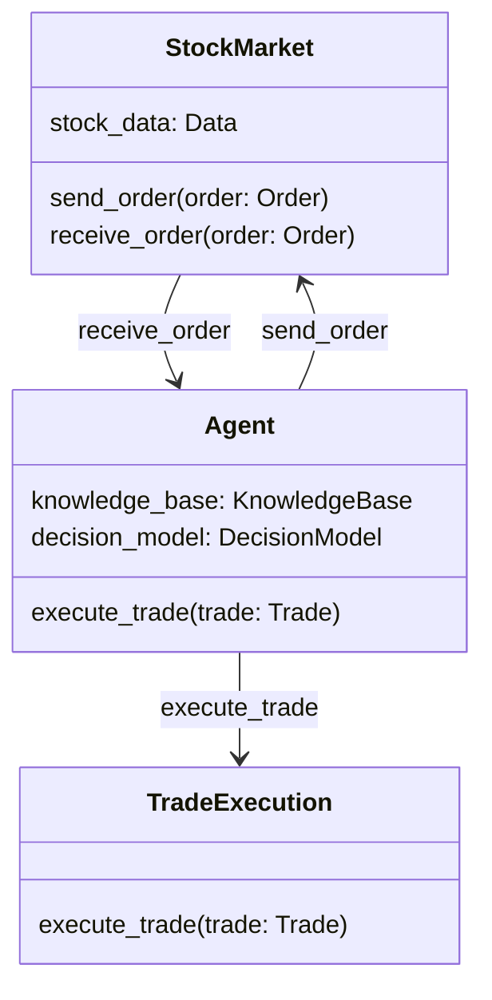
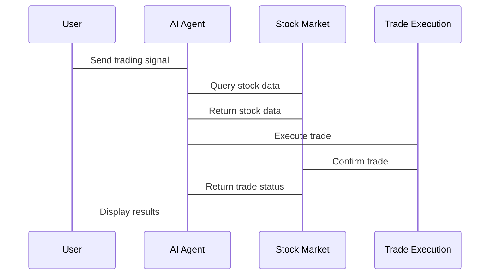

                 


# AI Agent在各行业中的应用场景

## 关键词：AI Agent, 人工智能, 大模型, 应用场景, 系统架构

## 摘要：AI Agent作为一种智能实体，通过感知、决策和执行机制，能够在多个行业中实现自动化和智能化。本文将从AI Agent的核心概念、技术原理、系统架构设计到项目实战进行详细讲解，分析其在金融、医疗、教育等领域的应用场景，探讨其带来的优势与挑战，并展望未来的发展方向。

---

# 第1章: AI Agent 的背景与核心概念

## 1.1 AI Agent 的定义与核心要素
### 1.1.1 什么是 AI Agent
AI Agent（人工智能代理）是一种能够感知环境、做出决策并执行任务的智能实体。它通过与环境交互，主动完成目标，具有自主性、反应性和社会性等特点。

### 1.1.2 AI Agent 的核心要素
AI Agent的核心要素包括：
1. **感知能力**：通过传感器或数据输入获取环境信息。
2. **决策能力**：基于感知信息，利用算法做出最优决策。
3. **执行能力**：通过执行机构或接口将决策转化为实际操作。
4. **知识库**：存储任务相关的知识和经验，用于辅助决策。
5. **目标驱动**：AI Agent的行为始终围绕目标展开。

### 1.1.3 AI Agent 的分类与特点
AI Agent可以根据智能水平分为：
1. **反应式AI Agent**：基于当前感知做出反应，适用于实时任务。
2. **认知式AI Agent**：具备复杂推理和规划能力，适用于复杂任务。
3. **协作式AI Agent**：能够与其他Agent或人类协同工作。

---

## 1.2 AI Agent 的发展背景
### 1.2.1 人工智能技术的演进
AI Agent的发展离不开人工智能技术的进步，尤其是大模型（如GPT）的突破，为AI Agent提供了强大的自然语言处理和理解能力。

### 1.2.2 大模型技术对 AI Agent 的推动
大模型的引入使得AI Agent具备了更强的语义理解和生成能力，能够更自然地与人类交互。

### 1.2.3 AI Agent 的应用场景与潜力
AI Agent已在多个行业展现出巨大潜力，如金融交易、医疗诊断、教育辅助等。

---

## 1.3 本章小结
本章介绍了AI Agent的基本概念、核心要素和分类，分析了其发展背景和应用场景，为后续章节奠定了基础。

---

# 第2章: AI Agent 的核心概念与技术原理

## 2.1 AI Agent 的核心概念
### 2.1.1 感知、决策、执行的三阶段模型
AI Agent的工作流程可以分为三个阶段：感知、决策和执行。感知阶段通过传感器获取信息，决策阶段基于信息做出选择，执行阶段将决策转化为行动。

### 2.1.2 AI Agent 的任务分解与协同机制
AI Agent需要将复杂任务分解为子任务，并通过协同机制与其他Agent或系统合作完成目标。

### 2.1.3 AI Agent 的知识表示与推理
知识表示是AI Agent理解世界的基础，常用的方法包括逻辑推理和知识图谱。

---

## 2.2 AI Agent 的技术架构
### 2.2.1 基于大模型的 AI Agent 架构
现代AI Agent通常基于大模型构建，结合强化学习和监督学习技术。

### 2.2.2 AI Agent 的模块化设计
AI Agent的架构可以分为感知模块、决策模块和执行模块，每个模块负责特定功能。

### 2.2.3 AI Agent 的可扩展性与灵活性
通过模块化设计，AI Agent能够灵活扩展功能，适应不同应用场景的需求。

---

## 2.3 AI Agent 的核心算法与模型
### 2.3.1 强化学习在 AI Agent 中的应用
强化学习通过奖励机制训练AI Agent，使其在复杂环境中做出最优决策。

### 2.3.2 监督学习与无监督学习的结合
监督学习用于任务分类，无监督学习用于发现数据中的隐含模式。

### 2.3.3 大模型在 AI Agent 中的作用
大模型提供了强大的自然语言处理能力，使AI Agent能够理解复杂指令和上下文。

---

## 2.4 本章小结
本章详细讲解了AI Agent的核心概念和技术架构，分析了其算法原理和模型设计，为后续章节的应用场景分析奠定了基础。

---

# 第3章: AI Agent 的技术原理与数学模型

## 3.1 AI Agent 的感知机制
### 3.1.1 感知模型的输入与输出
感知模型通过输入传感器数据，输出环境的状态描述。

### 3.1.2 感知模型的数学表示
感知模型可以用概率论和统计学方法表示，例如马尔可夫链模型。

### 3.1.3 感知模型的训练与优化
通过深度学习技术，感知模型可以不断优化对环境的理解能力。

---

## 3.2 AI Agent 的决策机制
### 3.2.1 决策模型的输入与输出
决策模型接收感知结果和目标信息，输出决策动作。

### 3.2.2 决策模型的数学表示
决策模型可以用强化学习中的Q-learning算法表示，公式为：
$$ Q(s, a) = r + \gamma \max Q(s', a') $$
其中，$s$是当前状态，$a$是动作，$r$是奖励，$\gamma$是折扣因子，$s'$是下一个状态。

### 3.2.3 决策模型的训练与优化
通过梯度下降算法优化决策模型的参数，使其在复杂环境中做出最优选择。

---

## 3.3 AI Agent 的执行机制
### 3.3.1 执行模型的输入与输出
执行模型接收决策信号，输出具体的操作指令。

### 3.3.2 执行模型的数学表示
执行模型可以用控制论中的反馈控制系统表示，公式为：
$$ u(t+1) = K(u(t) - y(t)) $$
其中，$u(t)$是输入信号，$y(t)$是输出信号，$K$是反馈系数。

### 3.3.3 执行模型的训练与优化
通过强化学习和反馈机制，执行模型不断优化其执行策略。

---

## 3.4 本章小结
本章详细讲解了AI Agent的感知、决策和执行机制，通过数学模型和算法分析，揭示了其技术原理。

---

# 第4章: AI Agent 的系统架构设计

## 4.1 问题场景介绍
以金融交易为例，设计一个基于AI Agent的股票交易系统。

## 4.2 系统功能设计
### 4.2.1 领域模型
领域模型可以用Mermaid类图表示，如下：


### 4.2.2 系统架构设计
系统架构可以用Mermaid架构图表示，如下：
```mermaid
archi
    title Stock Trading System
    component AI Agent {
        Knowledge Base
        Decision Model
        Execution Module
    }
    component Stock Market {
        Stock Data
        Trading API
    }
    component User Interface {
        User Input
        Output Display
    }
    AI Agent -->> Stock Market: Query Data
    AI Agent -->> User Interface: Display Results
    Stock Market -->> AI Agent: Update Data
```

### 4.2.3 系统接口设计
系统接口设计可以用Mermaid序列图表示，如下：


---

## 4.3 本章小结
本章通过设计一个具体的金融交易系统，详细讲解了AI Agent的系统架构设计，包括领域模型、架构设计和接口设计。

---

# 第5章: AI Agent 的项目实战

## 5.1 项目背景与目标
以教育行业为例，设计一个基于AI Agent的智能辅导系统。

## 5.2 项目环境与工具
### 5.2.1 环境配置
- 操作系统：Linux
- 开发工具：PyCharm
- 深度学习框架：TensorFlow
- 自然语言处理库：Hugging Face

### 5.2.2 安装依赖
```bash
pip install tensorflow transformers
```

## 5.3 核心代码实现
### 5.3.1 感知模块
```python
class PerceptionModule:
    def __init__(self):
        self.model = load_model("perception_model.h5")
    
    def perceive(self, input_data):
        return self.model.predict(input_data)
```

### 5.3.2 决策模块
```python
class DecisionModule:
    def __init__(self):
        self.model = load_model("decision_model.h5")
    
    def decide(self, input_data):
        return self.model.predict(input_data)
```

### 5.3.3 执行模块
```python
class ExecutionModule:
    def __init__(self):
        self.api_key = "your_api_key"
    
    def execute(self, action):
        # 调用外部API执行操作
        pass
```

## 5.4 项目案例分析
通过具体案例分析，展示AI Agent在教育行业的实际应用，如个性化学习推荐。

## 5.5 项目总结
总结项目实现过程中的经验教训，提出改进建议。

---

## 5.6 本章小结
本章通过一个具体的项目实战，详细讲解了AI Agent的实现过程，包括环境配置、核心代码实现和案例分析。

---

# 第6章: AI Agent 的最佳实践与小结

## 6.1 最佳实践
### 6.1.1 系统设计
- 模块化设计，便于扩展和维护
- 使用大模型提升自然语言处理能力
- 强化学习优化决策策略

### 6.1.2 开发注意事项
- 数据质量对AI Agent性能影响巨大
- 定期更新模型，适应环境变化
- 确保系统安全性和稳定性

## 6.2 小结与展望
总结全文内容，展望AI Agent技术的未来发展方向，包括多模态交互、跨领域应用和人机协作等。

---

## 6.3 本章小结
本章提出了AI Agent的最佳实践建议，并对未来的发展进行了展望。

---

# 作者：AI天才研究院 & 禅与计算机程序设计艺术

---

**注：以上目录大纲和内容仅为示例，实际撰写时可根据具体需求调整章节和内容深度。**

