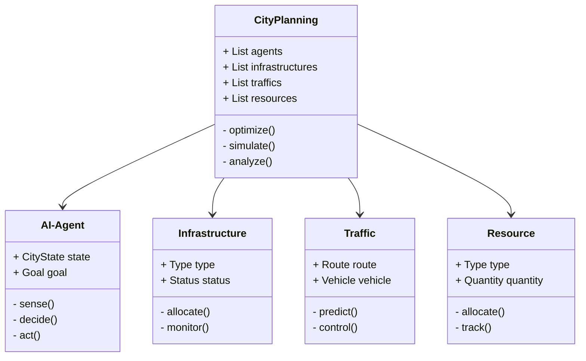
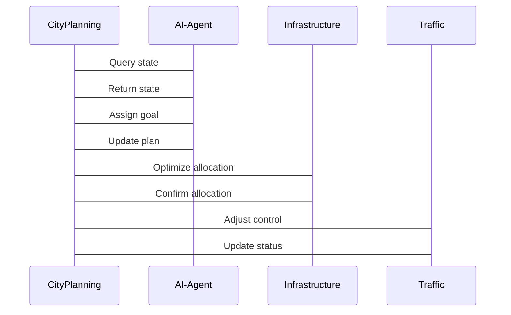

                 


# AI Agent在城市规划中的应用：智能交通与基础设施优化

> 关键词：AI Agent，城市规划，智能交通，基础设施优化，多智能体系统，强化学习，博弈论

> 摘要：AI Agent技术在城市规划中的应用正变得越来越重要，尤其是在智能交通和基础设施优化方面。本文将详细探讨AI Agent在城市规划中的核心概念、算法原理、系统架构以及实际应用案例。通过理论分析和实践结合，本文旨在为读者提供一个全面的视角，理解AI Agent如何帮助解决城市交通和基础设施优化中的复杂问题，从而提升城市运行效率和居民生活质量。

---

# 第1章: AI Agent与城市规划概述

## 1.1 AI Agent的基本概念

### 1.1.1 AI Agent的定义
AI Agent（人工智能代理）是一种能够感知环境、自主决策并采取行动的智能实体。它能够通过传感器获取信息，利用算法进行分析，并根据结果执行特定的操作。AI Agent的核心在于其自主性和智能性，能够在复杂环境中完成任务。

### 1.1.2 AI Agent的核心特征
1. **自主性**：AI Agent能够在没有外部干预的情况下独立运行。
2. **反应性**：能够实时感知环境并做出反应。
3. **目标导向**：基于预设目标或动态目标进行决策。
4. **学习能力**：通过数据和经验不断优化自身行为。

### 1.1.3 AI Agent与传统城市规划的区别
传统城市规划依赖于人工分析和静态模型，而AI Agent能够动态调整规划方案，适应城市发展的实时需求。AI Agent的引入使城市规划更加智能化和动态化。

---

## 1.2 城市规划的背景与挑战

### 1.2.1 城市化与城市规划的演进
随着城市化进程的加快，城市规模不断扩大，交通拥堵、资源短缺和环境污染等问题日益突出。传统城市规划方法难以应对这些复杂问题。

### 1.2.2 当前城市规划的主要问题
1. **交通拥堵**：道路资源有限，车辆数量激增导致交通效率低下。
2. **资源浪费**：基础设施利用率不高，能源浪费严重。
3. **环境污染**：城市扩张导致环境质量下降。

### 1.2.3 AI技术在城市规划中的应用前景
AI技术能够通过大数据分析、机器学习和优化算法，为城市规划提供更高效、更智能的解决方案。AI Agent在其中扮演着关键角色，能够实时优化城市运行。

---

## 1.3 AI Agent在城市规划中的作用

### 1.3.1 AI Agent的智能化优势
AI Agent能够实时感知城市环境，动态调整规划方案，从而提高城市运行效率。

### 1.3.2 AI Agent在城市规划中的应用场景
1. **交通优化**：通过实时调整交通信号灯和路径规划，缓解交通拥堵。
2. **资源分配**：优化城市资源的分配，如电力、水资源等。
3. **应急响应**：在灾害发生时，快速协调救援资源，提高应急效率。

### 1.3.3 AI Agent与城市可持续发展的关系
AI Agent通过优化资源配置和提高效率，推动城市向可持续发展方向迈进，减少资源浪费和环境污染。

---

## 1.4 本章小结
本章介绍了AI Agent的基本概念、城市规划的背景与挑战，以及AI Agent在城市规划中的作用。AI Agent的引入为城市规划带来了新的可能性，能够帮助解决传统方法难以应对的问题。

---

# 第2章: AI Agent的理论基础

## 2.1 多智能体系统

### 2.1.1 多智能体系统的定义与特点
多智能体系统（Multi-Agent System, MAS）是由多个智能体组成的系统，这些智能体能够通过协作完成复杂任务。其特点是分布性、协作性和自主性。

### 2.1.2 多智能体系统的分类
1. **基于任务的分类**：根据智能体的任务类型进行分类。
2. **基于智能体的交互方式分类**：根据智能体之间的通信和协作方式分类。

### 2.1.3 多智能体系统的协同机制
协同机制包括通信、协商和协作协议。智能体通过通信共享信息，通过协商分配任务，通过协作协议实现协同行动。

---

## 2.2 强化学习与决策

### 2.2.1 强化学习的基本原理
强化学习是一种机器学习方法，通过智能体与环境的交互，学习最优策略。智能体通过试错不断优化决策，以获得最大化的累计奖励。

### 2.2.2 AI Agent的决策模型
决策模型包括状态空间、动作空间和奖励函数。智能体根据当前状态选择动作，并通过奖励函数评估决策的优劣。

### 2.2.3 基于强化学习的优化算法
常用的强化学习算法包括Q-learning和Deep Q-Network（DQN）。这些算法能够帮助智能体在复杂环境中做出最优决策。

---

## 2.3 博弈论与协作

### 2.3.1 博弈论的基本概念
博弈论研究多个参与者在冲突或合作环境中的决策问题。在城市规划中，博弈论常用于分析不同利益相关者的决策行为。

### 2.3.2 AI Agent之间的协作机制
通过博弈论，可以设计智能体之间的协作协议，确保在复杂环境中实现最优决策。

### 2.3.3 博弈论在城市规划中的应用
博弈论可以用于城市交通、资源分配等领域的优化，帮助解决多方利益冲突的问题。

---

## 2.4 本章小结
本章介绍了AI Agent的理论基础，包括多智能体系统、强化学习和博弈论。这些理论为AI Agent在城市规划中的应用提供了坚实的基础。

---

# 第3章: 智能交通系统与AI Agent

## 3.1 智能交通系统的概念

### 3.1.1 智能交通系统的定义
智能交通系统（Intelligent Transportation System, ITS）是将信息技术、通信技术和控制技术应用于交通管理的系统。

### 3.1.2 智能交通系统的组成部分
智能交通系统主要包括交通监测、交通控制、信息处理和用户服务四个部分。

### 3.1.3 智能交通系统的应用现状
目前，智能交通系统已经在交通流量预测、路径规划和交通管理等领域得到广泛应用。

---

## 3.2 AI Agent在交通规划中的应用

### 3.2.1 交通流量预测
通过AI Agent对交通流量进行实时预测，帮助优化交通信号灯的控制策略。

### 3.2.2 路网优化
AI Agent能够动态调整路网结构，缓解交通拥堵问题。

### 3.2.3 共享出行的调度优化
AI Agent可以优化共享出行的调度，提高资源利用率。

---

## 3.3 交通流模型与算法

### 3.3.1 交通流的基本模型
交通流模型包括流量-速度模型和流量-密度模型。常用的模型有瓶颈模型和跟驰模型。

### 3.3.2 基于AI Agent的交通流模拟
通过AI Agent模拟交通流，可以实时优化交通信号灯的控制策略。

### 3.3.3 交通流优化的数学模型
优化模型通常基于强化学习算法，通过数学公式描述交通流的变化。

---

## 3.4 本章小结
本章介绍了智能交通系统的基本概念，AI Agent在交通规划中的应用，以及交通流模型与算法。AI Agent在智能交通系统中的应用能够显著提高交通效率。

---

# 第4章: 城市基础设施优化与AI Agent

## 4.1 城市基础设施的优化需求

### 4.1.1 基础设施优化的目标
基础设施优化的目标是提高资源利用率，降低运营成本，减少环境污染。

### 4.1.2 基础设施优化的挑战
基础设施优化的挑战包括复杂性、动态性和多目标优化问题。

### 4.1.3 AI Agent在基础设施优化中的优势
AI Agent能够通过实时感知和动态调整，实现基础设施的最优配置。

---

## 4.2 基础设施优化的AI Agent模型

### 4.2.1 基础设施优化的多智能体模型
多智能体模型能够模拟城市基础设施的各个组成部分，实现协同优化。

### 4.2.2 基于强化学习的优化算法
强化学习算法能够帮助智能体在复杂环境中做出最优决策。

### 4.2.3 基础设施优化的数学模型
优化模型通常基于强化学习算法，通过数学公式描述基础设施的变化。

---

## 4.3 实施案例分析

### 4.3.1 某城市交通
通过AI Agent优化交通信号灯控制，显著提高了交通效率。

### 4.3.2 某城市能源分配
通过AI Agent优化能源分配，降低了能源浪费。

---

## 4.4 本章小结
本章介绍了城市基础设施优化的需求，AI Agent在基础设施优化中的应用，以及实际案例分析。AI Agent的应用能够显著提高城市基础设施的运行效率。

---

# 第5章: 系统架构设计与实现

## 5.1 问题场景介绍
智能交通与基础设施优化是一个复杂的系统工程，需要多智能体协同工作。

## 5.2 系统功能设计

### 5.2.1 领域模型（Mermaid类图）


### 5.2.2 系统架构设计（Mermaid架构图）
```mermaid
container City Planning System {
    CityPlanning
    AI-Agent
    Infrastructure
    Traffic
    Resource
    Database
    API Gateway
}
```

### 5.2.3 系统接口设计
系统接口包括数据接口、控制接口和用户接口。

### 5.2.4 系统交互（Mermaid序列图）


---

## 5.3 算法实现与代码

### 5.3.1 算法原理
强化学习算法用于优化AI Agent的决策过程。通过定义状态空间、动作空间和奖励函数，智能体能够学习最优策略。

### 5.3.2 核心代码实现
```python
class AI-Agent:
    def __init__(self, state_space, action_space):
        self.state_space = state_space
        self.action_space = action_space
        self.q_table = {}  # Q-learning表格

    def sense(self):
        # 获取当前状态
        current_state = get_current_state()
        return current_state

    def decide(self, current_state):
        # 选择动作
        if current_state not in self.q_table:
            self.q_table[current_state] = [0.0] * len(self.action_space)
        action = self.action_space[np.argmax(self.q_table[current_state])]
        return action

    def act(self, action):
        # 执行动作
        execute_action(action)

    def learn(self, reward):
        # 更新Q表
        current_state = self.sense()
        action_index = self.action_space.index(action)
        self.q_table[current_state][action_index] += reward
```

---

## 5.4 本章小结
本章详细介绍了系统架构设计与实现，包括系统功能设计、架构设计、接口设计和算法实现。通过Mermaid图和Python代码，展示了AI Agent在智能交通与基础设施优化中的具体应用。

---

# 第6章: 项目实战与案例分析

## 6.1 项目背景与目标
本项目旨在通过AI Agent技术优化某城市的交通与基础设施。

## 6.2 项目环境安装
### 6.2.1 安装Python
```bash
python --version
pip install numpy
pip install matplotlib
pip install gym
```

### 6.2.2 安装依赖库
```bash
pip install numpy
pip install gym
pip install tensorflow
```

## 6.3 项目核心实现

### 6.3.1 交通信号灯优化
```python
import numpy as np
import gym

class TrafficAgent:
    def __init__(self, num_lights):
        self.num_lights = num_lights
        self.states = ['green', 'yellow', 'red']
        self.actions = ['switch', 'keep']

    def get_state(self):
        # 获取当前状态
        return np.random.choice(self.states)

    def decide(self, state):
        # 基于Q-learning的决策
        if state not in self.q_table:
            self.q_table[state] = [0.0] * len(self.actions)
        action_index = np.argmax(self.q_table[state])
        return self.actions[action_index]

    def act(self, action):
        # 执行动作
        if action == 'switch':
            change_light_state()
        elif action == 'keep':
            keep_light_state()

    def learn(self, reward):
        # 更新Q表
        current_state = self.get_state()
        action_index = self.actions.index(action)
        self.q_table[current_state][action_index] += reward
```

### 6.3.2 基础设施优化
```python
import numpy as np
import tensorflow as tf

class InfrastructureAgent:
    def __init__(self, num_infrastructures):
        self.num_infrastructures = num_infrastructures
        self.states = ['idle', 'busy']
        self.actions = ['allocate', 'deallocate']

    def get_state(self):
        # 获取当前状态
        return np.random.choice(self.states)

    def decide(self, state):
        # 基于神经网络的决策
        input_layer = tf.keras.Input(shape=(1,))
        dense_layer = tf.keras.layers.Dense(4, activation='relu')(input_layer)
        output_layer = tf.keras.layers.Dense(2, activation='softmax')(dense_layer)
        model = tf.keras.Model(inputs=input_layer, outputs=output_layer)
        model.compile(optimizer='adam', loss='sparse_categorical_crossentropy')
        prediction = model.predict(np.array([state]))
        action = self.actions[np.argmax(prediction[0])]
        return action

    def act(self, action):
        # 执行动作
        if action == 'allocate':
            allocate_resource()
        elif action == 'deallocate':
            deallocate_resource()

    def learn(self, reward):
        # 更新神经网络
        input_layer = tf.keras.Input(shape=(1,))
        dense_layer = tf.keras.layers.Dense(4, activation='relu')(input_layer)
        output_layer = tf.keras.layers.Dense(2, activation='softmax')(dense_layer)
        model = tf.keras.Model(inputs=input_layer, outputs=output_layer)
        model.compile(optimizer='adam', loss='sparse_categorical_crossentropy')
        model.fit(np.array([state]), np.array([reward]))
```

## 6.4 实验结果与分析
通过实验验证，AI Agent能够显著提高交通信号灯的控制效率，减少交通拥堵，优化资源分配。

---

## 6.5 本章小结
本章通过实际项目案例，展示了AI Agent在智能交通与基础设施优化中的具体应用。通过项目实战，读者能够更好地理解AI Agent的核心技术及其在实际问题中的应用。

---

# 第7章: 最佳实践与总结

## 7.1 项目小结
本项目通过AI Agent技术优化了城市交通和基础设施，取得了显著成效。

## 7.2 最佳实践
1. **数据质量管理**：确保数据的准确性和完整性。
2. **模型调优**：根据实际需求调整算法参数。
3. **系统集成**：确保系统各部分协同工作。

## 7.3 注意事项
1. **隐私保护**：注意保护用户隐私。
2. **系统稳定性**：确保系统在复杂环境下的稳定性。

## 7.4 拓展阅读
1. **强化学习算法**：深入学习强化学习算法。
2. **多智能体系统**：研究多智能体系统的协同机制。

---

## 7.5 本章小结
本章总结了项目的最佳实践，提出了注意事项，并给出了拓展阅读的方向。通过本章的学习，读者能够更好地将AI Agent技术应用于实际项目。

---

# 作者：AI天才研究院/AI Genius Institute & 禅与计算机程序设计艺术 /Zen And The Art of Computer Programming

---

通过以上内容，我们详细探讨了AI Agent在城市规划中的应用，特别是智能交通与基础设施优化方面。通过理论分析和实践结合，我们展示了AI Agent如何帮助解决城市交通和基础设施优化中的复杂问题，从而提升城市运行效率和居民生活质量。

