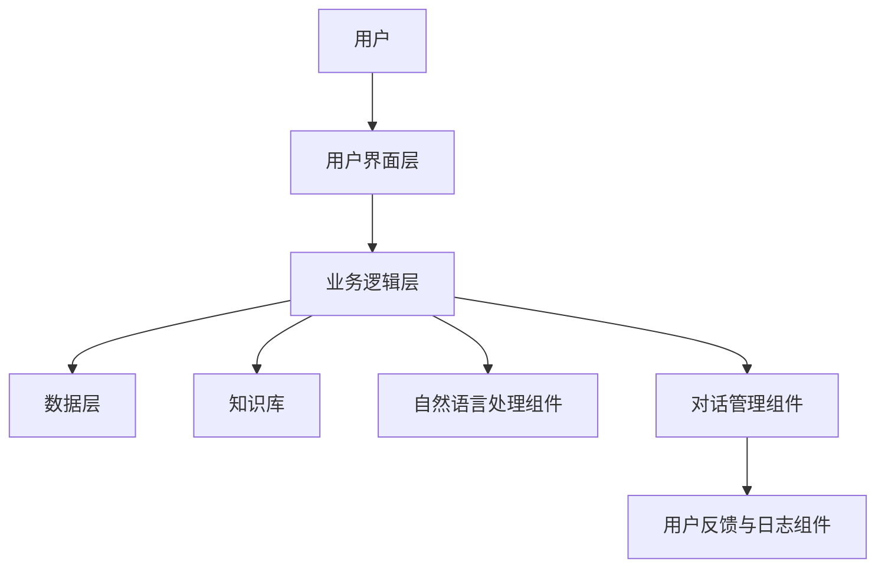

                 


# AI Agent在客户服务中的应用：提升响应速度与质量

> 关键词：AI Agent、客户服务、自然语言处理、对话管理、知识库、机器学习

> 摘要：AI Agent（人工智能代理）在客户服务中的应用正变得越来越广泛。通过自然语言处理、机器学习和深度学习等技术，AI Agent能够快速理解客户需求，提供准确的解决方案，从而显著提升客户服务的响应速度与质量。本文将详细探讨AI Agent的核心原理、系统架构、项目实战以及优化策略，帮助读者全面了解AI Agent在客户服务中的应用及其带来的巨大价值。

---

## 第一部分: AI Agent 在客户服务中的应用概述

### 第1章: AI Agent 的基本概念

#### 1.1 AI Agent 的定义与特点
- **1.1.1 什么是 AI Agent**
  AI Agent（人工智能代理）是指能够感知环境并采取行动以实现目标的智能系统。在客户服务领域，AI Agent通常表现为智能客服机器人，能够通过自然语言处理技术与用户进行交互，提供问题解答、信息查询等服务。

- **1.1.2 AI Agent 的核心特点**
  - **智能性**：基于机器学习和深度学习技术，能够理解上下文并生成自然语言回复。
  - **实时性**：能够在短时间内快速响应用户需求。
  - **个性化**：根据用户历史行为和偏好提供定制化服务。
  - **可扩展性**：能够处理多种语言、多渠道（如电话、邮件、社交媒体）的客户需求。

- **1.1.3 AI Agent 与传统客服系统的主要区别**
  - AI Agent能够实现24/7的实时响应，而传统客服系统通常受限于工作时间。
  - AI Agent能够处理大量并发请求，而传统客服系统需要人工逐一处理。
  - AI Agent能够通过数据学习不断优化服务质量，而传统客服系统的效率提升依赖于人工经验。

#### 1.2 客户服务中的 AI Agent 应用场景
- **1.2.1 售前咨询与售后服务**
  - AI Agent可以帮助潜在客户解答产品相关问题，促进销售转化。
  - 在售后阶段，AI Agent可以处理客户反馈、解决问题，提升客户满意度。

- **1.2.2 技术支持与问题解答**
  - AI Agent可以快速理解客户的技术问题，并提供解决方案或转接人工客服。
  - 通过知识库的不断更新，AI Agent能够准确回答技术相关的问题。

- **1.2.3 客户投诉与反馈处理**
  - AI Agent可以快速识别客户投诉情绪，并提供相应的解决方案。
  - 通过分析客户反馈，AI Agent可以帮助企业优化产品和服务质量。

#### 1.3 AI Agent 的优势与挑战
- **1.3.1 提升响应速度与服务质量**
  AI Agent可以在短时间内快速响应客户的需求，减少客户等待时间，提升客户满意度。

- **1.3.2 降低企业运营成本**
  AI Agent可以替代部分人工客服，减少企业的人员招聘和培训成本。

- **1.3.3 智能化与个性化的客户体验**
  AI Agent能够根据客户的偏好和历史行为，提供个性化的服务体验，增强客户忠诚度。

- **1.3.4 数据隐私与安全风险**
  AI Agent需要处理大量的客户数据，如何保护这些数据的隐私和安全是一个重要挑战。

- **1.3.5 技术实现的复杂性**
  AI Agent的实现需要结合自然语言处理、机器学习等多种技术，技术实现的复杂性较高。

---

### 第2章: AI Agent 的核心原理

#### 2.1 自然语言处理 (NLP) 的基础
- **2.1.1 什么是自然语言处理**
  自然语言处理是指让计算机理解和生成人类语言的技术，是AI Agent实现智能对话的核心技术之一。

- **2.1.2 NLP 在 AI Agent 中的应用**
  - **文本预处理**：包括分词、去停用词、词干提取等步骤。
  - **特征提取**：通过词袋模型、TF-IDF等方法提取文本特征。
  - **模型训练**：使用机器学习算法（如SVM、随机森林）或深度学习模型（如RNN、BERT）进行文本分类、实体识别等任务。

- **2.1.3 常见的 NLP 技术与工具**
  - **分词工具**：如jieba（中文）、nltk（英文）。
  - **情感分析工具**：如VADER、TextBlob。
  - **命名实体识别工具**：如spaCy、Stanford NLP。

#### 2.2 对话管理与知识库构建
- **2.2.1 对话流程的规划与优化**
  对话管理是指在对话过程中，AI Agent如何规划和优化对话流程，以确保对话的高效性和目的性。

- **2.2.2 知识库的设计与实现**
  知识库是AI Agent能够回答问题的核心知识来源，通常包括产品信息、FAQ、业务规则等。

- **2.2.3 知识库的更新与维护**
  随着业务的发展和客户需求的变化，知识库需要定期更新和维护，以确保AI Agent的回答准确无误。

#### 2.3 机器学习与深度学习的应用
- **2.3.1 机器学习在意图识别中的作用**
  通过机器学习技术，AI Agent可以识别用户的意图，例如识别用户是在咨询产品信息还是投诉问题。

- **2.3.2 深度学习在自然语言理解中的应用**
  深度学习模型（如BERT、GPT）可以用于理解复杂的对话上下文，生成更自然的回复。

- **2.3.3 基于强化学习的对话优化**
  通过强化学习技术，AI Agent可以在与用户的对话中不断优化回复策略，提升对话质量。

---

### 第3章: AI Agent 的系统架构

#### 3.1 系统架构设计
- **3.1.1 分层架构的设计理念**
  AI Agent的系统架构通常采用分层设计，包括数据层、业务逻辑层和用户界面层。

- **3.1.2 各模块的功能与交互关系**
  - **数据层**：负责存储和管理客户数据、知识库数据等。
  - **业务逻辑层**：负责处理用户的请求，调用NLP模块、对话管理模块等。
  - **用户界面层**：负责与用户交互，展示对话结果。

- **3.1.3 系统扩展性与可维护性的考虑**
  系统设计需要考虑模块化设计，以便于功能扩展和维护。

#### 3.2 系统组件详解
- **3.2.1 自然语言处理组件**
  - **功能**：负责文本的预处理、特征提取和模型训练。
  - **技术**：使用NLP工具和机器学习模型实现意图识别、情感分析等功能。

- **3.2.2 对话管理组件**
  - **功能**：负责规划和优化对话流程，管理对话状态。
  - **技术**：使用对话管理算法（如基于规则的对话管理、基于模型的对话管理）。

- **3.2.3 知识库组件**
  - **功能**：负责存储和管理知识库数据，支持快速查询。
  - **技术**：使用数据库技术、知识图谱技术实现知识库的高效管理。

- **3.2.4 用户反馈与日志组件**
  - **功能**：负责收集和分析用户反馈，优化系统性能。
  - **技术**：使用日志分析工具、数据挖掘技术实现反馈分析。

#### 3.3 系统架构图


---

## 第4章: AI Agent 的项目实战

### 4.1 项目背景与目标
- **项目背景**：某电商平台希望通过引入AI Agent提升客户服务效率，降低人工客服的工作量。
- **项目目标**：实现智能客服机器人，能够处理常见问题、提供产品咨询、处理客户投诉等。

### 4.2 系统功能设计
- **功能模块**：
  - 用户咨询：支持多语言、多渠道的客户咨询。
  - 问题解答：基于知识库提供准确的产品信息和解决方案。
  - 投诉处理：识别客户情绪，提供相应的投诉解决方案。
  - 个性化推荐：根据用户偏好推荐相关产品或服务。

### 4.3 系统实现
- **环境搭建**：
  - 安装Python、TensorFlow、Keras等开发工具。
  - 配置NLP工具（如jieba、spaCy）和机器学习框架（如Scikit-learn）。

- **核心代码实现**：
  ```python
  import numpy as np
  from sklearn.feature_extraction.text import TfidfVectorizer
  from sklearn.svm import SVC

  # 文本预处理
  def preprocess(text):
      # 分词处理
      words = jieba.lcut(text)
      # 去除停用词
      filtered_words = [word for word in words if word not in stop_words]
      return ' '.join(filtered_words)

  # 特征提取
  vectorizer = TfidfVectorizer()
  features = vectorizer.fit_transform(corpus)

  # 模型训练
  model = SVC()
  model.fit(features, labels)

  # 对话管理
  def manage_dialogue(current_state, user_input):
      # 基于规则的对话管理
      if user_input contains "产品咨询":
          return "提供产品信息"
      elif user_input contains "技术支持":
          return "转接技术支持团队"
      else:
          return "继续对话"
  ```

- **系统交互流程图**
```mermaid
sequenceDiagram
    participant 用户
    participant AI Agent
    participant 知识库
    participant 人工客服
    用户->AI Agent: 提问
    AI Agent->知识库: 查询答案
    AI Agent-->>用户: 回复
    if 用户需要进一步帮助:
        AI Agent->人工客服: 转接
        用户->人工客服: 提供更多信息
        人工客服-->>用户: 提供解决方案
    else:
        AI Agent->用户: 提供更多信息
```

---

## 第5章: 优化与扩展

### 5.1 模型调优与性能优化
- **优化策略**：
  - 使用更先进的NLP模型（如BERT、GPT）提升对话质量。
  - 增加训练数据量，优化模型泛化能力。
  - 定期更新知识库，确保信息的准确性和及时性。

### 5.2 多轮对话优化
- **对话上下文管理**：
  - 使用对话历史记录，确保AI Agent能够理解上下文。
  - 通过记忆网络技术，增强对话的连贯性。

### 5.3 异常处理与容错机制
- **常见问题**：
  - 知识库未匹配到答案：转接人工客服。
  - 网络问题：提供离线模式或缓存机制。

### 5.4 多模态交互设计
- **视觉化反馈**：
  - 提供图形化界面，增强用户体验。
  - 支持语音识别和语音合成技术，提供更便捷的交互方式。

### 5.5 系统安全与隐私保护
- **数据加密**：
  - 对敏感数据进行加密处理，确保数据安全。
  - 遵守数据隐私保护法规（如GDPR）。

---

## 第6章: 总结与展望

### 6.1 全文总结
AI Agent在客户服务中的应用显著提升了响应速度与服务质量，通过自然语言处理、机器学习等技术，AI Agent能够实现智能化、个性化的客户服务。然而，AI Agent的实现也面临技术复杂性、数据隐私等挑战，需要进一步优化和改进。

### 6.2 未来展望
- **技术发展**：
  - 更先进的NLP模型（如GPT-4）将进一步提升AI Agent的对话能力。
  - 多模态交互技术将为客户提供更丰富的交互体验。
- **应用场景**：
  - AI Agent将广泛应用于更多领域，如金融、医疗、教育等。
  - 随着5G和物联网技术的发展，AI Agent将实现更高效的实时交互。

---

## 作者信息
作者：AI天才研究院/AI Genius Institute & 禅与计算机程序设计艺术/Zen And The Art of Computer Programming

---

通过以上详细的文章结构，您可以逐步深入理解AI Agent在客户服务中的应用，并掌握其实现的核心技术和优化策略。希望这篇文章能够为您的学习和实践提供有价值的参考。

