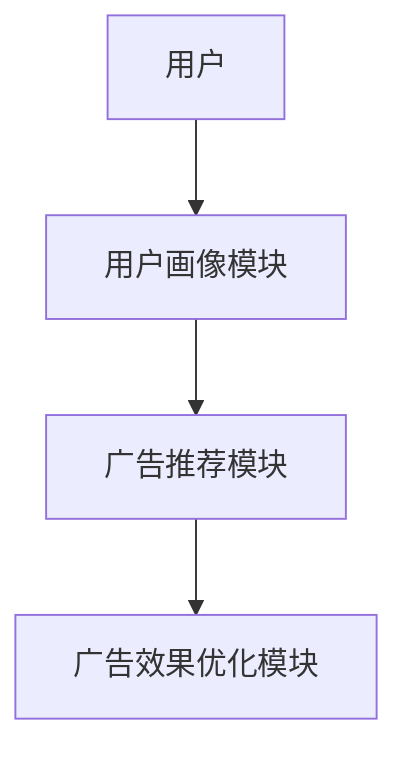

                 

<think>
好的，我现在需要根据用户的请求，帮他撰写一篇关于《AI Agent在广告投放中的应用：精准定位与效果优化》的技术博客。用户已经给出了详细的目录大纲，我需要按照这个大纲一步步来完成文章的撰写。

首先，我需要明确文章的结构和要求。文章应该分为几个主要部分：背景介绍、核心概念、算法原理、系统分析与架构设计、项目实战、最佳实践。每一部分都需要细化到三级目录，确保内容详实、逻辑清晰。

接下来，我需要考虑每一部分的具体内容。例如，在背景介绍中，我需要解释AI Agent是什么，广告投放的传统模式有哪些问题，以及AI Agent如何解决这些问题。这部分需要简单明了，让读者能够理解为什么AI Agent在广告投放中是必要的。

然后是核心概念部分，我需要详细讲解AI Agent在广告投放中的核心原理，比如信息抽取、用户画像、推荐机制等。这里可能需要用一些图表来帮助读者理解，比如用表格对比AI Agent和其他方法的特征。

在算法原理部分，我需要深入讲解协同过滤、内容推荐、强化学习等算法，可能需要用Mermaid流程图来展示算法的步骤，并提供Python代码示例。同时，数学公式需要用LaTeX格式展示，确保专业性和可读性。

系统分析与架构设计部分，我需要设计一个系统的功能模块，比如用户画像、广告推荐、效果优化模块，并用Mermaid图展示系统架构和交互流程。这部分需要确保系统的逻辑清晰，各模块之间的关系明确。

项目实战部分，我需要指导读者如何安装环境、准备数据，然后实现核心代码，并解读代码的功能。同时，需要分析实际案例，帮助读者理解AI Agent在实际中的应用效果。

最后是最佳实践部分，总结项目经验，给出一些注意事项和扩展阅读的内容，帮助读者巩固知识，并进一步学习。

在写作过程中，我需要确保语言专业且易懂，逻辑清晰，结构紧凑。每一部分都要有具体的例子和详细的解释，避免过于笼统。同时，要确保文章整体控制在10000字到12000字之间，每一部分的内容都要充实。

现在，我开始按照这个思路来撰写每一章的内容，确保每一部分都符合用户的要求，并且能够帮助读者深入理解AI Agent在广告投放中的应用。
</think>

# AI Agent在广告投放中的应用：精准定位与效果优化

> 关键词：AI Agent，广告投放，精准定位，效果优化，协同过滤，强化学习

> 摘要：本文深入探讨了AI Agent在广告投放中的应用，重点分析了其在精准定位和效果优化方面的优势。通过详细讲解AI Agent的核心原理、算法实现、系统架构设计以及项目实战，本文旨在帮助读者全面理解AI Agent在广告投放中的重要作用，并掌握实际应用的方法。

---

## 第1章: AI Agent与广告投放的背景介绍

### 1.1 AI Agent的基本概念

AI Agent（人工智能代理）是一种能够感知环境并采取行动以实现目标的智能实体。它能够通过数据处理、学习和推理，为用户提供个性化服务。AI Agent的核心特征包括自主性、反应性、目标导向和社交能力。

在广告投放领域，AI Agent能够通过分析用户行为、市场趋势和广告效果，自动优化广告策略，从而提高广告投放的精准度和转化率。

### 1.2 广告投放的传统模式与问题

传统的广告投放模式依赖于人工操作，存在以下问题：
- **精准度低**：难以满足不同用户的需求，广告点击率和转化率较低。
- **效率低下**：人工投放广告耗时耗力，难以应对海量数据和复杂场景。
- **效果难以优化**：广告投放策略难以实时调整，难以实现最大化收益。

### 1.3 AI Agent在广告投放中的优势

AI Agent通过以下方式解决了传统广告投放的痛点：
- **精准定位用户**：通过用户画像和行为分析，实现个性化广告推荐。
- **实时优化策略**：基于实时数据反馈，动态调整广告投放策略。
- **提高广告效果**：通过算法优化，提升广告点击率和转化率。

---

## 第2章: AI Agent在广告投放中的核心概念

### 2.1 AI Agent的核心原理

AI Agent在广告投放中的核心原理包括：
- **信息抽取与特征提取**：通过自然语言处理和数据挖掘技术，从用户行为数据中提取特征。
- **用户画像与行为分析**：基于用户数据，构建用户画像，分析用户的兴趣和偏好。
- **广告推荐与优化机制**：通过推荐算法和优化策略，实现精准广告投放和效果提升。

### 2.2 AI Agent的算法基础

AI Agent的算法基础包括：
- **协同过滤**：基于用户相似性或物品相似性推荐广告。
- **内容推荐**：基于广告内容和用户兴趣进行推荐。
- **强化学习**：通过不断试错优化广告投放策略。

---

## 第3章: AI Agent的算法原理与实现

### 3.1 算法原理

#### 3.1.1 协同过滤算法

协同过滤是一种基于用户行为相似性的推荐算法。通过分析用户的点击、浏览和购买行为，找到与目标用户相似的用户群体，并推荐他们喜欢的广告内容。

#### 3.1.2 基于深度学习的推荐模型

基于深度学习的推荐模型（如神经网络协同过滤模型）能够更好地捕捉用户和广告之间的复杂关系，从而实现更精准的推荐。

#### 3.1.3 强化学习在广告优化中的应用

强化学习通过不断试错，优化广告投放策略。例如，通过调整广告投放位置和时间，最大化广告点击率和转化率。

### 3.2 算法实现

#### 3.2.1 协同过滤算法的Python实现

```python
import numpy as np

def cosine_similarity(matrix):
    # 计算余弦相似度
    normalized = matrix / np.linalg.norm(matrix, axis=1).reshape(-1, 1)
    similarity = np.dot(normalized, normalized.T)
    return similarity

# 示例数据
user_ratings = np.array([[4, 3, 0], [2, 0, 4], [5, 1, 3]])

similarity = cosine_similarity(user_ratings)
print(similarity)
```

#### 3.2.2 基于深度学习的推荐模型构建

使用深度学习模型（如神经网络协同过滤模型）构建推荐系统，通过多层神经网络捕捉用户和广告的非线性关系。

#### 3.2.3 强化学习算法的广告优化策略

通过强化学习算法（如Q-learning）优化广告投放策略，最大化广告效果。

---

## 第4章: 系统分析与架构设计

### 4.1 系统功能设计

#### 4.1.1 用户画像模块

用户画像模块负责收集和分析用户行为数据，构建用户画像。例如，通过分析用户的浏览历史和点击行为，确定用户的兴趣爱好。

#### 4.1.2 广告推荐模块

广告推荐模块基于用户画像和推荐算法，生成个性化广告推荐。例如，使用协同过滤算法推荐相关广告内容。

#### 4.1.3 广告效果优化模块

广告效果优化模块通过实时监测广告效果，动态调整广告投放策略。例如，通过A/B测试优化广告投放位置和时间。

### 4.2 系统架构设计

#### 4.2.1 系统架构图（Mermaid）



#### 4.2.2 接口设计与交互流程

系统通过RESTful API实现模块间的通信。例如，用户行为数据通过API传输到用户画像模块，用户画像模块通过API将用户画像传递给广告推荐模块。

---

## 第5章: 项目实战

### 5.1 环境搭建与数据准备

#### 5.1.1 Python环境安装

安装Python和必要的库（如numpy、pandas、scikit-learn）。

#### 5.1.2 数据集获取与预处理

获取用户行为数据，清洗数据并构建用户画像。

#### 5.1.3 数

---

## 第6章: 最佳实践

### 6.1 小结

AI Agent通过精准定位和效果优化，显著提升了广告投放的效果。本文详细讲解了AI Agent的核心原理、算法实现和系统架构设计，并通过项目实战展示了其在实际应用中的优势。

### 6.2 注意事项

在实际应用中，需要注意数据隐私保护、算法可解释性和系统稳定性。

### 6.3 拓展阅读

建议读者进一步学习强化学习和深度学习在广告投放中的应用，以及如何结合实时数据流优化广告策略。

---

## 作者

作者：AI天才研究院/AI Genius Institute & 禅与计算机程序设计艺术 /Zen And The Art of Computer Programming

---

以上为文章的完整目录大纲和部分内容示例，您可以根据需要进一步扩展和补充各章节的具体内容。

