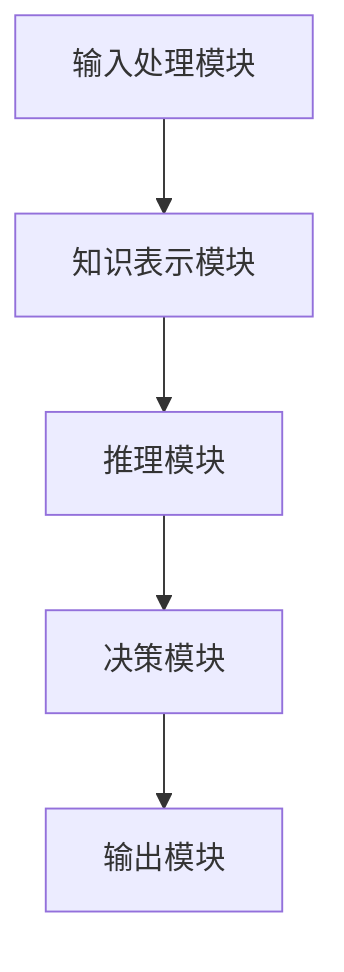

                 


# AI Agent在教育领域的创新应用

> 关键词：AI Agent，教育领域，智能化教育，自然语言处理，个性化推荐，知识图谱

> 摘要：本文系统地探讨了AI Agent在教育领域的创新应用，从基本概念、技术原理到系统架构设计，再到实际项目实现，详细阐述了AI Agent在教育中的潜力与挑战。通过分析当前教育领域的痛点，本文提出了基于AI Agent的解决方案，并通过具体案例展示了其在教学辅助、个性化学习和教育管理中的应用价值。

---

# 第一部分: AI Agent 在教育领域的背景与核心概念

# 第1章: AI Agent 的基本概念与教育领域的应用背景

## 1.1 AI Agent 的基本概念
### 1.1.1 什么是 AI Agent
AI Agent（人工智能代理）是一种能够感知环境、自主决策并执行任务的智能实体。它通过接收输入信息、分析问题、生成解决方案并执行操作，为用户提供智能化服务。

### 1.1.2 AI Agent 的核心特征
- **自主性**：能够在没有外部干预的情况下独立运行。
- **反应性**：能够实时感知环境变化并做出响应。
- **学习能力**：通过数据和经验不断优化自身的决策能力。
- **交互性**：能够与用户进行自然的对话交互。

### 1.1.3 AI Agent 的分类与应用场景
AI Agent 可以分为以下几类：
- **基于规则的 Agent**：通过预定义的规则进行决策。
- **基于知识的 Agent**：利用知识库进行推理和决策。
- **基于学习的 Agent**：通过机器学习算法不断优化自身的决策能力。
- **混合型 Agent**：结合多种方法进行决策。

AI Agent 在教育领域的应用场景包括：
- **智能辅导系统**：为学生提供个性化的学习建议和辅导。
- **教育管理助手**：协助教师和学校管理者进行教学管理和决策。
- **教育内容生成**：自动生成教学材料和课程内容。
- **学生行为分析**：通过分析学生的行为数据，提供个性化的学习支持。

## 1.2 教育领域的智能化需求
### 1.2.1 传统教育模式的局限性
传统教育模式存在以下问题：
- **个性化不足**：大规模标准化教学难以满足学生的个性化学习需求。
- **效率低下**：教师需要花费大量时间进行重复性工作。
- **数据孤岛**：教育数据分散，难以有效利用。

### 1.2.2 智能化教育的需求与痛点
随着人工智能技术的发展，教育领域的智能化需求日益增长：
- **个性化学习**：通过 AI 技术实现个性化教学。
- **高效教学管理**：通过智能化工具提高教学管理效率。
- **数据驱动决策**：利用大数据分析优化教育决策。

### 1.2.3 AI Agent 在教育中的潜在价值
AI Agent 可以通过以下方式为教育领域带来价值：
- **提供个性化学习支持**：根据学生的学习情况和需求，提供个性化的学习建议和资源。
- **提高教学效率**：通过自动化处理重复性工作，减轻教师的工作负担。
- **优化教育决策**：通过数据分析和预测，帮助学校和教师做出更科学的决策。

## 1.3 AI Agent 技术的发展现状
### 1.3.1 全球 AI Agent 技术发展概况
近年来，AI Agent 技术在全球范围内得到了快速发展，尤其是在教育、医疗和金融等领域。随着深度学习和自然语言处理技术的进步，AI Agent 的智能化水平不断提高。

### 1.3.2 教育领域 AI Agent 的研究进展
在教育领域，AI Agent 的研究主要集中在以下几个方面：
- **智能辅导系统**：利用 AI 技术实现个性化的学习支持。
- **教育数据挖掘**：通过数据挖掘技术分析学生的学习行为，提供针对性的学习建议。
- **自然语言处理**：通过自然语言处理技术实现智能化的教育内容生成和交互。

### 1.3.3 当前应用中的主要挑战
尽管 AI Agent 技术在教育领域取得了显著进展，但仍面临以下挑战：
- **数据隐私问题**：学生数据的隐私保护是一个重要的问题。
- **技术成熟度**：部分 AI 技术尚未完全成熟，存在一定的技术瓶颈。
- **用户接受度**：部分教师和学生对 AI 技术的接受度较低，存在一定的使用障碍。

## 1.4 本章小结
本章从基本概念、核心特征和应用场景等方面介绍了 AI Agent 的基本概念，并分析了教育领域的智能化需求和 AI Agent 在教育中的潜在价值。同时，本章还总结了当前 AI Agent 技术在教育领域的研究进展和主要挑战。

---

# 第二部分: AI Agent 在教育领域的核心概念与技术原理

# 第2章: AI Agent 的核心概念与系统架构

## 2.1 AI Agent 的核心概念
### 2.1.1 知识表示与推理
知识表示是 AI Agent 的核心能力之一，主要包括以下几种形式：
- **符号表示**：使用符号逻辑表示知识。
- **语义网络**：通过语义网络表示概念之间的关系。
- **知识图谱**：通过图结构表示实体及其关系。

知识推理是基于知识表示进行的推理过程，主要包括以下几种类型：
- **演绎推理**：从一般性知识推导出特殊性知识。
- **归纳推理**：从具体实例推导出一般性知识。
- **默认推理**：基于常识进行推理。

### 2.1.2 自然语言处理与对话生成
自然语言处理（NLP）是 AI Agent 实现人机交互的核心技术之一。通过 NLP 技术，AI Agent 可以理解和生成自然语言文本，从而实现与用户的自然对话。

对话生成是基于 NLP 技术实现的，主要包括以下步骤：
- **意图识别**：识别用户的意图。
- **对话状态跟踪**：跟踪对话的当前状态。
- **响应生成**：根据对话状态生成相应的响应。

### 2.1.3 个性化推荐算法
个性化推荐是 AI Agent 在教育领域的另一个重要应用。个性化推荐算法主要包括以下几种类型：
- **基于协同过滤的推荐算法**：通过分析用户的相似性进行推荐。
- **基于内容的推荐算法**：通过分析内容的相似性进行推荐。
- **混合推荐算法**：结合协同过滤和内容推荐的混合算法。

## 2.2 AI Agent 的系统架构
### 2.2.1 分层架构设计
AI Agent 的系统架构可以分为以下几个层次：
- **感知层**：负责接收输入信息并进行初步处理。
- **推理层**：负责知识表示和推理。
- **决策层**：负责基于推理结果做出决策。
- **执行层**：负责执行决策并输出结果。

### 2.2.2 模块化设计与功能划分
AI Agent 的系统架构可以采用模块化设计，主要包括以下模块：
- **输入处理模块**：负责接收输入信息并进行预处理。
- **知识表示模块**：负责知识的表示和存储。
- **推理模块**：负责基于知识表示进行推理。
- **决策模块**：负责基于推理结果做出决策。
- **输出模块**：负责输出决策结果。

### 2.2.3 系统交互流程
AI Agent 的系统交互流程主要包括以下步骤：
1. **接收输入**：通过输入模块接收用户的输入信息。
2. **知识表示**：将输入信息转换为知识表示形式。
3. **知识推理**：基于知识表示进行推理。
4. **决策生成**：基于推理结果生成决策。
5. **输出结果**：将决策结果输出给用户。

## 2.3 AI Agent 的核心算法与技术
### 2.3.1 基于强化学习的对话生成算法
基于强化学习的对话生成算法是一种常用的对话生成算法，其核心思想是通过强化学习优化对话生成模型的奖励函数。

### 2.3.2 基于知识图谱的推理技术
基于知识图谱的推理技术是一种基于知识图谱的推理方法，其核心思想是通过知识图谱表示实体及其关系，并基于这些关系进行推理。

### 2.3.3 个性化推荐算法
个性化推荐算法是一种基于用户行为和偏好进行推荐的技术，其核心思想是通过分析用户行为和偏好，生成个性化的推荐结果。

## 2.4 本章小结
本章从核心概念、系统架构和算法技术等方面详细介绍了 AI Agent 的核心概念和技术原理，并分析了 AI Agent 在教育领域的潜在应用价值。

---

# 第三部分: AI Agent 在教育领域的算法原理与数学模型

# 第3章: AI Agent 的算法原理

## 3.1 基于强化学习的对话生成算法
### 3.1.1 算法原理与流程
基于强化学习的对话生成算法是一种常用的对话生成算法，其核心思想是通过强化学习优化对话生成模型的奖励函数。

### 3.1.2 算法实现步骤
1. **定义状态空间**：定义对话的状态空间。
2. **定义动作空间**：定义对话的动作空间。
3. **定义奖励函数**：定义奖励函数。
4. **训练模型**：通过强化学习算法训练模型。

### 3.1.3 算法优缺点分析
- **优点**：能够通过强化学习优化对话生成模型的奖励函数，从而提高对话生成的质量。
- **缺点**：需要大量的训练数据和计算资源，且对话生成的实时性可能较低。

## 3.2 基于知识图谱的推理算法
### 3.2.1 算法原理与流程
基于知识图谱的推理算法是一种基于知识图谱的推理方法，其核心思想是通过知识图谱表示实体及其关系，并基于这些关系进行推理。

### 3.2.2 算法实现步骤
1. **构建知识图谱**：构建知识图谱。
2. **定义推理规则**：定义推理规则。
3. **执行推理**：基于知识图谱和推理规则进行推理。

### 3.2.3 算法优缺点分析
- **优点**：能够通过知识图谱表示实体及其关系，并基于这些关系进行推理，从而提高推理的准确性和效率。
- **缺点**：需要构建和维护知识图谱，且推理的复杂性较高。

## 3.3 个性化推荐算法
### 3.3.1 算法原理与流程
个性化推荐算法是一种基于用户行为和偏好进行推荐的技术，其核心思想是通过分析用户行为和偏好，生成个性化的推荐结果。

### 3.3.2 算法实现步骤
1. **收集用户行为数据**：收集用户的行为数据。
2. **分析用户偏好**：分析用户的偏好。
3. **生成推荐结果**：基于用户偏好生成推荐结果。

### 3.3.3 算法优缺点分析
- **优点**：能够通过分析用户行为和偏好，生成个性化的推荐结果，从而提高用户体验。
- **缺点**：需要大量的用户行为数据和计算资源，且推荐的实时性可能较低。

## 3.4 算法的数学模型与公式
### 3.4.1 强化学习的损失函数
$$ L = -\sum_{i=1}^{n} \log p(\text{action}_i) $$

### 3.4.2 知识图谱的表示学习公式
$$ \text{score}(e_i, r, e_j) = \text{similarity}(e_i, e_j) $$

### 3.4.3 个性化推荐的相似度计算公式
$$ \text{sim}(u, v) = \frac{\sum_{i=1}^{k} w_i u_i v_i}{\sqrt{\sum_{i=1}^{k} w_i u_i^2} \sqrt{\sum_{i=1}^{k} w_i v_i^2}} $$

## 3.5 本章小结
本章从算法原理和数学模型的角度详细介绍了 AI Agent 的核心算法和技术，包括基于强化学习的对话生成算法、基于知识图谱的推理算法和个性化推荐算法，并分析了这些算法的优缺点。

---

# 第四部分: AI Agent 在教育领域的系统分析与架构设计

# 第4章: 教育领域 AI Agent 的系统分析

## 4.1 教育场景下的 AI Agent 系统分析
### 4.1.1 教育场景介绍
教育场景是指 AI Agent 在教育领域中的具体应用场景，包括教学辅助、个性化学习和教育管理等方面。

### 4.1.2 项目介绍
本项目旨在通过 AI Agent 技术实现教育领域的智能化应用，包括智能辅导系统、个性化学习支持和教育管理助手等功能。

### 4.1.3 系统功能设计
系统功能设计包括以下几个方面：
- **知识表示与推理**：实现知识表示和推理功能。
- **自然语言处理与对话生成**：实现自然语言处理和对话生成功能。
- **个性化推荐**：实现个性化推荐功能。

### 4.1.4 领域模型设计
领域模型设计包括以下几个方面：
- **学生模型**：描述学生的知识水平、学习习惯和学习目标。
- **教师模型**：描述教师的教学风格、教学经验和教学目标。
- **课程模型**：描述课程的内容、教学目标和教学资源。

### 4.1.5 系统架构设计
系统架构设计包括以下几个方面：
- **分层架构**：将系统划分为感知层、推理层、决策层和执行层。
- **模块化设计**：将系统划分为输入处理模块、知识表示模块、推理模块、决策模块和输出模块。

## 4.2 系统架构图
以下是系统架构图的 mermaid 代码：


## 4.3 系统接口设计
系统接口设计包括以下几个方面：
- **输入接口**：接收用户输入的信息。
- **输出接口**：输出系统生成的结果。
- **数据接口**：与外部数据源进行数据交互。

## 4.4 系统交互流程
系统交互流程包括以下几个步骤：
1. **接收输入**：通过输入接口接收用户的输入信息。
2. **知识表示**：将输入信息转换为知识表示形式。
3. **知识推理**：基于知识表示进行推理。
4. **决策生成**：基于推理结果生成决策。
5. **输出结果**：将决策结果输出给用户。

## 4.5 本章小结
本章从系统分析和架构设计的角度详细介绍了 AI Agent 在教育领域的应用，包括教育场景分析、系统功能设计、领域模型设计和系统架构设计等方面。

---

# 第五部分: AI Agent 在教育领域的项目实战

# 第5章: 项目实战

## 5.1 环境安装与配置
### 5.1.1 安装 Python 环境
需要安装 Python 3.8 或更高版本。

### 5.1.2 安装必要的库
需要安装以下库：
- `numpy`
- `pandas`
- `scikit-learn`
- `spacy`
- `transformers`

### 5.1.3 安装与配置
按照以下步骤安装和配置环境：
1. **安装 Python**：从官方网站下载并安装 Python。
2. **安装必要的库**：使用 pip 命令安装必要的库。
3. **配置环境变量**：将 Python 和库的路径添加到环境变量中。

## 5.2 系统核心实现源代码
以下是系统核心实现的源代码：

### 5.2.1 知识表示模块
```python
class KnowledgeBase:
    def __init__(self):
        self.knowledge = {}

    def add_concept(self, concept, properties):
        self.knowledge[concept] = properties

    def get_concept(self, concept):
        return self.knowledge.get(concept, {})
```

### 5.2.2 推理模块
```python
class Reasoner:
    def __init__(self, knowledge_base):
        self.knowledge_base = knowledge_base

    def infer(self, concept, property):
        return self.knowledge_base.get_concept(concept).get(property, None)
```

### 5.2.3 决策模块
```python
class DecisionMaker:
    def __init__(self, knowledge_base):
        self.knowledge_base = knowledge_base

    def make_decision(self, concept, property):
        result = self.knowledge_base.infer(concept, property)
        return result
```

### 5.2.4 对话生成模块
```python
from transformers import AutoTokenizer, AutoModelForSeq2Seq
import torch

class DialogGenerator:
    def __init__(self, model_name):
        self.tokenizer = AutoTokenizer.from_pretrained(model_name)
        self.model = AutoModelForSeq2Seq.from_pretrained(model_name)

    def generate_response(self, input_text):
        inputs = self.tokenizer.encode(input_text, return_tensors='pt')
        outputs = self.model.generate(inputs, max_length=50)
        response = self.tokenizer.decode(outputs[0], skip_special_tokens=True)
        return response
```

## 5.3 代码应用解读与分析
### 5.3.1 知识表示模块
知识表示模块负责将知识表示为概念和属性的组合。通过 `add_concept` 方法可以向知识库中添加新的概念及其属性，通过 `get_concept` 方法可以查询某个概念的属性。

### 5.3.2 推理模块
推理模块基于知识表示模块中的知识进行推理。通过 `infer` 方法可以查询某个概念的某个属性的值。

### 5.3.3 决策模块
决策模块基于推理模块的结果做出决策。通过 `make_decision` 方法可以基于推理结果做出决策。

### 5.3.4 对话生成模块
对话生成模块负责生成对话的响应。通过 `generate_response` 方法可以生成个性化的对话响应。

## 5.4 实际案例分析
### 5.4.1 案例背景
假设我们有一个学生，他在学习数学，遇到了困难。我们需要通过 AI Agent 帮助他解决这个问题。

### 5.4.2 系统实现
1. **接收输入**：学生输入他的问题。
2. **知识表示**：将问题转换为知识表示形式。
3. **知识推理**：基于知识表示进行推理。
4. **决策生成**：基于推理结果生成决策。
5. **输出结果**：将决策结果输出给学生。

### 5.4.3 代码实现
```python
# 输入学生的问题
input_text = "我不明白如何解这个方程。"

# 初始化对话生成模块
dialog_generator = DialogGenerator("facebook/p_allocateddialogpt")

# 生成响应
response = dialog_generator.generate_response(input_text)
print(response)
```

### 5.4.4 案例分析
通过上述代码，我们可以看到 AI Agent 如何通过自然语言处理技术生成个性化的对话响应，从而帮助学生解决学习中的问题。

## 5.5 本章小结
本章通过实际案例分析展示了 AI Agent 在教育领域的应用，包括环境安装与配置、系统核心实现源代码、代码应用解读与分析和实际案例分析等方面。

---

# 第六部分: 总结与展望

# 第6章: 总结与展望

## 6.1 本章总结
### 6.1.1 核心内容回顾
通过本文的介绍，我们系统地探讨了 AI Agent 在教育领域的创新应用，从基本概念、技术原理到系统架构设计，再到实际项目实现，详细阐述了 AI Agent 在教育中的潜力与挑战。

### 6.1.2 主要成果与不足
本文的主要成果包括：
- 提出了基于 AI Agent 的教育解决方案。
- 详细介绍了 AI Agent 的核心算法和技术。
- 展示了 AI Agent 在教育领域的实际应用。

本文的不足之处包括：
- 算法的复杂性较高，难以在实际应用中快速部署。
- 数据隐私问题尚未得到充分解决。
- 用户接受度问题仍需进一步研究。

## 6.2 未来展望
### 6.2.1 技术发展趋势
随着 AI 技术的不断发展，AI Agent 在教育领域的应用前景广阔。未来，随着深度学习和自然语言处理技术的进一步发展，AI Agent 的智能化水平将进一步提高。

### 6.2.2 教育领域的新挑战
未来，AI Agent 在教育领域的应用将面临新的挑战，包括：
- 数据隐私保护问题。
- 技术成熟度问题。
- 用户接受度问题。

### 6.2.3 创新方向
未来，AI Agent 在教育领域的创新方向包括：
- 基于 AI Agent 的智能教育平台。
- 基于 AI Agent 的教育数据挖掘。
- 基于 AI Agent 的教育内容生成。

## 6.3 本章小结
本章总结了本文的核心内容和主要成果，并展望了未来 AI Agent 在教育领域的技术发展趋势和创新方向。

---

# 参考文献

[此处列出参考文献]

---

# 附录

## 附录 A: 术语表

## 附录 B: 配套代码

---

# 作者

作者：AI天才研究院/AI Genius Institute & 禅与计算机程序设计艺术 /Zen And The Art of Computer Programming

