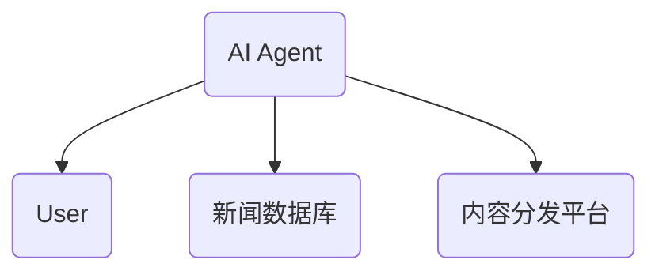
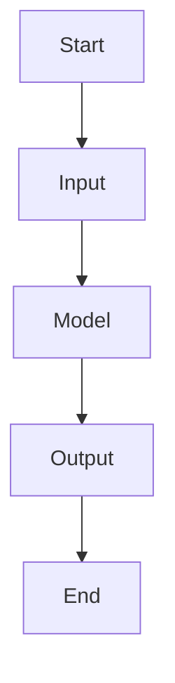
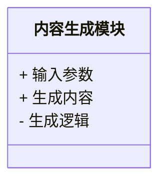
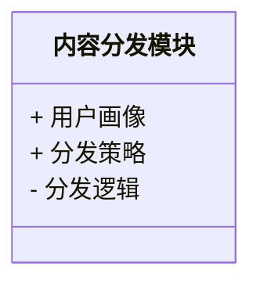
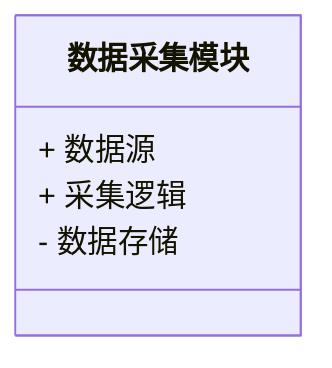
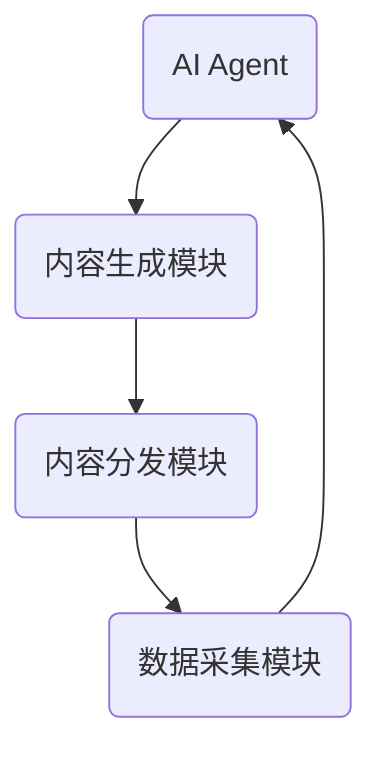
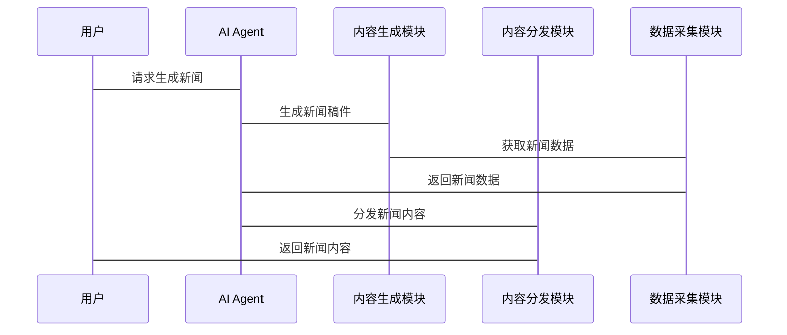

                 

# AI Agent在新闻媒体中的应用：自动写作与内容分发

## 关键词：AI Agent、新闻媒体、自动写作、内容分发、大语言模型、强化学习

## 摘要：本文探讨AI Agent在新闻媒体中的应用，特别是自动写作和内容分发领域。通过分析AI Agent的核心概念、算法原理、系统架构设计，结合实际案例，详细阐述AI Agent如何提高新闻生产的效率、优化内容分发的精准度，并降低新闻生产的成本。

---

## 第一部分: AI Agent在新闻媒体中的应用概述

## 第1章: AI Agent与新闻媒体的结合

### 1.1 AI Agent的基本概念

#### 1.1.1 什么是AI Agent

AI Agent（人工智能代理）是指能够感知环境、自主决策并执行任务的智能实体。在新闻媒体领域，AI Agent通常被设计为能够理解、分析和生成新闻内容的智能系统。AI Agent的核心在于其智能化和自动化能力，能够根据输入的信息生成符合要求的新闻稿件。

#### 1.1.2 AI Agent的核心特征

AI Agent在新闻媒体中的应用具有以下核心特征：

- **智能化**：能够理解新闻内容、分析数据并生成高质量的新闻稿件。
- **自主性**：无需人工干预，能够独立完成从数据收集到内容分发的整个流程。
- **适应性**：能够根据实时数据和用户反馈不断优化生成内容的质量和分发策略。

#### 1.1.3 AI Agent与传统新闻媒体的结合

AI Agent与传统新闻媒体的结合主要体现在以下方面：

- **数据驱动**：AI Agent能够快速处理大量数据，生成新闻线索。
- **自动化写作**：AI Agent可以根据预设的模板或风格，自动生成新闻稿件。
- **个性化分发**：AI Agent能够根据用户兴趣和行为，精准分发新闻内容。

### 1.2 新闻媒体行业的现状

#### 1.2.1 现代新闻媒体的运作模式

现代新闻媒体的运作模式主要包括以下几个步骤：

1. **新闻采集**：通过记者采访、网络爬取等方式获取新闻素材。
2. **内容编辑**：对新闻素材进行整理、撰写和排版。
3. **内容分发**：通过多种渠道（如网站、社交媒体）将新闻内容分发给目标用户。

#### 1.2.2 传统新闻分发的痛点

传统新闻分发模式存在以下痛点：

- **效率低下**：新闻采集和编辑过程需要大量人工参与，效率较低。
- **精准度不足**：内容分发缺乏针对性，难以满足用户的个性化需求。
- **成本高昂**：传统新闻分发需要大量的人力、物力和财力支持。

#### 1.2.3 AI技术在新闻媒体中的潜力

AI技术在新闻媒体中的潜力主要体现在以下几个方面：

- **提高效率**：AI Agent能够快速处理大量数据，缩短新闻生产的周期。
- **优化精准度**：AI Agent能够根据用户行为和偏好，实现精准的内容分发。
- **降低成本**：通过自动化流程，减少人力投入，降低运营成本。

### 1.3 AI Agent在新闻媒体中的应用价值

#### 1.3.1 提高新闻生产的效率

AI Agent可以通过自动化处理和快速生成，显著提高新闻生产的效率。例如，AI Agent可以在几秒钟内生成一篇新闻稿，而传统方式可能需要数小时甚至更长时间。

#### 1.3.2 优化内容分发的精准度

AI Agent能够根据用户的兴趣、行为和历史数据，精准匹配新闻内容，实现个性化分发。这种精准分发能够提高用户的阅读体验，同时增加媒体的分发效率。

#### 1.3.3 降低新闻生产的成本

通过自动化流程和减少人工干预，AI Agent能够显著降低新闻生产的成本。例如，AI Agent可以自动完成新闻素材的采集、整理和生成，减少对记者和编辑的依赖。

### 1.4 本章小结

本章主要介绍了AI Agent的基本概念、新闻媒体行业的现状以及AI Agent在新闻媒体中的应用价值。通过分析，我们看到AI Agent在新闻媒体中的应用潜力巨大，能够显著提高新闻生产的效率、优化内容分发的精准度，并降低新闻生产的成本。

---

## 第二部分: AI Agent的核心概念与原理

## 第2章: AI Agent的核心概念

### 2.1 AI Agent的定义与属性

#### 2.1.1 AI Agent的定义

AI Agent（人工智能代理）是指能够感知环境、自主决策并执行任务的智能实体。在新闻媒体领域，AI Agent通常被设计为能够理解、分析和生成新闻内容的智能系统。AI Agent的核心在于其智能化和自动化能力，能够根据输入的信息生成符合要求的新闻稿件。

#### 2.1.2 AI Agent的核心属性对比

以下是AI Agent的核心属性对比：

| 属性       | 描述                                   |
|------------|--------------------------------------|
| 智能性      | 基于AI算法进行内容生成和决策           |
| 自主性      | 可以独立完成任务                     |
| 适应性      | 能够根据反馈调整行为                 |

#### 2.1.3 AI Agent与传统新闻媒体的结合

AI Agent与传统新闻媒体的结合主要体现在以下方面：

- **数据驱动**：AI Agent能够快速处理大量数据，生成新闻线索。
- **自动化写作**：AI Agent可以根据预设的模板或风格，自动生成新闻稿件。
- **个性化分发**：AI Agent能够根据用户兴趣和行为，精准分发新闻内容。

### 2.2 AI Agent的实体关系图

以下是AI Agent的实体关系图：

在上图中：

- **A(AI Agent)**：代表AI Agent，能够感知环境、自主决策并执行任务。
- **B(User)**：代表用户，AI Agent的目标用户。
- **C(新闻数据库)**：代表新闻数据的存储库，AI Agent从中获取数据。
- **D(内容分发平台)**：代表新闻内容的分发渠道，AI Agent通过此平台将内容分发给用户。

### 2.3 本章小结

本章主要介绍了AI Agent的核心概念，包括其定义、核心属性以及与传统新闻媒体的结合。通过实体关系图，我们清晰地看到了AI Agent在新闻媒体中的角色和作用。

---

## 第三部分: AI Agent的算法原理

## 第3章: AI Agent的算法实现

### 3.1 基于大语言模型的新闻生成算法

#### 3.1.1 模型输入与输出

以下是基于大语言模型的新闻生成算法的输入与输出示意图：

在上图中：

- **Start**：代表算法的开始。
- **Input**：代表输入的数据，通常包括新闻素材和生成要求。
- **Model**：代表大语言模型，负责生成新闻内容。
- **Output**：代表生成的新闻稿件。
- **End**：代表算法的结束。

#### 3.1.2 模型训练过程

以下是模型的训练过程：

$$ \text{损失函数} = -\sum_{i=1}^{n} \log P(x_i | x_{<i}) $$

在上式中：

- **$x_i$**：代表第i个词。
- **$x_{<i}$**：代表前i-1个词。
- **$\log P(x_i | x_{<i})$**：代表在前i-1个词的情况下，生成第i个词的概率的对数。

#### 3.1.3 生成过程

以下是生成过程的公式：

$$ P(x_{n} | x_{<n}) = \text{softmax}(h_n) $$

在上式中：

- **$x_{n}$**：代表第n个词。
- **$x_{<n}$**：代表前n-1个词。
- **$h_n$**：代表第n个词的隐藏层状态。
- **$\text{softmax}(h_n)$**：代表第n个词的生成概率分布。

### 3.2 基于强化学习的优化算法

#### 3.2.1 强化学习的基本原理

以下是强化学习的基本原理：

$$ R = r_1 + r_2 + \dots + r_n $$

在上式中：

- **$R$**：代表总奖励。
- **$r_i$**：代表第i步的奖励。

#### 3.2.2 奖励函数的设计

以下是奖励函数的设计：

$$ R = \text{ Rouge分数} + \text{ 阅读体验分数} $$

在上式中：

- **$\text{Rouge分数}$**：代表生成内容的相关性评分。
- **$\text{阅读体验分数}$**：代表生成内容的可读性和吸引力评分。

### 3.3 本章小结

本章主要介绍了AI Agent的算法实现，包括基于大语言模型的新闻生成算法和基于强化学习的优化算法。通过公式和流程图，我们清晰地了解了AI Agent的生成和优化过程。

---

## 第四部分: AI Agent的系统架构设计

## 第4章: 系统架构与实现

### 4.1 系统功能模块

#### 4.1.1 内容生成模块

以下是内容生成模块的类图：

在上图中：

- **输入参数**：代表生成内容所需的参数，如主题、关键词等。
- **生成内容**：代表生成的新闻稿件。
- **生成逻辑**：代表生成内容的算法和逻辑。

#### 4.1.2 内容分发模块

以下是内容分发模块的类图：

在上图中：

- **用户画像**：代表用户的兴趣和行为数据。
- **分发策略**：代表内容分发的规则和策略。
- **分发逻辑**：代表内容分发的算法和逻辑。

#### 4.1.3 数据采集模块

以下是数据采集模块的类图：

在上图中：

- **数据源**：代表新闻数据的来源，如新闻网站、社交媒体等。
- **采集逻辑**：代表数据采集的算法和逻辑。
- **数据存储**：代表数据的存储位置，如数据库、云存储等。

### 4.2 系统架构图

以下是系统的架构图：

在上图中：

- **A(AI Agent)**：代表AI Agent，负责协调各个模块的工作。
- **B(内容生成模块)**：代表内容生成模块，负责生成新闻稿件。
- **C(内容分发模块)**：代表内容分发模块，负责分发新闻内容。
- **D(数据采集模块)**：代表数据采集模块，负责采集新闻数据。

### 4.3 系统接口设计

以下是系统的接口设计：

在上图中：

- **用户**：代表新闻内容的请求者。
- **AI Agent**：代表AI Agent，负责协调各个模块的工作。
- **内容生成模块**：代表内容生成模块，负责生成新闻稿件。
- **内容分发模块**：代表内容分发模块，负责分发新闻内容。
- **数据采集模块**：代表数据采集模块，负责采集新闻数据。

### 4.4 系统交互流程

以下是系统的交互流程：

1. **用户请求生成新闻**：用户向AI Agent请求生成一篇新闻稿件。
2. **AI Agent调用内容生成模块**：AI Agent调用内容生成模块，生成新闻稿件。
3. **内容生成模块调用数据采集模块**：内容生成模块调用数据采集模块，获取新闻数据。
4. **数据采集模块返回新闻数据**：数据采集模块将新闻数据返回给AI Agent。
5. **AI Agent调用内容分发模块**：AI Agent调用内容分发模块，分发新闻内容。
6. **内容分发模块返回新闻内容**：内容分发模块将新闻内容返回给用户。

### 4.5 本章小结

本章主要介绍了AI Agent的系统架构设计，包括系统的功能模块、架构图、接口设计和交互流程。通过系统的架构设计，我们能够清晰地看到AI Agent在新闻媒体中的应用流程和各模块之间的协作关系。

---

## 作者：AI天才研究院/AI Genius Institute & 禅与计算机程序设计艺术 /Zen And The Art of Computer Programming

