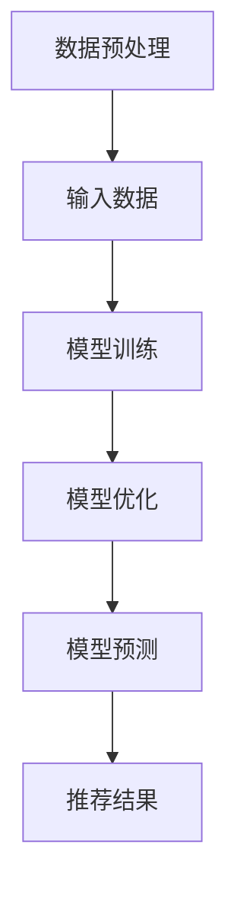
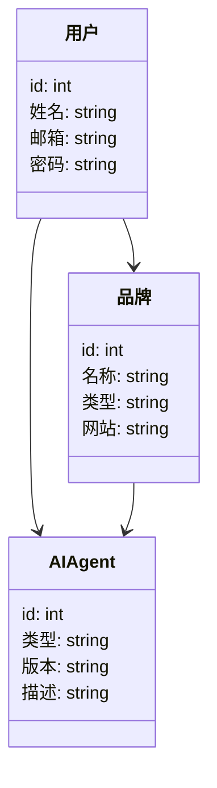
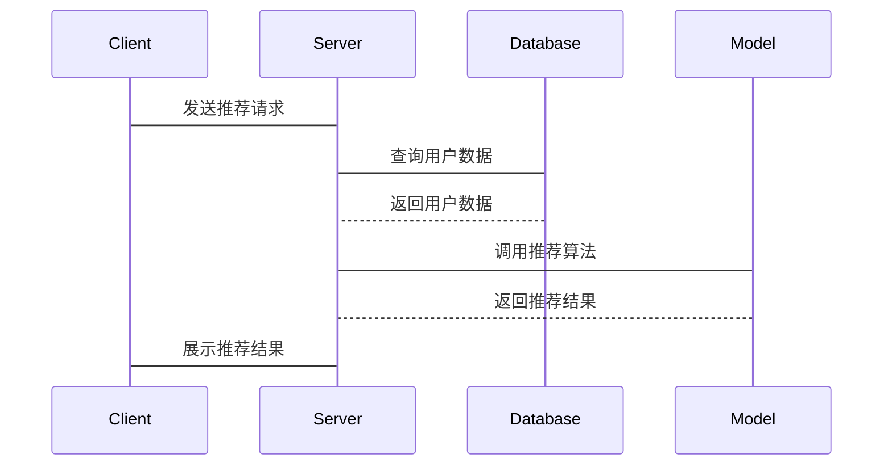

                 


```markdown
# AI Agent在时尚产业中的应用：趋势预测与个性化搭配

> 关键词：AI Agent, 时尚产业, 趋势预测, 个性化搭配, 算法原理, 系统架构

> 摘要：本文探讨了AI Agent在时尚产业中的应用，重点分析了其在趋势预测和个性化搭配中的作用。通过详细的技术分析，展示了AI Agent如何通过数据采集、模型训练和推荐系统实现精准的趋势预测和个性化推荐。文章还介绍了AI Agent的核心原理、算法实现和系统架构，并通过实际案例展示了其在时尚产业中的实际应用价值。

---

# 第一部分: AI Agent与时尚产业的背景介绍

## 第1章: AI Agent与时尚产业概述

### 1.1 AI Agent的基本概念
#### 1.1.1 AI Agent的定义与特点
AI Agent（人工智能代理）是指能够感知环境、做出决策并执行任务的智能体。它通过数据驱动的方法，利用机器学习算法从大量数据中提取有用信息，并基于这些信息进行推理和预测。

#### 1.1.2 AI Agent在时尚产业中的应用背景
时尚产业是一个高度依赖趋势和消费者偏好的行业。传统的趋势预测和个性化搭配方法依赖于经验丰富的设计师和市场分析师，但这种方法效率低下且容易受到主观因素的影响。随着人工智能技术的发展，AI Agent逐渐成为时尚产业的重要工具。

#### 1.1.3 问题背景与问题描述
传统趋势预测方法存在以下问题：
- 数据量大且复杂，难以快速处理。
- 预测结果依赖人工经验，主观性较强。
- 个性化推荐缺乏深度，难以满足消费者的多样化需求。

AI Agent可以通过以下方式解决这些问题：
- 利用大数据分析技术，快速提取趋势信息。
- 基于用户行为数据，实现个性化推荐。
- 通过实时反馈优化推荐结果。

### 1.2 时尚产业中的趋势预测与个性化搭配
#### 1.2.1 传统趋势预测的挑战
传统趋势预测主要依赖市场调研和经验分析，存在以下挑战：
- 数据收集成本高，耗时长。
- 预测结果不够精确，难以满足精准营销的需求。
- 难以实时响应市场变化。

#### 1.2.2 个性化搭配的需求
消费者对个性化体验的需求日益增加，传统的一-size-fits-all推荐方法已无法满足市场需求。个性化搭配需要基于消费者的个人风格、体型、肤色等因素，提供定制化的搭配建议。

#### 1.2.3 AI Agent在其中的作用与边界
AI Agent在趋势预测和个性化搭配中的作用包括：
- 数据采集与分析：通过收集消费者行为数据、社交媒体数据和市场数据，提取趋势信息。
- 模型训练与优化：利用机器学习算法训练推荐模型，优化推荐结果。
- 实时反馈与优化：根据用户反馈实时调整推荐策略，提高推荐精度。

### 1.3 本章小结
本章介绍了AI Agent的基本概念及其在时尚产业中的应用背景，分析了传统趋势预测和个性化搭配的挑战，并提出了AI Agent在其中的作用与边界。

---

# 第二部分: AI Agent的核心概念与联系

## 第2章: AI Agent的核心概念与原理

### 2.1 AI Agent的核心原理
#### 2.1.1 感知模块
感知模块负责从环境中获取信息。在时尚产业中，感知模块主要通过以下方式获取数据：
- 用户行为数据：包括点击、浏览、购买记录等。
- 社交媒体数据：包括用户的社交媒体帖子、评论、点赞等。
- 市场数据：包括潮流趋势、流行色、热门款式等。

#### 2.1.2 决策模块
决策模块基于感知模块获取的信息，利用机器学习算法进行预测和推荐。常见的算法包括：
- 基于协同过滤的推荐算法：通过分析用户行为数据，找到相似的用户或商品，进行推荐。
- 基于深度学习的推荐算法：利用神经网络模型，从数据中提取高层次特征，进行推荐。

#### 2.1.3 执行模块
执行模块负责将决策模块的推荐结果传递给用户或系统。在时尚产业中，执行模块可以是：
- 推荐系统：将推荐结果展示给用户。
- 自动化采购系统：根据推荐结果，自动采购相关商品。

### 2.2 AI Agent在时尚产业中的应用原理
#### 2.2.1 数据采集与处理
AI Agent通过多种渠道采集数据，包括：
- 用户行为数据：通过网站、APP等渠道收集用户的浏览、点击、购买记录。
- 社交媒体数据：通过API接口获取用户的社交媒体帖子、评论、点赞等数据。
- 市场数据：通过爬虫技术获取潮流趋势、流行色、热门款式等数据。

数据采集后，需要进行清洗、预处理和特征提取，为后续的模型训练提供高质量的数据。

#### 2.2.2 模型训练与优化
模型训练是AI Agent的核心环节。常用的算法包括：
- 基于协同过滤的推荐算法：通过分析用户行为数据，找到相似的用户或商品，进行推荐。
- 基于深度学习的推荐算法：利用神经网络模型，从数据中提取高层次特征，进行推荐。
- 时间序列分析：通过分析历史数据，预测未来的趋势。

模型训练后，需要进行调优和测试，确保模型的准确性和稳定性。

#### 2.2.3 推荐与执行
推荐系统将模型的预测结果传递给用户或系统。在时尚产业中，推荐系统可以是：
- 个性化推荐：根据用户的偏好，推荐适合的服装、配饰等。
- 趋势预测：预测未来的流行趋势，帮助品牌制定产品策略。

### 2.3 核心概念对比表
#### 2.3.1 传统趋势预测与AI Agent预测的对比
| 对比维度 | 传统趋势预测 | AI Agent预测 |
|----------|--------------|--------------|
| 数据来源 | 主要依赖市场调研和经验分析 | 利用大数据分析和机器学习算法 |
| 预测精度 | 低，容易受到主观因素影响 | 高，基于大量数据和算法优化 |
| 实时性 | 低，周期长 | 高，可以实时更新和优化 |

#### 2.3.2 传统搭配推荐与AI Agent搭配推荐的对比
| 对比维度 | 传统搭配推荐 | AI Agent搭配推荐 |
|----------|--------------|----------------|
| 推荐依据 | 主要依赖经验丰富的设计师 | 基于用户的个人风格、体型、肤色等因素 |
| 推荐效率 | 低，耗时长 | 高，实时推荐 |
| 推荐效果 | 个性化程度低 | 个性化程度高 |

### 2.4 ER实体关系图
```mermaid
er
actor 用户 {
  id: int
  姓名: string
  邮箱: string
  密码: string
}
actor 品牌 {
  id: int
  名称: string
  类型: string
  网站: string
}
actor AI Agent {
  id: int
  类型: string
  版本: string
  描述: string
}
```

---

# 第三部分: AI Agent的算法原理讲解

## 第3章: AI Agent算法原理

### 3.1 算法概述
AI Agent的核心算法包括：
- 基于协同过滤的推荐算法：通过分析用户行为数据，找到相似的用户或商品，进行推荐。
- 基于深度学习的推荐算法：利用神经网络模型，从数据中提取高层次特征，进行推荐。
- 时间序列分析：通过分析历史数据，预测未来的趋势。

### 3.2 基于深度学习的推荐算法
#### 3.2.1 算法流程


#### 3.2.2 算法实现
以下是基于深度学习的推荐算法的Python代码示例：
```python
import numpy as np
import tensorflow as tf

# 数据预处理
def preprocess_data(data):
    # 数据清洗和特征提取
    pass

# 模型训练
def train_model(X_train, y_train):
    model = tf.keras.Sequential([
        tf.keras.layers.Dense(64, activation='relu'),
        tf.keras.layers.Dense(1, activation='sigmoid')
    ])
    model.compile(optimizer='adam', loss='binary_crossentropy')
    model.fit(X_train, y_train, epochs=10, batch_size=32)
    return model

# 模型预测
def predict(model, X_test):
    y_pred = model.predict(X_test)
    return y_pred
```

#### 3.2.3 算法数学模型
以下是一个简单的深度学习模型的数学公式：
$$
y = \sigma(Wx + b)
$$
其中，$W$ 是权重矩阵，$x$ 是输入数据，$b$ 是偏置项，$\sigma$ 是sigmoid函数。

---

# 第四部分: 系统分析与架构设计方案

## 第4章: 系统分析与架构设计

### 4.1 问题场景介绍
本系统的目标是通过AI Agent实现时尚产业中的趋势预测和个性化搭配。系统需要处理大量的用户行为数据、社交媒体数据和市场数据，利用机器学习算法进行预测和推荐。

### 4.2 项目介绍
本项目旨在开发一个基于AI Agent的时尚产业推荐系统，包括以下功能：
- 数据采集与处理：通过多种渠道采集用户行为数据、社交媒体数据和市场数据。
- 模型训练与优化：利用机器学习算法训练推荐模型，优化推荐结果。
- 推荐与执行：将推荐结果展示给用户或系统。

### 4.3 系统功能设计
#### 4.3.1 领域模型类图


#### 4.3.2 系统架构设计


### 4.4 系统接口设计
#### 4.4.1 接口描述
- 请求推荐接口：用户通过客户端向服务器发送推荐请求。
- 返回推荐结果接口：服务器根据请求，调用模型进行预测，并将结果返回给用户。

#### 4.4.2 交互流程


---

# 第五部分: 项目实战

## 第5章: 项目实战

### 5.1 环境安装
以下是项目所需的环境和工具：
- Python 3.8+
- TensorFlow 2.0+
- Scikit-learn 0.24+
- Mermaid CLI
- VS Code

### 5.2 系统核心实现源代码
#### 5.2.1 数据预处理
```python
import pandas as pd

def preprocess_data(data):
    # 数据清洗
    data = data.dropna()
    # 特征提取
    features = data[['age', 'gender', 'purchase_history']]
    labels = data['preferred_style']
    return features, labels
```

#### 5.2.2 模型训练
```python
from sklearn.neighbors import NearestNeighbors

def train_model(features, labels):
    model = NearestNeighbors(n_neighbors=5, algorithm='brute')
    model.fit(features, labels)
    return model
```

#### 5.2.3 模型预测
```python
def predict(model, features):
    distances, indices = model.kneighbors(features)
    return indices
```

### 5.3 代码应用解读与分析
以上代码展示了如何利用机器学习算法进行个性化推荐。数据预处理部分包括数据清洗和特征提取，模型训练部分使用了NearestNeighbors算法，模型预测部分通过计算最近邻来推荐相似的商品。

### 5.4 实际案例分析
以下是一个实际案例分析：
假设我们有一个用户数据集，包括用户的年龄、性别和购买历史。我们可以通过上述代码对用户进行个性化推荐。

### 5.5 项目小结
本章通过实际案例展示了如何利用AI Agent进行时尚产业中的趋势预测和个性化搭配。通过数据预处理、模型训练和模型预测的步骤，实现了个性化的推荐系统。

---

# 第六部分: 最佳实践与小结

## 第6章: 最佳实践与小结

### 6.1 最佳实践
- 数据质量：确保数据的准确性和完整性，避免噪声数据的影响。
- 模型可解释性：选择可解释性较强的算法，便于分析和优化。
- 数据隐私：在处理用户数据时，注意保护用户隐私，遵守相关法律法规。

### 6.2 小结
本文详细探讨了AI Agent在时尚产业中的应用，重点分析了其在趋势预测和个性化搭配中的作用。通过技术分析和实际案例，展示了AI Agent如何通过数据驱动的方法实现精准的推荐。

### 6.3 注意事项
- 在实际应用中，需要注意数据隐私和模型的实时性。
- 需要定期更新模型，以适应市场变化和用户需求。

### 6.4 拓展阅读
- 《Deep Learning in Action》
- 《Machine Learning for Business》
- 《Fashion Industry Trends Analysis》

---

# 结语
AI Agent正在逐步改变时尚产业的运作方式。通过大数据分析和机器学习算法，AI Agent可以帮助品牌和消费者更好地理解市场需求和用户偏好。未来，随着技术的不断发展，AI Agent在时尚产业中的应用将更加广泛和深入。

---

作者：AI天才研究院/AI Genius Institute & 禅与计算机程序设计艺术 /Zen And The Art of Computer Programming
```

