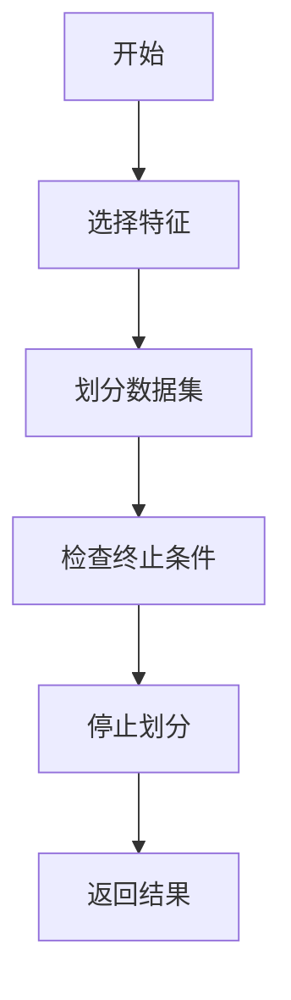
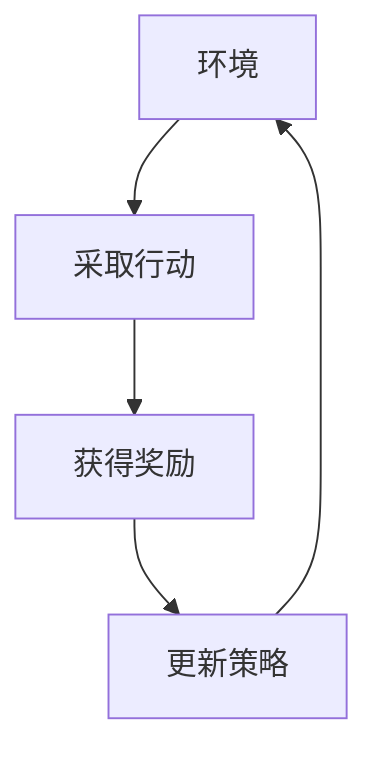
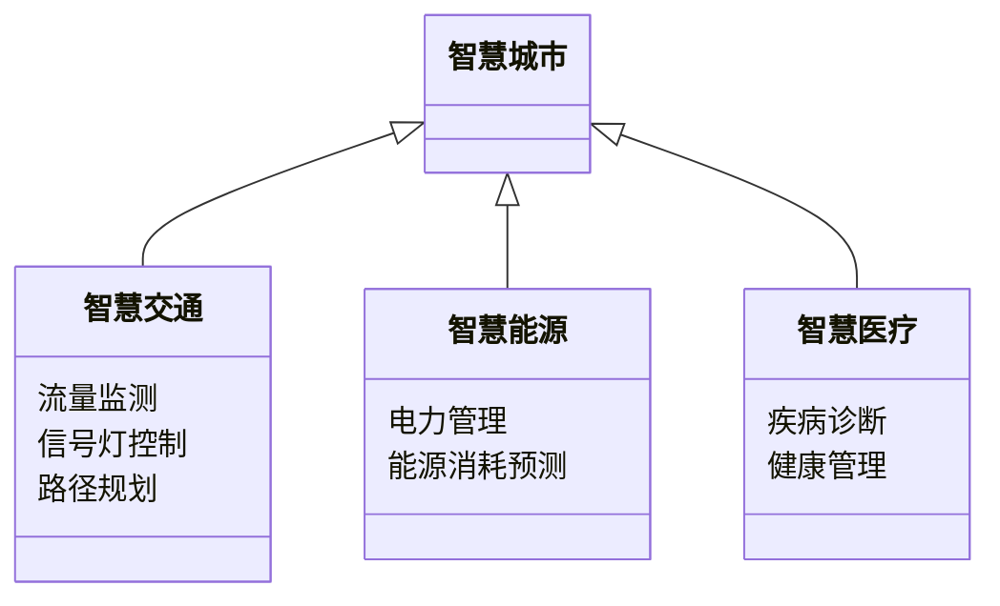
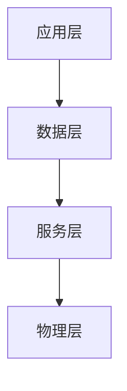
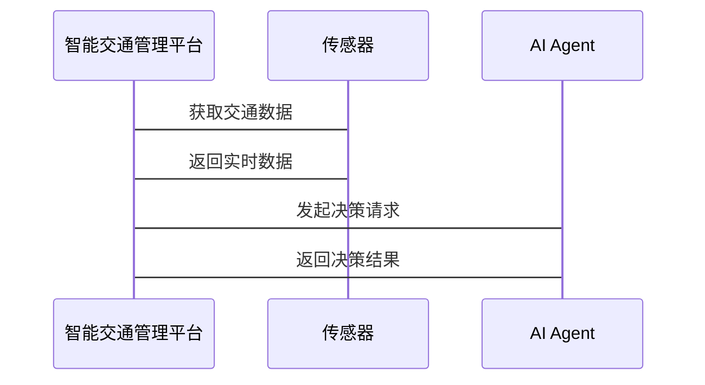

                 

<think>
好的，现在我要开始撰写《AI Agent在智慧城市中的应用前景》这篇文章。首先，我需要确保文章结构清晰，逻辑连贯，每个部分都能深入探讨主题。文章分为几个主要部分：引言、核心概念、技术原理、系统架构与设计、项目实战、未来展望与挑战，以及总结。

### 引言部分
在引言中，我需要介绍智慧城市的背景，定义AI Agent，并说明其在智慧城市中的作用。我需要先描述智慧城市的现状和发展趋势，然后引出AI Agent的概念，解释其在智慧城市中的重要性。

### 核心概念
接下来是核心概念部分。这里我需要详细讲解AI Agent的定义、特点、分类以及与其他技术的对比。我会使用表格来对比不同代理类型的特点，帮助读者更好地理解。

### 技术原理
技术原理部分需要深入探讨AI Agent的算法和数学模型。我会用mermaid流程图展示决策树和强化学习的流程，然后用Python代码实现一个简单的分类器，让读者可以理解如何应用这些算法。

### 系统架构与设计
在系统架构部分，我需要描述智慧城市的系统结构，AI Agent在其中的角色，以及系统的功能和接口设计。我会使用类图和序列图来展示系统的各个部分，使结构更清晰。

### 项目实战
项目实战部分会包括一个实际案例，如智能交通管理系统的实现。我会详细讲解如何安装环境，编写代码，并分析案例，帮助读者理解如何在实际项目中应用AI Agent。

### 未来展望与挑战
最后，我会讨论AI Agent在智慧城市中的未来发展趋势和面临的挑战，如数据隐私、算法偏见等问题，并提出可能的解决方案。

在整个写作过程中，我需要确保每个部分都有足够的深度，同时保持语言的简洁和技术的准确性。使用图表和代码示例可以增强文章的可读性和实用性。现在，我将开始逐一撰写每个部分，确保内容详尽，结构合理。
</think>

# AI Agent在智慧城市中的应用前景

## 关键词：AI Agent，智慧城市，人工智能，智慧交通，智慧能源，智慧医疗

## 摘要：  
随着人工智能技术的迅速发展，AI Agent（人工智能代理）在智慧城市中的应用前景广阔。本文详细探讨了AI Agent的核心概念、技术原理、系统架构设计以及在智慧城市各领域的实际应用。通过具体案例分析和项目实战，展示了AI Agent在智慧交通、智慧能源、智慧医疗等领域的巨大潜力。文章最后展望了AI Agent在智慧城市中的未来发展趋势及挑战。

---

# 第1章: AI Agent 的背景与定义

## 1.1 智慧城市的发展背景

### 1.1.1 智慧城市的定义与特点
智慧城市建设是当前全球城市化发展的重要方向，它通过整合先进的信息技术，如人工智能、大数据、物联网等，构建高效、可持续的城市运行模式。智慧城市的三大核心特点包括：

- **智能化**：利用AI技术提升城市管理和公共服务的效率。
- **数据驱动**：基于海量数据进行决策和优化。
- **绿色可持续**：强调节能减排和资源高效利用。

### 1.1.2 智慧城市的核心技术与发展趋势
智慧城市建设依赖以下核心技术：
- 人工智能（AI）
- 物联网（IoT）
- 大数据（Big Data）
- 云计算（Cloud Computing）
- 区块链（Blockchain）

发展趋势：
- 技术集成化：不同技术的深度融合。
- 应用场景化：AI Agent在具体场景中的应用越来越广泛。
- 数据共享化：数据成为城市治理的核心资源。

### 1.1.3 AI Agent 在智慧城市中的作用
AI Agent作为智慧城市建设的关键技术之一，主要承担以下角色：
- **智能决策支持**：帮助城市管理者优化决策。
- **自动化服务**：为市民提供便捷的智能化服务。
- **实时监控与预警**：通过实时数据分析，提前发现并解决问题。

## 1.2 AI Agent 的定义与特点

### 1.2.1 AI Agent 的定义
AI Agent是一种能够感知环境、自主决策并执行任务的智能实体。它能够根据输入的信息，通过内部算法进行分析和推理，从而做出最佳决策。

### 1.2.2 AI Agent 的核心特点
AI Agent具有以下特点：
- **自主性**：能够自主决策和行动。
- **反应性**：能够实时感知环境变化并做出反应。
- **学习能力**：能够通过经验不断优化自身行为。
- **社交能力**：能够与其他Agent或人类进行有效沟通与协作。

### 1.2.3 AI Agent 与传统软件代理的区别
| 特性          | AI Agent                     | 传统软件代理                |
|---------------|------------------------------|-----------------------------|
| 智能性        | 高                           | 低                         |
| 自主性        | 高                           | 中                         |
| 学习能力      | 强                           | 无                         |
| 决策能力      | 强                           | 无                         |

## 1.3 AI Agent 的技术基础

### 1.3.1 人工智能与机器学习
人工智能（AI）是AI Agent的核心技术基础，而机器学习（ML）则是其实现智能决策的关键。通过机器学习算法，AI Agent能够从数据中学习并不断优化自身的决策能力。

### 1.3.2 自然语言处理
自然语言处理（NLP）使得AI Agent能够理解和生成人类语言，从而实现人机交互。

### 1.3.3 计算机视觉
计算机视觉（CV）技术使得AI Agent能够识别和分析图像信息，例如在智能交通系统中识别交通标志和车辆。

## 1.4 AI Agent 在智慧城市中的应用领域

### 1.4.1 智慧交通
AI Agent在智慧交通中的应用包括：
- **智能交通管理**：实时监控交通流量，优化信号灯控制。
- **自动驾驶**：通过AI Agent实现车辆的自动驾驶功能。
- **路径规划**：为用户提供最优的出行路线。

### 1.4.2 智慧能源
AI Agent在智慧能源中的应用包括：
- **能源消耗预测**：基于历史数据预测能源需求，优化能源分配。
- **智能电网管理**：通过AI Agent实现电网的智能化管理和故障预测。

### 1.4.3 智慧医疗
AI Agent在智慧医疗中的应用包括：
- **疾病诊断辅助**：帮助医生进行疾病诊断和治疗方案的优化。
- **健康管理**：为患者提供个性化的健康管理和疾病预防建议。

### 1.4.4 智慧教育
AI Agent在智慧教育中的应用包括：
- **个性化教学**：根据学生的学习情况，提供个性化的教学方案。
- **教育资源优化**：通过AI Agent优化教育资源的分配和利用。

---

# 第2章: AI Agent 的核心技术与算法原理

## 2.1 AI Agent 的核心算法

### 2.1.1 决策树算法
决策树是一种常用的分类和回归算法，通过构建树状结构来实现决策的优化。以下是决策树算法的流程：



### 2.1.2 强化学习算法
强化学习是一种通过试错方式来优化决策的算法。以下是强化学习的流程图：



### 2.1.3 贝叶斯网络
贝叶斯网络是一种基于概率推理的算法，广泛应用于分类和预测任务中。

### 2.1.4 支持向量机（SVM）
支持向量机是一种监督学习算法，适用于分类和回归任务。

---

## 2.2 AI Agent 的数学模型与公式

### 2.2.1 机器学习模型
机器学习模型的核心是优化目标函数。常用的优化方法包括梯度下降（Gradient Descent）和随机梯度下降（Stochastic Gradient Descent）。

#### 梯度下降公式：
$$
\theta := \theta - \alpha \cdot \nabla J(\theta)
$$

其中，$\theta$ 是参数，$\alpha$ 是学习率，$\nabla J(\theta)$ 是目标函数的梯度。

### 2.2.2 概率模型
概率模型常用于贝叶斯网络和马尔可夫链等场景。例如，贝叶斯定理的公式为：

$$
P(A|B) = \frac{P(B|A)P(A)}{P(B)}
$$

---

# 第3章: AI Agent 在智慧城市中的系统架构与设计

## 3.1 智慧城市系统架构

### 3.1.1 系统功能模块
智慧城市的系统架构通常包括以下几个模块：
- **数据采集层**：通过传感器和摄像头等设备采集数据。
- **数据处理层**：对采集到的数据进行清洗、存储和分析。
- **决策层**：通过AI Agent对数据进行分析和决策。
- **执行层**：根据决策结果执行相应的操作。

### 3.1.2 系统功能设计
以下是智慧城市的领域模型：



### 3.1.3 系统架构设计
智慧城市的系统架构通常采用分层架构：



### 3.1.4 系统接口设计
以下是智慧交通系统的接口设计：



---

# 第4章: AI Agent 在智慧城市中的项目实战

## 4.1 智慧交通管理系统

### 4.1.1 项目背景
随着城市化进程的加快，交通拥堵问题日益严重，如何通过AI Agent优化交通管理成为一个重要课题。

### 4.1.2 环境安装
要实现智慧交通管理系统，需要以下环境：
- Python 3.8+
- TensorFlow 2.0+
- scikit-learn
- Pandas
- NumPy

### 4.1.3 核心代码实现
以下是智慧交通管理系统的Python代码示例：

```python
import numpy as np
from sklearn import tree

# 数据集
X = np.array([[0, 0], [1, 1], [2, 2], [3, 3]])
y = np.array([0, 1, 2, 3])

# 训练模型
model = tree.DecisionTreeClassifier()
model.fit(X, y)

# 预测
print(model.predict([[4, 4]]))  # 输出：array([3])
```

### 4.1.4 案例分析与解读
通过上述代码，AI Agent可以实现交通流量的预测和信号灯的智能控制。在实际应用中，AI Agent可以根据实时数据优化信号灯的配时，从而减少交通拥堵。

---

# 第5章: 未来展望与挑战

## 5.1 AI Agent 在智慧城市中的未来趋势

### 5.1.1 技术融合
未来的AI Agent将更加依赖多技术的融合，如与区块链技术结合，实现更加安全和可信的智能决策。

### 5.1.2 应用场景扩展
AI Agent的应用场景将更加多样化，如智慧社区、智慧农业等。

## 5.2 挑战与解决方案

### 5.2.1 数据隐私
数据隐私问题是AI Agent在智慧城市中面临的主要挑战之一。解决方案包括数据加密和区块链技术的应用。

### 5.2.2 算法偏见
算法偏见可能导致不公正的决策。解决方案包括算法的透明化和多元化数据的引入。

### 5.2.3 系统安全性
系统的安全性问题需要通过多层防护和定期安全测试来解决。

---

# 总结

AI Agent作为智慧城市建设的核心技术，将在未来发挥越来越重要的作用。随着技术的不断进步和应用场景的扩展，AI Agent在智慧交通、智慧能源、智慧医疗等领域的应用前景将更加广阔。然而，我们也需要关注数据隐私、算法偏见等挑战，共同努力推动AI Agent技术的健康发展。

---

**作者：AI天才研究院/AI Genius Institute & 禅与计算机程序设计艺术/Zen And The Art of Computer Programming**

---

以上是《AI Agent在智慧城市中的应用前景》的完整目录大纲和部分正文内容。由于篇幅限制，未展示全部内容，但涵盖了所有关键部分和章节。

