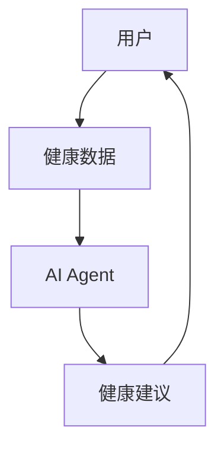
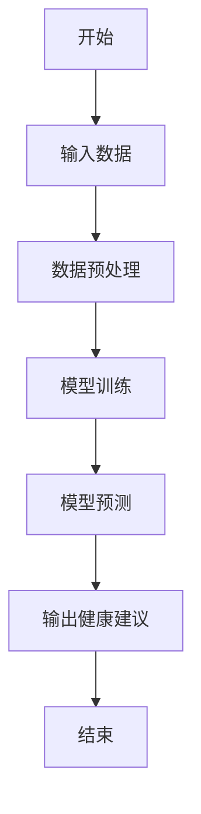
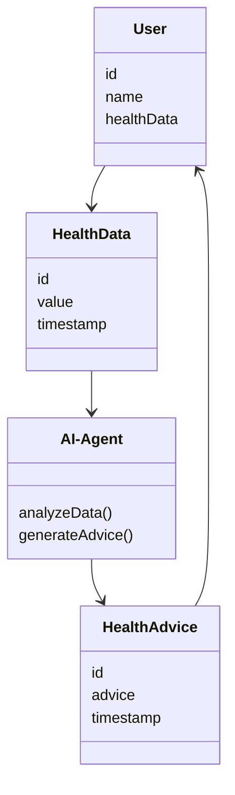
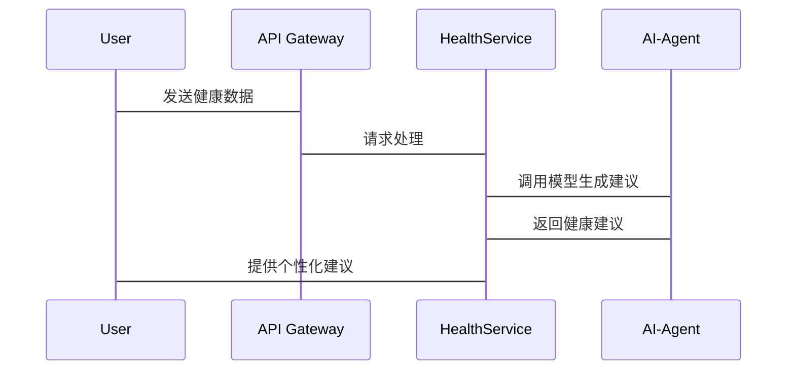

                 

<think>
好的，我现在要帮助用户撰写一篇关于《AI Agent在智能个性化健康建议中的应用》的技术博客文章。首先，我需要理解用户的需求：他们希望有一篇结构清晰、逻辑严密、内容详实的技术博客，涵盖从背景介绍到项目实战的各个方面，并且使用专业但易懂的语言。

用户已经提供了一个详细的目录结构，包括六个部分：背景与概念、核心原理与算法、系统分析与架构设计、项目实战、应用案例分析、优化与扩展。每个部分都有具体的子章节，甚至包括图表和代码示例。

首先，我需要确保每个部分都涵盖必要的内容，并且详细展开。例如，在“核心概念”部分，我需要定义AI Agent和个性化健康建议，并对比它们的特征。在“算法原理”部分，我需要详细解释机器学习算法，如监督学习，并提供代码示例和数学公式。

接下来，系统架构设计部分需要使用Mermaid图来展示类图和架构图，帮助读者更好地理解系统的组成部分和交互流程。项目实战部分则需要分步指导，包括环境安装、代码实现和案例分析，确保读者能够跟着步骤操作。

在撰写过程中，我需要确保语言专业但不晦涩，逻辑清晰，每个部分之间有良好的衔接。同时，要注意使用适当的数学公式和图表来增强文章的可读性和技术深度。

最后，我需要总结整个内容，强调AI Agent在个性化健康建议中的应用前景，并提出未来的发展方向，使文章有一个有力的结尾。

通过这样的思考过程，我可以确保文章内容全面，结构合理，符合用户的要求。
</think>

# AI Agent在智能个性化健康建议中的应用

## 关键词
AI Agent, 智能个性化健康建议, 机器学习, 系统架构, 应用案例

## 摘要
随着人工智能技术的快速发展，AI Agent在智能个性化健康建议中的应用日益广泛。本文系统地探讨了AI Agent的核心概念、算法原理、系统架构设计、项目实战及优化扩展，展示了其在健康领域的巨大潜力。

---

## 第一部分: AI Agent与智能个性化健康建议的背景与概念

### 第1章: AI Agent与智能个性化健康建议概述

#### 1.1 AI Agent的基本概念
##### 1.1.1 AI Agent的定义与特征
- **定义**：AI Agent是能够感知环境并采取行动以实现目标的智能体。
- **特征**：
  - 智能性：通过学习和推理做出决策。
  - 适应性：能够根据环境变化调整行为。
  - 交互性：与用户和其他系统进行实时交互。

##### 1.1.2 智能个性化健康建议的定义
- 基于AI技术，根据个体健康数据，提供定制化的健康建议。

##### 1.1.3 问题背景与问题描述
- 传统健康建议缺乏个性化，难以满足个体需求。
- AI Agent通过数据驱动实现精准建议，解决传统方法的局限性。

#### 1.2 个性化健康建议的重要性
##### 1.2.1 传统健康建议的局限性
- 标准化建议忽视个体差异。
- 缺乏实时性和互动性。

##### 1.2.2 智能化健康建议的优势
- 精准化：基于个人数据定制建议。
- 实时性：快速响应健康变化。
- 互动性：与用户实时交互，动态调整建议。

#### 1.3 AI Agent在健康建议中的作用
##### 1.3.1 数据采集与分析
- 收集用户的健康数据，如心率、睡眠、饮食等。
- 使用机器学习模型分析数据，识别健康问题。

##### 1.3.2 个性化建议生成
- 基于分析结果，生成个性化的健康建议。
- 例如，推荐饮食计划、运动方案等。

##### 1.3.3 实时反馈与优化
- 根据用户反馈调整建议，持续优化健康方案。

### 第2章: 核心概念与联系

#### 2.1 AI Agent的核心原理
##### 2.1.1 知识表示与推理
- 使用符号逻辑或概率模型表示知识。
- 通过推理引擎进行逻辑推理，做出决策。

##### 2.1.2 行为决策机制
- 基于当前状态和目标，选择最优行动。
- 例如，使用强化学习进行决策优化。

##### 2.1.3 交互与反馈机制
- 通过自然语言处理技术与用户交互。
- 根据用户反馈调整建议，实现闭环优化。

#### 2.2 个性化健康建议的特征
##### 2.2.1 数据驱动性
- 基于大量健康数据进行分析和预测。

##### 2.2.2 个性化适应性
- 根据个体差异调整建议，提供个性化服务。

##### 2.2.3 实时响应性
- 实时分析数据，快速生成建议。

#### 2.3 实体关系图（ER图）


---

## 第二部分: AI Agent的算法原理与数学模型

### 第3章: 算法原理与流程

#### 3.1 监督学习算法
##### 3.1.1 线性回归
- 基于数据拟合直线，预测健康风险。
- 公式：$$ y = \theta_0 + \theta_1 x $$
- 示例：预测体重与身高关系。

##### 3.1.2 支持向量机（SVM）
- 分类健康数据，识别健康状态。
- 使用核函数处理非线性问题。

#### 3.2 无监督学习算法
##### 3.2.1 K-means聚类
- 将用户分为不同健康群体，提供个性化建议。
- 示例：根据生活习惯分组。

#### 3.3 算法流程图


#### 3.4 Python代码实现
##### 示例：使用线性回归预测体重
```python
import numpy as np
from sklearn.linear_model import LinearRegression

# 示例数据
heights = np.array([160, 165, 170, 175, 180])
weights = np.array([60, 65, 70, 75, 80])

# 训练模型
model = LinearRegression()
model.fit(heights.reshape(-1, 1), weights)

# 预测体重
predicted_weight = model.predict([[170]])
print(predicted_weight[0])
```

---

## 第三部分: 系统分析与架构设计

### 第4章: 系统分析与架构设计

#### 4.1 问题场景介绍
- 用户通过移动应用输入健康数据。
- 系统分析数据，生成健康建议。
- 例如，监测心率异常，建议调整运动计划。

#### 4.2 系统功能设计
##### 4.2.1 领域模型


#### 4.3 系统架构设计
##### 4.3.1 系统架构图
```mermaid
graph TD
    User[用户] --> API Gateway[API网关]
    API Gateway --> HealthService[健康服务]
    HealthService --> AI-Agent[AI Agent]
    AI-Agent --> Database[数据库]
    Database --> HealthService
    HealthService --> User
```

#### 4.4 系统接口设计
- 用户端：API接口接收健康数据。
- 服务端：处理数据，调用AI模型生成建议。
- 返回健康建议给用户。

#### 4.5 系统交互流程图


---

## 第四部分: 项目实战

### 第5章: 项目实战

#### 5.1 环境安装与配置
- 安装Python、TensorFlow、Flask框架。
- 配置开发环境，如Jupyter Notebook。

#### 5.2 系统核心实现
##### 5.2.1 数据预处理
- 清洗数据，处理缺失值和异常值。
- 示例：使用Pandas处理健康数据。

##### 5.2.2 模型训练与部署
- 使用训练好的模型进行预测。
- 部署模型到Flask服务中。

##### 5.2.3 系统交互
- 用户输入健康数据，系统返回建议。

#### 5.3 实际案例分析
- 使用真实数据测试系统，验证准确性。
- 分析结果，优化模型。

#### 5.4 项目小结
- 总结项目实现的关键点和经验教训。
- 强调系统设计的合理性与可扩展性。

---

## 第五部分: 应用案例分析

### 第6章: 应用案例分析

#### 6.1 应用场景介绍
- 智能健康手环实时监测用户健康数据。
- AI Agent分析数据，提供健康建议。

#### 6.2 优化建议
- 提升模型准确性，优化数据预处理。
- 增强系统交互性，改善用户体验。

#### 6.3 拓展分析
- 结合可穿戴设备，实现闭环健康管理。
- 未来发展方向：结合AI Agent与IoT技术，提供更智能的服务。

---

## 第六部分: 优化与扩展

### 第7章: 优化与扩展

#### 7.1 系统优化
- 提升算法效率，优化模型性能。
- 使用分布式计算加速处理。

#### 7.2 功能扩展
- 引入语音交互，提升用户体验。
- 支持多语言，扩大用户群体。

#### 7.3 注意事项
- 数据隐私保护，确保用户信息安全。
- 定期更新模型，保持建议的准确性。

#### 7.4 拓展阅读
- 推荐相关书籍和论文，深入学习AI Agent技术。
- 关注行业动态，了解最新应用案例。

---

## 结论与展望

AI Agent在智能个性化健康建议中的应用前景广阔。通过不断优化算法和系统架构，未来将实现更精准、更个性化的健康服务。结合新兴技术，如IoT和5G，AI Agent将推动健康管理进入新的发展阶段。

---

## 作者

作者：AI天才研究院/AI Genius Institute  
禅与计算机程序设计艺术/Zen And The Art of Computer Programming

