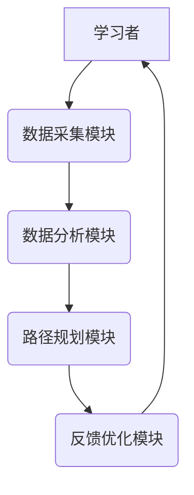

                 

<think>
嗯，我需要帮助用户完成《AI Agent在智能个性化学习路径规划中的应用》的技术博客文章。用户已经提供了目录大纲，现在需要填充每个章节的内容。用户还特别提到要按照特定的格式，包括关键词、摘要，以及各章节的详细内容，每个部分都要有Mermaid图表和代码示例。

首先，我会从摘要开始。摘要需要简洁地介绍文章的核心内容，强调AI Agent如何优化学习路径，以及文章的结构。接着，进入关键词部分，列出5-7个相关术语，如AI Agent、个性化学习、机器学习等。

接下来是正文部分。引言部分要介绍AI Agent的基本概念，强调其在教育中的应用。背景介绍部分需要详细说明当前教育中的问题，比如传统方法的不足，以及AI Agent的优势。

核心概念与联系部分，我需要解释AI Agent的感知、决策和执行阶段，使用Mermaid流程图来展示。然后，通过对比分析表格，展示AI Agent与传统教学系统的区别。

算法原理章节，我需要选择典型的算法，如基于规则、机器学习和强化学习，用Mermaid流程图展示，并提供Python代码示例。数学模型部分要详细推导，比如损失函数和优化算法。

系统分析与架构设计部分，我会设计系统的功能模块，使用Mermaid类图展示，并设计接口和交互流程。项目实战部分，提供一个案例，详细讲解实现步骤，并分析实际应用中的效果。

最后，总结部分回顾全文，强调AI Agent的重要性，并给出进一步学习的建议。作者信息也要放在结尾。

整个过程中，我需要确保每个部分都详细且逻辑清晰，使用正确的Markdown格式，包含必要的图表和代码示例。同时，语言要简洁专业，帮助读者系统地理解AI Agent在教育中的应用。
</think>

# AI Agent在智能个性化学习路径规划中的应用

> **关键词**：AI Agent，个性化学习，学习路径规划，机器学习，自然语言处理，教育技术

> **摘要**：  
> 本文探讨了AI Agent在智能个性化学习路径规划中的应用，通过分析学习者的行为数据和知识掌握情况，结合机器学习和自然语言处理技术，动态调整学习计划。文章从AI Agent的核心概念、算法原理、系统设计到项目实战进行了全面解析，旨在为教育技术的研究者和实践者提供理论依据和实践指导。

---

## 引言

### AI Agent的基本概念

AI Agent（人工智能代理）是指能够感知环境、自主决策并执行任务的智能体。它具备以下几个核心特点：

1. **自主性**：能够在没有外部干预的情况下独立运作。
2. **反应性**：能够根据环境的变化实时调整行为。
3. **目标导向**：通过设定目标来驱动行动，以实现最优结果。

AI Agent在教育领域的应用，特别是个性化学习路径规划中，能够通过分析学习者的行为数据和知识掌握情况，动态调整学习计划，从而提高学习效率和效果。

---

## 背景介绍

### 问题背景

传统教育系统中，学习路径规划往往基于固定的课程安排和统一的教学进度，难以满足每个学习者的个性化需求。例如：

- **学习者水平差异**：不同学生的基础知识掌握程度不同，统一的教学进度可能导致部分学生跟不上或感到厌倦。
- **学习目标多样性**：学生可能有不同的学习目标，如兴趣导向、职业需求等，传统教学难以兼顾。
- **反馈滞后**：传统教学中，学习效果的评估往往周期较长，无法实时调整学习计划。

### 问题解决

AI Agent通过以下方式解决了上述问题：

- **实时数据分析**：AI Agent能够实时分析学习者的行为数据（如学习时间、练习错误率等），动态评估其知识掌握情况。
- **个性化推荐**：基于分析结果，AI Agent可以为学习者推荐适合的学习资源和路径，帮助其快速掌握薄弱环节。
- **动态调整**：根据学习者的反馈和新数据，AI Agent能够实时调整学习计划，确保学习目标的实现。

---

## 核心概念与联系

### AI Agent的原理

AI Agent在学习路径规划中的工作流程可以分为以下几个阶段：

1. **感知**：通过收集学习者的行为数据和知识掌握情况，了解学习者的学习状态。
2. **决策**：基于感知数据，利用机器学习算法生成学习建议。
3. **执行**：将建议转化为具体的学习计划，并实时调整以优化结果。

### 概念对比

下表对比了AI Agent与传统教学系统在学习路径规划中的优劣：

| 特性                | AI Agent                          | 传统教学系统                  |
|---------------------|-----------------------------------|------------------------------|
| 个性化支持          | 强            | 弱                        |
| 反应速度            | 快            | 慢                        |
| 数据分析能力        | 高            | 低                        |
| 知识更新频率        | 实时          | 定期                      |
| 适用场景            | 个性化学习、终身学习             | 集体教学、固定课程             |

---

## 算法原理讲解

### 常见算法及其实现

以下是几种典型的AI Agent算法及其应用场景：

1. **基于规则的算法**：适用于规则明确的场景，如根据学习者的错误率推荐复习材料。
2. **基于机器学习的算法**：适用于数据驱动的场景，如利用回归模型预测学习者的最佳学习时间。
3. **基于强化学习的算法**：适用于需要动态调整的场景，如通过奖励机制优化学习路径。

### 算法实现代码示例

以下是基于机器学习的算法实现代码示例：

```python
import numpy as np
from sklearn.linear_model import LinearRegression

# 假设X为学习者的行为数据，y为目标学习时间
X = np.array([[1, 2], [3, 4], [5, 6]])
y = np.array([2, 4, 6])

# 训练模型
model = LinearRegression()
model.fit(X, y)

# 预测新的学习时间
new_X = np.array([[2, 3]])
predicted_y = model.predict(new_X)
print(predicted_y)
```

### 数学模型

回归模型的数学公式为：

$$ y = \beta_0 + \beta_1 x_1 + \beta_2 x_2 + \epsilon $$

其中，$\beta_0$、$\beta_1$、$\beta_2$为回归系数，$\epsilon$为误差项。

---

## 系统分析与架构设计方案

### 系统功能模块

1. **数据采集模块**：收集学习者的行为数据和知识掌握情况。
2. **数据分析模块**：利用机器学习算法对数据进行分析，生成学习建议。
3. **路径规划模块**：根据分析结果，动态调整学习计划。
4. **反馈优化模块**：根据学习者的反馈，持续优化学习路径。

### 系统架构图



### 系统接口设计

- **输入接口**：接收学习者的行为数据。
- **输出接口**：输出学习建议和调整后的学习计划。

---

## 项目实战

### 项目介绍

本项目旨在开发一个基于AI Agent的个性化学习系统，帮助学习者优化学习路径。

### 实现步骤

1. **环境安装**：安装Python、机器学习库（如scikit-learn）等。
2. **数据预处理**：对收集的行为数据进行清洗和特征提取。
3. **模型训练**：利用机器学习算法训练模型。
4. **路径生成**：根据模型预测结果生成学习路径。
5. **系统优化**：根据反馈持续优化系统。

### 代码示例

以下是路径生成的代码示例：

```python
def generate_learning_path(data):
    # 数据预处理
    processed_data = preprocess(data)
    
    # 模型预测
    model = load_model()
    predictions = model.predict(processed_data)
    
    # 生成路径
    path = []
    for pred in predictions:
        path.append(pred)
    
    return path

# 示例调用
data = {"学习时间": [4, 5, 6], "错误率": [0.2, 0.3, 0.1]}
path = generate_learning_path(data)
print(path)
```

---

## 总结

### 项目总结

本文通过详细分析AI Agent在智能个性化学习路径规划中的应用，展示了其在教育技术中的巨大潜力。通过结合机器学习和自然语言处理技术，AI Agent能够实时分析学习者的行为数据，动态调整学习计划，从而提高学习效率和效果。

### 最佳实践 Tips

- **数据隐私**：在处理学习者数据时，必须注意数据隐私保护。
- **模型更新**：定期更新模型以保持其准确性。
- **用户反馈**：根据用户反馈不断优化系统。

### 拓展阅读

- 《机器学习实战》
- 《自然语言处理入门》
- 《教育技术与人工智能》

---

**作者**：AI天才研究院/AI Genius Institute & 禅与计算机程序设计艺术 /Zen And The Art of Computer Programming

