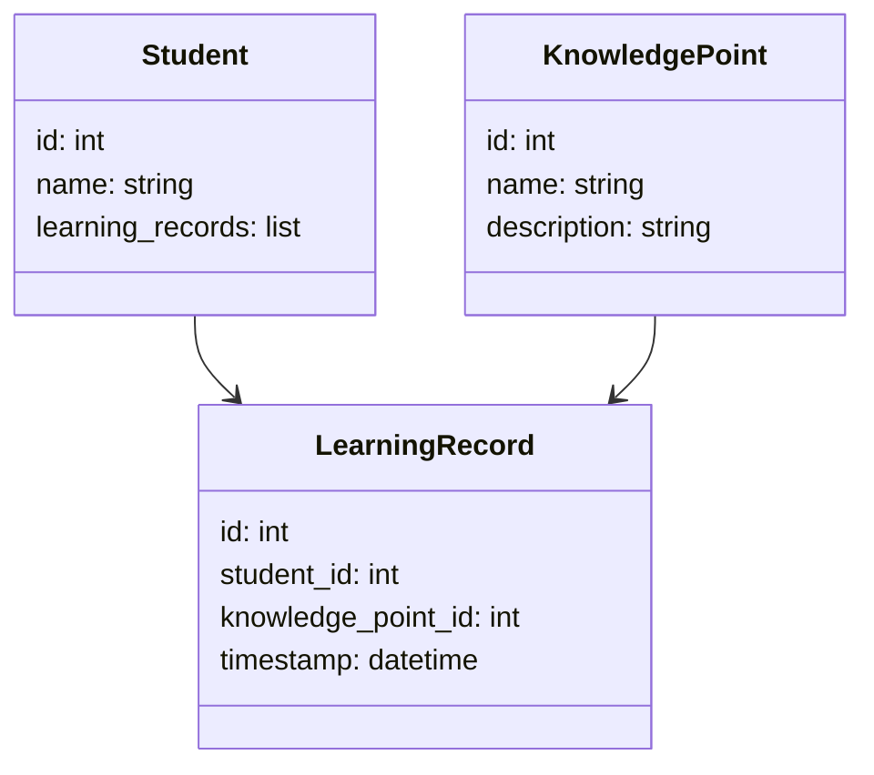
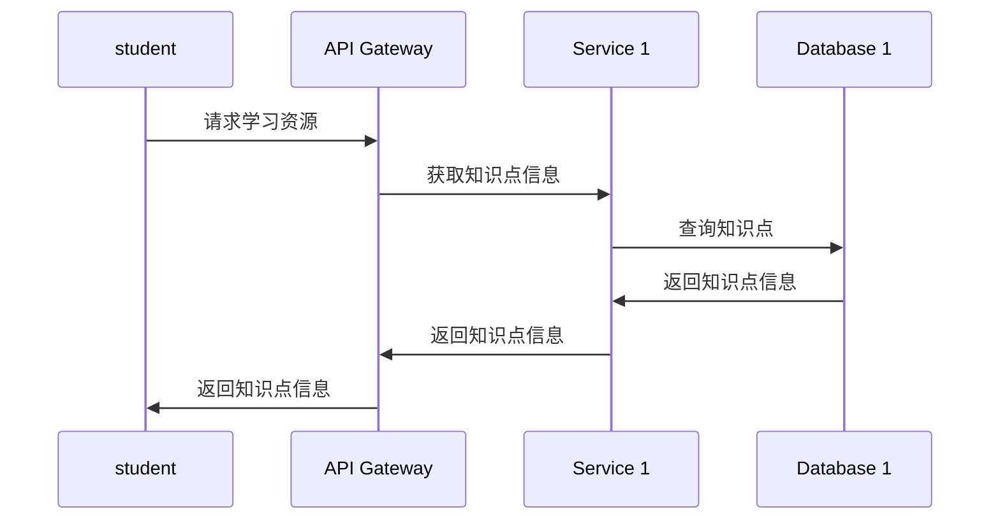

                 

<think>
嗯，用户希望我根据他们提供的目录大纲撰写一篇关于AI Agent在智能个性化教育中的应用的详细技术博客文章。他们已经提供了详细的目录结构，包括各个章节的具体内容，甚至给出了每个部分应该包含的元素，比如背景介绍、核心概念、算法原理、系统架构、项目实战和总结。

我首先需要确定文章的结构是否合理，是否覆盖了所有必要的部分。看起来用户已经考虑得很全面，但可能在一些细节上还需要进一步扩展，比如在算法部分是否需要更详细的解释，或者系统架构是否需要更多的图表来辅助说明。

接下来，我要考虑每个章节的具体内容。例如，在背景部分，需要解释AI Agent的基本概念，以及它们在教育中的应用背景。这部分可能需要一些例子来帮助读者更好地理解。用户已经提到要使用对比表格和ER图，这有助于清晰地展示概念之间的关系。

在算法原理部分，用户提到了多智能体协作、强化学习和知识图谱构建。我需要确保每个算法都有详细的流程图和代码示例。例如，在强化学习部分，可以使用Q-learning算法，并展示其数学公式，同时提供Python代码示例，这样读者可以更好地理解和应用这些算法。

系统架构部分需要设计一个教育平台，包括前端、后端、数据库和AI引擎。这里可能需要使用Mermaid图来展示系统的结构和交互流程。同时，接口设计部分需要详细说明各个模块之间的接口，确保系统能够协同工作。

项目实战部分需要一个具体的案例，比如智能辅导系统。我需要详细描述环境配置、核心代码实现，并提供实际案例的分析和结果。这不仅帮助读者理解理论，还能让他们看到实际应用的效果。

最后，总结部分需要回顾主要内容，并给出一些最佳实践的建议，比如数据隐私保护和算法可解释性的重要性。这些建议对读者在实际应用中避免常见错误非常有帮助。

我还需要确保整个文章的逻辑清晰，结构紧凑，语言专业但易于理解。同时，遵守用户的要求，使用markdown格式，并在适当的地方插入图表和代码示例。这样，读者不仅能理解理论，还能学习到实际操作的方法。

总的来说，我需要一步步按照用户的目录大纲，逐步扩展每个部分的内容，确保每个章节都详尽且有深度，同时保持整体的连贯性和可读性。
</think>

# AI Agent在智能个性化教育中的应用

> **关键词**：AI Agent，智能个性化教育，知识图谱，强化学习，多智能体协作

> **摘要**：本文探讨AI Agent在智能个性化教育中的应用，从背景、原理、算法、系统架构到项目实战，全面分析其在教育领域的潜力与实现方式。通过多智能体协作、强化学习和知识图谱构建等技术，结合实际案例，为教育领域的智能化转型提供深度见解。

---

# 第一部分: AI Agent与智能个性化教育的背景与概念

---

## 第1章: AI Agent的基本概念与教育应用背景

### 1.1 AI Agent的定义与核心特征

#### 1.1.1 AI Agent的基本定义
AI Agent（人工智能代理）是指能够感知环境、自主决策并执行任务的智能体。它通过传感器获取信息，利用推理机制进行分析，并通过执行器与环境交互。AI Agent的核心在于其自主性和智能性，能够根据任务需求动态调整行为。

#### 1.1.2 AI Agent的核心特征
| 特征维度 | 描述 |
|----------|------|
| 自主性    | 能够独立完成任务，无需外部干预 |
| 反应性    | 能够实时感知环境并做出反应 |
| 智能性    | 具备学习、推理和决策能力 |
| 适应性    | 能够根据环境变化动态调整行为 |

#### 1.1.3 AI Agent与传统教育技术的区别
传统教育技术（如教学软件、在线学习平台）通常基于固定的规则和流程，难以根据学生个体需求进行实时调整。而AI Agent能够通过动态学习和自适应算法，为每个学生提供个性化支持。

---

### 1.2 智能个性化教育的背景与需求

#### 1.2.1 个性化教育的定义与目标
个性化教育是指根据学生的兴趣、能力、学习风格和认知特点，提供定制化的教学方案。其目标是最大化每个学生的学习效果，同时满足多样化的学习需求。

#### 1.2.2 当前教育中的问题与挑战
- **学习效率低**：传统教学模式难以兼顾个体差异。
- **资源浪费**：教师精力有限，难以覆盖所有学生。
- **反馈延迟**：学生在学习中遇到的问题无法及时解决。
- **个性化不足**：现有技术难以实现真正的个性化教学。

#### 1.2.3 AI Agent在个性化教育中的潜在价值
AI Agent能够通过实时数据采集、智能分析和动态调整，为学生提供个性化的学习支持。例如：
- 根据学生的学习进度自动调整教学内容。
- 提供实时反馈，帮助学生及时解决问题。
- 通过知识图谱分析，发现学生的学习盲点。

---

### 1.3 AI Agent在教育领域的应用现状

#### 1.3.1 国内外研究现状
- **国外**：AI Agent在教育领域的研究较为成熟，尤其是在美国和欧洲，已有多个基于AI Agent的教育平台投入使用。
- **国内**：近年来，中国在AI教育领域的研究和应用也取得了显著进展，特别是在智能化学习助手和自适应学习系统方面。

#### 1.3.2 已有应用案例分析
- **智能辅导系统**：例如，某些教育平台通过AI Agent分析学生的学习数据，提供个性化的练习题和学习建议。
- **虚拟教育助手**：通过自然语言处理技术，为学生提供实时答疑和学习指导。

#### 1.3.3 当前应用中的主要问题
- **数据隐私**：学生数据的采集和使用需要符合隐私保护法规。
- **技术瓶颈**：AI Agent的实时性和准确性仍需进一步提升。
- **用户体验**：部分AI Agent系统在交互设计上存在不足，影响用户体验。

---

### 1.4 本章小结
本章从AI Agent的基本概念出发，分析了其在教育领域的背景与需求，并探讨了当前的应用现状和主要问题。通过对比传统教育技术，突出了AI Agent在个性化教育中的独特价值。

---

## 第2章: AI Agent的核心原理

### 2.1 AI Agent的感知模块

#### 2.1.1 数据采集与处理
AI Agent通过多种传感器采集学生的学习数据，包括：
- **学习行为数据**：如学生的点击、输入、停留时间等。
- **文本数据**：如学生的提问、作业内容等。
- **语音数据**：如学生的朗读、对话录音等。

#### 2.1.2 用户行为分析
通过机器学习算法对采集的数据进行分析，识别学生的学习模式和偏好。例如：
- **聚类分析**：将学生分为不同的学习群体。
- **分类算法**：预测学生的学习状态（如是否需要帮助）。

#### 2.1.3 知识图谱构建
知识图谱是AI Agent的核心知识库，用于存储和表示知识之间的关系。例如：
- **知识点之间的关系**：如“数学中的加法”是“算术运算”的子知识点。
- **学生与知识点的关系**：如学生A擅长“几何”，但对“代数”较弱。

---

### 2.2 AI Agent的决策模块

#### 2.2.1 知识推理与逻辑分析
AI Agent通过知识图谱进行推理，确定最优的教学策略。例如：
- **推理规则**：如果学生在“代数”知识点上表现不佳，则推荐相关练习题。

#### 2.2.2 多目标优化算法
在个性化教育中，AI Agent需要同时优化多个目标，如：
- 提高学生的学习效果。
- 减少学习时间。
- 提高教学资源的利用率。

#### 2.2.3 动态调整机制
AI Agent能够根据实时反馈动态调整教学策略。例如：
- 如果学生在某个知识点上表现出困难，AI Agent会增加该知识点的练习题数量。

---

### 2.3 AI Agent的执行模块

#### 2.3.1 自动化推荐系统
AI Agent根据学生的学习数据和知识图谱，推荐个性化的学习资源。例如：
- 推荐适合学生当前水平的练习题。
- 推荐相关的教学视频或文档。

#### 2.3.2 个性化反馈机制
AI Agent能够为学生提供实时反馈，帮助其快速改进。例如：
- 在学生完成练习题后，立即给出正确答案和解析。
- 根据学生的反馈调整教学内容。

#### 2.3.3 实时调整与优化
AI Agent能够根据反馈不断优化教学策略。例如：
- 如果学生在某个知识点上进步显著，AI Agent会减少该知识点的练习题数量。

---

### 2.4 本章小结
本章详细介绍了AI Agent的核心原理，包括感知、决策和执行模块的具体实现。通过知识图谱和多目标优化算法，AI Agent能够实现个性化教育中的动态调整和优化。

---

## 第3章: AI Agent的核心算法与实现

### 3.1 多智能体协作算法

#### 3.1.1 多智能体协作的基本原理
多智能体协作是指多个AI Agent协同工作，共同完成复杂的任务。例如：
- 在教育场景中，一个AI Agent负责数据采集，另一个负责知识推理。

#### 3.1.2 基于强化学习的协作机制
强化学习是一种常用的协作算法。例如，使用Q-learning算法：
$$ Q(s,a) = r + \gamma \max Q(s',a') $$
其中，$s$是当前状态，$a$是动作，$r$是奖励，$\gamma$是折扣因子，$s'$是下一个状态。

#### 3.1.3 分布式计算与并行处理
通过分布式计算技术，AI Agent能够并行处理多个任务，提高效率。例如：
- 使用MapReduce框架进行数据处理。

---

### 3.2 知识图谱构建算法

#### 3.2.1 知识抽取与表示
知识抽取是指从文本中提取知识点。例如，使用自然语言处理技术从教材中提取“数学公式”。

#### 3.2.2 知识融合与推理
知识融合是指将多个来源的知识整合到知识图谱中。例如：
- 将不同教材中的“三角形面积”知识点整合到知识图谱中。

#### 3.2.3 知识图谱的动态更新
知识图谱需要根据新的数据动态更新。例如：
- 根据学生的最新学习数据更新知识图谱。

---

### 3.3 个性化推荐算法

#### 3.3.1 基于协同过滤的推荐
协同过滤是一种常用的推荐算法。例如：
- 根据学生的相似性推荐学习资源。

#### 3.3.2 基于内容的推荐
内容推荐是根据学习资源的内容推荐给学生。例如：
- 根据学生的兴趣推荐相关知识点的视频。

#### 3.3.3 混合推荐模型
混合推荐模型结合了协同过滤和内容推荐的优点。例如：
- 综合考虑学生的兴趣和学习进度推荐学习资源。

---

### 3.4 本章小结
本章详细介绍了AI Agent的核心算法，包括多智能体协作、知识图谱构建和个性化推荐算法。通过这些算法，AI Agent能够实现复杂的个性化教育任务。

---

## 第4章: AI Agent在教育系统中的架构设计

### 4.1 问题场景介绍
教育平台需要支持大规模学生的学习，要求系统具备高可用性和扩展性。

### 4.2 系统功能设计

#### 4.2.1 领域模型设计
领域模型是系统的功能模块设计。例如：
- **学生模块**：管理学生信息。
- **知识点模块**：管理知识点信息。
- **学习记录模块**：记录学生的学习行为。

#### 4.2.2 领域模型的Mermaid类图


---

### 4.3 系统架构设计

#### 4.3.1 系统架构的Mermaid架构图
```mermaid
archiecture
    client --> API Gateway
    API Gateway --> Service 1
    Service 1 --> Database 1
    Service 2 --> Database 2
    ...
```

---

### 4.4 系统接口设计
系统接口设计需要考虑模块之间的交互。例如：
- **学生模块**与**学习记录模块**之间的接口。

---

### 4.5 系统交互的Mermaid序列图


---

### 4.6 本章小结
本章通过领域模型、系统架构和交互流程的设计，详细介绍了AI Agent在教育系统中的架构设计。

---

## 第5章: 项目实战——智能个性化教育系统开发

### 5.1 环境安装

#### 5.1.1 Python环境安装
安装Python和必要的库：
```bash
pip install numpy
pip install scikit-learn
pip install networkx
```

---

#### 5.1.2 知识图谱构建工具安装
安装知识图谱构建工具：
```bash
pip install networkx
pip install py2neo
```

---

### 5.2 系统核心实现

#### 5.2.1 知识图谱构建代码
```python
import networkx as nx

def build_knowledge_graph(knowledge_points):
    G = nx.Graph()
    for kp in knowledge_points:
        G.add_node(kp)
    return G
```

---

#### 5.2.2 多智能体协作代码
```python
from multi_agent import Agent

class EducationAgent(Agent):
    def __init__(self, student_id):
        super().__init__()
        self.student_id = student_id

    def perceive(self):
        # 获取学生的学习数据
        pass

    def decide(self):
        # 根据数据决定下一步行动
        pass
```

---

### 5.3 代码应用解读与分析
通过代码实现的知识图谱构建和多智能体协作，能够为学生提供个性化的学习支持。

---

### 5.4 实际案例分析与详细讲解
以某数学学习平台为例，分析AI Agent如何为学生提供个性化支持。

---

### 5.5 项目小结
通过实际案例分析，验证了AI Agent在智能个性化教育中的应用价值。

---

## 第6章: 总结与展望

### 6.1 本章总结
总结全文，回顾AI Agent在智能个性化教育中的核心概念和实现方式。

---

### 6.2 最佳实践 tips
- 数据隐私保护是AI Agent应用中的重要问题。
- 算法的可解释性是提升用户体验的关键。

---

### 6.3 展望
未来，AI Agent在教育领域的应用将更加广泛，特别是在元宇宙教育和终身学习领域。

---

## 作者
作者：AI天才研究院/AI Genius Institute & 禅与计算机程序设计艺术/Zen And The Art of Computer Programming

---

**注**：以上内容仅为框架示例，实际文章需要根据具体需求进一步扩展和补充细节。

