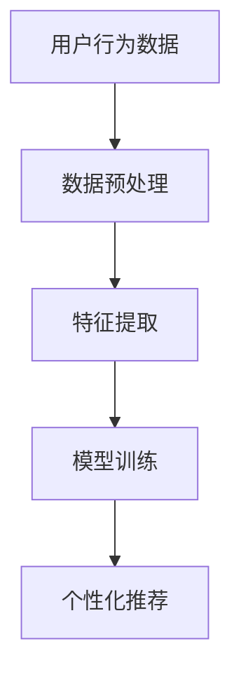
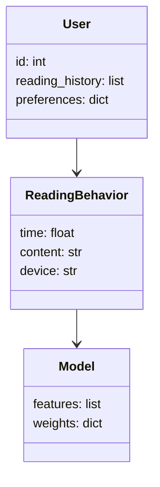
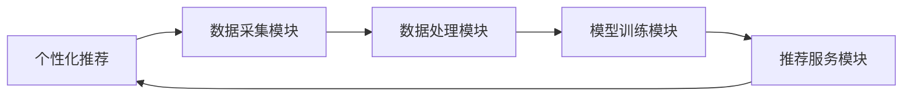

                 

<think>
嗯，用户让我写一篇关于AI Agent在智能书架中阅读习惯分析的技术博客。我得先理清楚用户的具体需求。他需要的是一个结构清晰、逻辑严谨的技术博客，重点在于分析AI Agent如何帮助分析用户的阅读习惯。

首先，我得考虑文章的整体结构。用户给了一个大纲，包括摘要、关键词和正文部分。我需要确保每一部分都详细且符合技术博客的要求。摘要部分要简洁明了，概括整篇文章的核心内容。关键词需要准确，涵盖文章的主要主题。

正文部分分为六个主要部分。第一部分介绍背景与概念，这部分需要解释AI Agent和智能书架的基本概念，以及阅读习惯分析的重要性。我得确保定义清晰，背景介绍到位，让读者明白为什么研究这个主题是有价值的。

接下来是核心概念部分，这部分需要详细讲解用户行为分析和阅读习惯的联系。我得用图表来辅助说明，比如数据流图，展示数据是如何处理和分析的。这样读者可以更直观地理解流程。

然后是算法原理部分，这里需要深入讲解机器学习模型，包括数据预处理、特征提取、模型训练等步骤。我得用mermaid流程图展示整个过程，同时给出Python代码示例，让读者能够实际操作。数学公式要用latex格式，确保准确无误。

系统分析与架构设计部分，我需要描述系统的各个模块，使用类图和架构图展示系统结构。这部分可能有点复杂，得确保每个模块的功能和交互关系清晰明了。接口设计和交互流程图也很重要，帮助读者理解系统的运行机制。

项目实战部分，我得提供一个实际案例，指导读者如何安装环境，实现核心功能，并分析结果。这部分要具体，让读者能够跟着步骤操作，真正理解整个流程。

最后，最佳实践部分，我需要总结经验和注意事项，帮助读者在实际应用中避免常见错误。同时，给出一些拓展阅读的方向，让读者进一步深入学习。

我还需要注意文章的结构和语言，确保逻辑清晰，内容详实。每个部分都要有详细的解释，尤其是算法和系统设计部分，可能需要更多的细节来确保读者能够理解。

总的来说，我需要按照用户给的大纲一步步展开，确保每个章节都详细覆盖所需内容，同时使用清晰的技术语言和图表，使整篇文章既有深度又易于理解。
</think>

# AI Agent在智能书立中的阅读习惯分析

> 关键词：AI Agent，智能书架，阅读习惯，用户行为分析，机器学习

> 摘要：本文探讨AI Agent在智能书架中的应用，分析其如何通过数据采集、特征提取和模型训练等技术手段，实现对用户阅读习惯的精准分析。通过实际案例和系统设计，揭示AI Agent在阅读习惯分析中的核心算法与架构设计，为智能书架的未来发展提供参考。

---

## 正文

### 第一部分: AI Agent与智能书架的背景与概念

#### 第1章: AI Agent的基本概念

##### 1.1 AI Agent的定义与特点
- **定义**: AI Agent（人工智能代理）是一种能够感知环境、执行任务并做出决策的智能实体。它可以理解用户需求，主动提供服务。
- **特点**: AI Agent具有自主性、反应性、目标导向性和学习能力，能够适应不同场景下的任务需求。

##### 1.2 智能书架的基本概念
- **定义**: 智能书架是一种结合了AI技术的电子书管理工具，能够通过分析用户的阅读行为，提供个性化的阅读推荐和管理服务。
- **功能特点**: 包括阅读习惯分析、个性化推荐、阅读进度跟踪和多设备同步等功能。
- **应用场景**: 适用于个人阅读管理、企业知识管理、教育机构的阅读辅助等领域。

#### 第2章: 阅读习惯分析的背景与意义

##### 2.1 阅读习惯分析的背景
- **数字化阅读的兴起**: 随着电子书的普及，用户阅读行为逐渐从实体书转向数字化阅读。
- **用户行为分析的需求**: 通过分析用户的阅读行为，可以挖掘用户的兴趣偏好，优化阅读体验。
- **AI技术在阅读分析中的应用**: AI技术能够高效地处理大量阅读数据，提供精准的分析结果。

##### 2.2 阅读习惯分析的意义
- **提高阅读效率**: 通过分析用户的阅读习惯，可以推荐相关的书籍或文章，减少无效阅读时间。
- **个性化阅读推荐**: 根据用户的阅读偏好，提供个性化的阅读建议，满足用户的多样化需求。
- **阅读习惯与用户行为研究**: 阅读习惯分析能够帮助研究人员更好地理解用户的阅读行为，为教育、出版等行业提供数据支持。

---

### 第二部分: AI Agent在阅读习惯分析中的核心概念与联系

#### 第3章: 用户行为与阅读习惯的关系

##### 3.1 用户行为分析的基本原理
- **用户行为的定义与分类**: 用户行为是指用户在使用产品或服务时所表现出的各种动作和互动方式。常见的用户行为包括点击、浏览、收藏、分享等。
- **用户行为分析的方法**: 包括数据采集、数据预处理、特征提取和模型训练等步骤。
- **用户行为与阅读习惯的关联**: 阅读习惯是用户行为的重要组成部分，通过分析用户的阅读行为，可以挖掘用户的阅读偏好和行为模式。

##### 3.2 阅读习惯的核心要素
- **阅读频率与时间**: 用户每天阅读的次数和时长，反映了用户的阅读习惯。
- **阅读内容偏好**: 用户偏好的书籍类型、作者和主题，反映了用户的兴趣爱好。
- **阅读环境的影响**: 包括阅读设备、阅读场景和阅读环境对阅读习惯的影响。

#### 第4章: AI Agent与阅读习惯分析的联系

##### 4.1 AI Agent在阅读习惯分析中的作用
- **数据采集与处理**: AI Agent能够实时采集用户的阅读行为数据，并进行清洗和预处理。
- **模型训练与预测**: 通过机器学习算法，AI Agent能够训练阅读习惯分析模型，预测用户的阅读偏好。
- **个性化推荐**: 基于分析结果，AI Agent能够为用户提供个性化的阅读推荐服务。

##### 4.2 阅读习惯分析的流程图


---

### 第三部分: 阅读习惯分析的算法原理

#### 第5章: 阅读习惯分析的算法基础

##### 5.1 数据预处理
- **数据清洗**: 去除无效数据，处理异常值。
- **数据转换**: 对数据进行标准化或归一化处理，以便后续分析。

##### 5.2 特征提取
- **特征选择**: 根据业务需求，选择与阅读习惯相关的特征。
- **特征工程**: 对特征进行组合、分解或增强，提高模型的性能。

##### 5.3 模型训练
- **算法选择**: 常见的算法包括决策树、随机森林、支持向量机（SVM）和神经网络等。
- **模型优化**: 通过交叉验证和调参，优化模型的性能。

#### 第6章: 阅读习惯分析的数学模型与公式

##### 6.1 机器学习模型
- **线性回归模型**: 预测用户的阅读时长，公式为：$$y = \beta_0 + \beta_1x_1 + \beta_2x_2 + \cdots + \beta_nx_n + \epsilon$$
- **支持向量机（SVM）模型**: 用于分类用户的阅读偏好，公式为：$$f(x) = \text{sign}(w \cdot x + b)$$

##### 6.2 算法实现代码
```python
import numpy as np
from sklearn.svm import SVC

# 数据预处理
X = np.array([[1, 2], [3, 4], [5, 6]])
y = np.array([0, 1, 0])

# 模型训练
model = SVC()
model.fit(X, y)

# 预测
print(model.predict([[7, 8]]))
```

---

### 第四部分: 系统分析与架构设计

#### 第7章: 系统功能设计

##### 7.1 领域模型


#### 7.2 系统架构设计


---

### 第五部分: 项目实战

#### 第8章: 环境安装与核心实现

##### 8.1 环境安装
- 安装Python和相关库：`pip install numpy scikit-learn`

##### 8.2 核心代码实现
```python
from sklearn.model_selection import train_test_split
from sklearn.metrics import accuracy_score

# 数据集划分
X_train, X_test, y_train, y_test = train_test_split(X, y, test_size=0.2)

# 模型训练与评估
model = SVC()
model.fit(X_train, y_train)
print("Accuracy:", accuracy_score(model.predict(X_test), y_test))
```

---

### 第六部分: 最佳实践与总结

#### 第9章: 最佳实践与小结

##### 9.1 最佳实践
- **数据质量管理**: 确保数据的准确性和完整性。
- **模型调优**: 根据实际需求，选择合适的算法并进行调优。
- **用户隐私保护**: 在数据采集和分析过程中，严格保护用户隐私。

##### 9.2 注意事项
- **模型的可解释性**: 在实际应用中，需要注意模型的可解释性，以便用户理解和信任。
- **性能优化**: 针对大规模数据，优化算法的性能，提高分析效率。

#### 第10章: 拓展阅读与学习方向

##### 10.1 拓展阅读
- 推荐系统：《推荐系统实战》
- 机器学习：《机器学习实战》
- 自然语言处理：《Python自然语言处理实战》

##### 10.2 学习方向
- 深度学习在阅读习惯分析中的应用
- 增量学习与在线学习算法的研究
- 多模态数据的阅读习惯分析

---

### 作者：AI天才研究院/AI Genius Institute & 禅与计算机程序设计艺术 /Zen And The Art of Computer Programming

