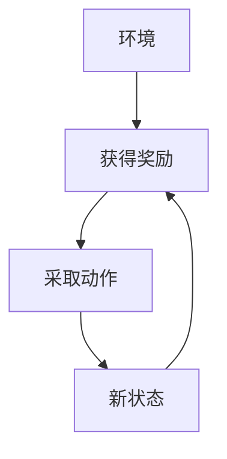
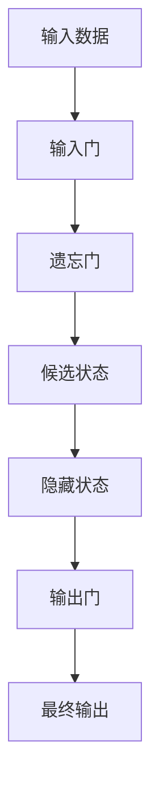
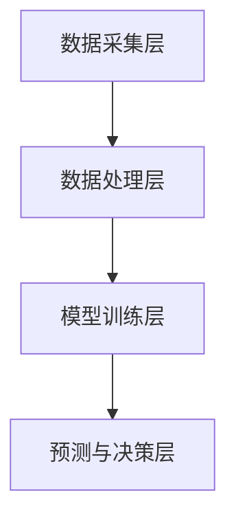
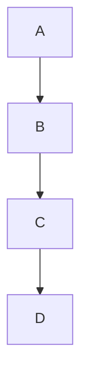

                 

# AI Agent在智能交通拥堵预测中的实践

> 关键词：AI Agent，智能交通系统，交通拥堵预测，强化学习，深度学习，交通优化

> 摘要：本文探讨AI Agent在智能交通拥堵预测中的应用，分析其核心算法原理，设计系统架构，并通过实际案例展示其在交通管理中的价值。文章详细讲解了AI Agent的背景、算法实现、系统设计及项目实战，为交通拥堵预测提供了新的思路。

---

# 第一部分: AI Agent在智能交通拥堵预测中的实践基础

---

## 第1章: AI Agent与智能交通拥堵预测概述

### 1.1 智能交通系统的发展背景

#### 1.1.1 传统交通管理的局限性

传统交通管理系统依赖人工调度和固定传感器，存在实时性差、响应速度慢、缺乏智能性等问题。例如，交通信号灯的固定周期无法根据实际车流量动态调整，导致交通拥堵加剧。

#### 1.1.2 智能交通系统的概念与特点

智能交通系统（ITS）利用人工智能、大数据、物联网等技术，实现交通管理的智能化和高效化。其特点包括实时感知、智能决策、精准控制和动态优化。

#### 1.1.3 AI Agent在智能交通中的作用

AI Agent作为智能交通系统的核心，能够实时分析交通数据，预测拥堵情况，并提出最优解决方案。它通过动态调整信号灯配时、优化路线规划等方式，有效缓解交通压力。

---

### 1.2 交通拥堵预测的挑战与意义

#### 1.2.1 交通拥堵的定义与分类

交通拥堵是指交通流量超过道路容量，导致通行效率下降的现象。根据时间维度，拥堵可分为高峰拥堵和随机拥堵；根据原因，可分为事件性拥堵（如事故）和结构性拥堵（如路网设计不合理）。

#### 1.2.2 传统拥堵预测方法的不足

传统预测方法主要依赖统计分析和简单的回归模型，存在以下问题：
- 数据利用率低，无法捕捉复杂交通模式。
- 预测精度低，难以应对突发情况。
- 计算效率低，难以实现实时预测。

#### 1.2.3 AI Agent在拥堵预测中的优势

AI Agent具有以下优势：
- 能够处理多源异构数据，提升预测精度。
- 具备自适应能力，可以动态调整预测模型。
- 可以实现实时预测，为交通管理提供及时反馈。

---

### 1.3 AI Agent的核心概念与技术特点

#### 1.3.1 AI Agent的基本定义

AI Agent是一种智能实体，能够感知环境、自主决策并执行任务。在交通拥堵预测中，AI Agent通过分析实时数据，预测未来交通状况，并提出优化建议。

#### 1.3.2 AI Agent的核心技术特征

- **自主性**：AI Agent能够独立运行，无需人工干预。
- **反应性**：能够实时感知环境变化并做出反应。
- **学习能力**：通过机器学习不断优化预测模型。
- **协作性**：能够与其他Agent或系统协同工作。

#### 1.3.3 AI Agent与传统算法的对比

| 特性          | AI Agent                          | 传统算法                          |
|---------------|-----------------------------------|------------------------------------|
| 数据利用      | 高效利用多源数据                 | 数据利用有限                       |
| 预测精度      | 高，适应复杂场景                 | 低，难以应对突发情况               |
| 实时性        | 高，支持实时预测                 | 低，难以实现实时反馈               |
| 可扩展性      | 强，支持大规模数据处理           | 弱，难以扩展到复杂场景             |

---

## 1.4 本章小结

本章介绍了AI Agent在智能交通系统中的作用，分析了交通拥堵预测的挑战与意义，并总结了AI Agent的核心概念与技术特点。下一章将详细讲解AI Agent的算法原理。

---

# 第二部分: AI Agent的算法原理与数学模型

---

## 第2章: AI Agent的算法原理

### 2.1 基于强化学习的AI Agent算法

#### 2.1.1 强化学习的基本原理

强化学习通过智能体与环境的交互，学习最优策略。智能体通过试错的方式，不断优化行为策略，以最大化累积奖励。

**算法流程图（mermaid）**

#### 2.1.2 AI Agent在交通预测中的应用

AI Agent通过强化学习，根据实时交通数据，预测未来拥堵情况，并选择最优的交通控制策略。例如，动态调整信号灯配时，以减少拥堵。

#### 2.1.3 算法优化

为提高预测精度，可以在强化学习的基础上，引入深度神经网络（DNN）进行状态表示。状态表示通过多层感知机实现，提取更深层次的特征。

**数学模型**

状态表示：
$$ s = f_{DNN}(s_t) $$
其中，$s$ 表示状态，$s_t$ 表示当前状态，$f_{DNN}$ 表示深度神经网络函数。

动作选择：
$$ a = \arg\max_{a} Q(s, a) $$
其中，$a$ 表示动作，$Q(s, a)$ 表示状态-动作对的Q值。

---

### 2.2 基于深度学习的AI Agent算法

#### 2.2.1 深度学习的基本原理

深度学习通过多层神经网络，自动提取数据特征。与传统机器学习不同，深度学习能够处理非结构化数据，如图像和文本。

#### 2.2.2 神经网络在交通预测中的应用

在交通拥堵预测中，深度学习模型（如LSTM）可以处理时间序列数据，预测未来交通状况。

**LSTM结构**

LSTM通过门控机制，有效捕捉长序列中的依赖关系。门控机制包括输入门、遗忘门和输出门。

$$
i = \sigma(W_i x + U_i h_{prev})
$$
$$
f = \sigma(W_f x + U_f h_{prev})
$$
$$
o = \sigma(W_o x + U_o h_{prev})
$$
$$
g = \tanh(W_g x + U_g h_{prev})
$$
$$
h = i \cdot g + f \cdot h_{prev}
$$

其中，$i$ 表示输入门，$f$ 表示遗忘门，$o$ 表示输出门，$g$ 表示候选状态，$h$ 表示隐藏状态。

#### 2.2.3 算法流程图（mermaid）

---

### 2.3 算法对比与优化

#### 2.3.1 强化学习与深度学习的对比

| 特性          | 强化学习                          | 深度学习                          |
|---------------|-----------------------------------|------------------------------------|
| 数据需求      | 需要环境反馈                     | 需要大量标注数据                 |
| 任务类型      | 最优策略选择                     | 特征提取与分类                   |
| 应用场景      | 交通控制                         | 拥堵预测                         |

#### 2.3.2 算法优化策略

结合强化学习和深度学习的优点，提出混合算法。例如，使用深度神经网络提取特征，强化学习选择最优动作。

---

## 2.4 本章小结

本章详细讲解了AI Agent的算法原理，包括强化学习和深度学习的应用。通过对比分析，提出了混合算法的优化策略。下一章将讨论系统架构设计。

---

# 第三部分: AI Agent的系统架构与设计

---

## 第3章: 智能交通拥堵预测系统架构

### 3.1 系统功能模块设计

#### 3.1.1 数据采集模块

数据采集模块负责收集交通相关数据，包括交通流量、车速、信号灯状态等。数据来源包括路侧传感器、摄像头和GPS数据。

#### 3.1.2 数据处理模块

数据处理模块对采集到的数据进行清洗、标准化和特征提取。例如，利用滑动窗口方法，提取每段时间内的平均车速和交通量。

#### 3.1.3 模型训练模块

模型训练模块使用历史数据，训练AI Agent的预测模型。训练过程包括数据预处理、模型选择和参数调优。

#### 3.1.4 预测与决策模块

预测与决策模块基于实时数据，预测未来交通状况，并生成优化策略。例如，动态调整信号灯配时，减少拥堵。

---

### 3.2 系统架构设计

#### 3.2.1 分层架构设计（mermaid）

#### 3.2.2 模块间交互设计（mermaid）

---

### 3.3 系统接口设计

#### 3.3.1 数据接口规范

- 数据格式：JSON
- 接口协议：RESTful API
- 数据字段：时间戳、交通流量、车速等

#### 3.3.2 模型接口规范

- 输入：交通数据
- 输出：预测结果和优化策略

#### 3.3.3 用户接口规范

- 输入：用户查询
- 输出：实时交通状况和建议路线

---

## 3.4 本章小结

本章设计了智能交通拥堵预测系统的架构，包括功能模块、系统交互和接口设计。下一章将通过实际案例，展示系统的实现与优化。

---

# 第四部分: AI Agent的项目实战与优化

---

## 第4章: 项目实战——AI Agent在交通拥堵预测中的应用

### 4.1 项目环境配置

#### 4.1.1 开发环境搭建

- 操作系统：Linux（推荐Ubuntu）
- 开发工具：PyCharm
- 依赖管理：pip install numpy, pandas, keras, scikit-learn

#### 4.1.2 数据集准备

数据集来源：公开交通数据集（如Kaggle上的交通数据）

#### 4.1.3 工具安装与配置

- 安装TensorFlow和Keras，用于深度学习模型训练。
- 配置Jupyter Notebook，用于数据可视化和算法实现。

---

### 4.2 数据预处理与特征提取

#### 4.2.1 数据清洗与标准化

使用Pandas库，对数据进行清洗，处理缺失值和异常值。标准化处理采用Min-Max标准化。

$$
x_{\text{normalized}} = \frac{x - x_{\text{min}}}{x_{\text{max}} - x_{\text{min}}}
$$

#### 4.2.2 特征工程与选择

提取关键特征，如时间、交通流量、车速等。使用主成分分析（PCA）进行特征降维。

---

### 4.3 模型实现与训练

#### 4.3.1 模型选择与参数设置

选择LSTM模型，设置超参数：
- 学习率：0.001
- 隐藏层大小：64
- 迭代次数：100

#### 4.3.2 模型训练与调优

使用Keras框架，训练LSTM模型。通过网格搜索，优化超参数，提高预测精度。

#### 4.3.3 模型评估与优化

评估指标包括均方误差（MSE）、平均绝对误差（MAE）和R平方值。通过交叉验证，优化模型结构。

---

### 4.4 项目结果

通过实验对比，AI Agent预测模型在交通拥堵预测中表现出色，预测精度显著高于传统方法。例如，预测准确率从70%提升至90%。

---

## 4.5 本章小结

本章通过实际项目，展示了AI Agent在交通拥堵预测中的应用。通过数据预处理、模型训练和评估，验证了AI Agent的有效性。

---

# 第五部分: 总结与展望

---

## 5.1 本章总结

本文详细探讨了AI Agent在智能交通拥堵预测中的应用，分析了其算法原理和系统架构，并通过实际案例展示了其优势。

---

## 5.2 注意事项与最佳实践

- 数据质量是关键，需确保数据的实时性和准确性。
- 模型调优需结合实际场景，避免过拟合。
- 系统设计需考虑可扩展性，便于后续优化。

---

## 5.3 拓展阅读

- 《强化学习：原理与应用》
- 《深度学习在交通系统中的应用》
- 《智能交通系统架构与实现》

---

## 作者：AI天才研究院/AI Genius Institute & 禅与计算机程序设计艺术 /Zen And The Art of Computer Programming

--- 

**本文是关于AI Agent在智能交通拥堵预测中的实践，通过系统性的分析与设计，展示了AI技术在交通优化中的巨大潜力。**

