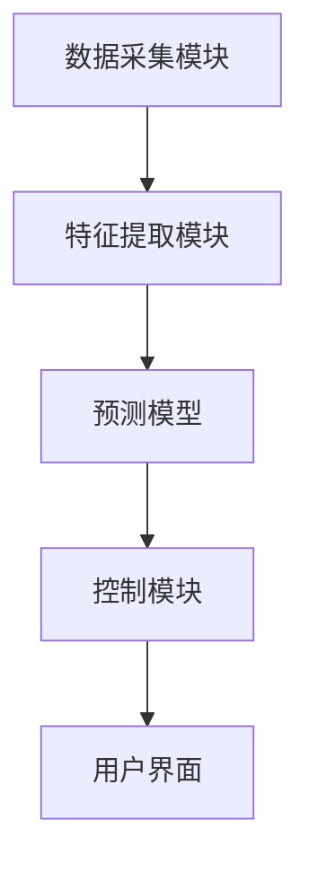

                 


# AI Agent在智能交通流量预测中的实践

> 关键词：AI Agent, 交通流量预测, 智能交通系统, 强化学习, 多智能体协作, 交通优化

> 摘要：本文详细探讨了AI Agent在智能交通流量预测中的实践应用，从AI Agent的基本概念和核心原理出发，结合实际案例，深入分析了AI Agent在交通流量预测中的算法实现、系统架构设计和项目实战。通过本文的阐述，读者可以全面了解AI Agent如何助力智能交通系统的优化与创新，掌握其在交通流量预测中的技术细节和实际应用价值。

---

# 第1章: AI Agent与智能交通流量预测概述

## 1.1 AI Agent的基本概念

### 1.1.1 AI Agent的定义与特点

AI Agent（人工智能代理）是一种能够感知环境、自主决策并采取行动的智能实体。它具备以下核心特点：
- **自主性**：能够在没有外部干预的情况下独立运行。
- **反应性**：能够实时感知环境并做出响应。
- **目标导向**：基于预设目标或学习目标进行决策。
- **协作性**：能够与其他Agent或系统进行协作。

### 1.1.2 AI Agent的核心要素与分类

AI Agent的核心要素包括：
- **感知能力**：通过传感器、摄像头等设备获取环境信息。
- **决策能力**：基于感知信息进行推理和决策。
- **行动能力**：通过执行器或接口对外界产生影响。

AI Agent的分类：
- **简单反射型Agent**：基于当前输入做出简单反应。
- **基于模型的反射型Agent**：利用内部模型进行决策。
- **目标驱动型Agent**：以实现特定目标为导向。
- **效用驱动型Agent**：通过最大化效用函数进行决策。

### 1.1.3 AI Agent在智能交通中的应用潜力

AI Agent在智能交通中的潜力主要体现在：
- **实时性**：能够快速响应交通变化。
- **自主性**：能够在复杂交通环境中自主决策。
- **协作性**：能够与其他交通参与者协同工作。

## 1.2 智能交通流量预测的背景与挑战

### 1.2.1 传统交通流量预测方法的局限性

传统交通流量预测方法主要依赖统计模型（如ARIMA）和简单的机器学习模型，存在以下问题：
- **实时性不足**：无法快速响应交通状况的变化。
- **模型单一**：难以处理复杂的交通场景。
- **缺乏自主性**：需要人工干预调整模型。

### 1.2.2 智能交通系统的发展现状

智能交通系统（ITS）已广泛应用于交通管理、路线规划等领域，但仍然面临以下挑战：
- **数据多样性**：交通数据来源多样，处理复杂。
- **动态变化**：交通流量受多种因素影响，具有不确定性。
- **系统集成**：不同子系统之间的协同工作需要高度集成。

### 1.2.3 交通流量预测的典型应用场景

交通流量预测的典型应用场景包括：
- **交通管理**：优化信号灯控制，减少拥堵。
- **路线规划**：为用户提供实时最优路线。
- **事件响应**：在交通事故或特殊事件中快速调整交通流。

## 1.3 AI Agent在交通流量预测中的优势

### 1.3.1 AI Agent的自主性与适应性

AI Agent能够根据实时数据自主调整预测模型，适应交通环境的变化。

### 1.3.2 AI Agent在实时数据处理中的优势

AI Agent能够快速处理实时数据，提供及时的预测结果。

### 1.3.3 AI Agent在复杂交通环境中的应用价值

AI Agent能够在复杂交通环境中进行多目标优化，提高预测准确性。

## 1.4 本章小结

本章介绍了AI Agent的基本概念和核心特点，分析了智能交通流量预测的背景与挑战，并探讨了AI Agent在交通流量预测中的优势。这些内容为后续章节的深入分析奠定了基础。

---

# 第2章: AI Agent的核心原理

## 2.1 AI Agent的决策机制

### 2.1.1 基于强化学习的决策过程

强化学习是一种通过试错机制优化决策的算法，AI Agent通过与环境互动，逐步学习最优策略。强化学习的基本过程如下：
1. **状态感知**：AI Agent感知当前状态。
2. **动作选择**：基于当前状态选择一个动作。
3. **奖励反馈**：根据动作结果获得奖励或惩罚。
4. **策略更新**：根据奖励调整策略，优化未来决策。

### 2.1.2 基于监督学习的决策模型

监督学习通过输入-输出对训练模型，AI Agent可以根据历史数据学习预测未来状态。

### 2.1.3 多智能体协作机制

在复杂交通环境中，多个AI Agent需要协作完成任务。常见的协作机制包括：
- **分布式决策**：每个Agent独立决策，通过通信共享信息。
- **集中式决策**：由一个主Agent协调其他Agent的行动。

## 2.2 交通流量预测的数学模型

### 2.2.1 时间序列分析模型

时间序列分析模型（如ARIMA）通过历史数据预测未来趋势。

### 2.2.2 空间分布模型

空间分布模型（如空间自回归模型）考虑地理位置因素，预测不同区域的流量。

### 2.2.3 综合预测模型

综合预测模型结合时间序列和空间分布模型，提高预测准确性。

## 2.3 AI Agent与交通流量预测的结合原理

### 2.3.1 数据流分析

AI Agent通过传感器、摄像头等设备实时采集交通数据，进行特征提取和预测。

### 2.3.2 状态识别与预测

AI Agent根据实时数据识别交通状态，并预测未来流量。

### 2.3.3 动作选择与优化

AI Agent根据预测结果选择最优的交通控制策略，优化交通流量。

## 2.4 核心概念对比分析

### 2.4.1 AI Agent与传统算法对比

| 对比维度 | AI Agent | 传统算法 |
|----------|-----------|-----------|
| 自主性    | 高         | 低         |
| 实时性    | 高         | 中         |
| 复杂性    | 高         | 中         |

### 2.4.2 交通流量预测中的关键参数对比

| 参数       | AI Agent | 传统算法 |
|------------|-----------|-----------|
| 预测精度   | 高         | 低         |
| 计算效率   | 高         | 低         |
| 灵活性     | 高         | 低         |

### 2.4.3 系统性能指标对比

| 性能指标   | AI Agent | 传统算法 |
|------------|-----------|-----------|
| 响应时间   | 短         | 长         |
| 预测准确率  | 高         | 一般       |
| 扩展性     | 高         | 低         |

---

# 第3章: AI Agent与交通流量预测的系统架构

## 3.1 系统整体架构设计

### 3.1.1 分层架构设计

分层架构包括数据层、计算层和应用层，每层负责不同的功能。

### 3.1.2 模块化设计

系统分为数据采集模块、特征提取模块、预测模块和控制模块。

### 3.1.3 可扩展性设计

系统设计应考虑未来的扩展需求，便于新增功能和优化。

## 3.2 数据流与信息处理流程

### 3.2.1 数据采集与预处理

AI Agent通过传感器、摄像头等设备采集交通数据，并进行清洗和归一化处理。

### 3.2.2 特征提取与选择

从原始数据中提取关键特征，如时间、地点、车流量等。

### 3.2.3 预测模型构建与优化

基于特征数据构建预测模型，并通过训练优化模型性能。

## 3.3 系统接口与交互设计

### 3.3.1 数据接口设计

定义数据输入输出接口，确保不同模块之间的数据交互。

### 3.3.2 用户接口设计

设计友好的用户界面，方便用户查看预测结果和控制交通信号。

### 3.3.3 系统监控与反馈机制

实时监控系统运行状态，并根据反馈调整预测模型。

## 3.4 系统架构图



---

# 第4章: AI Agent与交通流量预测的项目实战

## 4.1 项目背景与目标

本项目旨在利用AI Agent实现交通流量预测，优化交通管理。

## 4.2 系统核心实现

### 4.2.1 环境安装

安装Python、TensorFlow、Keras等开发工具。

### 4.2.2 核心代码实现

```python
class AI_Agent:
    def __init__(self):
        self.model = self.build_model()

    def build_model(self):
        # 构建预测模型
        pass

    def predict_traffic(self, data):
        # 根据输入数据进行预测
        pass

    def update_model(self, new_data):
        # 更新模型参数
        pass
```

### 4.2.3 代码应用解读与分析

通过对代码的解读，分析AI Agent的实现细节和运行流程。

## 4.3 实际案例分析

### 4.3.1 数据采集与预处理

从交通传感器中获取数据，并进行清洗和归一化处理。

### 4.3.2 模型训练与优化

基于预处理数据训练预测模型，并通过交叉验证优化模型性能。

### 4.3.3 结果分析与可视化

通过可视化工具展示预测结果，并分析模型的准确率和响应时间。

## 4.4 项目小结

总结项目实施过程中的经验与教训，提出改进建议。

---

# 第5章: 总结与展望

## 5.1 本章总结

回顾本文的主要内容，总结AI Agent在智能交通流量预测中的应用价值。

## 5.2 未来展望

探讨AI Agent在智能交通中的未来发展方向，如边缘计算、5G通信等技术的应用。

---

作者：AI天才研究院/AI Genius Institute & 禅与计算机程序设计艺术 /Zen And The Art of Computer Programming

