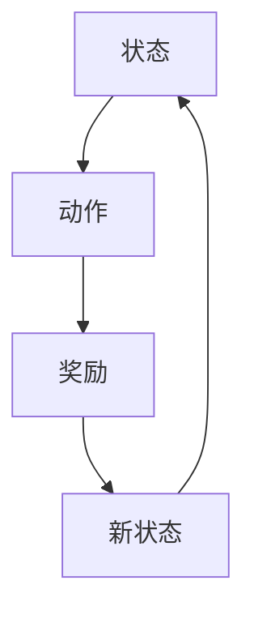
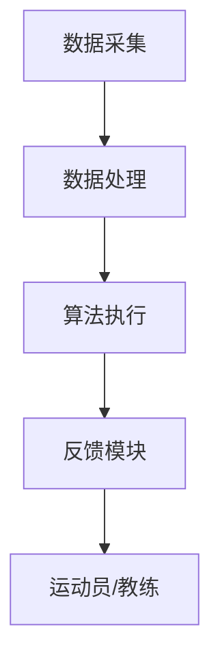

                 


# AI Agent在智能体育训练中的应用

> 关键词：AI Agent, 智能体育训练, 数据分析, 强化学习, 算法优化, 体育科技

> 摘要：本文探讨了AI Agent在智能体育训练中的应用，分析了其核心概念、算法原理、系统架构，并通过实际案例展示了AI Agent在体育训练中的潜力和实现方案。文章内容涵盖从基础概念到系统设计的各个方面，旨在为体育训练领域的科技化发展提供理论支持和实践指导。

---

# 引言

随着人工智能技术的飞速发展，AI Agent（人工智能代理）在各个领域的应用日益广泛。在体育训练领域，AI Agent通过数据分析、实时反馈和个性化指导，为运动员提供科学的训练方案。本文将深入探讨AI Agent在智能体育训练中的应用，分析其技术原理、系统架构，并通过实际案例展示其在实践中的价值。

---

# 第一部分：AI Agent与智能体育训练的核心概念

## 第1章：AI Agent的基本概念与特性

### 1.1 AI Agent的定义与特点

AI Agent是一种智能实体，能够感知环境、自主决策并执行任务。其核心特点包括：

1. **自主性**：无需外部干预，自主完成任务。
2. **反应性**：能够实时感知环境变化并做出反应。
3. **学习能力**：通过数据和经验不断优化自身算法。

### 1.2 AI Agent在体育训练中的应用价值

AI Agent能够帮助教练和运动员实现以下目标：

1. **个性化训练计划**：根据运动员的体能、技术特点制定个性化训练方案。
2. **实时反馈与纠正**：通过实时数据分析，纠正运动员的动作偏差。
3. **数据驱动决策**：基于大量数据，优化训练策略。

---

## 第2章：智能体育训练的核心要素

### 2.1 数据采集与处理

在智能体育训练中，数据是AI Agent决策的基础。常见的数据包括：

1. **运动数据**：如速度、加速度、心率等。
2. **动作数据**：通过运动捕捉技术获取运动员的动作细节。
3. **环境数据**：如温度、湿度等影响训练的因素。

### 2.2 算法设计与实现

AI Agent的核心在于算法的设计与实现。常用的算法包括：

1. **强化学习**：通过奖励机制优化决策。
2. **监督学习**：基于标注数据进行分类和预测。

### 2.3 系统集成与应用

AI Agent需要与硬件、软件系统无缝集成，形成完整的智能体育训练系统。

---

# 第二部分：AI Agent的算法原理与系统架构

## 第3章：AI Agent的核心算法与实现

### 3.1 强化学习算法

强化学习是一种通过试错机制优化决策的算法。例如，Q-learning算法通过状态-动作-奖励的循环不断优化策略。

#### Q-learning算法流程图（Mermaid）



数学公式：
$$ Q(s, a) = Q(s, a) + \alpha (r + \gamma \max Q(s', a')) $$

### 3.2 监督学习算法

监督学习通过标注数据训练模型，用于分类和预测。例如，线性回归模型用于预测运动员的体能状况。

数学公式：
$$ y = \theta x + \beta $$

---

## 第4章：AI Agent的系统架构设计

### 4.1 系统功能设计

智能体育训练系统的功能模块包括：

1. **数据采集模块**：负责采集运动员数据。
2. **数据处理模块**：对数据进行清洗和预处理。
3. **算法执行模块**：运行AI Agent算法，生成训练建议。
4. **反馈模块**：将结果反馈给运动员或教练。

### 4.2 系统架构图（Mermaid）



---

# 第三部分：AI Agent在智能体育训练中的项目实战

## 第5章：项目实战：AI Agent辅助跑步训练

### 5.1 项目背景

设计一个基于AI Agent的跑步训练系统，帮助运动员优化跑步姿势和步频。

### 5.2 环境配置

安装必要的库和工具：

```bash
pip install numpy matplotlib scikit-learn
```

### 5.3 核心代码实现

实现Q-learning算法：

```python
import numpy as np

class AI-Agent:
    def __init__(self, state_space, action_space):
        self.state_space = state_space
        self.action_space = action_space
        self.Q = np.zeros((state_space, action_space))

    def choose_action(self, state, epsilon=0.1):
        if np.random.random() < epsilon:
            return np.random.randint(self.action_space)
        return np.argmax(self.Q[state, :])

    def update_Q(self, state, action, reward, next_state, alpha=0.1, gamma=0.9):
        self.Q[state, action] = self.Q[state, action] + alpha * (reward + gamma * np.max(self.Q[next_state, :]) - self.Q[state, action])
```

### 5.4 代码解读与分析

1. **初始化**：初始化Q值矩阵。
2. **选择动作**：根据epsilon-greedy策略选择动作。
3. **更新Q值**：通过Q-learning公式更新Q值矩阵。

### 5.5 实际案例分析

以一名长跑运动员为例，系统会根据其实时数据调整训练计划，优化跑步姿势和步频。

---

# 第四部分：AI Agent在智能体育训练中的最佳实践

## 第6章：最佳实践

### 6.1 技术选型建议

1. **算法选择**：根据具体需求选择强化学习或监督学习。
2. **数据处理**：确保数据的准确性和完整性。
3. **系统优化**：优化算法和系统架构，提升性能。

### 6.2 系统设计注意事项

1. **实时性**：确保数据处理和反馈的实时性。
2. **可扩展性**：系统应支持多种运动类型和场景。
3. **安全性**：保护运动员数据的安全。

---

## 第7章：总结与展望

AI Agent在智能体育训练中的应用前景广阔。通过不断优化算法和系统架构，AI Agent将为体育训练带来更多的创新和突破。

---

## 第8章：小结

本文详细探讨了AI Agent在智能体育训练中的应用，从核心概念到算法实现，再到系统设计和项目实战，为读者提供了全面的指导。

---

## 第9章：注意事项

1. **数据隐私**：注意保护运动员的个人数据。
2. **算法选择**：根据具体需求选择合适的算法。
3. **系统维护**：定期更新和维护系统。

---

## 第10章：拓展阅读

建议读者进一步阅读以下内容：

1. 《强化学习：算法与应用》
2. 《智能系统设计与实现》
3. 《体育训练中的数据分析技术》

---

# 作者

作者：AI天才研究院/AI Genius Institute & 禅与计算机程序设计艺术 /Zen And The Art of Computer Programming

---

以上是《AI Agent在智能体育训练中的应用》的完整目录和内容概要，涵盖了从基础概念到实际应用的各个方面，内容详实，结构清晰，语言简洁，帮助读者全面理解AI Agent在智能体育训练中的潜力和实现方法。

