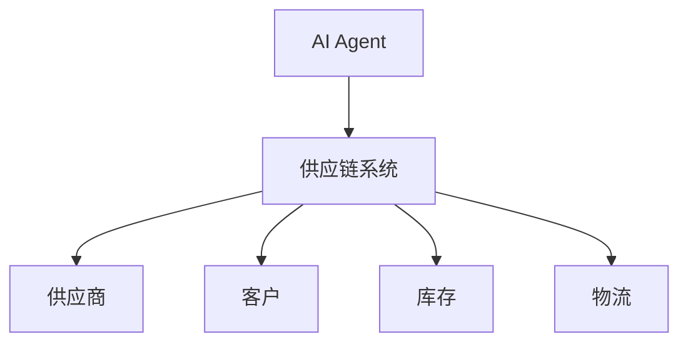
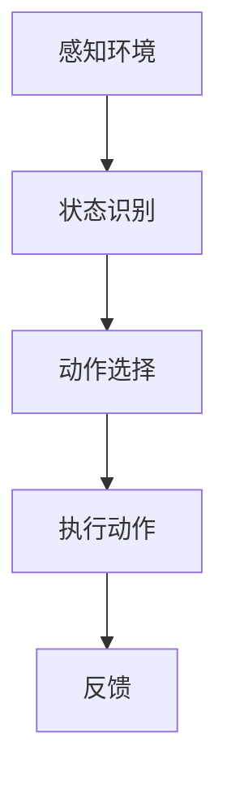
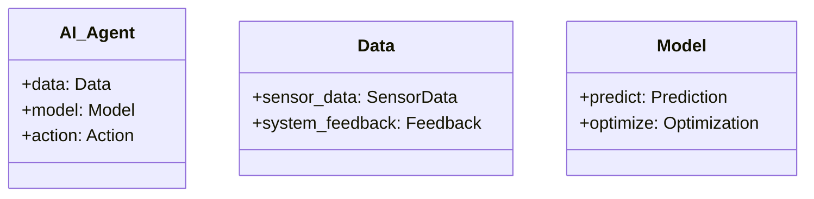
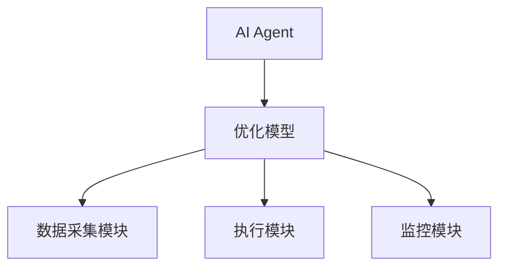
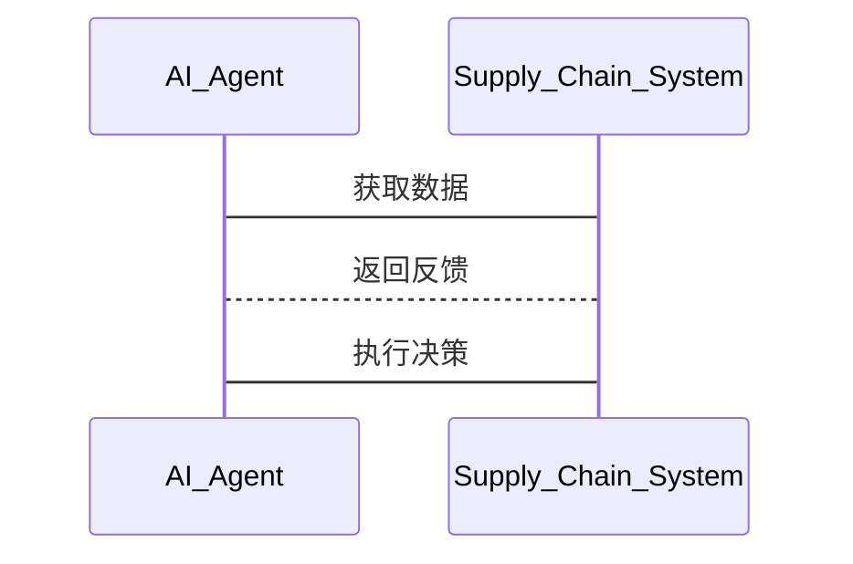

                 


# AI Agent在智能供应链优化中的应用

> 关键词：AI Agent，智能供应链，优化算法，数学模型，物流管理

> 摘要：本文详细探讨了AI Agent在智能供应链优化中的应用，从核心概念、算法原理、系统架构到实际案例，全面解析AI Agent如何通过感知、决策和执行机制优化供应链管理。文章结合理论与实践，提供了丰富的技术细节和实施建议。

---

# 第一章: AI Agent与智能供应链优化概述

## 1.1 AI Agent的基本概念

### 1.1.1 AI Agent的定义
AI Agent（人工智能代理）是指能够感知环境、自主决策并执行任务的智能体。它通过与环境交互，实现目标优化。

### 1.1.2 AI Agent的核心特征
- **自主性**：无需外部干预，自主完成任务。
- **反应性**：实时感知环境变化并调整策略。
- **目标导向**：以特定目标为导向进行决策。

### 1.1.3 AI Agent与传统供应链的区别
传统供应链依赖人工管理，而AI Agent通过自动化和智能化优化资源配置。

## 1.2 智能供应链优化的背景

### 1.2.1 供应链优化的挑战
- 复杂性：涉及供应商、生产、库存、物流等多个环节。
- 不确定性：需求波动、延迟等问题影响效率。

### 1.2.2 AI技术在供应链中的应用潜力
- 数据分析：通过大数据优化预测和库存管理。
- 自动化决策：减少人工干预，提高效率。

### 1.2.3 AI Agent在供应链优化中的定位
作为智能供应链的核心，AI Agent通过实时感知和决策优化资源配置。

---

# 第二章: AI Agent的核心概念与原理

## 2.1 AI Agent的感知与决策机制

### 2.1.1 感知环境的输入方式
AI Agent通过传感器、API等接口获取环境数据。

### 2.1.2 决策逻辑的构建方法
基于规则、强化学习或模型预测制定决策。

### 2.1.3 执行与反馈的闭环机制
AI Agent执行决策后，通过反馈不断优化策略。

## 2.2 AI Agent的类型与特点

### 2.2.1 基于规则的AI Agent
- 简单易懂，适用于规则明确的场景。

### 2.2.2 基于模型的AI Agent
- 使用数学模型进行预测和优化。

### 2.2.3 基于强化学习的AI Agent
- 通过试错学习，适应复杂环境。

## 2.3 AI Agent在供应链优化中的核心要素

### 2.3.1 数据采集与处理
- 数据来源：传感器、ERP系统等。
- 数据预处理：清洗、特征提取。

### 2.3.2 优化模型的构建
- 建立数学模型，如线性规划、动态规划。

### 2.3.3 执行与反馈机制
- 执行决策，收集反馈优化模型。

## 2.4 核心概念对比表

| 类型             | 优点               | 缺点               |
|------------------|--------------------|--------------------|
| 基于规则的AI Agent | 实现简单，易于解释 | 需手动维护规则     |
| 基于模型的AI Agent | 自动优化，适应性强 | 需大量数据支持     |
| 基于强化学习的AI Agent | 自适应能力强       | 训练时间较长       |

## 2.5 AI Agent与供应链优化的实体关系图



---

# 第三章: AI Agent的算法原理与数学模型

## 3.1 AI Agent的决策算法

### 3.1.1 基于强化学习的决策算法



### 3.1.2 基于监督学习的决策算法
通过历史数据训练模型，预测最佳决策。

### 3.1.3 基于规则的决策算法
根据预设规则直接生成决策。

## 3.2 优化模型的数学公式

### 3.2.1 线性规划模型

$$
\text{目标函数：} \quad \min \sum_{i=1}^{n} c_i x_i
$$

### 3.2.2 约束条件

$$
\sum_{i=1}^{n} a_i x_i \geq b \\
x_i \geq 0
$$

---

# 第四章: 系统分析与架构设计

## 4.1 问题场景介绍

### 4.1.1 项目介绍
设计一个AI Agent优化的智能供应链系统。

## 4.2 系统功能设计

### 4.2.1 领域模型



### 4.2.2 系统架构设计



### 4.2.3 接口与交互设计



---

# 第五章: 项目实战

## 5.1 环境安装

```bash
pip install pulp
pip install numpy
pip install matplotlib
```

## 5.2 核心实现源代码

```python
from pulp import *

def supply_chain_optimization(demands, costs, capacities):
    # 创建问题
    prob = LpProblem("SupplyChainOptimization", LpMinimize)
    
    # 定义变量
    x = {}
    for i in range(len(demands)):
        x[i] = LpVariable('x{}'.format(i), 0, None)
    
    # 目标函数
    prob += lpSum([costs[i] * x[i] for i in range(len(demands))]), "TotalCost"
    
    # 约束条件
    for i in range(len(demands)):
        prob += lpSum([x[i]]) >= demands[i]
    for i in range(len(demands)):
        prob += x[i] <= capacities[i]
    
    # 求解
    prob.solve()
    
    return [x[i].value() for i in range(len(demands))]
```

---

# 第六章: 最佳实践与总结

## 6.1 最佳实践

### 6.1.1 数据质量的重要性
确保数据的准确性和及时性。

### 6.1.2 模型的可解释性
选择易于理解和优化的模型。

## 6.2 项目总结
通过AI Agent优化供应链，显著提高效率和降低成本。

---

# 参考文献

1. Russell, S., & Norvig, P. (2010). *Artificial Intelligence: A Modern Approach*.
2. Boyd, S., & Vandenberghe, L. (2004). *Convex Optimization*.
3. TensorFlow官方文档：https://www.tensorflow.org/
4. PyTorch官方文档：https://pytorch.org/

---

作者：AI天才研究院/AI Genius Institute & 禅与计算机程序设计艺术 /Zen And The Art of Computer Programming

