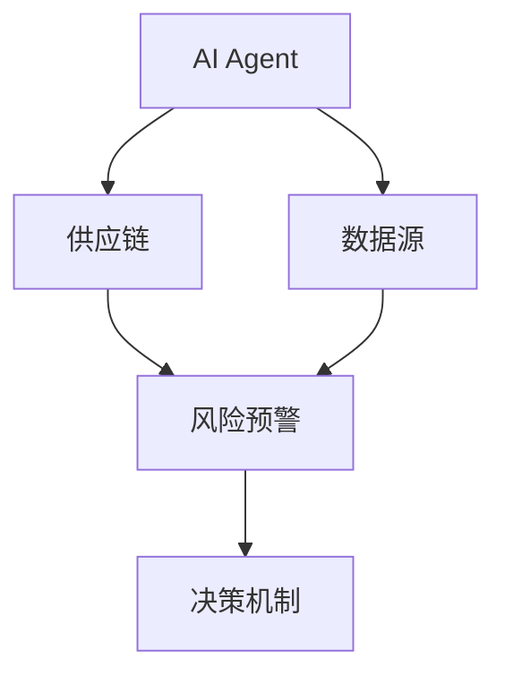
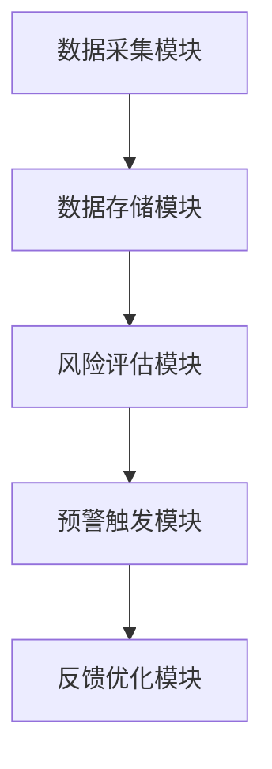

                 

<think>
好的，我现在需要帮助用户完成《AI Agent在智能供应链风险预警中的应用》的技术博客文章。用户已经提供了详细的目录结构，我需要按照这个结构逐步填充内容，确保每个部分都详细且符合技术深度。

首先，用户希望文章开头有标题、关键词和摘要。我需要确保这些部分简洁明了，能够准确反映文章的核心内容。

接下来是背景介绍部分，我需要详细解释供应链风险管理的重要性，以及AI Agent的应用前景。这部分需要让读者理解为什么供应链风险管理是必要的，以及AI Agent在其中的独特价值。

然后是核心概念与核心要素，这部分需要详细解释AI Agent的基本概念和原理，以及智能供应链的要素。我需要通过图表来展示实体关系和系统架构，帮助读者更好地理解。

算法原理部分，我需要深入讲解AI Agent在供应链风险预警中的具体算法，比如强化学习和监督学习，并提供数学公式和代码示例，让读者能够理解实现细节。

系统架构设计部分，我需要描述系统的各个模块，包括数据采集、风险评估等，并用图表展示系统架构，帮助读者理解系统的组成和运作方式。

项目实战部分，我需要提供具体的环境安装说明和代码实现，让读者能够实际操作，同时解释代码的作用和实现过程。

最后，最佳实践部分需要总结文章内容，给出注意事项和拓展阅读建议，帮助读者巩固所学知识，并进一步深入学习。

在写作过程中，我需要确保语言专业且易懂，使用适当的Markdown格式，并嵌入数学公式和图表，以增强文章的表现力。同时，注意文章的整体结构和逻辑性，确保读者能够顺畅地跟随内容逐步深入。

总结一下，我的思考过程是按照用户提供的目录结构，逐部分填充内容，确保每个部分都符合要求，同时保持整体的连贯性和专业性。
</think>

# AI Agent在智能供应链风险预警中的应用

> 关键词：AI Agent, 智能供应链, 供应链风险管理, 风险预警, 供应链优化

> 摘要：随着全球经济的快速发展，供应链的复杂性和不确定性不断增加，传统供应链管理方式已经难以应对日益复杂的市场环境。AI Agent作为人工智能领域的新兴技术，能够在智能供应链风险预警中发挥重要作用。本文将从AI Agent的基本概念、算法原理、系统架构等多个维度进行深入分析，探讨AI Agent如何帮助实现智能供应链风险预警，并通过实际案例展示其应用价值。

---

## 第一部分: AI Agent与智能供应链风险预警的背景介绍

### 第1章: 问题背景与问题描述

#### 1.1 供应链风险管理的重要性
供应链是现代企业运营的核心，涵盖了从原材料采购到产品交付的全过程。然而，供应链的复杂性使得其容易受到多种风险的影响，例如供应商延迟、物流中断、市场需求波动等。这些风险可能导致企业成本增加、交付延迟甚至业务中断，从而对企业的声誉和财务状况造成严重影响。

#### 1.2 问题描述
传统的供应链风险管理依赖于人工监控和经验判断，这种方式不仅效率低下，而且难以应对复杂多变的市场环境。例如，当供应链中的某个环节出现问题时，人工监控可能无法及时发现并采取有效措施。此外，传统方法通常基于静态数据进行分析，难以捕捉到动态变化中的潜在风险。

#### 1.3 问题解决方法
引入AI Agent技术，能够实时监控供应链中的各种数据，通过智能化的算法快速识别潜在风险，并提供最优的应对策略。AI Agent能够根据实时数据动态调整供应链的运作，从而降低风险发生的概率或减少风险的影响。

#### 1.4 边界与外延
AI Agent在供应链风险管理中的应用范围主要集中在风险识别、风险评估和风险应对三个方面。其边界包括数据采集、模型训练和预警触发，而外延则涉及企业内部的业务流程优化和外部合作伙伴的协同管理。

#### 1.5 核心概念与核心要素
AI Agent是一种能够感知环境并采取行动以实现目标的智能体。在供应链风险预警中，AI Agent的核心要素包括：
- 数据源：包括供应商信息、物流数据、市场需求等。
- 智能算法：包括机器学习、强化学习等。
- 决策机制：根据实时数据做出最优决策。

---

### 第2章: 核心概念与核心要素

#### 2.1 AI Agent的基本原理
AI Agent通过感知环境并采取行动来实现目标。在供应链风险预警中，AI Agent需要实时监控供应链中的各种数据，并根据这些数据做出预测和决策。例如，当检测到某个供应商的交货周期突然延长时，AI Agent可以立即触发预警机制，并建议调整采购策略。

#### 2.2 智能供应链的核心要素
智能供应链的核心要素包括数据驱动的供应链管理、智能化的决策支持系统以及多方协同的供应链网络。通过这些要素的协同作用，企业能够实现供应链的智能化和高效化。

#### 2.3 核心概念之间的关系
以下是核心概念之间的关系图：



从上图可以看出，AI Agent通过数据源感知供应链环境，并通过决策机制实现风险预警。

---

## 第二部分: AI Agent在供应链风险预警中的算法原理

### 第3章: AI Agent的算法原理

#### 3.1 AI Agent的基本算法框架
AI Agent在供应链风险预警中的应用主要依赖于强化学习和监督学习两种算法框架。

- **强化学习（Reinforcement Learning）**：强化学习是一种通过试错方式来优化决策的算法。在供应链风险预警中，AI Agent可以通过强化学习不断优化其风险识别能力。
  
  ```mermaid
  graph TD
      A[状态] --> B[动作]
      B --> C[奖励]
      C --> A
  ```

- **监督学习（Supervised Learning）**：监督学习是一种基于已有的数据进行训练，从而预测未来结果的算法。在供应链风险预警中，AI Agent可以通过监督学习模型预测潜在风险。

  $$ \text{线性回归模型示例：} y = \beta_0 + \beta_1x + \epsilon $$

#### 3.2 供应链风险预警模型的算法实现
供应链风险预警模型的实现需要结合多种算法，例如：
- **风险评估指标的构建**：通过分析供应链中的各种数据，构建风险评估指标。
- **基于机器学习的风险预测模型**：利用机器学习算法对潜在风险进行预测。
- **基于规则的异常检测算法**：通过预设的规则检测供应链中的异常情况。

#### 3.3 算法实现的数学模型
以下是几种常见的算法及其数学模型：

- **强化学习模型**：
  $$ Q(s, a) = r + \gamma \max Q(s', a') $$
  其中，\( Q(s, a) \) 表示状态 \( s \) 下采取行动 \( a \) 的价值，\( r \) 是奖励，\( \gamma \) 是折扣因子。

- **监督学习模型**：
  $$ y = \beta_0 + \beta_1x + \epsilon $$
  其中，\( y \) 是目标变量，\( x \) 是自变量，\( \epsilon \) 是误差项。

---

### 第4章: 供应链风险预警的系统架构设计

#### 4.1 系统功能模块设计
供应链风险预警系统的功能模块包括：
- **数据采集模块**：负责采集供应链中的各种数据。
- **风险评估模块**：利用算法对潜在风险进行评估。
- **预警触发模块**：当风险超过预设阈值时，触发预警机制。
- **反馈优化模块**：根据预警结果优化供应链的运作。

#### 4.2 系统架构图
以下是供应链风险预警系统的架构图：



从上图可以看出，系统通过数据采集、存储、评估、预警和优化的流程，实现供应链风险的实时监控和管理。

---

## 第三部分: AI Agent在供应链风险预警中的系统分析与架构设计方案

### 第5章: 项目实战

#### 5.1 环境安装
以下是项目实战所需的环境安装说明：
- **Python 3.8 或更高版本**
- **机器学习库（如 TensorFlow、Scikit-learn）**
- **数据处理库（如 Pandas、NumPy）**
- **可视化库（如 Matplotlib、Seaborn）**

#### 5.2 系统核心实现源代码
以下是供应链风险预警系统的核心代码实现：

```python
import numpy as np
import pandas as pd
from sklearn.linear_model import LinearRegression
from sklearn.metrics import mean_squared_error

# 数据预处理
data = pd.read_csv('supply_chain_data.csv')
X = data[[' supplier_lead_time', '物流成本', '市场需求']]
y = data['风险等级']

# 模型训练
model = LinearRegression()
model.fit(X, y)

# 模型预测
y_pred = model.predict(X)
print('预测结果:', y_pred)
print('均方误差:', mean_squared_error(y, y_pred))
```

#### 5.3 代码应用解读与分析
上述代码实现了一个基于线性回归的供应链风险预测模型。数据预处理部分负责将数据加载并进行必要的处理，模型训练部分使用线性回归算法对数据进行训练，模型预测部分利用训练好的模型对新数据进行预测，并计算均方误差以评估模型的性能。

---

## 第四部分: 最佳实践

### 第6章: 最佳实践 tips、小结、注意事项、拓展阅读

#### 6.1 小结
本文详细介绍了AI Agent在智能供应链风险预警中的应用，从背景介绍、算法原理到系统架构设计，全面分析了AI Agent在供应链风险管理中的重要作用。

#### 6.2 注意事项
- 在实际应用中，需要根据具体需求选择合适的算法。
- 数据的质量和完整性对模型的性能有重要影响。
- 需要定期对模型进行优化和更新，以应对不断变化的市场环境。

#### 6.3 拓展阅读
- 《Reinforcement Learning: Theory and Algorithms》
- 《Machine Learning for Supply Chain Risk Management》
- 《Artificial Intelligence in Supply Chain Optimization》

---

## 作者：AI天才研究院/AI Genius Institute & 禅与计算机程序设计艺术 /Zen And The Art of Computer Programming

