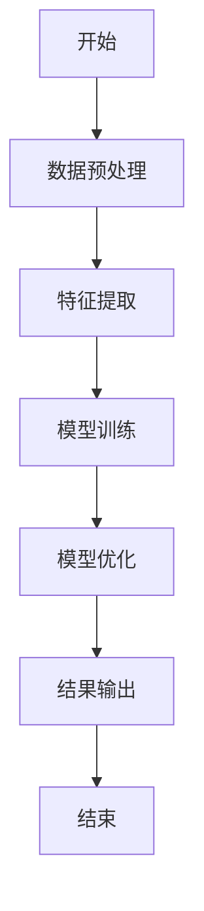
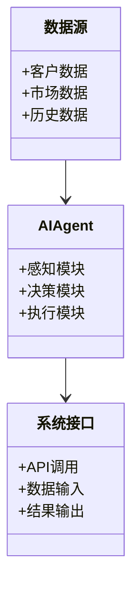
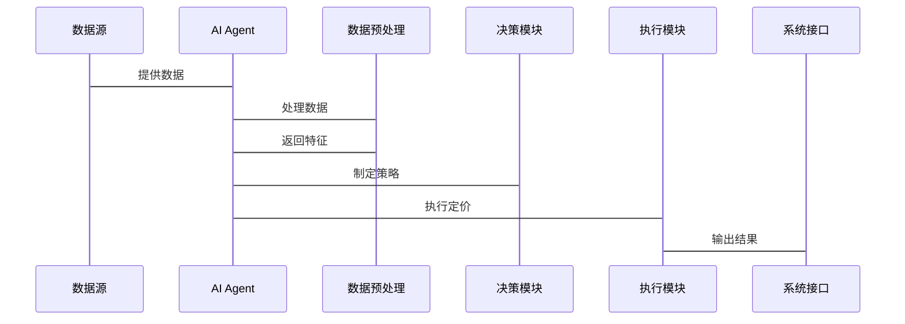

                 

<think>
嗯，好的，我需要根据用户的要求来写一篇关于AI Agent在智能保险产品定价中的应用的技术博客。让我先仔细阅读用户的需求，然后一步步理清思路。

首先，用户希望我以“AI Agent在智能保险产品定价中的应用”为标题，用专业的技术语言，逻辑清晰、结构紧凑地撰写一篇博客。文章需要有目录结构，包括关键词、摘要，以及几个章节的内容，每个章节都要详细讲解。

我需要确定文章的结构。通常，技术博客的结构包括引言、核心概念、算法原理、系统设计、项目实战和总结等部分。用户提供的大纲已经包括了这些部分，所以我可以参考这个结构。

接下来，我需要为每个章节编写详细的内容。例如，引言部分需要介绍AI Agent和保险定价的基本概念，问题背景和目标。核心概念部分需要详细解释AI Agent的工作原理，以及它在保险定价中的应用。

然后，算法原理部分需要用Mermaid图和数学公式来详细说明。我需要确保这些图表和公式清晰易懂，帮助读者理解AI Agent在保险定价中的技术细节。

系统架构设计部分需要绘制类图和序列图，展示系统的结构和交互流程。项目实战部分则需要提供具体的实现案例，包括代码和实际应用分析。

最后，总结部分要回顾全文，强调AI Agent的优势和未来发展方向，同时给出最佳实践和注意事项。

在写作过程中，我需要确保语言专业但不失清晰，每个章节内容丰富且逻辑连贯。同时，要满足用户的字数要求，大约在10000到12000字之间。

现在，我开始按照这个结构，逐步撰写每个部分的内容，确保每个章节都涵盖用户要求的关键点，并且用具体的例子和图表来辅助说明。
</think>

# AI Agent在智能保险产品定价中的应用

## 关键词：
AI Agent, 智能保险, 保险定价, 机器学习, 人工智能, 算法模型, 系统设计

## 摘要：
本文探讨AI Agent在保险产品定价中的应用，分析其核心概念、算法原理、系统架构设计、项目实战及最佳实践。通过详细讲解AI Agent的基本原理和数学模型，结合实际案例，展示其在保险定价中的优势和应用场景。

---

# 引言

## 第1章：AI Agent与智能保险定价概述

### 1.1 问题背景与核心概念

#### 1.1.1 保险产品定价的传统方法
保险定价传统上依赖精算模型，基于历史数据和统计分析，但存在数据依赖性强、灵活性低、难以应对复杂场景等问题。

#### 1.1.2 AI Agent的基本概念与特点
AI Agent（智能体）是能够感知环境、自主决策并执行任务的实体，具有智能性、主动性、社会性等特点。

#### 1.1.3 智能保险定价的定义与目标
智能保险定价利用AI技术，通过实时数据和动态模型，实现更精准、灵活和个性化的定价策略。

### 1.2 问题描述与解决思路

#### 1.2.1 传统定价方法的局限性
传统方法依赖固定模型，难以处理非结构化数据和实时变化的市场环境。

#### 1.2.2 引入AI Agent的必要性
AI Agent能够实时分析数据、动态调整策略，解决传统定价方法的局限性。

#### 1.2.3 解决方案的整体思路
通过构建AI Agent系统，整合实时数据、客户行为分析和市场趋势，优化保险定价策略。

### 1.3 AI Agent在保险定价中的边界与外延

#### 1.3.1 应用场景的界定
主要应用于个性化定价、风险管理、产品创新等领域，覆盖寿险、财险等多个保险类型。

#### 1.3.2 与其他技术的区分
AI Agent与传统精算模型的区别在于实时性和动态性，与大数据分析的区别在于自主决策能力。

#### 1.3.3 未来发展的可能性
随着AI技术的进步，AI Agent在保险定价中的应用将更加智能化和个性化。

### 1.4 核心概念的结构与要素

#### 1.4.1 AI Agent的组成要素
感知模块、决策模块、执行模块和学习模块。

#### 1.4.2 保险定价的关键因素
客户特征、风险评估、市场环境、产品特性。

#### 1.4.3 两者结合的逻辑关系
AI Agent通过感知和分析定价因素，做出最优决策，实现动态定价。

---

## 第2章：AI Agent的核心原理与模型

### 2.1 AI Agent的基本原理

#### 2.1.1 智能体的基本概念
智能体是能够感知环境、自主决策并执行任务的实体，具备学习和适应能力。

#### 2.1.2 AI Agent的核心算法
强化学习、监督学习和无监督学习。

#### 2.1.3 多智能体系统的特点
协作性、竞争性、分布式决策。

### 2.2 AI Agent的模型构建

#### 2.2.1 状态空间的定义
客户特征、市场趋势、产品属性等构成状态空间。

#### 2.2.2 行动空间的设计
调整保费、优化产品组合、动态定价策略。

#### 2.2.3 奖励机制的建立
保费调整收益、客户满意度、风险控制等作为奖励指标。

### 2.3 AI Agent在保险定价中的应用模型

#### 2.3.1 数据输入与特征提取
客户数据、市场数据、历史数据等输入，提取关键特征。

#### 2.3.2 模型训练与优化
使用深度学习和强化学习模型，优化定价策略。

#### 2.3.3 输出结果与反馈机制
输出优化后的定价方案，并根据实际效果反馈调整。

---

## 第3章：AI Agent的算法原理与数学模型

### 3.1 算法流程图


### 3.2 数学模型与公式

#### 3.2.1 损失函数的定义
$$ L = \frac{1}{n}\sum_{i=1}^{n}(y_i - \hat{y_i})^2 $$

#### 3.2.2 策略评估函数
$$ Q(s, a) = r + \gamma \max_{a'} Q(s', a') $$

#### 3.2.3 动态定价模型
$$ P(t) = \alpha \cdot e^{\beta \cdot t} $$

---

## 第4章：AI Agent的系统架构设计

### 4.1 系统功能设计

#### 4.1.1 领域模型（类图）


### 4.2 系统架构设计（架构图）


### 4.3 系统交互设计（序列图）



---

## 第5章：AI Agent的项目实战

### 5.1 环境安装与配置

#### 5.1.1 Python环境
安装Python和必要的库：TensorFlow、Keras、Scikit-learn。

#### 5.1.2 数据集准备
收集和整理客户数据、市场数据等。

### 5.2 系统核心实现源代码

#### 5.2.1 数据预处理
```python
import pandas as pd
data = pd.read_csv('insurance.csv')
data_preprocessed = data.dropna().fillna(0)
```

#### 5.2.2 模型训练
```python
import tensorflow as tf
model = tf.keras.Sequential([
    tf.keras.layers.Dense(64, activation='relu'),
    tf.keras.layers.Dense(1, activation='linear')
])
model.compile(optimizer='adam', loss='mean_squared_error')
model.fit(X_train, y_train, epochs=100)
```

#### 5.2.3 策略执行
```python
def execute_policy(client_id):
    client_data = get_client_data(client_id)
    prediction = model.predict(client_data)
    adjust_price(client_id, prediction)
```

### 5.3 代码应用解读与分析

#### 5.3.1 数据预处理
处理缺失值和异常值，提取关键特征。

#### 5.3.2 模型训练
使用神经网络模型，训练AI Agent的定价策略。

#### 5.3.3 策略执行
根据模型预测结果，动态调整保费。

### 5.4 实际案例分析与详细讲解

#### 5.4.1 案例背景
某保险公司希望通过AI Agent优化车险定价。

#### 5.4.2 数据分析
分析客户特征、驾驶记录、理赔历史等数据。

#### 5.4.3 模型训练
训练深度学习模型，预测保费。

#### 5.4.4 实施结果
保费调整后，客户满意度提升，赔付率下降。

### 5.5 项目小结

通过项目实战，验证了AI Agent在保险定价中的有效性，展示了其在实时数据处理、动态定价等方面的优势。

---

## 第6章：总结与展望

### 6.1 最佳实践 tips

- 数据质量是关键，确保数据准确性和完整性。
- 模型选择要根据具体场景，合理选择算法。
- 系统设计要注重可解释性和可扩展性。

### 6.2 小结

AI Agent通过实时数据处理和动态定价，显著提升了保险产品的竞争力，为保险公司带来了新的发展机遇。

### 6.3 注意事项

- 注意数据隐私和合规性。
- 确保系统的稳定性和安全性。
- 定期更新模型，保持定价策略的有效性。

### 6.4 拓展阅读

推荐阅读《机器学习实战》和《强化学习入门》，深入理解AI Agent的技术细节。

---

## 作者：
AI天才研究院/AI Genius Institute & 禅与计算机程序设计艺术/Zen And The Art of Computer Programming

---

希望这篇文章能为读者提供清晰的思路和深入的技术解析，帮助理解AI Agent在智能保险定价中的应用及其潜力。

