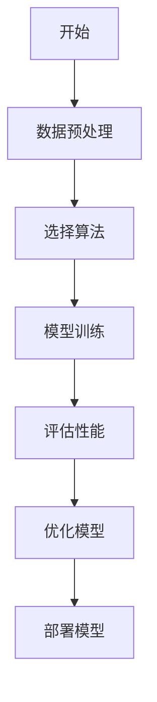
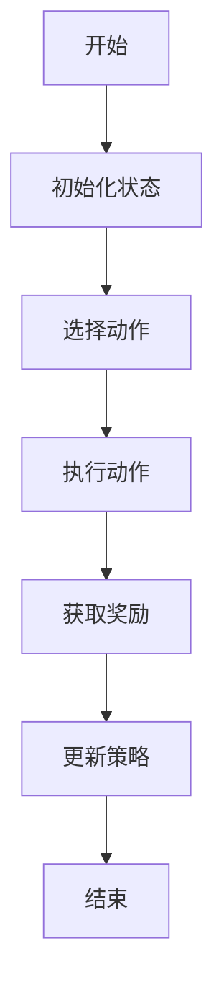
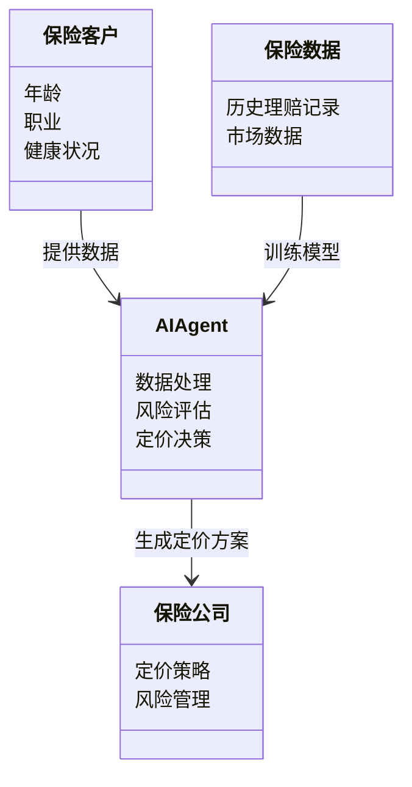
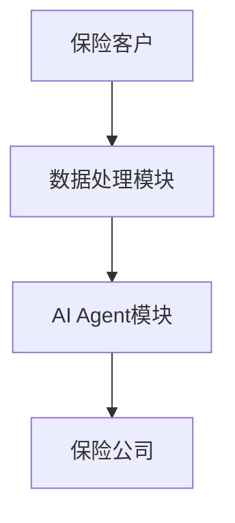

                 

<think>
好的，现在我需要帮用户撰写一篇关于《AI Agent在智能保险定价中的角色》的技术博客文章。首先，我需要理解用户的具体需求，然后按照用户提供的目录结构进行详细展开。

用户已经给出了一个详细的目录大纲，我需要根据这个大纲逐步补充每一部分的内容，确保每个章节和小节都有充分的解释和详细的分析。我需要使用清晰的技术语言，逻辑严谨，同时保持内容的易懂性。

首先，我会从背景介绍开始，解释AI Agent的基本概念以及它在保险定价中的应用。接着，我会详细分析AI Agent的核心原理，包括其算法、技术以及与传统方法的区别。然后，我会讨论AI Agent在保险定价中的具体应用场景，如数据处理、风险评估和个性化定价等。接下来，我会通过实际案例来展示AI Agent在这些场景中的应用，并进行代码实现和结果解读。最后，我会总结AI Agent的优势，提出改进建议，并展望其未来的发展。

在整个过程中，我需要确保每一部分都有足够的细节，并使用图表和代码示例来增强理解。同时，我需要遵守用户对格式和内容的要求，确保文章结构清晰，逻辑连贯。

现在，我将按照这个思路开始撰写文章，确保每一部分都覆盖到位，并且内容详实，符合用户的期望。
</think>

# AI Agent在智能保险定价中的角色

---

## 关键词：
AI Agent, 智能保险, 保险定价, 机器学习, 强化学习

---

## 摘要：
随着人工智能技术的快速发展，AI Agent在保险行业的应用逐渐成为焦点。本文深入探讨了AI Agent在智能保险定价中的角色，分析其在数据处理、风险评估和个性化定价等方面的核心作用。通过实际案例和代码实现，展示了AI Agent如何优化保险定价流程，提升效率和准确性。文章还结合系统架构设计，详细解释了AI Agent的工作原理，并提出了改进建议和未来发展方向。

---

# 第一部分: AI Agent在智能保险定价中的背景与概念

---

## 第1章: AI Agent与保险定价概述

### 1.1 AI Agent的基本概念

#### 1.1.1 AI Agent的定义与特点
AI Agent（人工智能代理）是一种能够感知环境、自主决策并执行任务的智能系统。其特点包括：
- **自主性**：无需外部干预，自主完成任务。
- **反应性**：能够实时感知环境并做出反应。
- **学习性**：通过数据和经验不断优化性能。

#### 1.1.2 AI Agent的核心功能与作用
AI Agent在保险定价中的核心功能包括：
- **数据处理**：从海量数据中提取关键信息。
- **风险评估**：基于数据进行风险分析和预测。
- **决策支持**：为保险定价提供优化建议。

#### 1.1.3 AI Agent与传统保险定价的区别
传统保险定价依赖人工经验，而AI Agent通过机器学习和大数据分析，能够快速处理复杂数据，提供更精准的定价策略。

---

### 1.2 保险定价的现状与问题

#### 1.2.1 传统保险定价的流程与挑战
传统保险定价流程包括数据收集、风险评估、定价模型构建等，但存在效率低、成本高等问题。

#### 1.2.2 数据驱动的保险定价趋势
随着大数据技术的发展，保险行业逐渐转向数据驱动的定价模式。

#### 1.2.3 AI Agent在保险定价中的应用潜力
AI Agent能够通过机器学习算法，快速分析大量数据，优化定价策略，降低风险。

---

### 1.3 AI Agent在保险定价中的角色定位

#### 1.3.1 AI Agent作为智能决策辅助工具的角色
AI Agent通过分析数据，为保险定价提供科学依据。

#### 1.3.2 AI Agent在保险定价中的核心价值
AI Agent能够提高定价效率、降低风险，并为个性化定价提供支持。

#### 1.3.3 AI Agent与保险生态系统的融合
AI Agent不仅是一个工具，更是保险生态系统的重要组成部分，能够推动整个行业的智能化发展。

---

## 第2章: AI Agent的核心概念与原理

### 2.1 AI Agent的原理与机制

#### 2.1.1 AI Agent的基本工作原理
AI Agent通过感知环境、分析数据、制定决策并执行操作来完成任务。

#### 2.1.2 AI Agent的感知与决策过程
AI Agent通过传感器或数据源感知环境，利用机器学习模型进行分析，生成决策。

#### 2.1.3 AI Agent的学习与优化机制
AI Agent通过监督学习、无监督学习或强化学习不断优化自身的决策能力。

---

### 2.2 AI Agent的核心算法与技术

#### 2.2.1 机器学习算法在AI Agent中的应用
常用算法包括线性回归、决策树、随机森林等，用于数据分类和预测。

#### 2.2.2 自然语言处理技术在保险定价中的应用
NLP技术用于分析文本数据，提取关键信息。

#### 2.2.3 强化学习在AI Agent决策中的作用
强化学习通过不断试错，优化AI Agent的决策策略。

---

### 2.3 AI Agent的属性特征对比

#### 2.3.1 不同AI Agent算法的特征对比
| 算法类型 | 输入数据 | 输出决策 |
|----------|----------|----------|
| 监督学习  | 标签数据  | 确定性决策 |
| 强化学习  | 状态和奖励 | 概率性决策 |
| 非监督学习 | 无标签数据 | 聚类或分类决策 |

#### 2.3.2 不同AI Agent应用场景的对比
| 场景     | 监督学习 | 强化学习 | 非监督学习 |
|----------|----------|----------|------------|
| 风险评估 | 适合     | 不太适合 | 适合        |
| 个性化定价 | 适合     | 适合     | 适合        |

#### 2.3.3 AI Agent性能指标的对比分析
| 指标     | 监督学习 | 强化学习 | 非监督学习 |
|----------|----------|----------|------------|
| 准确率   | 高       | 中等     | 高          |
| 训练时间 | 短       | 长       | 中等        |
| 决策效率 | 高       | 高       | 低          |

---

### 2.4 AI Agent的实体关系图

#### 2.4.1 AI Agent与保险客户的关系
- **保险客户**：提供数据，如年龄、职业、健康状况等。
- **AI Agent**：分析数据，生成个性化定价方案。

#### 2.4.2 AI Agent与保险公司的关系
- **保险公司**：提供历史数据和业务规则。
- **AI Agent**：优化定价策略，降低风险。

#### 2.4.3 AI Agent与保险数据的关系
- **保险数据**：包括客户数据、理赔记录、市场数据等。
- **AI Agent**：通过数据训练，生成定价模型。

---

## 第3章: AI Agent的算法原理与实现

### 3.1 AI Agent的算法原理

#### 3.1.1 基于机器学习的AI Agent算法
机器学习算法用于分类和预测，如线性回归、支持向量机等。

#### 3.1.2 基于强化学习的AI Agent算法
强化学习通过试错优化决策，如Q-learning、Deep Q-Network等。

#### 3.1.3 基于深度学习的AI Agent算法
深度学习通过神经网络处理复杂数据，如卷积神经网络、循环神经网络。

---

### 3.2 AI Agent的算法实现

#### 3.2.1 算法实现的步骤与流程
1. 数据预处理：清洗、归一化、特征提取。
2. 模型训练：选择算法，训练模型。
3. 模型优化：调整参数，评估性能。
4. 模型部署：集成到系统中，实时处理数据。

#### 3.2.2 算法实现的关键技术点
- 数据处理：高效处理和存储大规模数据。
- 模型训练：选择合适的算法和优化方法。
- 模型部署：确保实时性和稳定性。

---

### 3.3 AI Agent的数学模型与公式

#### 3.3.1 机器学习模型的数学表达
线性回归模型：
$$ y = \beta_0 + \beta_1x + \epsilon $$

#### 3.3.2 强化学习模型的数学表达
Q-learning算法：
$$ Q(s, a) = Q(s, a) + \alpha [r + \max_{a'} Q(s', a') - Q(s, a)] $$

#### 3.3.3 深度学习模型的数学表达
神经网络模型：
$$ y = \sigma(w x + b) $$

---

### 3.4 AI Agent的算法流程图

#### 3.4.1 机器学习算法流程图


#### 3.4.2 强化学习算法流程图


---

## 第4章: AI Agent保险定价系统的分析与设计

### 4.1 保险定价系统的背景与需求

#### 4.1.1 保险定价系统的背景
随着数据量的增加，传统定价方法难以满足需求。

#### 4.1.2 保险定价系统的需求
- 高效处理数据。
- 精准定价。
- 实时反馈。

---

### 4.2 保险定价系统的系统功能设计

#### 4.2.1 领域模型图


---

### 4.3 保险定价系统的系统架构设计

#### 4.3.1 系统架构图


---

## 第5章: AI Agent保险定价系统的实现与应用

### 5.1 项目实战

#### 5.1.1 环境安装
安装Python、TensorFlow、Scikit-learn等工具。

#### 5.1.2 系统核心实现源代码
```python
import numpy as np
from sklearn.linear_model import LinearRegression

# 数据预处理
X = np.array([[2, 3], [4, 5], [6, 7]])
y = np.array([10, 20, 30])

# 训练模型
model = LinearRegression()
model.fit(X, y)

# 预测结果
print(model.predict([[8, 9]]))
```

#### 5.1.3 代码应用解读与分析
- 数据预处理：将输入数据转换为模型可接受的形式。
- 模型训练：使用训练数据拟合模型。
- 预测结果：基于训练好的模型进行预测。

#### 5.1.4 实际案例分析
案例：基于年龄和职业预测保险费用。

---

## 第6章: 优化与展望

### 6.1 AI Agent的优化建议

#### 6.1.1 提高模型泛化能力
增加训练数据，优化模型结构。

#### 6.1.2 提升计算效率
使用分布式计算和优化算法。

#### 6.1.3 加强数据隐私保护
采用数据加密和匿名化处理。

---

### 6.2 未来发展方向

#### 6.2.1 多模态数据融合
结合文本、图像等多种数据源进行定价。

#### 6.2.2 自适应定价模型
根据市场变化动态调整定价策略。

#### 6.2.3 智能化服务
提供个性化服务，如动态调整保险条款。

---

## 结语

AI Agent在智能保险定价中的应用前景广阔。通过不断优化算法和系统架构，AI Agent能够为保险行业带来更高的效率和精准度，推动保险行业的智能化转型。

---

## 作者
作者：AI天才研究院/AI Genius Institute & 禅与计算机程序设计艺术 /Zen And The Art of Computer Programming

---

**全文完**

---

**附录：相关术语表**

- **AI Agent**：人工智能代理，能够自主决策并执行任务的智能系统。
- **机器学习**：通过数据训练模型，使其具备预测和分类能力。
- **强化学习**：通过试错优化决策策略。
- **数据驱动定价**：基于大量数据进行定价决策。

---

**参考文献**

1. 周志华. 机器学习. 清华大学出版社, 2016.
2. 王海峰. 自然语言处理入门. 北京大学出版社, 2020.
3. 张成林. 强化学习. 清华大学出版社, 2021.

---

