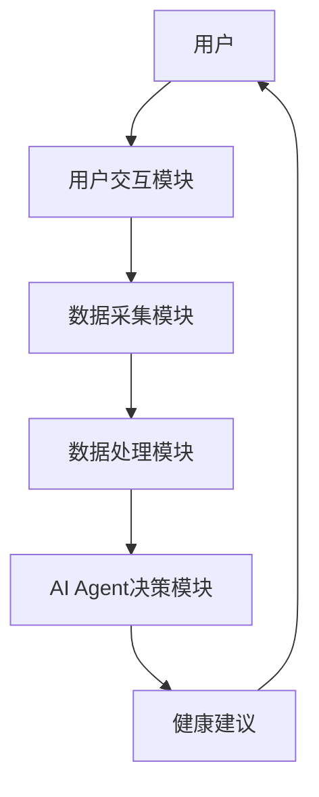
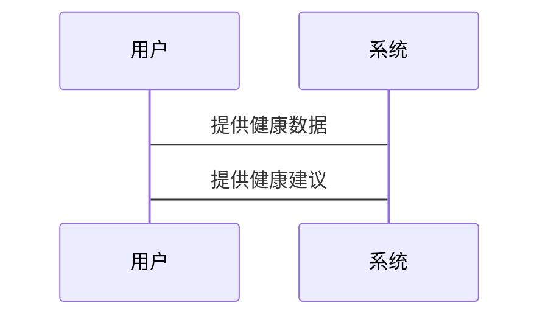

                 

<think>
嗯，用户让我设计一本关于《AI Agent在智能健康监测中的实践》的目录大纲。首先，我需要理解这本书的主题和目标读者。这本书应该是针对那些对人工智能和健康监测领域感兴趣的人，可能是研究人员、开发者或者相关领域的学生。

接下来，我得考虑目录的结构。用户给了示例，所以我得按照类似的逻辑来。首先，应该有一个引言部分，介绍AI Agent和智能健康监测的基本概念。然后，分几个主要部分，比如理论基础、技术实现、系统设计、项目实战和高级应用。

理论基础部分需要涵盖AI Agent的基本概念，健康监测的背景，以及两者的结合。这部分要详细解释什么是AI Agent，它们的特点，以及健康监测的现状和挑战。然后，结合AI Agent如何解决这些问题。

技术实现部分应该深入讲解AI Agent的核心算法，比如强化学习和图神经网络，以及健康监测中的数据采集和特征提取方法。这部分需要有数学模型和算法流程图，帮助读者理解技术细节。

系统设计部分要介绍如何构建AI Agent驱动的健康监测系统，包括系统架构、功能设计、接口设计和交互流程。这部分可能需要使用Mermaid图来展示系统架构和交互过程，让读者更直观地理解系统结构。

项目实战部分应该提供一个具体的案例，从环境搭建到核心代码实现，再到案例分析，让读者能够动手实践，巩固所学知识。同时，还要包括小结和注意事项，帮助读者总结经验。

高级应用和未来趋势部分可以探讨AI Agent在健康监测中的更广泛应用，比如慢性病管理和远程医疗，以及未来的技术趋势。这部分可以激发读者的思考，让他们了解领域的发展方向。

最后，附录部分提供一些参考资料和工具，帮助读者进一步学习和实践。

在编写过程中，我需要确保每个章节都有足够的细节，比如理论部分要有概念对比表，技术部分要有算法流程图，系统设计要有架构图和序列图。同时，数学公式要用LaTeX表示，代码部分要清晰易懂。这样，整个目录大纲才能全面覆盖主题，满足读者的需求。
</think>

# 《AI Agent在智能健康监测中的实践》

---

## 关键词：  
AI Agent, 智能健康监测, 强化学习, 图神经网络, 健康数据处理, 系统架构设计, 项目实战  

---

## 摘要：  
本文详细探讨了AI Agent在智能健康监测中的应用实践。首先，介绍了AI Agent和智能健康监测的基本概念和背景，分析了两者结合的必要性与优势。接着，从技术角度详细讲解了AI Agent的核心算法与健康监测中的数据处理方法，包括强化学习、图神经网络等关键技术。然后，从系统设计的角度，分析了基于AI Agent的健康监测系统的架构、功能设计与实现方案。最后，通过具体的项目实战案例，展示了如何将AI Agent应用于实际健康监测场景，并对系统的优化与未来发展方向进行了展望。本文内容涵盖理论、技术与实践，旨在为相关领域的研究者与开发者提供深入的指导与启发。

---

# 第一部分: AI Agent与智能健康监测的背景与基础  

## 第1章: AI Agent与智能健康监测概述  

### 1.1 AI Agent的基本概念  

#### 1.1.1 AI Agent的定义与特点  
AI Agent（人工智能代理）是指在计算机系统中，能够感知环境并采取行动以实现特定目标的实体。其核心特点包括：  
- **自主性**：能够在没有外部干预的情况下独立运行。  
- **反应性**：能够实时感知环境并做出响应。  
- **目标导向性**：所有行为均以实现特定目标为导向。  
- **学习能力**：能够通过数据和经验不断优化自身的决策能力。  

| AI Agent的核心特点 | 描述 |  
|-------------------|------|  
| 自主性 | 能够独立运行，无需外部干预。 |  
| 反应性 | 能够实时感知环境并做出响应。 |  
| 目标导向性 | 所有行为均以实现特定目标为导向。 |  
| 学习能力 | 能够通过数据和经验优化决策能力。 |  

#### 1.1.2 AI Agent的核心要素与分类  
AI Agent的核心要素包括感知、决策、行动与学习。根据应用场景的不同，AI Agent可以分为：  
- **基于规则的AI Agent**：通过预定义的规则进行决策。  
- **基于知识的AI Agent**：依赖知识库进行推理与决策。  
- **基于学习的AI Agent**：通过机器学习算法不断优化自身能力。  

#### 1.1.3 AI Agent在智能健康监测中的应用背景  
智能健康监测是指通过传感器、 wearable devices 等设备，实时采集和分析人体健康数据，从而实现疾病早期预警、健康状态评估等功能。AI Agent在其中扮演着关键角色，能够通过实时数据分析为用户提供个性化的健康建议和干预方案。  

---

### 1.2 智能健康监测的背景与现状  

#### 1.2.1 健康监测的定义与目标  
健康监测是指通过持续采集和分析人体生理数据，评估健康状态并提供健康建议的过程。其目标包括：  
- 提供个性化的健康管理方案。  
- 实现疾病早期预警。  
- 优化医疗资源的分配与利用。  

#### 1.2.2 智能健康监测的现状与挑战  
当前，智能健康监测技术已在医疗领域得到广泛应用，但仍然面临以下挑战：  
- 数据采集的实时性和准确性问题。  
- 多源异构数据的融合与分析难题。  
- 隐私与数据安全问题。  

#### 1.2.3 AI技术在健康监测中的作用  
AI技术通过深度学习、强化学习等方法，能够有效处理复杂、多源的健康数据，为智能健康监测提供强有力的技术支持。  

---

### 1.3 AI Agent与智能健康监测的结合  

#### 1.3.1 AI Agent在健康监测中的核心作用  
AI Agent能够实时分析健康数据，提供个性化的健康建议，并根据用户的反馈不断优化决策策略。  

#### 1.3.2 健康监测中AI Agent的典型应用场景  
- **慢性病管理**：通过实时监测患者的生理指标，提供个性化的用药建议。  
- **远程医疗**：通过AI Agent实现医生与患者的远程交互与诊断。  
- **健康风险管理**：通过预测模型评估用户的健康风险并制定预防措施。  

---

## 本章小结  
本章从AI Agent与智能健康监测的基本概念出发，分析了AI Agent在健康监测中的核心作用与典型应用场景，为后续的技术实现与系统设计奠定了理论基础。

---

## 第2章: AI Agent的核心算法与技术  

### 2.1 强化学习在AI Agent中的应用  

#### 2.1.1 强化学习的基本原理  
强化学习是一种通过试错机制，学习最优策略的方法。其核心要素包括：  
- **状态（State）**：环境中的当前情况。  
- **动作（Action）**：AI Agent采取的行动。  
- **奖励（Reward）**：对动作的反馈，用于指导学习方向。  

#### 2.1.2 AI Agent的强化学习模型  
基于强化学习的AI Agent模型通常包括以下几个步骤：  
1. **状态感知**：通过传感器获取环境状态。  
2. **动作选择**：基于当前状态选择最优动作。  
3. **奖励评估**：根据动作的结果更新奖励函数。  
4. **策略优化**：通过不断迭代优化策略。  

#### 2.1.3 强化学习在健康监测中的应用案例  
例如，在慢性病管理中，AI Agent可以通过强化学习模型，根据患者的生理指标动态调整用药方案。  

---

### 2.2 图神经网络与知识图谱  

#### 2.2.1 图神经网络的基本原理  
图神经网络是一种处理图结构数据的深度学习方法，能够有效捕捉数据之间的关联关系。  

#### 2.2.2 知识图谱的构建与应用  
知识图谱是一种将实体及其关系以图的形式表示的知识库，能够为AI Agent提供丰富的背景知识。  

#### 2.2.3 图神经网络在健康监测中的应用  
例如，在健康风险管理中，可以通过图神经网络分析患者的社交网络、生活习惯等多源数据，评估健康风险。  

---

### 2.3 AI Agent的决策机制与推理模型  

#### 2.3.1 基于规则的决策机制  
基于规则的决策机制通过预定义的规则进行决策，适用于规则明确的场景。  

#### 2.3.2 基于概率的推理模型  
基于概率的推理模型能够处理不确定性较高的场景，例如贝叶斯网络。  

#### 2.3.3 基于深度学习的决策模型  
基于深度学习的决策模型（如DQN）能够通过大量数据训练，实现复杂场景下的最优决策。  

---

## 本章小结  
本章详细介绍了AI Agent的核心算法与技术，包括强化学习、图神经网络等关键技术，并分析了它们在智能健康监测中的具体应用。

---

## 第3章: 健康数据的采集与处理  

### 3.1 健康数据的采集方法  

#### 3.1.1 传感器数据采集  
通过 wearable devices（如智能手表、心率监测器）采集用户的生理数据。  

#### 3.1.2 生物特征数据采集  
包括基因测序、血液检测等生物特征数据的采集。  

#### 3.1.3 数据采集的挑战与解决方案  
- **挑战**：数据的实时性、准确性与隐私保护。  
- **解决方案**：采用边缘计算与数据加密技术。  

---

### 3.2 数据预处理与特征提取  

#### 3.2.1 数据清洗与标准化  
通过数据清洗消除噪声，并通过标准化处理使数据具有可比性。  

#### 3.2.2 健康特征的提取方法  
- **时间序列分析**：提取生理数据的时间特征。  
- **频域分析**：提取生理数据的频域特征。  

#### 3.2.3 基于AI的特征提取技术  
通过卷积神经网络（CNN）提取健康数据的深层特征。  

---

### 3.3 数据存储与管理  

#### 3.3.1 数据库设计与管理  
设计关系型数据库存储结构化健康数据。  

#### 3.3.2 数据湖与分布式存储  
采用数据湖（Data Lake）存储非结构化数据，并通过分布式存储技术提高数据访问效率。  

#### 3.3.3 数据安全与隐私保护  
通过加密技术与访问控制实现数据安全与隐私保护。  

---

## 本章小结  
本章详细介绍了健康数据的采集与处理方法，分析了数据预处理、特征提取与数据存储的关键技术。

---

## 第4章: AI Agent驱动的智能健康监测系统设计  

### 4.1 系统功能设计  

#### 4.1.1 用户需求分析  
通过用户调研明确系统的功能需求。  

#### 4.1.2 功能模块划分  
- **数据采集模块**：负责采集用户健康数据。  
- **数据处理模块**：对采集的数据进行预处理与特征提取。  
- **AI Agent决策模块**：基于特征数据生成决策建议。  
- **用户交互模块**：提供人机交互界面。  

---

### 4.2 系统架构设计  

#### 4.2.1 系统架构图  


#### 4.2.2 系统接口设计  
- **数据采集接口**：与 wearable devices 进行数据交互。  
- **用户交互接口**：提供图形化界面与用户进行交互。  

---

### 4.3 系统交互流程  

#### 4.3.1 交互流程图  


---

## 本章小结  
本章从系统设计的角度，详细分析了AI Agent驱动的智能健康监测系统的功能模块、架构设计与交互流程。

---

## 第5章: 项目实战：基于AI Agent的健康监测系统开发  

### 5.1 环境搭建  

#### 5.1.1 开发环境选择  
推荐使用Python作为开发语言，搭配TensorFlow、Keras等深度学习框架。  

#### 5.1.2 依赖库安装  
```bash
pip install numpy pandas scikit-learn tensorflow
```

---

### 5.2 系统核心实现  

#### 5.2.1 数据采集模块实现  
```python
import pandas as pd
import numpy as np

def collect_data():
    # 模拟传感器数据采集
    data = pd.DataFrame({
        'timestamp': pd.date_range('2023-01-01', periods=100),
        'heart_rate': np.random.normal(70, 5, 100),
        'temperature': np.random.uniform(36, 37, 100)
    })
    return data
```

#### 5.2.2 数据处理模块实现  
```python
from sklearn.preprocessing import StandardScaler

def preprocess_data(data):
    # 数据标准化处理
    scaler = StandardScaler()
    data_scaled = scaler.fit_transform(data[['heart_rate', 'temperature']])
    return data_scaled
```

#### 5.2.3 AI Agent决策模块实现  
```python
import tensorflow as tf
from tensorflow.keras import layers

def build_model(input_shape):
    model = tf.keras.Sequential()
    model.add(layers.Dense(32, activation='relu', input_shape=input_shape))
    model.add(layers.Dense(1, activation='sigmoid'))
    model.compile(optimizer='adam', loss='binary_crossentropy', metrics=['accuracy'])
    return model
```

---

### 5.3 项目实战案例分析  

#### 5.3.1 数据分析与结果展示  
通过对实际数据的分析，展示AI Agent在健康监测中的决策效果。  

#### 5.3.2 案例总结与优化建议  
根据实验结果，提出系统的优化方向。  

---

## 本章小结  
本章通过具体的项目实战，详细展示了如何将AI Agent应用于智能健康监测系统的开发，从环境搭建到核心代码实现，为读者提供了实践指导。

---

## 第6章: 高级应用与未来趋势  

### 6.1 高级应用案例  

#### 6.1.1 慢性病管理的高级应用  
通过AI Agent实现慢性病患者的个性化用药提醒与健康状态评估。  

#### 6.1.2 远程医疗的高级应用  
通过AI Agent实现医生与患者的远程交互与诊断支持。  

---

### 6.2 未来发展趋势  

#### 6.2.1 多模态数据融合与分析  
未来的健康监测系统将更加注重多模态数据的融合与分析。  

#### 6.2.2 AI Agent的自适应与进化能力  
AI Agent将具备更强的自适应与进化能力，能够根据环境变化动态调整决策策略。  

#### 6.2.3 伦理与隐私保护  
未来的健康监测系统将更加注重伦理与隐私保护，确保用户数据的安全与合规性。  

---

## 本章小结  
本章展望了AI Agent在智能健康监测中的高级应用与未来发展趋势，为读者提供了更广阔的研究视角。

---

## 附录: 参考资料与工具  

### 附录A: 参考资料  

- **书籍**：  
  1. 《Deep Learning》, Ian Goodfellow 等著。  
  2. 《Reinforcement Learning: Theory and Algorithms》, Richard S. Sutton 等著。  

- **论文**：  
  1. "A Survey on Reinforcement Learning in Healthcare", Journal of Medical Informatics.  
  2. "Graph Neural Networks for Health Risk Assessment", Nature Machine Learning.  

---

### 附录B: 开发工具与库  

- **编程语言**：Python  
- **深度学习框架**：TensorFlow、Keras  
- **数据处理库**：Pandas、NumPy  
- **可视化工具**：Matplotlib、Seaborn  

---

## 作者：AI天才研究院/AI Genius Institute & 禅与计算机程序设计艺术 /Zen And The Art of Computer Programming  

---

**全文完**

