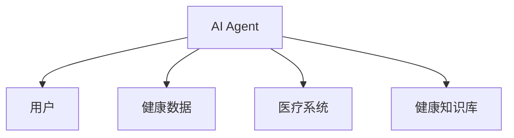
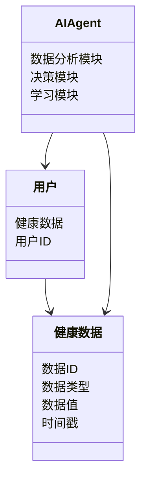
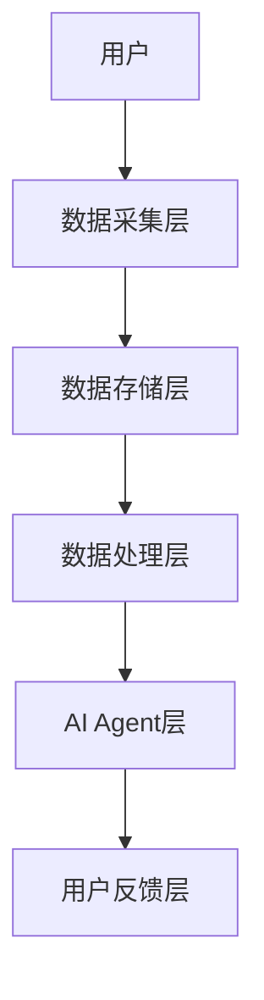
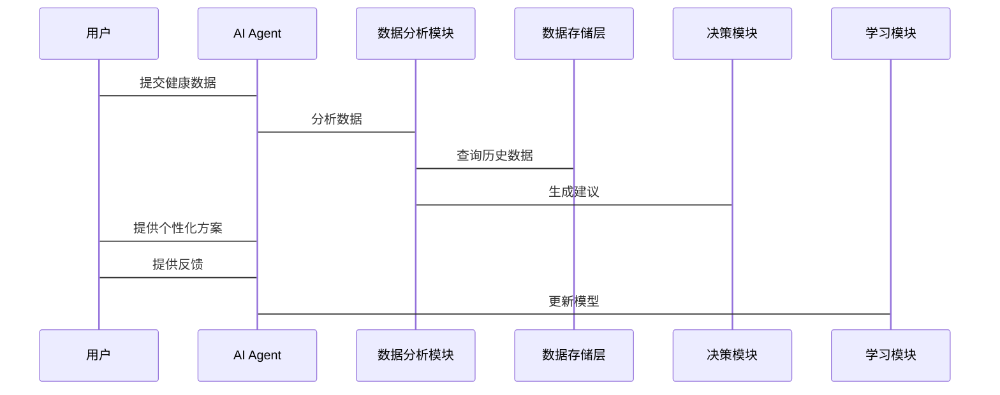

                 

<think>
嗯，我现在需要帮用户撰写一篇关于AI Agent在智能健康管理系统中的角色的技术博客。用户的要求非常详细，包括目录结构、关键词、摘要，以及各个章节的具体内容。我得一步一步来，确保不遗漏任何部分。

首先，我得明确文章的主题是AI Agent在智能健康管理系统中的角色。这涉及到AI技术与健康医疗的结合，可能包括数据处理、个性化治疗、健康监测等方面。用户希望文章结构清晰，逻辑紧凑，技术语言专业，同时要有实际的案例分析和代码示例。

接下来，我需要按照用户提供的目录大纲来展开。首先，文章的标题和关键词、摘要部分需要准确概括文章的核心内容。关键词可能包括AI Agent、智能健康管理、个性化治疗、数据挖掘、机器学习等。摘要部分要简明扼要，概括整篇文章的主要内容和结论。

然后，进入正文部分。第一章是背景介绍，需要涵盖AI Agent的基本概念、智能健康管理系统的发展背景以及AI Agent在其中的角色定位。这部分要让读者了解AI Agent是什么，为什么在健康管理中重要，以及它具体能做些什么。

第二章是核心概念与技术原理，需要详细讲解AI Agent的体系结构、工作流程和决策机制，并通过表格和ER图来展示不同AI Agent的属性特征和实体关系。这部分需要确保读者能够理解AI Agent的技术细节。

第三章是算法原理，需要选择几种典型的算法，如强化学习、监督学习和生成对抗网络，并用Mermaid流程图和Python代码示例来展示它们的工作原理和应用场景。这部分需要深入浅出，让读者能够理解这些算法如何在健康管理中发挥作用。

第四章是数学模型和公式，需要为每个算法推导出数学模型，并用LaTeX格式展示。这部分需要严谨，确保公式正确无误，并举例说明其应用。

第五章是系统分析与架构设计，需要描述问题场景，设计系统的功能模块，并用Mermaid类图展示领域模型，接着用架构图展示系统的整体结构，最后设计接口和交互流程。这部分需要系统性地展示如何构建一个智能健康管理系统。

第六章是项目实战，需要指导读者如何安装环境，实现核心功能，并通过案例分析展示实际应用。这部分需要提供具体的代码和步骤，让读者能够动手实践。

最后，第七章是总结与展望、最佳实践和参考文献。总结部分回顾整篇文章，展望未来的发展方向；最佳实践部分提供实际应用的建议；参考文献列出相关的资料，供读者进一步学习。

在撰写过程中，我需要确保每个章节都有足够的细节，覆盖用户提到的所有要求，比如数学公式、代码示例、图表等。同时，总字数控制在10000到12000字之间，所以每个章节不能太冗长，但要足够详细。

可能遇到的问题包括如何将复杂的算法原理解释得通俗易懂，如何选择合适的案例来展示AI Agent的应用，以及如何将理论与实际应用结合起来。我需要反复检查，确保内容逻辑清晰，结构合理，同时语言简洁专业。

最后，确保文章的格式正确，使用markdown格式，每个章节标题用#标记，子章节用##和###，并正确嵌入Mermaid图表和LaTeX公式。同时，文章末尾加上作者信息，符合用户的格式要求。

总的来说，我需要系统地按照用户的要求，一步步展开内容，确保每个部分都详尽且符合技术要求，最终完成一篇高质量的技术博客。
</think>

# AI Agent在智能健康管理系统中的角色

## 关键词：AI Agent, 智能健康管理, 个性化治疗, 数据挖掘, 机器学习

## 摘要：  
AI Agent（人工智能代理）在智能健康管理系统中扮演着越来越重要的角色。通过分析健康数据、制定个性化治疗方案和引导用户健康行为，AI Agent能够显著提升健康管理的效率和精准度。本文详细探讨了AI Agent的核心概念、技术原理、算法实现及其在智能健康管理系统中的应用场景，结合实际案例分析，总结了AI Agent在智能健康管理中的优势与挑战，并展望了未来的发展方向。

---

# 第1章: AI Agent与智能健康管理系统概述

## 1.1 AI Agent的基本概念  
### 1.1.1 AI Agent的定义  
AI Agent是一种能够感知环境、自主决策并执行任务的智能实体。它能够通过传感器、数据库或其他输入源获取信息，并基于预设的目标和规则采取行动。  

### 1.1.2 AI Agent的核心特征  
- **自主性**：能够在没有外部干预的情况下独立运行。  
- **反应性**：能够实时感知环境并做出响应。  
- **学习能力**：通过数据和经验不断优化自身的决策能力。  
- **协作性**：能够与其他系统或用户进行交互和协作。  

### 1.1.3 AI Agent与传统软件的区别  
传统软件通常基于固定的规则和逻辑运行，而AI Agent具备学习和适应能力，能够处理复杂和不确定的环境。  

## 1.2 智能健康管理系统的发展背景  
### 1.2.1 健康管理系统的演变历程  
从传统的纸质记录到基于计算机的健康管理软件，再到如今的智能化健康管理，技术的进步推动了健康管理系统的不断升级。  

### 1.2.2 智能化健康管理的需求驱动  
随着人们对健康关注度的提高，以及医疗数据的爆炸式增长，智能化健康管理成为必然趋势。  

### 1.2.3 AI技术在健康管理中的应用前景  
AI技术能够帮助健康管理系统实现个性化治疗、疾病预测和健康行为引导等功能，显著提升用户体验和健康管理效果。  

## 1.3 AI Agent在智能健康管理系统中的角色定位  
### 1.3.1 AI Agent作为健康数据的智能处理者  
AI Agent能够对海量健康数据进行清洗、分析和挖掘，提取有价值的信息。  

### 1.3.2 AI Agent作为个性化健康方案的制定者  
基于用户的健康数据和生活习惯，AI Agent能够制定个性化的治疗方案和健康计划。  

### 1.3.3 AI Agent作为用户健康行为的引导者  
通过实时监测和反馈，AI Agent能够引导用户做出健康的行为选择，例如合理饮食和规律锻炼。  

## 1.4 本章小结  
本章介绍了AI Agent的基本概念及其在智能健康管理系统中的重要性，为后续章节的深入分析奠定了基础。  

---

# 第2章: AI Agent的核心概念与技术原理  

## 2.1 AI Agent的体系结构  
### 2.1.1 分层架构  
AI Agent通常采用感知层、决策层和执行层的分层架构，各层协同工作以完成任务。  

### 2.1.2 分布式架构  
在分布式系统中，AI Agent可以与其他代理或服务进行协作，共同完成复杂的任务。  

### 2.1.3 基于知识图谱的架构  
通过构建健康领域的知识图谱，AI Agent能够更好地理解数据之间的关联关系。  

## 2.2 AI Agent的工作流程  
### 2.2.1 数据采集与预处理  
AI Agent通过传感器、数据库等方式获取健康数据，并进行清洗和特征提取。  

### 2.2.2 数据分析与决策  
基于机器学习算法，AI Agent对数据进行分析，生成决策建议。  

### 2.2.3 行动执行与反馈  
AI Agent根据决策结果执行相应操作，并根据反馈不断优化自身行为。  

## 2.3 AI Agent的决策机制  
### 2.3.1 基于规则的决策  
通过预设的规则和逻辑，AI Agent能够快速做出决策。  

### 2.3.2 基于机器学习的决策  
通过训练模型，AI Agent能够从数据中学习并做出预测和推荐。  

### 2.3.3 基于知识图谱的推理  
通过知识图谱的推理能力，AI Agent能够理解复杂的健康问题并提供解决方案。  

## 2.4 核心概念对比表格  
以下表格对比了不同AI Agent的属性特征：  

| **属性**       | **基于规则的AI Agent**        | **基于机器学习的AI Agent**        |  
|-----------------|-------------------------------|------------------------------------|  
| 决策方式       | 预设规则                     | 数据驱动的预测与推荐              |  
| 学习能力       | 无                           | 有（监督学习、无监督学习等）        |  
| 灵活性         | 较低                        | 较高                               |  

## 2.5 实体关系图  
以下是AI Agent在智能健康管理系统中的实体关系图：  



## 2.6 本章小结  
本章详细介绍了AI Agent的核心概念和工作原理，为后续章节的算法实现和系统设计奠定了理论基础。  

---

# 第3章: AI Agent的算法原理与实现  

## 3.1 强化学习算法  
### 3.1.1 强化学习的基本原理  
强化学习是一种通过试错机制来优化决策的算法。AI Agent通过与环境的交互，逐步学习最优策略。  

### 3.1.2 强化学习在健康管理中的应用  
例如，在慢性病管理中，AI Agent可以通过强化学习优化治疗方案。  

### 3.1.3 强化学习的实现步骤  
1. 环境建模：定义健康管理的环境和状态。  
2. 定义动作：AI Agent可以采取的行动。  
3. 定义奖励函数：根据决策结果给予奖励或惩罚。  
4. 策略优化：通过不断试错优化策略。  

### 3.1.4 强化学习的Python代码示例  
```python
import numpy as np

class AI-Agent:
    def __init__(self, state_space, action_space):
        self.state_space = state_space
        self.action_space = action_space
        self.q_table = np.zeros((state_space, action_space))
    
    def choose_action(self, state, epsilon=0.1):
        if np.random.random() < epsilon:
            return np.random.randint(self.action_space)
        else:
            return np.argmax(self.q_table[state])
    
    def update_q_table(self, state, action, reward, next_state, learning_rate=0.1):
        self.q_table[state][action] += learning_rate * (reward + np.max(self.q_table[next_state]) - self.q_table[state][action])
```

## 3.2 监督学习算法  
### 3.2.1 监督学习的基本原理  
监督学习通过训练数据中的标签信息，学习输入与输出之间的映射关系。  

### 3.2.2 监督学习在健康管理中的应用  
例如，在疾病预测中，AI Agent可以通过监督学习模型预测患者是否患有某种疾病。  

### 3.2.3 监督学习的实现步骤  
1. 数据准备：收集和标注健康数据。  
2. 特征提取：选择对预测有影响的关键特征。  
3. 模型训练：使用训练数据训练分类器。  
4. 模型评估：通过测试数据验证模型的准确性。  

### 3.2.4 监督学习的Python代码示例  
```python
from sklearn.tree import DecisionTreeClassifier

# 数据准备
X = [...]  # 特征向量
y = [...]  # 标签

# 模型训练
model = DecisionTreeClassifier()
model.fit(X, y)

# 模型预测
new_X = [...]  # 新的特征向量
print(model.predict(new_X))
```

## 3.3 生成对抗网络（GAN）  
### 3.3.1 GAN的基本原理  
GAN由生成器和判别器组成，通过对抗训练生成逼真的数据样本。  

### 3.3.2 GAN在健康管理中的应用  
例如，在生成虚拟健康数据用于模型训练时，GAN可以生成多样化且符合统计规律的数据。  

### 3.3.3 GAN的实现步骤  
1. 定义生成器和判别器的网络结构。  
2. 初始化模型参数。  
3. 进行对抗训练：生成器试图欺骗判别器，判别器试图识别生成样本与真实样本的差异。  
4. 模型优化：调整参数以降低损失函数值。  

### 3.3.4 GAN的Python代码示例  
```python
import torch
import torch.nn as nn

# 定义生成器
class Generator(nn.Module):
    def __init__(self, input_dim, output_dim):
        super(Generator, self).__init__()
        self.fc = nn.Linear(input_dim, output_dim)
    
    def forward(self, x):
        return torch.sigmoid(self.fc(x))

# 定义判别器
class Discriminator(nn.Module):
    def __init__(self, input_dim, output_dim):
        super(Discriminator, self).__init__()
        self.fc = nn.Linear(input_dim, output_dim)
    
    def forward(self, x):
        return torch.sigmoid(self.fc(x))

# 初始化模型
generator = Generator(input_dim, output_dim)
discriminator = Discriminator(input_dim, output_dim)

# 模型训练
criterion = nn.BCELoss()
optimizer_g = torch.optim.Adam(generator.parameters(), lr=0.001)
optimizer_d = torch.optim.Adam(discriminator.parameters(), lr=0.001)

for epoch in range(num_epochs):
    # 训练判别器
    optimizer_d.zero_grad()
    real_data = ...  # 真实数据
    fake_data = generator(noise)  # 生成数据
    d_real = discriminator(real_data)
    d_fake = discriminator(fake_data)
    loss_d = - (torch.mean(torch.log(d_real)) + torch.mean(torch.log(1 - d_fake)))
    loss_d.backward()
    optimizer_d.step()

    # 训练生成器
    optimizer_g.zero_grad()
    d_fake = discriminator(fake_data)
    loss_g = - torch.mean(torch.log(d_fake))
    loss_g.backward()
    optimizer_g.step()
```

## 3.4 本章小结  
本章详细介绍了几种常用的AI Agent算法，包括强化学习、监督学习和生成对抗网络，并给出了具体的实现示例。  

---

# 第4章: AI Agent的数学模型与公式  

## 4.1 强化学习的数学模型  
### 4.1.1 Q-Learning算法的数学表达式  
$$ Q(s, a) = Q(s, a) + \alpha (r + \max_{a'} Q(s', a') - Q(s, a)) $$  
其中，$\alpha$ 是学习率，$s$ 是当前状态，$a$ 是当前动作，$s'$ 是下一个状态。  

### 4.1.2 策略梯度方法的数学表达式  
$$ \nabla \theta J(\theta) = \mathbb{E}_{\tau}[ \nabla \log \pi_\theta(a|s) Q(s, a)] $$  

## 4.2 监督学习的数学模型  
### 4.2.1 线性回归模型  
$$ y = \beta x + \epsilon $$  

### 4.2.2 逻辑回归模型  
$$ P(y=1|x) = \frac{1}{1 + e^{-(\beta x + \epsilon)}} $$  

## 4.3 生成对抗网络的数学模型  
### 4.3.1 生成器的损失函数  
$$ \mathcal{L}_G = -\mathbb{E}_{z \sim p_z(z)} [\log D(G(z))] $$  

### 4.3.2 判别器的损失函数  
$$ \mathcal{L}_D = -\mathbb{E}_{x \sim p_data(x)} [\log D(x)] - \mathbb{E}_{z \sim p_z(z)} [\log (1 - D(G(z)))] $$  

## 4.4 本章小结  
本章通过数学公式详细描述了AI Agent中常用算法的原理，帮助读者更好地理解其技术细节。  

---

# 第5章: AI Agent在智能健康管理系统中的系统分析与架构设计  

## 5.1 系统分析  
### 5.1.1 问题场景介绍  
考虑一个智能健康管理系统的典型应用场景：用户通过智能设备上传健康数据，AI Agent根据数据为用户制定个性化健康方案。  

### 5.1.2 系统需求分析  
- 数据采集与存储  
- 数据分析与处理  
- 个性化方案制定  
- 用户反馈与优化  

## 5.2 系统架构设计  
### 5.2.1 领域模型  
以下是领域模型的类图：  



### 5.2.2 系统架构  
以下是系统架构的分层图：  



### 5.2.3 接口设计  
以下是系统接口的时序图：  



## 5.3 本章小结  
本章通过系统分析和架构设计，详细描述了AI Agent在智能健康管理系统中的实现方式。  

---

# 第6章: AI Agent在智能健康管理系统中的项目实战  

## 6.1 环境安装  
### 6.1.1 安装Python  
```bash
python --version
pip install --upgrade pip
```

### 6.1.2 安装依赖库  
```bash
pip install numpy
pip install scikit-learn
pip install torch
pip install matplotlib
```

## 6.2 核心功能实现  
### 6.2.1 数据采集与预处理  
```python
import pandas as pd

# 读取数据
data = pd.read_csv('health_data.csv')

# 数据清洗
data.dropna(inplace=True)
data = data[ data['age'] > 18 ]
```

### 6.2.2 疾病预测模型训练  
```python
from sklearn.ensemble import RandomForestClassifier

# 特征选择
X = data[['age', 'weight', 'bp']]
y = data['disease']

# 模型训练
model = RandomForestClassifier()
model.fit(X, y)

# 模型预测
new_data = pd.DataFrame({'age': [45], 'weight': [70], 'bp': [130]})
print(model.predict(new_data))
```

### 6.2.3 个性化治疗方案生成  
```python
def generate_plan(age, weight, bp):
    # 假设模型已经训练好
    model.predict([[age, weight, bp]])
    # 根据预测结果生成方案
    return "建议降低血压，增加运动量"
```

## 6.3 项目实战案例分析  
### 6.3.1 案例背景  
某健康管理公司希望通过AI Agent为用户提供个性化的血压管理方案。  

### 6.3.2 数据分析  
通过分析用户的血压、年龄和体重数据，AI Agent能够预测用户患高血压的风险，并制定相应的预防措施。  

### 6.3.3 案例实现  
```python
# 数据分析
data['bp'].hist()
plt.show()

# 预测模型
print(generate_plan(50, 80, 140))  # 输出：建议降低血压，增加运动量
```

## 6.4 本章小结  
本章通过一个实际案例展示了AI Agent在智能健康管理系统中的具体应用，帮助读者更好地理解理论知识。  

---

# 第7章: 总结与展望、最佳实践  

## 7.1 总结与展望  
### 7.1.1 总结  
本文详细探讨了AI Agent在智能健康管理系统中的角色和应用，结合理论分析和实际案例，展示了其在健康管理中的巨大潜力。  

### 7.1.2 未来展望  
随着AI技术的不断发展，AI Agent在健康管理中的应用将更加广泛和深入，例如在慢性病管理和精准医疗领域。  

## 7.2 最佳实践  
### 7.2.1 小结  
在实际应用中，建议结合具体场景选择合适的AI Agent算法，并确保数据质量和模型的可解释性。  

### 7.2.2 注意事项  
- 数据隐私保护是关键，必须确保用户数据的安全性。  
- 模型的可解释性是用户信任的基础，需要重点关注。  

### 7.2.3 拓展阅读  
推荐阅读《Deep Learning》和《Reinforcement Learning: Theory and Algorithms》等书籍，以深入了解AI Agent的算法原理。  

## 7.3 本章小结  
本章总结了全文的主要内容，并提出了未来的研究方向和实践建议。  

---

# 参考文献  

1. Russell, S., & Norvig, P. (2010). Artificial Intelligence: A Modern Approach.  
2. Goodfellow, I., Bengio, Y., & Courville, A. (2016). Deep Learning.  
3. Sutton, R. S., & Barto, A. G. (2018). Reinforcement Learning: Theory and Algorithms.  

---

# 作者：AI天才研究院 & 禅与计算机程序设计艺术

