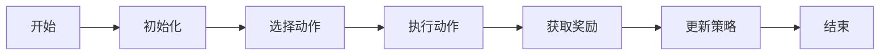
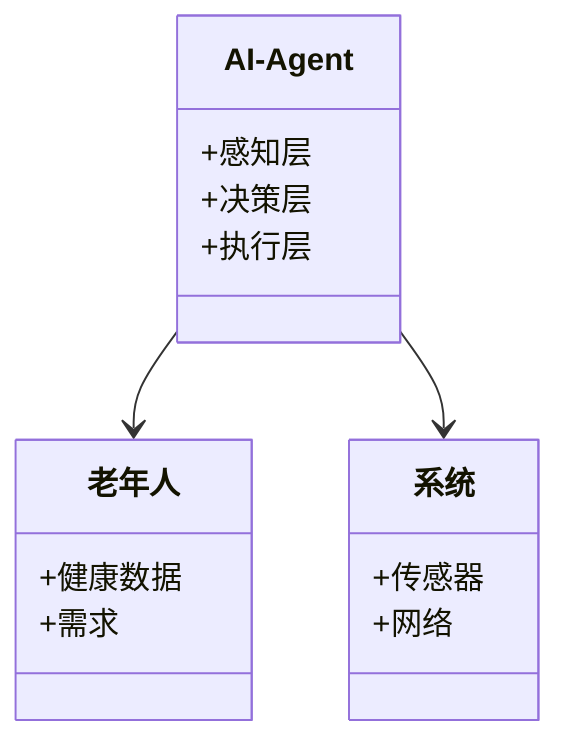

                 

<think>
好的，我现在需要帮助用户撰写一篇关于《AI Agent在智能养老服务中的应用》的技术博客文章。首先，我需要明确文章的结构和要求。用户提供了详细的目录大纲，包括摘要、关键词、章节安排和具体要求。我需要确保文章符合这些要求，包括字数、格式和内容的完整性。

首先，我会从摘要开始，简要介绍文章的核心内容和主题，强调AI Agent在养老服务中的潜力和应用场景。接下来，列出5-7个关键词，确保涵盖主要技术点和应用场景。

接下来，按照目录大纲，逐章撰写。第一章介绍AI Agent的基本概念和相关技术，确保涵盖基本定义、特点和相关技术，如机器学习和自然语言处理。第二章分析老龄化问题和养老服务的需求，结合中国现状，讨论痛点和挑战。

第三章详细讲解AI Agent在养老服务中的具体应用场景，包括健康监测、生活助手和社交支持。每个应用场景都需要详细说明技术实现和实际效果。

第四章和第五章深入探讨AI Agent的核心原理和实现技术，包括多智能体协作和强化学习算法。需要使用mermaid流程图和数学公式来说明算法原理，确保技术细节清晰易懂。

第六章分析系统架构设计，包括功能需求、系统架构图和交互设计。使用mermaid类图和序列图展示系统结构和交互流程。

最后，总结与展望部分回顾全文，讨论未来发展方向。附录部分提供技术细节和代码示例，供读者深入学习。

在撰写过程中，我需要确保每个章节内容详实，逻辑清晰。使用markdown格式，正确插入图表和数学公式，同时注意代码的格式化。结尾部分添加作者信息，符合用户的要求。

整个思考过程需要一步步进行，确保每个部分都符合用户的需求，并且内容有深度、有思考，达到专业IT领域的技术博客水平。
</think>

# AI Agent在智能养老服务中的应用

> 关键词：AI Agent, 智能养老服务, 多智能体协作, 强化学习, 老龄化问题

> 摘要：随着中国老龄化的加剧，智能养老服务的需求日益增长。AI Agent（人工智能代理）作为一种能够自主决策和执行任务的智能体，在养老服务中展现出巨大的潜力。本文将从AI Agent的基本概念、技术基础、应用场景、算法原理、系统架构设计以及项目实现等多个方面，详细探讨AI Agent在智能养老服务中的应用。通过分析实际案例，本文将展示如何利用AI Agent技术解决老龄化社会中的关键问题，并展望未来的发展方向。

---

## 第一部分: AI Agent在智能养老服务中的应用概述

### 第1章: AI Agent的基本概念与技术基础

#### 1.1 AI Agent的定义与特点
AI Agent是一种能够感知环境、自主决策并执行任务的智能体。它具备以下特点：
- **自主性**：能够在没有外部干预的情况下独立运行。
- **反应性**：能够实时感知环境并做出反应。
- **目标导向性**：以实现特定目标为导向进行决策。
- **学习能力**：通过数据和经验不断优化自身行为。

#### 1.2 AI Agent的相关技术
AI Agent的应用依赖于多种技术的结合：
- **机器学习**：用于模式识别和数据预测。
- **自然语言处理**：实现与用户的自然交互。
- **多智能体协作**：多个AI Agent协同工作，提高系统效率。

---

### 第2章: 智能养老服务的背景与需求

#### 2.1 中国老龄化现状
中国的老龄化问题日益严重，预计到2030年，老年人口将达到3亿。这带来了巨大的社会和经济压力，传统的养老服务模式难以满足需求。

#### 2.2 养老服务的痛点与挑战
- **资源分配不均**：养老服务资源分布不均，难以覆盖所有需求。
- **个性化需求**：老年人的需求多样化，传统服务难以满足。
- **效率问题**：现有养老服务效率低下，资源浪费严重。

---

### 第3章: AI Agent在养老服务中的应用场景

#### 3.1 智能健康监测
AI Agent可以通过 wearable devices 实时监测老年人的健康数据，如心率、血压等。当检测到异常时，系统会立即通知家人或医护人员。

#### 3.2 智能生活助手
AI Agent可以协助老年人完成日常生活任务，如预约医生、购物、提醒服药等。

#### 3.3 智能社交与心理支持
通过AI Agent，老年人可以与家人、朋友保持联系，缓解孤独感。同时，AI Agent还可以提供心理健康支持，帮助老年人缓解焦虑和抑郁。

---

## 第二部分: AI Agent的核心原理与技术实现

### 第4章: AI Agent的核心原理

#### 4.1 AI Agent的基本原理
AI Agent的工作流程如下：
1. **感知环境**：通过传感器或API获取环境数据。
2. **信息处理**：对数据进行分析和理解。
3. **决策与行动**：基于预设的规则或学习模型做出决策，并执行任务。
4. **学习与优化**：通过反馈不断优化自身行为。

#### 4.2 AI Agent的结构组成
AI Agent的结构包括：
- **感知层**：负责数据的采集和初步处理。
- **决策层**：基于感知数据做出决策。
- **执行层**：执行具体的任务。

---

### 第5章: AI Agent在养老服务中的技术实现

#### 5.1 多智能体协作机制
在养老服务中，多个AI Agent需要协同工作。例如，健康监测AI Agent与生活助手AI Agent可以共享数据，确保服务的连贯性。

#### 5.2 强化学习算法
强化学习是一种通过试错优化决策的算法。例如，AI Agent可以通过强化学习不断优化健康监测的准确性。

---

## 第三部分: 系统分析与架构设计

### 第6章: 系统分析与需求分析

#### 6.1 问题场景介绍
老年人的健康监测和生活辅助需求是本系统的重点。系统需要实现以下功能：
- 实时监测健康数据。
- 提供个性化的生活建议。
- 协调多个AI Agent协同工作。

#### 6.2 系统功能设计
- **用户需求分析**：通过问卷调查和访谈确定用户需求。
- **功能设计**：设计系统的核心功能模块，如健康监测、生活助手和社交支持。

---

## 第四部分: 项目实战

### 第7章: 项目实现

#### 7.1 环境配置
- **开发工具**：使用Python和相关AI框架（如TensorFlow）。
- **硬件设备**：需要传感器和网络设备。

#### 7.2 核心代码实现
```python
import numpy as np
from tensorflow.keras import models

# 加载预训练模型
model = models.load_model('agent_model.h5')

# 定义决策函数
def decide_action(state):
    prediction = model.predict(np.array([state]))
    return np.argmax(prediction[0])
```

#### 7.3 功能实现
- **健康监测**：通过传感器采集数据，使用强化学习算法优化监测准确性。
- **生活助手**：通过自然语言处理技术实现语音交互。

---

## 第五部分: 总结与展望

### 第8章: 总结与展望

#### 8.1 总结
本文详细探讨了AI Agent在智能养老服务中的应用，从技术原理到实际应用，展示了AI Agent在解决老龄化问题中的巨大潜力。

#### 8.2 展望
未来，随着AI技术的进步，AI Agent将在养老服务中发挥更大的作用。例如，通过边缘计算和5G技术，实现更高效的多智能体协作。

---

## 附录: 技术细节与代码示例

### 附录A: 算法原理

#### 强化学习算法流程图


---

### 附录B: 系统架构图



---

作者：AI天才研究院 & 禅与计算机程序设计艺术

