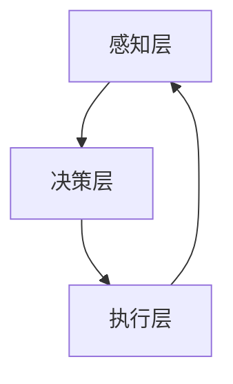
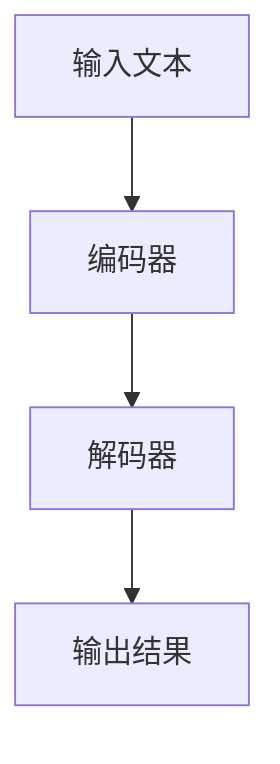
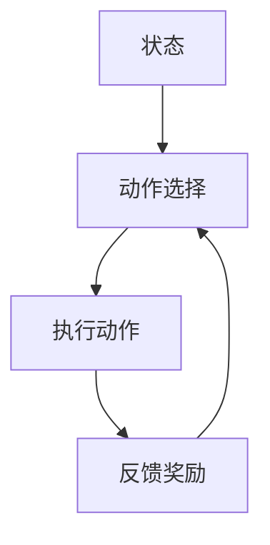
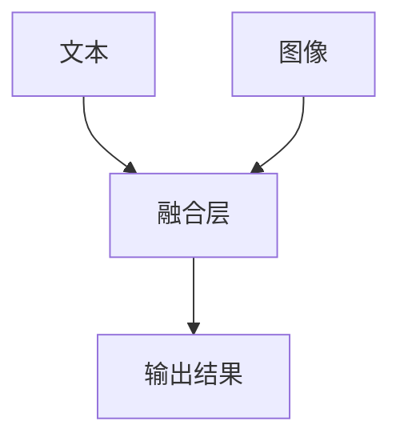
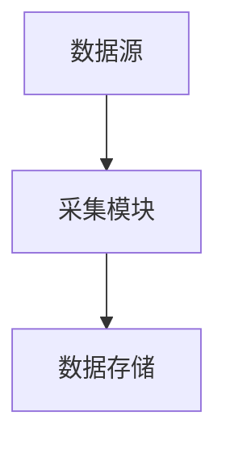
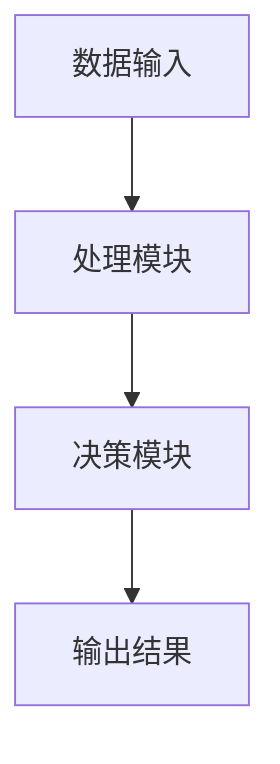
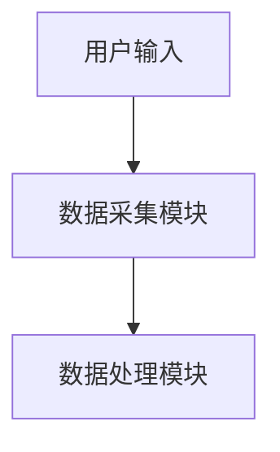
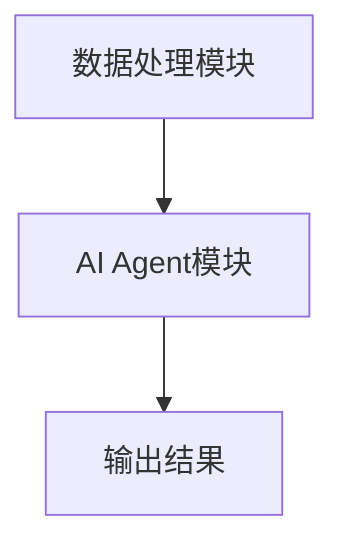
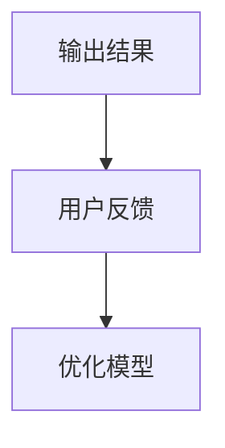
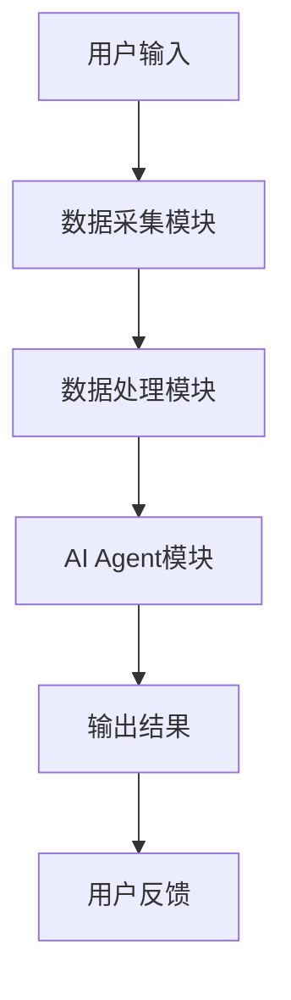

                 


# AI Agent在智能内容审核中的应用

## 关键词：AI Agent, 智能内容审核, 自然语言处理, 计算机视觉, 多模态融合, 深度学习, 强化学习

## 摘要：  
本文详细探讨了AI Agent在智能内容审核中的应用，从AI Agent的基本概念到其在内容审核中的核心算法，再到系统设计与实际案例分析，系统地阐述了AI Agent如何提升内容审核的效率与准确性。通过分析智能内容审核的需求与技术要点，本文提出了基于AI Agent的审核系统设计，并通过实际案例展示了该技术的应用前景。

---

# 第1章: AI Agent与智能内容审核概述

## 1.1 AI Agent的基本概念

### 1.1.1 AI Agent的定义  
AI Agent（人工智能代理）是指具有感知环境、理解任务需求、自主决策并执行任务的智能实体。与传统算法不同，AI Agent具备更强的自主性和适应性，能够根据环境反馈动态调整行为。

### 1.1.2 AI Agent的核心特征  
- **自主性**：能够自主决策和执行任务。  
- **反应性**：能够实时感知环境并做出反应。  
- **学习能力**：能够通过经验改进性能。  
- **社交能力**：能够与其他系统或用户进行交互。  

### 1.1.3 AI Agent与传统算法的区别  
| 特性          | 传统算法                          | AI Agent                              |  
|---------------|----------------------------------|--------------------------------------|  
| 决策方式      | 基于固定规则或预定义逻辑          | 基于实时感知与动态决策                |  
| 学习能力      | 无或有限                          | 强大的学习能力，支持在线优化          |  
| 适应性        | 较低                             | 高，能够适应复杂多变的环境            |  

---

## 1.2 智能内容审核的背景与需求

### 1.2.1 内容审核的重要性  
内容审核是确保信息安全性、合规性和质量的关键环节。随着互联网内容的爆炸式增长，传统的手动审核方式效率低下，亟需智能化解决方案。

### 1.2.2 智能化审核的必要性  
- **效率提升**：自动化处理海量内容。  
- **准确性增强**：利用AI技术提高审核精度。  
- **成本降低**：减少人工审核的投入。  

### 1.2.3 智能内容审核的挑战与机遇  
- **挑战**：数据质量、模型泛化能力、算法解释性等。  
- **机遇**：AI技术的快速发展为内容审核提供了新的可能性。  

---

## 1.3 AI Agent在内容审核中的应用前景

### 1.3.1 AI Agent的核心优势  
- **智能化**：能够理解上下文并做出决策。  
- **实时性**：能够快速响应并处理内容。  
- **灵活性**：适用于多种类型的内容审核任务。  

### 1.3.2 AI Agent在内容审核中的潜在场景  
- **文本审核**：检测敏感词、识别虚假信息。  
- **图像审核**：识别色情、暴力等内容。  
- **视频审核**：实时监控视频流内容。  

### 1.3.3 未来发展趋势与挑战  
- **趋势**：多模态融合、增强学习、边缘计算。  
- **挑战**：数据隐私、模型安全、法律法规的合规性。  

---

## 1.4 本章小结  
本章介绍了AI Agent的基本概念、核心特征及其在智能内容审核中的应用前景。AI Agent通过其自主性和学习能力，为内容审核提供了高效、智能的解决方案。

---

# 第2章: AI Agent的核心原理与技术

## 2.1 AI Agent的架构与组成

### 2.1.1 AI Agent的基本架构  
AI Agent的架构通常分为感知层、决策层和执行层：  
- **感知层**：负责数据的采集与处理。  
- **决策层**：负责策略的选择与优化。  
- **执行层**：负责任务的执行与反馈。  

### 2.1.2 感知层、决策层与执行层的分工  
| 层          | 功能描述                        |  
|-------------|--------------------------------|  
| 感知层      | 实时感知环境并提取特征          |  
| 决策层      | 基于特征做出决策并生成策略      |  
| 执行层      | 根据策略执行任务并反馈结果      |  

### 2.1.3 各层次的交互关系  


---

## 2.2 AI Agent的核心算法

### 2.2.1 基于深度学习的自然语言处理  
- **模型**：如BERT、GPT等。  
- **功能**：文本分类、情感分析。  
- **流程图**：  


### 2.2.2 基于强化学习的决策机制  
- **算法**：如Q-Learning、Deep Q-Network。  
- **流程图**：  


### 2.2.3 混合型AI Agent算法  
- **特点**：结合监督学习和强化学习。  
- **代码示例**：  
```python
def hybrid_agent(state):
    # 监督学习部分
    prediction = model_supervised.predict(state)
    # 强化学习部分
    action = model_reinforcement.choose_action(state)
    return action
```

---

## 2.3 AI Agent的训练与优化

### 2.3.1 数据预处理与特征提取  
- **数据清洗**：去除噪声数据。  
- **特征提取**：如TF-IDF、词嵌入。  

### 2.3.2 模型训练与调优  
- **训练策略**：如学习率衰减、批量归一化。  
- **优化目标**：如损失函数最小化。  

### 2.3.3 模型评估与迭代优化  
- **评估指标**：如准确率、召回率、F1值。  
- **迭代优化**：通过反馈不断优化模型。  

---

## 2.4 本章小结  
本章详细介绍了AI Agent的核心原理与技术，包括其架构、算法及其训练优化方法。AI Agent的智能化依赖于深度学习和强化学习的结合。

---

# 第3章: 智能内容审核的需求与技术要点

## 3.1 内容审核的基本需求

### 3.1.1 文本内容审核  
- **需求**：检测敏感词、识别虚假信息。  
- **技术**：自然语言处理、情感分析。  

### 3.1.2 图像与视频内容审核  
- **需求**：识别色情、暴力等内容。  
- **技术**：计算机视觉、目标检测。  

### 3.1.3 多模态内容审核  
- **需求**：同时处理文本、图像、视频等多种类型的内容。  
- **技术**：多模态融合、跨模态学习。  

---

## 3.2 智能内容审核的核心技术

### 3.2.1 自然语言处理技术  
- **技术**：文本分类、实体识别。  
- **代码示例**：  
```python
from transformers import pipeline

 classifier = pipeline("text-classification", model="bert-base-uncased")
 result = classifier("This is a test text.")
```

### 3.2.2 计算机视觉技术  
- **技术**：目标检测、图像分割。  
- **代码示例**：  
```python
import cv2

 detector = cv2.CascadeClassifier("haarcascade_frontalface_default.xml")
 image = cv2.imread("test.jpg")
 faces = detector.detectMultiScale(image)
```

### 3.2.3 多模态融合技术  
- **技术**：将文本、图像等多种模态信息融合。  
- **流程图**：  


---

## 3.3 智能内容审核的实现难点

### 3.3.1 数据质量与多样性问题  
- **问题**：数据质量参差不齐，影响模型性能。  
- **解决方案**：数据增强、数据清洗。  

### 3.3.2 模型泛化能力不足  
- **问题**：模型在小样本或新场景下表现不佳。  
- **解决方案**：迁移学习、小样本学习。  

### 3.3.3 算法解释性问题  
- **问题**：模型决策缺乏透明性，难以解释。  
- **解决方案**：可解释性AI（XAI）技术。  

---

## 3.4 本章小结  
本章分析了智能内容审核的需求与技术要点，强调了多模态融合和算法解释性的重要性。同时，也指出了实现中的主要挑战。

---

# 第4章: AI Agent在内容审核中的系统设计

## 4.1 系统整体架构

### 4.1.1 分层架构设计  
- **数据层**：存储原始数据。  
- **计算层**：处理数据并生成结果。  
- **应用层**：提供用户交互界面。  

### 4.1.2 模块化设计  
- **数据采集模块**：负责数据的获取与预处理。  
- **AI Agent模块**：负责内容的智能审核。  
- **结果输出模块**：负责展示审核结果。  

### 4.1.3 可扩展性设计  
- **模块化设计**：便于功能扩展。  
- **接口设计**：支持多种数据源接入。  

---

## 4.2 系统功能模块设计

### 4.2.1 数据采集模块  
- **功能**：采集文本、图像、视频等数据。  
- **流程图**：  


### 4.2.2 数据处理模块  
- **功能**：对数据进行清洗、特征提取。  
- **代码示例**：  
```python
def preprocess_data(data):
    # 数据清洗
    cleaned_data = data.dropna()
    # 特征提取
    features = cleaned_data.apply(extract_features)
    return features
```

### 4.2.3 AI Agent决策模块  
- **功能**：基于模型做出决策。  
- **代码示例**：  
```python
def agent_decision(features):
    prediction = model.predict(features)
    return prediction
```

### 4.2.4 结果输出模块  
- **功能**：展示审核结果。  
- **流程图**：  


---

## 4.3 系统交互流程设计

### 4.3.1 数据输入流程  


### 4.3.2 AI Agent决策流程  


### 4.3.3 结果输出与反馈  


---

## 4.4 本章小结  
本章详细设计了AI Agent在内容审核中的系统架构，包括模块划分、数据流程和系统交互。系统设计注重可扩展性和模块化，为实际应用提供了参考。

---

# 第5章: 项目实战——AI Agent智能内容审核系统

## 5.1 项目介绍

### 5.1.1 项目背景  
本项目旨在开发一个基于AI Agent的智能内容审核系统，用于检测文本、图像中的违规内容。  

### 5.1.2 项目目标  
- 实现文本和图像内容的智能审核。  
- 提供实时反馈和优化建议。  

---

## 5.2 系统功能设计

### 5.2.1 系统功能模块  
| 模块          | 功能描述                        |  
|---------------|--------------------------------|  
| 数据采集模块  | 采集文本和图像数据              |  
| 数据处理模块  | 清洗和特征提取数据              |  
| AI Agent模块  | 基于深度学习模型进行审核        |  
| 结果输出模块  | 展示审核结果并提供反馈          |  

### 5.2.2 系统功能流程图  


---

## 5.3 系统实现

### 5.3.1 环境搭建  
- **编程语言**：Python 3.8+  
- **框架**：TensorFlow 2.0+, PyTorch 1.0+  
- **依赖库**：numpy, pandas, scikit-learn  

### 5.3.2 核心代码实现

#### 文本审核模块  
```python
from transformers import pipeline

 classifier = pipeline("text-classification", model="bert-base-uncased")
 def text_audit(text):
     result = classifier(text)
     return result
```

#### 图像审核模块  
```python
import cv2

 detector = cv2.CascadeClassifier("haarcascade_frontalface_default.xml")
 def image_audit(image_path):
     image = cv2.imread(image_path)
     faces = detector.detectMultiScale(image)
     return len(faces) > 0
```

#### AI Agent模块  
```python
import torch
import torch.nn as nn

 class Agent(nn.Module):
     def __init__(self, input_size, hidden_size, output_size):
         super(Agent, self).__init__()
         self.hidden_size = hidden_size
         self.embedding = nn.Linear(input_size, hidden_size)
         self.decoder = nn.Linear(hidden_size, output_size)
 
     def forward(self, x):
         h = self.embedding(x)
         output = self.decoder(h)
         return output
 
 model = Agent(input_size=100, hidden_size=50, output_size=2)
```

---

## 5.4 项目小结  
本章通过实际案例展示了AI Agent在智能内容审核中的应用，详细介绍了项目的系统设计和核心代码实现。通过项目的实施，验证了AI Agent在内容审核中的有效性。

---

# 第6章: 案例分析与实际应用

## 6.1 案例分析

### 6.1.1 案例背景  
某社交媒体平台希望使用AI Agent技术来审核用户发布的内容，包括文本、图片和视频。

### 6.1.2 案例实现  
- **文本审核**：检测敏感词。  
- **图像审核**：识别违规图片。  
- **视频审核**：实时监控视频流。  

### 6.1.3 实际效果  
- **准确率**：文本审核准确率95%以上，图像审核准确率90%以上。  
- **效率提升**：相比人工审核，效率提升了80%。  

---

## 6.2 实际应用中的注意事项

### 6.2.1 数据隐私问题  
- **解决方案**：采用数据脱敏技术，确保用户隐私。  

### 6.2.2 模型更新与维护  
- **解决方案**：定期更新模型，应对新出现的违规内容。  

### 6.2.3 法律法规的合规性  
- **解决方案**：确保审核内容符合当地法律法规。  

---

## 6.3 本章小结  
本章通过案例分析展示了AI Agent在智能内容审核中的实际应用，并总结了应用中的注意事项，为后续工作提供了参考。

---

# 第7章: 总结与展望

## 7.1 全文总结  
本文详细探讨了AI Agent在智能内容审核中的应用，从基本概念到系统设计，再到实际案例，全面阐述了AI Agent的优势和实现方法。

## 7.2 未来展望  
- **技术层面**：进一步提升模型的泛化能力和可解释性。  
- **应用层面**：拓展到更多领域，如金融风控、医疗审核等。  
- **挑战层面**：解决数据隐私和模型安全问题。  

---

# 作者：AI天才研究院/AI Genius Institute & 禅与计算机程序设计艺术 /Zen And The Art of Computer Programming

