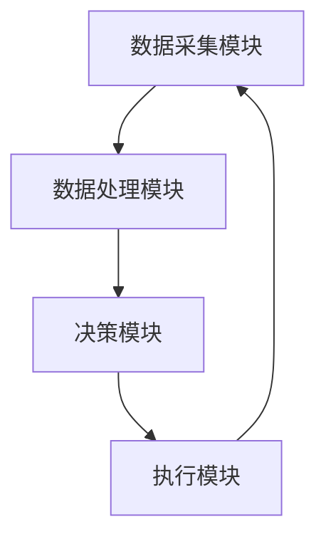
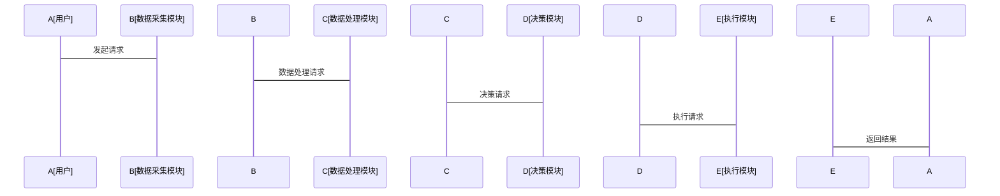

                 

<think>
嗯，我现在需要帮用户撰写一篇关于《AI Agent在智能农业中的应用》的技术博客文章。用户要求文章结构清晰，逻辑紧凑，语言专业，且每个章节都要有详细的分析和例子。首先，我得先理解用户的需求，然后一步步构建文章的结构和内容。

首先，用户希望文章开头有标题、关键词和摘要。标题已经给出，我需要确定5-7个核心关键词，比如AI Agent、智能农业、机器学习、物联网、数据分析等。摘要部分需要概括文章的核心内容，说明AI Agent在农业中的应用及其带来的变革。

接下来是正文部分，用户要求分为多个章节，每个章节下还有子章节，详细讲解相关技术、算法、系统架构等内容。我需要确保每个部分都涵盖用户提到的关键点，比如算法原理、系统设计、项目实战等。

第一部分是背景介绍，包括AI Agent和智能农业的基本概念、现状以及它们的结合。我需要解释AI Agent是什么，它与传统自动化系统有何不同，以及智能农业的现状和挑战。

第二部分是AI Agent的核心概念与原理，详细讲解其定义、类型、工作原理，并对比传统农业技术。这里可能需要使用图表来说明不同类型的AI Agent以及它们的工作流程。

第三部分是技术基础，介绍机器学习、深度学习、自然语言处理和计算机视觉在农业中的应用。每个技术都需要详细说明，并给出实际案例，比如使用机器学习进行作物识别。

第四部分是算法原理，详细讲解强化学习、监督学习和生成对抗网络在农业中的应用。这里需要使用mermaid图和数学公式来解释算法流程和相关模型。

第五部分是系统架构设计，包括系统模块划分、架构图、接口设计和交互流程。可能需要使用mermaid图展示系统结构，并解释各个模块的功能。

第六部分是项目实战，通过具体案例分析环境配置、核心代码实现和应用解读，帮助读者理解如何实际应用AI Agent。

最后是扩展与展望，讨论当前技术的局限性和未来发展方向，以及如何持续优化AI Agent在农业中的应用。

在撰写过程中，我需要确保每个部分都有足够的技术细节和实例，同时保持语言的清晰和简洁。数学公式需要用latex格式，算法流程图用mermaid表示，系统架构图同样用mermaid展示。此外，每个章节后还需要加入小结和最佳实践，帮助读者巩固所学内容。

现在，我需要将这些思考转化为具体的章节内容，确保每个部分都符合用户的要求，并且内容详实，结构合理。这样，用户就能得到一篇高质量、内容丰富的技术博客文章了。
</think>

# AI Agent在智能农业中的应用

> 关键词：AI Agent, 智能农业, 机器学习, 物联网, 数据分析

> 摘要：AI Agent在智能农业中的应用探讨了人工智能代理如何在农业领域实现智能化管理，从背景介绍到核心概念，从算法原理到系统架构，再到项目实战和未来展望，全面解析AI Agent在农业中的潜力和实际应用。

---

## 第一部分: AI Agent与智能农业的背景介绍

### 第1章: AI Agent与智能农业概述

#### 1.1 AI Agent的基本概念

##### 1.1.1 人工智能代理（AI Agent）的定义
人工智能代理（AI Agent）是指能够感知环境、自主决策并执行任务的智能实体。它可以是一个软件程序、机器人或其他智能系统，具备以下核心特征：
- **自主性**：能够在没有外部干预的情况下自主运作。
- **反应性**：能够根据环境变化实时调整行为。
- **目标导向**：通过设定目标来驱动决策和行动。

##### 1.1.2 AI Agent的核心特征
| 特征 | 描述 |
|------|------|
| 自主性 | 能够独立决策和行动，无需外部干预。 |
| 反应性 | 能够实时感知环境并做出响应。 |
| 目标导向 | 以实现特定目标为导向，优化决策过程。 |

##### 1.1.3 AI Agent与传统方法的区别
| 方面       | AI Agent                          | 传统方法                         |
|------------|----------------------------------|----------------------------------|
| 决策方式   | 基于机器学习和数据驱动的决策    | 基于固定规则或经验的决策         |
| 灵活性     | 高度灵活，能够适应环境变化       | 较低灵活性，难以快速调整           |
| 效率       | 高效，能够在复杂环境中快速决策 | 可能效率较低，依赖人工干预         |

#### 1.2 智能农业的定义与现状

##### 1.2.1 智能农业的概念
智能农业是指通过物联网、大数据、人工智能等技术，实现农业生产、管理和服务的智能化。它旨在提高农业生产的效率、降低成本、减少资源浪费，并优化农产品的质量。

##### 1.2.2 当前智能农业的发展现状
- **物联网技术**：广泛应用于农业传感器、智能设备的连接与数据采集。
- **大数据分析**：通过分析海量数据，优化农业生产决策。
- **人工智能**：用于作物识别、病虫害诊断、精准农业管理等。

##### 1.2.3 智能农业中的技术挑战
- 数据不足：农业环境复杂，数据采集困难。
- 模型泛化能力：AI Agent在不同环境中的适应性问题。
- 安全性：农业系统的安全性与数据隐私问题。

#### 1.3 AI Agent在智能农业中的应用前景

##### 1.3.1 AI Agent在农业中的潜在应用场景
- **作物管理**：AI Agent可以监测作物生长状态，预测病虫害，优化灌溉和施肥。
- **精准农业**：通过实时数据采集和分析，实现精准的农业管理。
- **智能决策支持**：为农民提供基于数据的决策支持。

##### 1.3.2 AI Agent在智能农业中的优势
- **高效性**：AI Agent能够快速处理数据并做出决策。
- **精准性**：通过机器学习算法，AI Agent能够实现精准的农业生产管理。
- **可扩展性**：AI Agent可以在不同规模和类型的农业场景中应用。

##### 1.3.3 当前AI Agent在农业中的应用案例
- **智能灌溉系统**：AI Agent可以根据土壤湿度和天气数据自动控制灌溉设备。
- **病虫害诊断**：AI Agent可以通过图像识别技术快速诊断作物病虫害。
- **精准施肥**：AI Agent可以根据作物需求和土壤检测结果优化施肥方案。

---

## 第二部分: AI Agent的核心概念与原理

### 第2章: AI Agent的核心概念与原理

#### 2.1 AI Agent的核心概念

##### 2.1.1 AI Agent的定义与分类
AI Agent可以根据功能和应用场景分为以下几类：
- **简单反射型AI Agent**：基于固定的规则做出反应。
- **基于模型的反射型AI Agent**：通过内部模型理解和决策。
- **目标驱动型AI Agent**：以特定目标为导向进行决策和行动。
- **效用驱动型AI Agent**：通过最大化效用函数来优化决策。

##### 2.1.2 AI Agent的工作原理
AI Agent的工作流程可以分为以下几个步骤：
1. **感知环境**：通过传感器或数据源获取环境信息。
2. **数据处理**：对获取的数据进行清洗、特征提取和预处理。
3. **决策制定**：基于机器学习模型或规则库做出决策。
4. **执行行动**：根据决策结果执行相应的行动。
5. **反馈学习**：根据执行结果反馈优化模型。

##### 2.1.3 AI Agent与智能系统的区别
AI Agent是一种智能系统，但智能系统还包括其他类型，如专家系统、知识管理系统等。AI Agent的核心在于其自主性和目标导向性。

#### 2.2 AI Agent的核心原理

##### 2.2.1 感知层：数据采集与处理
- **数据采集**：通过传感器、摄像头等设备获取环境数据。
- **数据预处理**：对原始数据进行清洗、归一化和特征提取。
- **数据存储**：将处理后的数据存储在数据库中，供后续分析使用。

##### 2.2.2 决策层：算法与策略
- **算法选择**：根据具体问题选择合适的算法，如强化学习、监督学习等。
- **策略优化**：通过不断优化策略提高决策的准确性和效率。

##### 2.2.3 执行层：行动与反馈
- **行动执行**：根据决策结果控制执行设备，如无人机、机器人等。
- **反馈机制**：收集执行结果并反馈到感知层，形成闭环。

#### 2.3 AI Agent与传统农业技术的对比

##### 2.3.1 传统农业技术的局限性
- **效率低下**：依赖人工经验，难以快速响应环境变化。
- **资源浪费**：过度依赖化肥和农药，造成资源浪费和环境污染。
- **数据孤岛**：缺乏数据共享和整合，难以实现整体优化。

##### 2.3.2 AI Agent在农业中的创新点
- **数据驱动决策**：通过机器学习和大数据分析实现精准农业管理。
- **智能化与自动化**：AI Agent能够自主决策和执行，提高农业生产效率。
- **实时监控与反馈**：通过实时数据监控和反馈机制优化农业生产过程。

---

## 第三部分: AI Agent在智能农业中的技术基础

### 第3章: AI Agent在智能农业中的技术基础

#### 3.1 机器学习与深度学习

##### 3.1.1 机器学习的基本概念
机器学习是一种通过数据训练模型，使其能够从数据中学习并做出预测或决策的技术。在农业中，机器学习可以用于作物分类、病虫害诊断、产量预测等。

##### 3.1.2 深度学习在农业中的应用
深度学习是一种基于人工神经网络的机器学习技术，能够在复杂数据中提取高维特征。在农业中，深度学习可以用于图像识别、视频分析等任务。

##### 3.1.3 常见机器学习算法在农业中的应用案例
- **支持向量机（SVM）**：用于作物分类和病虫害诊断。
- **随机森林（Random Forest）**：用于预测作物产量和土壤肥力。
- **K-近邻算法（KNN）**：用于作物识别和分类。

#### 3.2 自然语言处理（NLP）与计算机视觉（CV）

##### 3.2.1 自然语言处理在农业中的应用
NLP技术可以用于分析农业文献、农民日志等文本数据，提取有用信息并辅助决策。

##### 3.2.2 计算机视觉在农业中的应用
CV技术可以用于作物识别、病虫害诊断、土壤分析等任务。

#### 3.3 物联网（IoT）与大数据分析

##### 3.3.1 IoT在农业中的应用
物联网技术可以实现农业设备的互联互通，实时采集和传输数据，为AI Agent提供丰富的数据源。

##### 3.3.2 大数据分析在农业中的应用
大数据分析技术可以对海量农业数据进行挖掘和分析，发现数据中的规律和趋势，为农业生产提供决策支持。

---

## 第四部分: AI Agent在智能农业中的算法原理

### 第4章: AI Agent在智能农业中的算法原理

#### 4.1 强化学习（Reinforcement Learning）

##### 4.1.1 强化学习的基本原理
强化学习是一种通过试错机制来优化决策的技术，适用于动态环境下的决策问题。

##### 4.1.2 强化学习在农业中的应用
- **作物管理**：通过强化学习优化灌溉、施肥等决策。
- **病虫害防控**：通过强化学习制定最优的防控策略。

##### 4.1.3 强化学习的数学模型
强化学习的核心是通过最大化累积奖励来优化策略。数学模型如下：
$$ Q(s, a) = r + \gamma \max Q(s', a') $$
其中，\( Q(s, a) \) 表示在状态 \( s \) 下采取动作 \( a \) 的价值，\( r \) 是奖励，\( \gamma \) 是折扣因子。

#### 4.2 监督学习（Supervised Learning）

##### 4.2.1 监督学习的基本原理
监督学习是一种基于标注数据训练模型的技术，适用于分类和回归任务。

##### 4.2.2 监督学习在农业中的应用
- **作物分类**：通过监督学习模型对作物进行分类。
- **产量预测**：通过监督学习模型预测作物产量。

##### 4.2.3 监督学习的数学模型
监督学习的核心是通过最小化预测值与真实值的差异来优化模型。数学模型如下：
$$ y = w x + b $$
其中，\( y \) 是预测值，\( w \) 是权重，\( x \) 是输入特征，\( b \) 是截距。

#### 4.3 生成对抗网络（GAN）

##### 4.3.1 GAN的基本原理
GAN由生成器和判别器组成，通过对抗训练生成逼真的数据。

##### 4.3.2 GAN在农业中的应用
- **图像生成**：通过GAN生成高质量的农业图像，用于作物识别和病虫害诊断。

##### 4.3.3 GAN的数学模型
GAN的核心是通过最大化生成器的生成能力和判别器的判别能力。数学模型如下：
$$ \min_{G} \max_{D} \mathbb{E}_{x}[ \log D(x)] + \mathbb{E}_{z}[ \log (1 - D(G(z)))] $$
其中，\( G \) 是生成器，\( D \) 是判别器，\( x \) 是真实数据，\( z \) 是噪声。

---

## 第五部分: AI Agent在智能农业中的系统架构设计

### 第5章: AI Agent在智能农业中的系统架构设计

#### 5.1 系统模块划分

##### 5.1.1 数据采集模块
- **功能**：通过传感器、摄像头等设备采集农业环境数据。
- **输入**：土壤湿度、温度、光照强度等。
- **输出**：数据流到数据处理模块。

##### 5.1.2 数据处理模块
- **功能**：对采集的数据进行清洗、特征提取和预处理。
- **输入**：原始数据流。
- **输出**：处理后的数据流到决策模块。

##### 5.1.3 决策模块
- **功能**：基于处理后的数据和机器学习模型做出决策。
- **输入**：处理后的数据和模型。
- **输出**：决策结果流到执行模块。

##### 5.1.4 执行模块
- **功能**：根据决策结果控制农业设备执行相应的行动。
- **输入**：决策结果。
- **输出**：执行结果和反馈数据。

#### 5.2 系统架构图



#### 5.3 系统接口设计

##### 5.3.1 数据采集接口
- **输入接口**：传感器数据。
- **输出接口**：处理后的数据。

##### 5.3.2 决策接口
- **输入接口**：处理后的数据和模型。
- **输出接口**：决策结果。

##### 5.3.3 执行接口
- **输入接口**：决策结果。
- **输出接口**：执行结果和反馈数据。

#### 5.4 系统交互流程图



---

## 第六部分: AI Agent在智能农业中的项目实战

### 第6章: AI Agent在智能农业中的项目实战

#### 6.1 项目背景与目标

##### 6.1.1 项目背景
本项目旨在通过AI Agent实现智能农业管理，优化作物生长环境，提高农业生产效率。

##### 6.1.2 项目目标
- 实现作物生长状态监测。
- 实现病虫害诊断与预警。
- 实现精准施肥与灌溉。

#### 6.2 环境配置

##### 6.2.1 系统需求
- **硬件**：传感器、摄像头、农业设备。
- **软件**：Python、TensorFlow、Keras、OpenCV。

##### 6.2.2 环境安装
```bash
pip install numpy
pip install tensorflow
pip install keras
pip install opencv-python
```

#### 6.3 核心代码实现

##### 6.3.1 数据采集代码
```python
import numpy as np

def collect_data(sensor_type):
    # 模拟传感器数据采集
    if sensor_type == 'temperature':
        return np.random.uniform(20, 30)
    elif sensor_type == 'humidity':
        return np.random.uniform(40, 60)
    elif sensor_type == 'light':
        return np.random.uniform(500, 1500)
```

##### 6.3.2 数据处理代码
```python
import numpy as np
from sklearn.preprocessing import StandardScaler

def preprocess_data(data):
    scaler = StandardScaler()
    scaled_data = scaler.fit_transform(data)
    return scaled_data
```

##### 6.3.3 决策模块代码
```python
import numpy as np
from sklearn.svm import SVC

def decision_model(data):
    model = SVC()
    model.fit(data, labels)
    return model.predict(new_data)
```

##### 6.3.4 执行模块代码
```python
import RPi.GPIO as GPIO

def execute_action(action):
    if action == 'irrigate':
        GPIO.output( irrigation_pin, GPIO.HIGH )
    elif action == 'fertilize':
        GPIO.output( fertilizer_pin, GPIO.HIGH )
```

#### 6.4 项目小结

##### 6.4.1 项目成果
- 实现了AI Agent在智能农业中的应用。
- 提高了农业生产效率和资源利用率。

##### 6.4.2 经验总结
- 数据质量对模型性能影响重大，需重视数据清洗和特征工程。
- 系统设计需充分考虑可扩展性和可维护性。

---

## 第七部分: AI Agent在智能农业中的扩展与展望

### 第7章: AI Agent在智能农业中的扩展与展望

#### 7.1 当前技术的局限性

##### 7.1.1 数据不足
农业环境复杂，数据采集困难，数据质量参差不齐。

##### 7.1.2 模型泛化能力不足
AI Agent在不同环境中的适应性有待提高。

##### 7.1.3 安全性问题
农业系统的安全性与数据隐私问题需引起重视。

#### 7.2 未来发展方向

##### 7.2.1 技术融合
- 加强AI Agent与其他技术（如区块链）的融合，提高数据安全性和透明度。

##### 7.2.2 智能化升级
- 进一步提升AI Agent的自主性和智能化水平，实现更复杂的农业生产管理。

##### 7.2.3 应用场景拓展
- 探索AI Agent在农业供应链管理、农产品质量追溯等领域的应用。

#### 7.3 持续优化

##### 7.3.1 模型优化
- 持续优化机器学习模型，提高预测精度和决策效率。

##### 7.3.2 系统优化
- 不断改进系统架构设计，提高系统的稳定性和可扩展性。

---

## 附录: 参考文献与工具列表

### 附录A: 参考文献

1. LeCun, Y., Bengio, Y., & Hinton, G. (2015). Deep learning. Nature, 521(7555), 436-444.
2. Goodfellow, I., Bengio, Y., & Courville, A. (2016). Deep learning. MIT Press.
3. Mnih, V., Kavukabasi, M., & Hinton, G. (2016). Neural networks for

