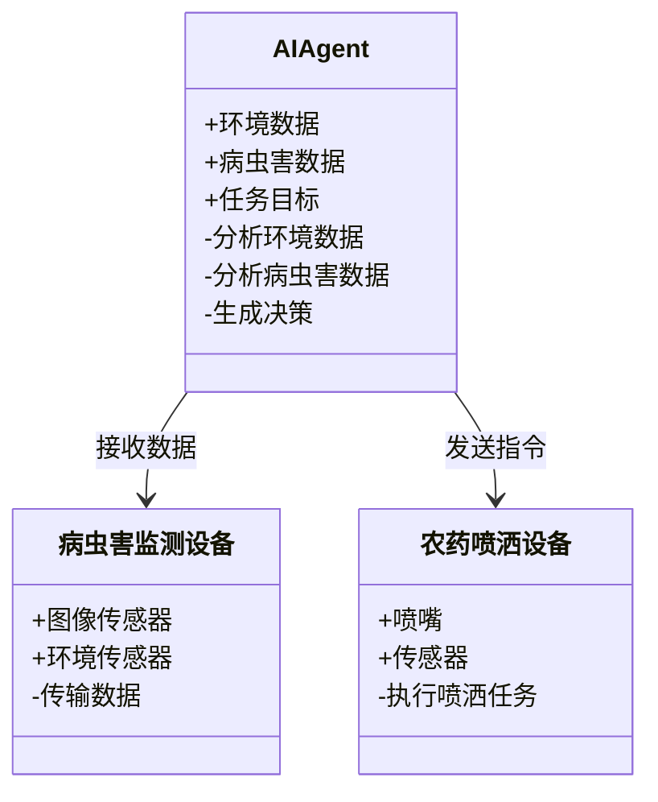
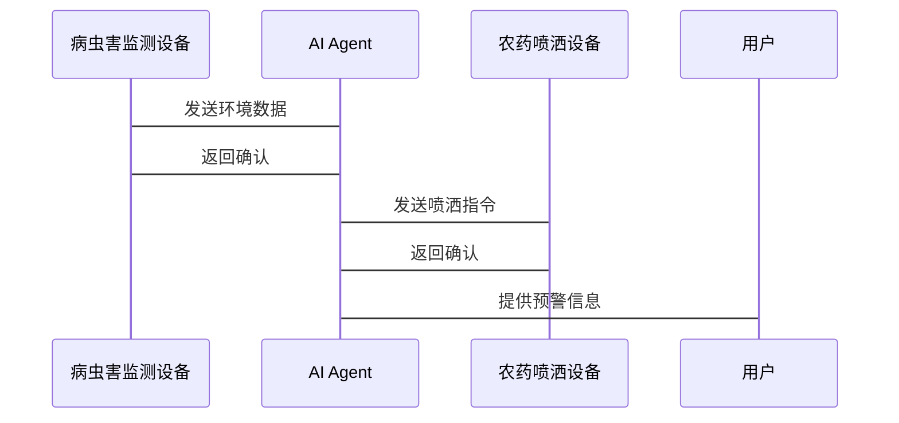

                 


# AI Agent在智能农业病虫害防控中的应用

> 关键词：AI Agent, 智能农业, 病虫害防控, 机器学习, 精准农业, 人工智能

> 摘要：本文探讨了AI Agent在智能农业病虫害防控中的应用，分析了AI Agent的基本概念、技术基础、病虫害监测与预警系统、精准施药与决策支持等关键环节，并通过实际案例展示了AI Agent在提升病虫害防控效率和精准度方面的重要作用。本文还详细介绍了系统的架构设计、算法实现及项目实战，为读者提供了全面的技术视角。

---

## 第一部分: AI Agent的基本概念与技术基础

### 第1章: AI Agent的定义与特点

#### 1.1 AI Agent的基本概念

##### 1.1.1 什么是AI Agent
AI Agent（人工智能代理）是一种智能体，能够感知环境、自主决策并执行任务。AI Agent具备以下核心特征：
- **自主性**：能够在没有外部干预的情况下独立运作。
- **反应性**：能够根据环境变化实时调整行为。
- **目标导向**：通过目标驱动来优化决策。
- **学习能力**：能够通过数据和经验不断优化自身性能。

##### 1.1.2 AI Agent的特点

| 特性 | 描述 |
|------|------|
| 智能性 | 基于数据和算法进行推理和决策 |
| 自主性 | 能够独立执行任务，无需人工干预 |
| 适应性 | 能够根据环境变化动态调整行为 |
| 可扩展性 | 支持多种应用场景和复杂任务 |

##### 1.1.3 AI Agent与传统AI的区别

| 对比维度 | 传统AI | AI Agent |
|----------|--------|----------|
| 执行方式 | 离线计算 | 实时执行 |
| 决策方式 | 基于规则 | 基于目标 |
| 交互方式 | 单向输入 | 双向交互 |

---

### 第2章: 智能农业的背景与发展

#### 2.1 智能农业的概念与内涵

##### 2.1.1 智能农业的定义
智能农业是将现代信息技术（如物联网、大数据、人工智能）应用于农业生产的各个环节，以提高农业生产效率和资源利用率的新型农业模式。

##### 2.1.2 智能农业的核心技术
- **物联网（IoT）**：用于实时监测农田环境数据。
- **大数据分析**：用于处理和分析海量农业数据。
- **人工智能（AI）**：用于优化农业生产决策。
- **区块链**：用于农产品溯源和供应链管理。

##### 2.1.3 智能农业的发展现状
当前，智能农业在全球范围内迅速发展，尤其是在发达国家和地区。AI Agent作为智能农业的核心技术之一，正在逐步应用于病虫害防控、精准施肥、智能灌溉等领域。

---

## 第二部分: 病虫害监测与预警系统

### 第3章: 病虫害监测技术

#### 3.1 病虫害监测的主要技术

##### 3.1.1 基于图像识别的病虫害监测
AI Agent可以通过图像识别技术（如卷积神经网络CNN）识别病虫害类型和严重程度。例如：
- 使用RGB相机拍摄作物叶片图像。
- 通过图像分割技术定位病斑区域。
- 通过分类算法（如ResNet）识别病虫害类型。

##### 3.1.2 基于传感器的环境数据采集
AI Agent可以整合多种传感器（如温湿度传感器、光照传感器）采集农田环境数据，并通过边缘计算实时分析环境因素对病虫害的影响。

##### 3.1.3 基于无人机的病虫害监测
无人机配备了高分辨率摄像头和光谱传感器，能够快速扫描大面积农田，并将数据传输到AI Agent进行分析。

#### 3.2 数据采集与处理

##### 3.2.1 数据采集方法
- **图像采集**：使用RGB相机或无人机摄像头采集作物图像。
- **环境数据采集**：使用传感器采集温湿度、光照强度等环境参数。
- **病虫害数据采集**：通过人工采样或自动识别设备采集病虫害样本。

##### 3.2.2 数据预处理与特征提取
- 数据清洗：去除噪声数据和异常值。
- 数据增强：通过旋转、翻转等操作增加训练数据量。
- 特征提取：使用主成分分析（PCA）提取关键特征。

##### 3.2.3 数据存储与管理
- 数据库设计：采用关系型数据库（如MySQL）存储结构化数据。
- 数据湖构建：使用Hadoop或AWS S3存储海量非结构化数据。

---

### 第4章: 病虫害预警模型构建

#### 4.1 预警模型的构建方法

##### 4.1.1 基于机器学习的预警模型
- **监督学习**：使用标记好的数据训练分类器（如随机森林、支持向量机SVM）。
- **无监督学习**：通过聚类算法（如K-means）发现异常模式。

##### 4.1.2 基于深度学习的预警模型
- **卷积神经网络（CNN）**：用于图像识别任务。
- **长短期记忆网络（LSTM）**：用于时间序列数据分析。

##### 4.1.3 基于规则的预警模型
- 通过专家经验制定阈值和规则。
- 例如：当温度超过30℃且湿度超过60%，且检测到病斑，则触发病害预警。

#### 4.2 模型训练与优化

##### 4.2.1 数据集的构建与标注
- 数据来源：公开数据集（如COCO）和人工标注数据。
- 标注工具：使用LabelImg或CVAT进行图像标注。

##### 4.2.2 模型训练与调优
- 使用K折交叉验证评估模型性能。
- 调参：优化学习率、批次大小等超参数。

##### 4.2.3 模型评估与验证
- 评估指标：准确率、召回率、F1分数。
- 模型部署：将训练好的模型部署到边缘设备或云端。

---

## 第三部分: AI Agent在病虫害防控中的应用

### 第5章: AI Agent在精准施药中的应用

#### 5.1 精准施药的定义与目标

##### 5.1.1 精准施药的概念
精准施药是指根据病虫害的发生情况和严重程度，精准投放农药，减少资源浪费和环境污染。

##### 5.1.2 精准施药的目标
- 减少农药用量。
- 提高防治效果。
- 降低生产成本。

##### 5.1.3 精准施药的优势
- 环境友好：减少化学农药的使用。
- 经济高效：降低农药和劳动力成本。
- 智能决策：通过AI Agent实现自动化管理。

#### 5.2 AI Agent在精准施药中的具体应用

##### 5.2.1 病虫害识别与定位
AI Agent通过图像识别技术识别病虫害类型和位置，生成喷洒路径。

##### 5.2.2 精准施药方案优化
基于病虫害的严重程度、气象数据和农药特性，AI Agent优化农药种类、用量和喷洒时间。

---

## 第四部分: 系统架构与实现

### 第6章: 系统架构设计

#### 6.1 问题场景介绍
在智能农业病虫害防控系统中，AI Agent需要协调多种设备和数据源，实现实时监测、预警和决策支持。

#### 6.2 系统功能设计

##### 6.2.1 领域模型


#### 6.3 系统架构设计


#### 6.4 系统接口设计
- AI Agent与监测设备之间的接口：HTTP API。
- AI Agent与喷洒设备之间的接口：MQTT协议。

#### 6.5 系统交互设计



---

## 第五部分: 项目实战

### 第7章: 项目实战

#### 7.1 环境配置

##### 7.1.1 安装Python环境
```bash
python --version
pip install --upgrade pip
```

##### 7.1.2 安装依赖包
```bash
pip install numpy scikit-learn matplotlib
```

#### 7.2 系统核心实现

##### 7.2.1 图像识别模型实现
```python
import cv2
import numpy as np
from sklearn.model_selection import train_test_split
from sklearn.svm import SVC

# 加载数据集
data = np.load('data.npy')
labels = np.load('labels.npy')

# 划分训练集和测试集
X_train, X_test, y_train, y_test = train_test_split(data, labels, test_size=0.2)

# 训练SVM模型
model = SVC()
model.fit(X_train, y_train)

# 模型评估
print("Accuracy:", model.score(X_test, y_test))
```

##### 7.2.2 病虫害预警模型实现
```python
import tensorflow as tf
from tensorflow.keras import layers

# 构建CNN模型
model = tf.keras.Sequential([
    layers.Conv2D(32, (3,3), activation='relu', input_shape=(64,64,3)),
    layers.MaxPooling2D((2,2)),
    layers.Conv2D(64, (3,3), activation='relu'),
    layers.MaxPooling2D((2,2)),
    layers.Flatten(),
    layers.Dense(128, activation='relu'),
    layers.Dense(10, activation='softmax')
])

# 编译模型
model.compile(optimizer='adam', loss='sparse_categorical_crossentropy', metrics=['accuracy'])

# 训练模型
model.fit(x_train, y_train, epochs=10, batch_size=32)
```

#### 7.3 实际案例分析
以某农场为例，AI Agent通过图像识别技术检测到小麦锈病，触发喷洒指令，最终有效控制病虫害的蔓延。

---

## 第六部分: 总结与展望

### 8.1 总结

#### 8.1.1 核心内容回顾
本文详细探讨了AI Agent在智能农业病虫害防控中的应用，从基本概念到系统实现，再到实际案例，为读者提供了全面的技术视角。

#### 8.1.2 本文的核心观点
- AI Agent能够显著提高病虫害监测和预警的效率。
- 精准施药可以大幅减少农药用量，降低生产成本。
- 系统架构设计是实现AI Agent应用的关键。

### 8.2 展望

#### 8.2.1 未来研究方向
- 开发更高效的AI Agent算法。
- 探索AI Agent与区块链的结合。
- 研究AI Agent在农业其他领域的应用。

#### 8.2.2 注意事项与最佳实践
- 数据质量是AI Agent性能的关键。
- 系统安全性和隐私保护必须重视。
- 在实际应用中，应结合具体场景优化AI Agent的行为。

---

## 作者：AI天才研究院 & 禅与计算机程序设计艺术

---

通过本文，读者可以全面了解AI Agent在智能农业病虫害防控中的应用，从理论到实践，从系统设计到项目实现，为农业智能化转型提供了重要的技术参考。

