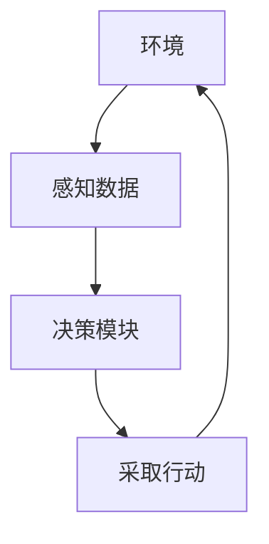

                 


# AI Agent在智能制造中的应用

> 关键词：AI Agent，智能制造，强化学习，系统架构，项目实战

> 摘要：本文探讨了AI Agent在智能制造中的应用，从背景、核心概念到算法原理，再到系统架构和项目实战，全面分析了AI Agent在智能制造中的作用、原理及实际应用案例。通过本文，读者可以深入了解AI Agent如何优化智能制造过程，提升生产效率和产品质量。

---

# 第一部分: AI Agent与智能制造基础

## 第1章: AI Agent与智能制造概述

### 1.1 AI Agent的基本概念

AI Agent，即人工智能代理，是一种能够感知环境并采取行动以实现目标的智能实体。它可以自主决策、学习和优化，广泛应用于各个领域。AI Agent的核心特征包括智能感知、自主决策、学习优化和多智能体协同。

### 1.2 智能制造的基本概念

智能制造是基于信息物理系统（CPS）和工业互联网，通过人、设备、产品和服务的全面连接，实现制造过程的智能化、网络化和协同化。其关键技术包括物联网、大数据、人工智能、云计算和数字孪生。

### 1.3 AI Agent在智能制造中的应用背景

当前，制造业正经历数字化转型，AI Agent在智能制造中的作用日益重要。它可以帮助企业优化生产流程、提高效率、降低成本，并解决传统自动化系统无法应对的复杂问题。然而，智能制造也面临数据孤岛、系统集成复杂、实时决策能力不足等挑战，AI Agent的应用可以有效缓解这些问题。

---

# 第二部分: AI Agent的核心概念与原理

## 第2章: AI Agent的核心概念与联系

### 2.1 AI Agent的核心原理

AI Agent的核心原理包括智能感知与决策、自主学习与优化、多智能体协同。智能感知通过传感器获取数据，决策模块基于这些数据做出最优决策，自主学习通过强化学习等方法不断优化，多智能体协同则确保系统各部分协同工作。

### 2.2 AI Agent的属性特征对比

| 特性                | 基于规则的AI Agent | 基于模型的AI Agent | 强化学习AI Agent |
|---------------------|--------------------|--------------------|------------------|
| 决策方式            | 预定义规则         | 使用模型推导       | 基于奖励机制     |
| 学习能力            | 无                 | 有                 | 强               |
| 适应性              | 低                 | 中                 | 高               |

### 2.3 ER实体关系图架构

```mermaid
erd
  A[AI Agent] -{1..n}--> B[制造系统]
  A <--{1..n}--> C[传感器数据]
  A -->{1}--> D[决策模块]
  A -->{1}--> E[执行模块]
```

---

# 第三部分: AI Agent的算法原理

## 第3章: AI Agent的算法原理

### 3.1 强化学习算法

强化学习是一种通过试错机制来优化决策的算法。其核心是通过与环境交互，不断优化策略以最大化累积奖励。常见的强化学习算法包括Q-learning和Deep Q-Network（DQN）。

#### 3.1.1 Q-learning算法

Q-learning的数学模型如下：

$$ Q(s, a) = Q(s, a) + \alpha [r + \max_{a'} Q(s', a') - Q(s, a)] $$

其中：
- \( Q(s, a) \) 表示状态s下采取行动a的收益值。
- \( \alpha \) 表示学习率。
- \( r \) 表示即时奖励。
- \( \max_{a'} Q(s', a') \) 表示下一状态下的最大收益值。

#### 3.1.2 Deep Q-Network（DQN）

DQN通过神经网络近似Q函数，实现端到端的学习。其网络结构包括输入层、隐藏层和输出层。

```python
import numpy as np
import gym
from collections import deque
import torch
import torch.nn as nn
import torch.optim as optim

class DQN(nn.Module):
    def __init__(self, input_size, output_size):
        super(DQN, self).__init__()
        self.fc1 = nn.Linear(input_size, 64)
        self.fc2 = nn.Linear(64, output_size)
    
    def forward(self, x):
        x = torch.relu(self.fc1(x))
        x = self.fc2(x)
        return x

# 初始化环境和网络
env = gym.make('CartPole-v1')
policy = DQN(env.observation_space.shape[0], env.action_space.n)
optimizer = optim.Adam(policy.parameters(), lr=0.001)
```

### 3.2 算法流程图



---

# 第四部分: 系统架构与项目实战

## 第4章: 系统架构与项目实战

### 4.1 系统架构设计

#### 4.1.1 C2MBA架构

C2MBA（Cloud-to-Machine-Business-Agent）是一种典型的智能制造系统架构，包括云平台、设备层、业务层和用户层。


#### 4.1.2 系统接口设计

系统接口设计包括设备层与管理层的交互，以及管理层与用户层的交互。

### 4.2 项目实战: 智能工厂设备维护优化

#### 4.2.1 项目背景

某智能工厂希望通过AI Agent优化设备维护流程，减少停机时间，降低成本。

#### 4.2.2 环境安装

安装Python 3.8及以上版本，安装必要的库：

```bash
pip install numpy gym torch matplotlib
```

#### 4.2.3 核心代码实现

```python
import gym
import torch
import torch.nn as nn
import torch.optim as optim

class AI-Agent-Agent(nn.Module):
    def __init__(self, state_size, action_size):
        super().__init__()
        self.fc1 = nn.Linear(state_size, 64)
        self.fc2 = nn.Linear(64, action_size)
    
    def forward(self, x):
        x = torch.relu(self.fc1(x))
        x = self.fc2(x)
        return x

# 初始化环境和网络
env = gym.make('Maintenance-v1')
agent = AI-Agent-Agent(env.observation_space.shape[0], env.action_space.n)
optimizer = optim.Adam(agent.parameters(), lr=0.001)
```

#### 4.2.4 代码应用解读与分析

该代码实现了一个AI Agent，用于维护设备的决策。通过与环境交互，AI Agent学习最优的维护策略，以最小化维护成本和停机时间。

#### 4.2.5 案例分析

通过训练，AI Agent能够预测设备故障并提前安排维护，显著降低了设备停机时间，提高了生产效率。

### 4.3 项目小结

本项目展示了AI Agent在智能制造中的实际应用，通过强化学习算法优化设备维护流程，为企业带来了显著的经济效益。

---

# 作者：AI天才研究院 & 禅与计算机程序设计艺术

---

本文从AI Agent的基本概念到实际应用，详细探讨了其在智能制造中的重要作用。通过理论分析和实际案例，展示了如何利用AI Agent优化生产流程，提升效率，降低成本。未来，随着AI技术的不断进步，AI Agent将在智能制造中发挥更大的作用，推动制造业的智能化转型。

