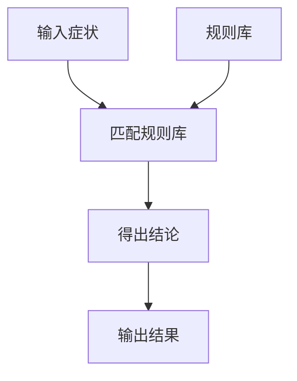
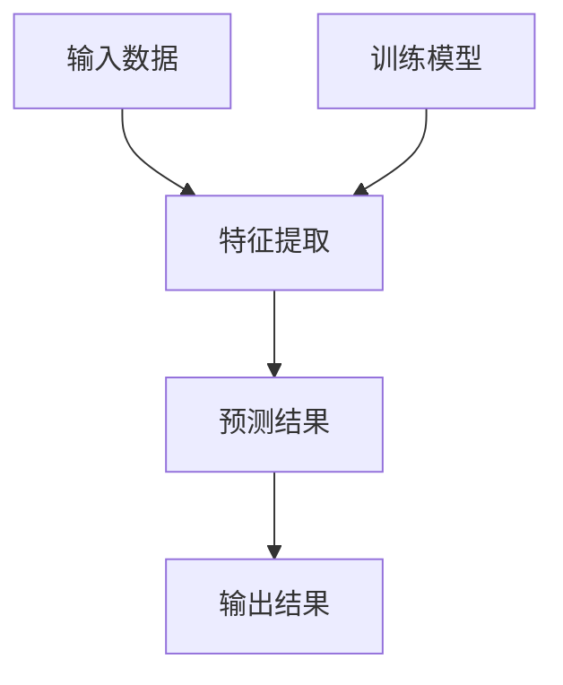
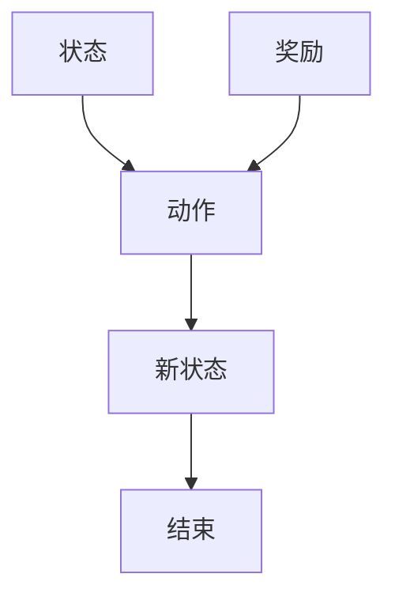
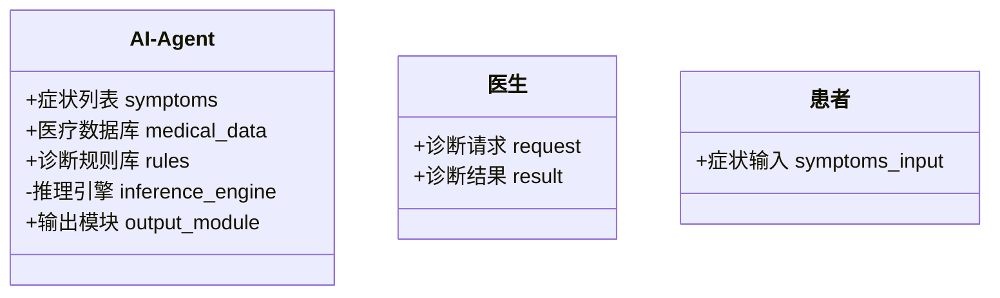
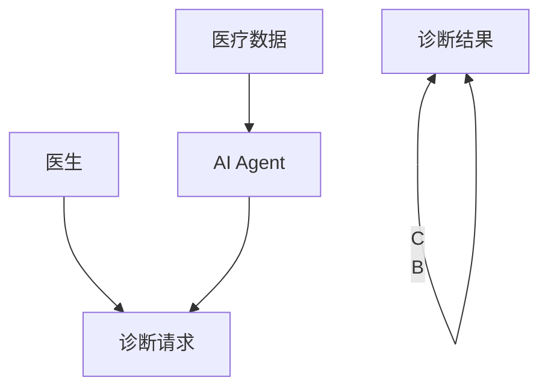
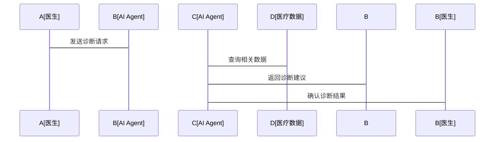

                 


# AI Agent在智能医疗中的应用：辅助诊断与治疗方案制定

## 关键词：AI Agent，智能医疗，辅助诊断，治疗方案，机器学习，医疗数据

## 摘要：AI Agent（人工智能代理）在智能医疗中的应用日益广泛，特别是在辅助诊断和治疗方案制定方面。本文详细探讨了AI Agent的核心概念、算法原理、系统架构以及在医疗领域的实际应用案例。通过对比分析、流程图和代码示例，揭示了AI Agent如何通过多智能体协作、知识表示与推理等技术，显著提高医疗诊断的准确性和治疗方案的科学性。本文还深入分析了当前存在的问题与挑战，并展望了未来的发展趋势。

---

# 第一部分: AI Agent在智能医疗中的应用背景与核心概念

## 第1章: AI Agent与智能医疗概述

### 1.1 AI Agent的基本概念

#### 1.1.1 什么是AI Agent
AI Agent（人工智能代理）是一种能够感知环境、自主决策并执行任务的智能实体。在医疗领域，AI Agent可以是软件系统，也可以是嵌入硬件设备的智能模块，其核心目标是通过数据处理、知识推理和人机交互，辅助医生完成诊断和治疗任务。

#### 1.1.2 AI Agent的核心特征
- **自主性**：AI Agent能够在没有人工干预的情况下独立运行。
- **反应性**：能够实时感知环境变化并做出相应反应。
- **学习能力**：通过机器学习算法不断优化自身的决策能力。
- **协作性**：能够与其他AI Agent或人类协同工作。

#### 1.1.3 AI Agent与传统医疗的区别
| 特性 | AI Agent | 传统医疗 |
|------|-----------|----------|
| 决策方式 | 数据驱动、自动化 | 依赖医生经验、人工判断 |
| 处理速度 | 快速、高效 | 较慢、依赖人工 |
| 可扩展性 | 高 | 低 |

### 1.2 智能医疗的背景与发展

#### 1.2.1 智能医疗的定义
智能医疗是指通过人工智能、大数据、物联网等技术，实现医疗数据的智能化处理、分析和应用，从而提高医疗服务的效率和质量。

#### 1.2.2 智能医疗的发展历程
智能医疗的发展可以分为以下几个阶段：
1. **传统医疗阶段**：以人工诊断为主，技术手段较为单一。
2. **计算机辅助阶段**：引入计算机技术，辅助医生进行数据处理和分析。
3. **人工智能阶段**：深度学习、自然语言处理等技术的应用，推动医疗智能化。
4. **智能协同阶段**：AI Agent与医疗设备、医生协同工作，实现智能化决策。

#### 1.2.3 当前智能医疗的主要应用领域
- **疾病诊断**：通过AI算法分析医学影像、病历数据，辅助医生进行诊断。
- **治疗方案制定**：基于患者个体特征和病情，推荐个性化治疗方案。
- **药物研发**：加速新药研发过程，优化药物筛选。
- **健康管理**：通过可穿戴设备实时监测患者健康状况，提供个性化健康管理建议。

### 1.3 AI Agent在医疗中的应用现状

#### 1.3.1 国内外研究现状
国内外对AI Agent在医疗中的应用研究主要集中在以下几个方面：
- **医学影像分析**：利用深度学习技术，提高疾病检测的准确性。
- **医疗数据挖掘**：通过大数据分析，发现疾病规律和潜在风险因素。
- **智能对话系统**：开发医疗领域的智能问答系统，辅助患者咨询和医生沟通。

#### 1.3.2 AI Agent在医疗中的典型应用案例
- **医学影像诊断**：例如，使用AI Agent对CT、MRI等医学影像进行自动分析，辅助医生发现病变。
- **个性化治疗方案制定**：基于患者的基因信息、病史和生活习惯，推荐个性化的治疗方案。
- **医疗流程优化**：通过AI Agent协调医疗资源，优化医院 workflows。

#### 1.3.3 当前存在的主要问题与挑战
- **数据隐私与安全**：医疗数据的隐私保护要求高，数据泄露风险大。
- **算法可靠性**：AI Agent的决策依赖算法的准确性，算法错误可能导致严重后果。
- **人机协作问题**：如何实现AI Agent与医生的有效协作，避免技术取代人类判断的风险。

---

## 第2章: AI Agent在医疗中的核心概念与联系

### 2.1 AI Agent的核心原理

#### 2.1.1 多智能体系统
多智能体系统是指由多个AI Agent组成的协作系统，每个AI Agent负责不同的任务，通过通信和协作完成整体目标。在医疗领域，多智能体系统可以用于协调不同科室的诊断和治疗工作。

#### 2.1.2 知识表示与推理
知识表示是将医疗领域的知识转化为计算机可以理解的形式，例如知识图谱。推理则是基于知识图谱进行逻辑推理，得出诊断结论或治疗建议。

#### 2.1.3 人机交互与协作
人机交互是AI Agent与医生、患者之间进行信息交换和协作的过程。通过自然语言处理技术，AI Agent可以理解医生的指令和患者的咨询，提供实时反馈。

### 2.2 智能医疗中的关键概念对比

#### 2.2.1 AI Agent与传统医疗系统的对比
| 特性 | AI Agent | 传统医疗系统 |
|------|-----------|--------------|
| 决策主体 | AI Agent | 医生 |
| 决策依据 | 数据驱动 | 经验驱动 |
| 决策速度 | 快速 | 较慢 |

#### 2.2.2 不同AI Agent算法的对比
| 算法类型 | 基于规则的推理 | 机器学习 | 强化学习 |
|----------|----------------|----------|----------|
| 优势 | 简单易懂，适合规则明确的场景 | 高度自适应，适合复杂场景 | 适合需要策略优化的场景 |
| 动态性 | 静态 | 动态 | 动态 |
| 适用场景 | 简单任务 | 复杂任务 | 策略优化任务 |

#### 2.2.3 医疗数据与普通数据的对比
| 特性 | 医疗数据 | 普通数据 |
|------|----------|----------|
| 敏感性 | 高 | 低 |
| 格式 | 结构化与非结构化并存 | 主要为结构化 |
| 重要性 | 关系到患者生命安全 | 一般不直接关系到生命安全 |

### 2.3 实体关系图与流程图

#### 2.3.1 AI Agent在医疗中的实体关系图
```mermaid
graph TD
A[医生] --> B[AI Agent]
C[患者] --> B
D[医疗数据] --> B
E[诊断结果] <-- B
F[治疗方案] <-- B
```

#### 2.3.2 AI Agent辅助诊断的流程图
```mermaid
graph TD
A[患者] --> B[症状输入]
C[医疗数据] --> B
D[A[AI Agent]] --> B
B --> E[诊断建议]
E --> F[医生确认]
F --> G[诊断结果]
```

---

# 第三部分: AI Agent的算法原理与数学模型

## 第3章: AI Agent的算法原理

### 3.1 基于规则的推理算法

#### 3.1.1 算法流程图


#### 3.1.2 Python代码示例
```python
def rule_based_inference(symptoms):
    rules = {
        "fever": ["high temperature", "chills"],
        "cough": ["dry cough", "productive cough"],
        "fatigue": ["general weakness", "tiredness"]
    }
    diagnosis = []
    for symptom in symptoms:
        if symptom in rules:
            diagnosis.extend(rules[symptom])
    return diagnosis

symptoms = ["fever", "cough"]
result = rule_based_inference(symptoms)
print(result)
```

#### 3.1.3 数学模型
基于规则的推理算法的数学模型可以用逻辑表达式表示：
$$
\text{诊断结果} = \bigcup_{s \in \text{症状}} \text{规则}(s)
$$

### 3.2 机器学习算法

#### 3.2.1 算法流程图


#### 3.2.2 Python代码示例
```python
from sklearn import tree

# 数据集
data = [
    [2, "fever"],
    [3, "cough"],
    [4, "fatigue"],
    [1, "healthy"]
]

# 特征与标签
X = [[2], [3], [4], [1]]
y = ["fever", "cough", "fatigue", "healthy"]

# 训练模型
model = tree.DecisionTreeClassifier()
model.fit(X, y)

# 预测
new_patient = [[2.5]]
prediction = model.predict(new_patient)
print(prediction)
```

#### 3.2.3 数学模型
决策树的数学模型可以用信息论中的熵和信息增益来表示：
$$
\text{信息增益}(A) = \text{熵}(D) - \sum_{v \in \text{分支}(A)} \text{熵}(D_v)
$$

### 3.3 强化学习算法

#### 3.3.1 算法流程图


#### 3.3.2 Python代码示例
```python
import gym

# 创建环境
env = gym.make("CartPole-v1")

# 初始化策略
policy = {
    0: 0,
    1: 1
}

# 环境运行
state = env.reset()
while True:
    action = policy[state]
    next_state, reward, done, _ = env.step(action)
    if done:
        break
    state = next_state

env.close()
```

#### 3.3.3 数学模型
强化学习的数学模型可以用Q-learning算法表示：
$$
Q(s, a) = Q(s, a) + \alpha [r + \gamma \max Q(s', a') - Q(s, a)]
$$

---

# 第四部分: 系统分析与架构设计方案

## 第4章: AI Agent的系统分析与架构设计

### 4.1 问题场景介绍
假设我们正在设计一个AI Agent辅助诊断的系统，目标是通过分析患者的症状和医疗数据，提供个性化的诊断建议。

### 4.2 系统功能设计

#### 4.2.1 领域模型图


### 4.3 系统架构设计

#### 4.3.1 系统架构图


#### 4.3.2 系统接口设计
- **输入接口**：接收医生的诊断请求和患者的症状输入。
- **输出接口**：输出AI Agent的诊断建议和推理结果。
- **数据接口**：与医疗数据库进行数据交互。

#### 4.3.3 交互序列图


---

## 第5章: 项目实战

### 5.1 环境安装
要运行本项目，需要安装以下Python库：
- `scikit-learn`
- `mermaid`（用于绘制图表）
- `gym`

### 5.2 核心实现代码

#### 5.2.1 基于规则的推理代码
```python
def rule_based_inference(symptoms):
    rules = {
        "fever": ["high temperature", "chills"],
        "cough": ["dry cough", "productive cough"],
        "fatigue": ["general weakness", "tiredness"]
    }
    diagnosis = []
    for symptom in symptoms:
        if symptom in rules:
            diagnosis.extend(rules[symptom])
    return diagnosis

symptoms = ["fever", "cough"]
result = rule_based_inference(symptoms)
print("诊断结果:", result)
```

#### 5.2.2 机器学习代码
```python
from sklearn import tree

data = [
    [2, "fever"],
    [3, "cough"],
    [4, "fatigue"],
    [1, "healthy"]
]

X = [[2], [3], [4], [1]]
y = ["fever", "cough", "fatigue", "healthy"]

model = tree.DecisionTreeClassifier()
model.fit(X, y)

new_patient = [[2.5]]
prediction = model.predict(new_patient)
print("预测结果:", prediction)
```

#### 5.2.3 强化学习代码
```python
import gym

env = gym.make("CartPole-v1")
policy = {0: 0, 1: 1}

state = env.reset()
while True:
    action = policy[state]
    next_state, reward, done, _ = env.step(action)
    if done:
        break
    state = next_state

env.close()
```

### 5.3 案例分析
假设一名患者报告了“发烧”和“咳嗽”的症状，AI Agent通过基于规则的推理和机器学习算法，得出可能的诊断结果为“流感”。医生可以根据AI Agent的建议进行进一步检查。

---

## 第6章: 最佳实践与总结

### 6.1 最佳实践
- **数据隐私保护**：在处理医疗数据时，必须遵守相关法律法规，确保患者隐私。
- **算法可靠性验证**：在实际应用中，需要对AI Agent的算法进行充分的测试和验证，确保其准确性。
- **人机协作优化**：AI Agent的决策结果需要经过医生的确认和调整，避免技术取代人类判断。

### 6.2 小结
本文详细探讨了AI Agent在智能医疗中的应用，从核心概念、算法原理到系统架构，再到实际案例，全面分析了AI Agent在医疗领域的潜力和挑战。通过本文的学习，读者可以深入了解AI Agent在医疗中的作用，并能够将其应用到实际项目中。

### 6.3 注意事项
- AI Agent的应用需要结合具体医疗场景，不能盲目依赖技术。
- 医疗数据的质量直接影响AI Agent的性能，需要确保数据的准确性和完整性。
- 在实际应用中，需要考虑系统的可扩展性和可维护性。

### 6.4 拓展阅读
- 推荐阅读《Deep Learning》（Ian Goodfellow等著）以深入了解机器学习算法。
- 推荐阅读《Artificial Intelligence: A Modern Approach》（ Stuart Russell等著）以掌握AI Agent的核心理论。

---

# 结语

AI Agent在智能医疗中的应用正在改变传统的医疗模式，通过数据驱动的决策和人机协作，显著提高了诊断的准确性和治疗的科学性。未来，随着技术的不断进步，AI Agent将在医疗领域发挥更大的作用，为患者提供更加个性化的医疗服务。

---

**作者：AI天才研究院/AI Genius Institute & 禅与计算机程序设计艺术 /Zen And The Art of Computer Programming**

