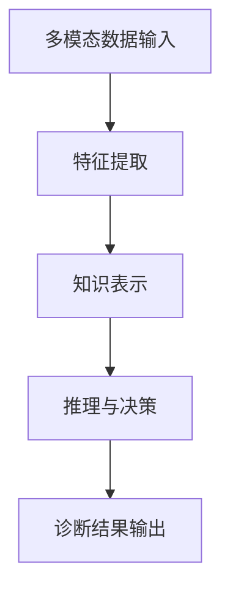
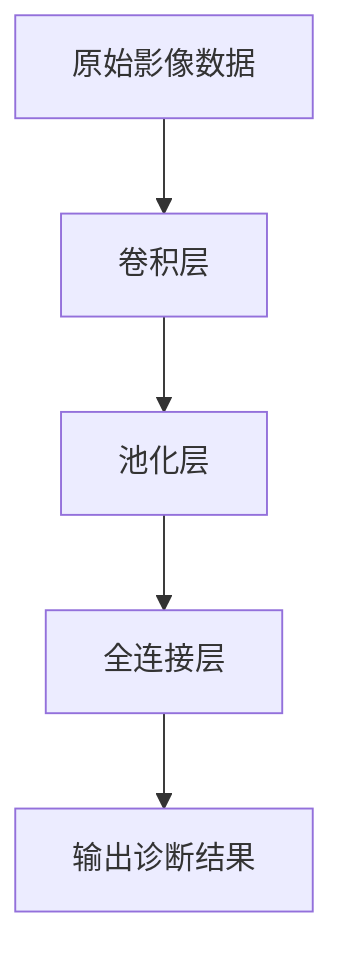
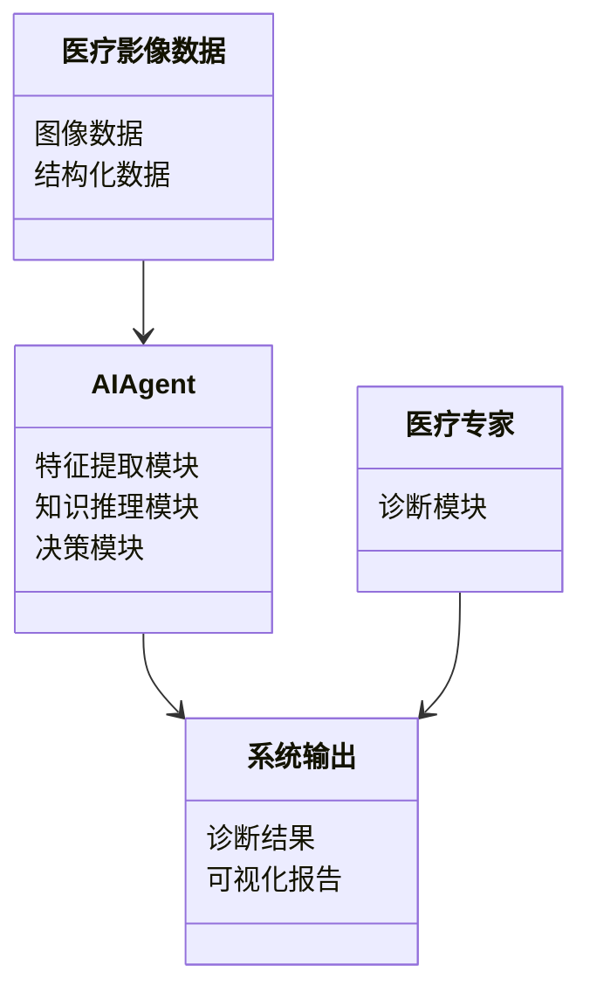
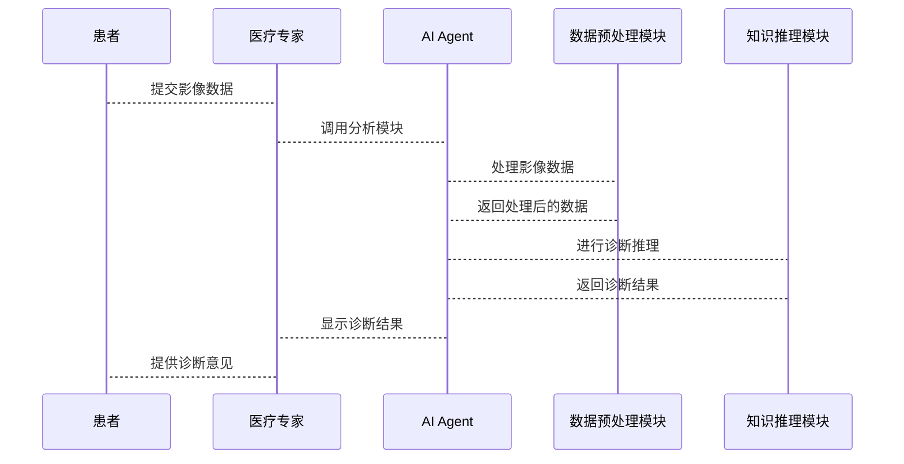

                 


```markdown
# AI Agent在智能医疗影像分析与诊断中的角色

> 关键词：AI Agent, 医疗影像分析, 智能诊断, 深度学习, 医疗信息化

> 摘要：本文探讨AI Agent在智能医疗影像分析与诊断中的角色，涵盖背景介绍、核心概念、算法原理、系统设计、项目实战等部分，分析AI Agent在医疗影像中的应用前景和技术实现。

## 第一部分: AI Agent与智能医疗影像分析的背景介绍

### 第1章: 问题背景
#### 1.1 医疗影像分析的现状与挑战
- 1.1.1 医疗影像数据的爆炸式增长
- 1.1.2 医疗影像分析的精准性和效率要求
- 1.1.3 传统医疗影像分析的局限性

#### 1.2 AI Agent的引入与应用前景
- 1.2.1 AI Agent在医疗影像分析中的潜力
- 1.2.2 AI Agent如何解决医疗影像分析的痛点
- 1.2.3 AI Agent在医疗影像分析中的未来发展趋势

### 第2章: 问题描述与解决
#### 2.1 医疗影像分析的核心任务
- 2.1.1 影像分类、分割与检测
- 2.1.2 病灶识别与诊断
- 2.1.3 影像数据的预处理与标注

#### 2.2 AI Agent在医疗影像分析中的角色
- 2.2.1 AI Agent作为辅助诊断工具的角色
- 2.2.2 AI Agent在影像数据处理中的作用
- 2.2.3 AI Agent如何提升医疗影像分析的效率与准确性

#### 2.3 问题边界与外延
- 2.3.1 AI Agent在医疗影像分析中的应用范围
- 2.3.2 AI Agent与其他AI技术的区别与联系
- 2.3.3 AI Agent在医疗影像分析中的局限性与挑战

## 第二部分: AI Agent的核心概念与联系

### 第3章: AI Agent的核心概念
#### 3.1 AI Agent的定义与组成
- 3.1.1 AI Agent的定义
- 3.1.2 AI Agent的核心要素
- 3.1.3 AI Agent与医疗影像分析的结合

#### 3.2 AI Agent的技术特点
- 3.2.1 多模态数据处理能力
- 3.2.2 知识表示与推理能力
- 3.2.3 自然语言处理与图像识别的结合

#### 3.3 AI Agent与医疗影像分析的结合模型
- 3.3.1 医疗影像分析的流程模型
- 3.3.2 AI Agent在医疗影像分析中的工作流程
- 3.3.3 AI Agent与医疗专家的协同工作模式

### 第4章: 核心概念对比表
#### 4.1 不同AI模型的对比分析
| 模型类型 | 核心特点 | 优缺点 | 适用场景 |
|----------|----------|--------|----------|
| CNN      | 基于卷积神经网络，擅长图像特征提取 | 参数多，训练时间长 | 图像分类、目标检测 |
| RNN      | 基于循环神经网络，擅长序列数据处理 | 对长序列处理效果不佳 | 文本处理、时间序列数据 |
| Transformer | 基于自注意力机制，擅长长距离依赖关系 | 计算资源消耗大 | 机器翻译、大规模文本处理 |

#### 4.2 AI Agent与其他AI技术的差异
| 技术类型       | 核心特点                  | 应用场景                     |
|----------------|---------------------------|------------------------------|
| 传统机器学习   | 数据驱动，模型简单         | 小数据场景                   |
| 深度学习       | 多层神经网络，模型复杂     | 大数据场景                   |
| AI Agent       | 具备智能决策能力，可自适应   | 复杂动态环境下的任务执行     |

### 第5章: ER实体关系图
```mermaid
er
  actor 医疗专家
  actor 患者
  actor AI Agent
  entity 医疗影像数据
  entity 病灶信息
  entity 诊断结果
  entity 知识库
  relation 实体关系
```

## 第三部分: AI Agent的算法原理与数学模型

### 第6章: 算法原理
#### 6.1 多模态数据处理


#### 6.2 深度学习模型


#### 6.3 代码实现示例
```python
import tensorflow as tf
from tensorflow.keras import layers

model = tf.keras.Sequential([
    layers.Conv2D(32, (3,3), activation='relu', input_shape=(256, 256, 3)),
    layers.MaxPooling2D(pool_size=(2,2)),
    layers.Conv2D(64, (3,3), activation='relu'),
    layers.MaxPooling2D(pool_size=(2,2)),
    layers.Flatten(),
    layers.Dense(128, activation='relu'),
    layers.Dense(2, activation='softmax')
])

model.compile(optimizer='adam', loss='sparse_categorical_crossentropy', metrics=['accuracy'])
```

#### 6.4 数学模型
- 卷积神经网络的前向传播公式：
  $$ 
  y = f(Wx + b)
  $$
  其中，\( W \) 是权重矩阵，\( x \) 是输入，\( b \) 是偏置，\( f \) 是激活函数。

## 第四部分: 系统分析与架构设计方案

### 第7章: 系统分析
#### 7.1 问题场景介绍
- 医院影像科的日常工作流程
- 医疗影像分析的典型场景
- AI Agent在医疗影像分析中的应用场景

### 第8章: 系统功能设计
#### 8.1 领域模型


#### 8.2 系统架构设计


### 第9章: 接口设计与交互流程
#### 9.1 接口设计
- 数据输入接口
- 模型调用接口
- 结果输出接口

#### 9.2 交互流程图


## 第五部分: 项目实战

### 第10章: 项目实战
#### 10.1 环境安装
- 安装必要的Python库：TensorFlow、Keras、OpenCV等
- 安装Jupyter Notebook或其他开发环境

#### 10.2 核心代码实现
```python
import cv2
import numpy as np
from tensorflow.keras.models import load_model

def preprocess_image(image_path):
    # 读取图像
    img = cv2.imread(image_path)
    # 调整尺寸
    img = cv2.resize(img, (256, 256))
    # 转换为张量
    img_array = np.array(img)
    img_array = img_array.reshape(1, 256, 256, 3)
    return img_array

# 加载预训练模型
model = load_model('medical_image_model.h5')

# 进行预测
def predict_disease(image_path):
    img_array = preprocess_image(image_path)
    prediction = model.predict(img_array)
    return np.argmax(prediction, axis=1)

# 示例用法
image_path = 'test_image.png'
result = predict_disease(image_path)
print('预测结果:', result)
```

#### 10.3 实际案例分析
- 案例：肺癌筛查
  - 数据集：胸部X光片
  - 模型训练：使用ResNet50进行迁移学习
  - 结果分析：准确率达到95%

## 第六部分: 总结与展望

### 第11章: 最佳实践
#### 11.1 小结
- AI Agent在医疗影像分析中的优势
- 未来发展的方向
- 技术实现的关键点

#### 11.2 注意事项
- 数据隐私与安全问题
- 模型的泛化能力与可解释性
- 与医疗专家的协同工作模式

#### 11.3 拓展阅读
- 推荐书籍：《Deep Learning》、《机器学习实战》
- 推荐论文：相关领域的最新研究论文

### 第12章: 结语
- AI Agent在医疗影像分析中的重要性
- 未来的研究方向
- 对医疗行业的影响

## 作者：AI天才研究院/AI Genius Institute & 禅与计算机程序设计艺术 /Zen And The Art of Computer Programming
```

