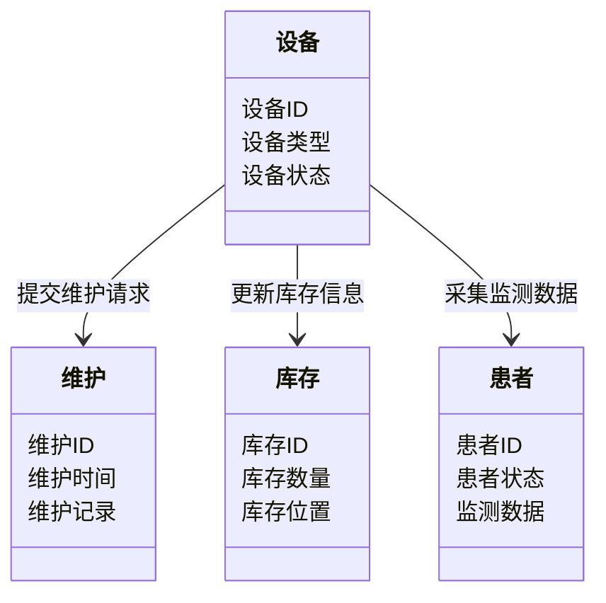
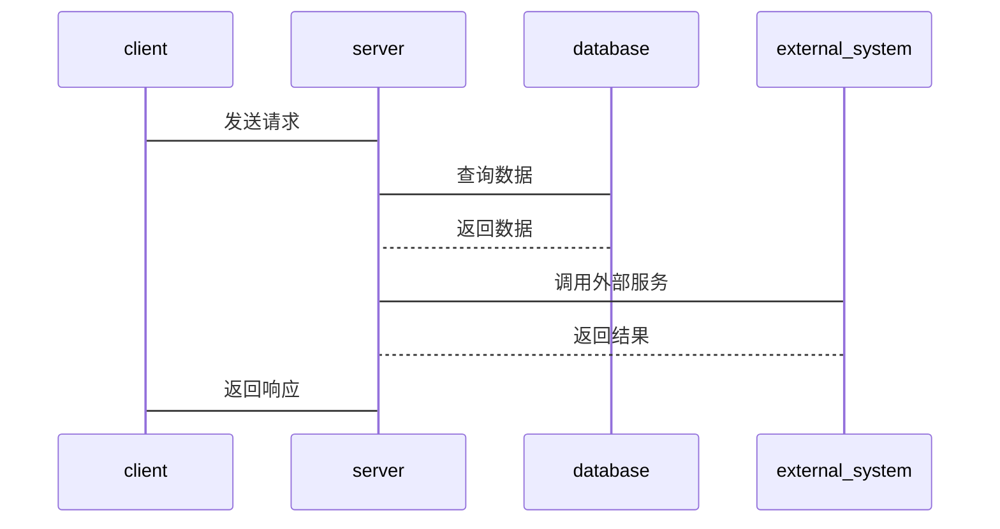

                 

<think>
好的，我现在需要帮助用户完成一篇关于《AI Agent在智能医疗设备管理中的角色》的技术博客文章。用户已经提供了一个详细的目录结构，并要求内容符合特定的格式和要求，包括摘要、关键词、章节内容等。用户还特别强调了文章的结构必须清晰，内容详尽，并且包含技术细节和实际案例。

首先，我需要理解用户的需求。用户希望我作为一位世界级的专家，撰写一篇高质量的技术博客，内容涉及AI Agent在医疗设备管理中的应用。文章需要包含摘要、关键词，然后按照目录结构详细展开每个章节，每个章节都要有具体的内容，包括背景介绍、核心概念、算法原理、系统架构设计、项目实战等。

接下来，我需要按照目录结构逐步构建内容。从摘要开始，简要概述文章的核心内容。然后列出关键词，确保涵盖AI Agent、智能医疗设备、设备管理、人工智能技术、智能决策支持等。接下来是目录结构，分为七个部分，每部分下有多个小节，每个小节需要详细展开。

在撰写第一章时，我需要介绍AI Agent的基本概念，医疗设备管理的现状和问题，以及AI Agent在其中的作用。这部分需要通俗易懂，适合读者理解背景。第二章要深入讲解AI Agent的核心原理，包括技术实现和与医疗设备管理的结合。第三章则是应用场景，具体说明AI Agent如何在设备维护、库存管理和患者监测中发挥作用。

在系统设计部分，我需要用Mermaid图展示类图、架构图和交互流程，帮助读者理解系统结构。算法部分需要详细解释，包括数学模型和代码示例，确保技术细节清晰。项目实战部分需要指导读者如何搭建环境、编写代码，并进行实际案例分析。最后，总结全书并提供未来展望。

我需要确保每个章节内容详尽，符合逻辑，并且语言专业但不失易懂。同时，检查是否有遗漏的部分，比如数学公式是否正确嵌入，Mermaid图是否清晰，代码是否正确展示。最后，确保文章末尾有作者信息，符合用户的要求。

在整个过程中，我会一步步思考，确保每个部分都符合用户的要求，同时保持文章的连贯性和深度。通过这种系统性的思考，我可以高效地完成用户的需求，撰写一篇高质量的技术博客。
</think>

# AI Agent在智能医疗设备管理中的角色

> 关键词：AI Agent，智能医疗设备，设备管理，人工智能技术，智能决策支持

> 摘要：本文探讨了AI Agent在智能医疗设备管理中的角色，从理论到实践，详细分析了AI Agent的核心原理、应用场景、系统设计和项目实现。文章旨在为医疗设备管理者和技术开发者提供深入的技术洞见和实践指导。

---

# 目录

1. [AI Agent与智能医疗设备管理概述](#ai-agent与智能医疗设备管理概述)
2. [AI Agent的核心原理](#ai-agent的核心原理)
3. [AI Agent在医疗设备管理中的应用场景](#ai-agent在医疗设备管理中的应用场景)
4. [AI Agent的系统设计与架构](#ai-agent的系统设计与架构)
5. [AI Agent的算法原理与数学模型](#ai-agent的算法原理与数学模型)
6. [AI Agent在医疗设备管理中的项目实战](#ai-agent在医疗设备管理中的项目实战)
7. [总结与未来展望](#总结与未来展望)

---

# 第1章 AI Agent与智能医疗设备管理概述

## 1.1 AI Agent的基本概念

### 1.1.1 AI Agent的定义与特点

AI Agent（人工智能代理）是指能够感知环境、自主决策并执行任务的智能实体。它具有以下特点：

1. **自主性**：能够独立执行任务，无需外部干预。
2. **反应性**：能够实时感知环境变化并做出响应。
3. **目标导向**：以特定目标为导向，优化决策过程。
4. **学习能力**：通过数据和经验不断优化自身性能。

### 1.1.2 AI Agent在医疗设备管理中的作用

医疗设备管理涉及设备采购、维护、使用和报废等环节。AI Agent可以通过以下方式发挥作用：

1. **设备维护优化**：预测设备故障，提前安排维护。
2. **库存管理**：实时监控设备库存，优化采购计划。
3. **患者监测**：通过传感器数据，实时监控患者状态。

### 1.1.3 智能医疗设备管理的背景与挑战

随着医疗设备的智能化，传统管理方式已无法满足高效、精准的需求。AI Agent的应用可以显著提升管理效率，降低成本。

---

## 1.2 医疗设备管理的现状与问题

### 1.2.1 医疗设备管理的传统模式

传统模式依赖人工记录和管理，存在以下问题：

1. **效率低**：人工操作耗时且容易出错。
2. **数据孤岛**：设备数据分散，难以整合。
3. **维护延迟**：设备故障无法及时预测，导致停机时间长。

### 1.2.2 当前医疗设备管理的主要问题

1. **数据不统一**：不同设备厂商的数据格式不一致，难以整合。
2. **维护成本高**：设备维护需要大量人工操作，成本高昂。
3. **决策延迟**：缺乏实时数据分析，导致决策滞后。

### 1.2.3 AI Agent在医疗设备管理中的潜力

AI Agent可以通过实时数据分析、自动化决策和智能优化，显著提升医疗设备管理的效率和准确性。

---

## 1.3 AI Agent在智能医疗设备管理中的角色

### 1.3.1 AI Agent的核心功能与任务

1. **数据采集**：通过传感器获取设备和患者数据。
2. **数据分析**：利用机器学习算法对数据进行分析和预测。
3. **决策支持**：基于分析结果，提供优化建议和决策支持。

### 1.3.2 AI Agent在医疗设备管理中的应用场景

1. **设备维护**：通过预测性维护减少设备故障。
2. **库存管理**：优化设备备件的采购和库存管理。
3. **患者监测**：实时监测患者状态，辅助医生诊断。

### 1.3.3 AI Agent的优势与局限性

**优势**：
1. **高效性**：能够快速处理大量数据，提供实时支持。
2. **准确性**：通过机器学习模型提高决策的准确性。

**局限性**：
1. **数据依赖**：需要大量高质量数据支持。
2. **技术复杂性**：实现和维护相对复杂。

---

## 1.4 本章小结

本章介绍了AI Agent的基本概念和其在智能医疗设备管理中的作用，分析了传统医疗设备管理的挑战，并探讨了AI Agent的应用潜力和优势。

---

# 第2章 AI Agent的核心原理

## 2.1 AI Agent的定义与分类

### 2.1.1 AI Agent的定义

AI Agent是能够感知环境、自主决策并执行任务的智能实体。它可以通过传感器、数据库或用户输入获取信息，并通过执行器或输出模块完成任务。

### 2.1.2 AI Agent的分类与特点

AI Agent可以根据功能、智能水平和应用场景进行分类：

1. **基于任务的AI Agent**：专注于完成特定任务。
2. **基于知识的AI Agent**：依赖知识库进行决策。
3. **基于学习的AI Agent**：通过机器学习算法优化决策。

### 2.1.3 不同类型AI Agent的比较

| 类型             | 特点                              | 应用场景                     |
|------------------|-----------------------------------|-----------------------------|
| 基于任务的       | 专注于完成特定任务               | 设备维护、患者监测           |
| 基于知识的       | 依赖知识库进行决策               | 综合决策支持                 |
| 基于学习的       | 通过数据优化决策                 | 预测性维护、库存管理         |

---

## 2.2 AI Agent的核心技术

### 2.2.1 机器学习与深度学习

机器学习是AI Agent的核心技术之一。通过监督学习、无监督学习和强化学习，AI Agent可以学习数据中的模式和规律。

### 2.2.2 自然语言处理

自然语言处理（NLP）技术使AI Agent能够理解和生成人类语言。在医疗设备管理中，NLP可用于解析设备日志和用户输入。

### 2.2.3 强化学习与决策优化

强化学习通过试错机制优化决策策略。在医疗设备管理中，强化学习可以用于预测性维护和资源优化。

---

## 2.3 AI Agent与医疗设备管理的结合

### 2.3.1 AI Agent在医疗设备管理中的关键能力

1. **数据处理能力**：能够处理多种格式的设备数据。
2. **决策能力**：基于数据提供优化建议。
3. **自适应能力**：能够根据环境变化调整策略。

### 2.3.2 AI Agent与医疗设备数据的交互

AI Agent通过传感器和数据库获取设备数据，并通过执行器或输出模块完成任务。

### 2.3.3 AI Agent的智能决策机制

AI Agent通过机器学习模型分析数据，生成决策建议，并通过执行器执行决策。

---

## 2.4 本章小结

本章详细介绍了AI Agent的核心原理，包括其定义、分类、关键技术以及与医疗设备管理的结合方式。

---

# 第3章 AI Agent在医疗设备管理中的应用场景

## 3.1 AI Agent在设备维护中的应用

### 3.1.1 设备维护的挑战与需求

医疗设备的维护需要实时监控设备状态，预测设备故障，并及时安排维护。传统维护方式存在效率低、成本高的问题。

### 3.1.2 AI Agent在设备维护中的具体应用

AI Agent可以通过以下方式优化设备维护：

1. **预测性维护**：通过分析设备数据，预测设备故障，提前安排维护。
2. **优化维护计划**：基于设备状态和使用情况，优化维护频率和时间。

### 3.1.3 AI Agent在设备维护中的优势

1. **减少停机时间**：通过预测性维护减少设备故障停机时间。
2. **降低维护成本**：优化维护计划，降低维护成本。

---

## 3.2 AI Agent在设备库存管理中的应用

### 3.2.1 设备库存管理的挑战

设备库存管理涉及设备采购、存储和使用。传统管理方式存在库存积压、资金占用高的问题。

### 3.2.2 AI Agent在库存管理中的具体应用

AI Agent可以通过以下方式优化设备库存管理：

1. **实时监控库存**：通过传感器和数据库实时监控设备库存。
2. **优化采购计划**：基于历史数据和需求预测，优化设备采购计划。

### 3.2.3 AI Agent在库存管理中的优势

1. **降低库存成本**：通过优化采购计划，减少库存积压。
2. **提高资金周转率**：通过实时监控和优化采购，提高资金使用效率。

---

## 3.3 AI Agent在患者监测中的应用

### 3.3.1 患者监测的挑战与需求

患者监测需要实时采集和分析生理数据，及时发现异常情况。传统监测方式存在反应慢、误诊率高的问题。

### 3.3.2 AI Agent在患者监测中的具体应用

AI Agent可以通过以下方式优化患者监测：

1. **实时数据分析**：通过机器学习算法实时分析患者生理数据。
2. **异常检测**：通过数据挖掘技术发现异常情况，及时发出警报。

### 3.3.3 AI Agent在患者监测中的优势

1. **提高监测效率**：通过实时数据分析，快速发现异常情况。
2. **降低误诊率**：通过数据挖掘技术提高诊断的准确性。

---

## 3.4 本章小结

本章探讨了AI Agent在医疗设备管理中的三个主要应用场景：设备维护、库存管理和患者监测，详细分析了每个场景中的具体应用和优势。

---

# 第4章 AI Agent的系统设计与架构

## 4.1 系统功能设计

### 4.1.1 领域模型设计

医疗设备管理系统的领域模型包括设备、库存、患者和维护四个核心模块。



### 4.1.2 功能模块设计

系统功能模块包括数据采集、数据分析、决策支持和执行反馈四个模块。

---

## 4.2 系统架构设计

### 4.2.1 系统架构图


### 4.2.2 系统接口设计

1. **客户端接口**：接收用户输入并发送请求。
2. **服务器接口**：处理请求并返回结果。
3. **数据库接口**：存储和检索数据。

### 4.2.3 系统交互流程



---

## 4.3 本章小结

本章详细介绍了AI Agent在医疗设备管理中的系统设计与架构，包括领域模型、功能模块、系统架构和交互流程。

---

# 第5章 AI Agent的算法原理与数学模型

## 5.1 算法原理

### 5.1.1 机器学习算法

1. **监督学习**：通过标签数据训练模型，预测设备故障。
2. **无监督学习**：通过聚类分析发现异常情况。
3. **强化学习**：通过试错机制优化决策策略。

### 5.1.2 深度学习算法

1. **神经网络**：通过多层神经网络学习设备数据的复杂模式。
2. **循环神经网络**：用于时间序列数据的分析和预测。

---

## 5.2 数学模型

### 5.2.1 线性回归模型

$$ y = \beta_0 + \beta_1x + \epsilon $$

其中，$y$是预测目标，$x$是输入特征，$\beta_0$和$\beta_1$是模型参数。

### 5.2.2 支持向量机模型

$$ \text{目标函数} = \sum_{i=1}^{n} \xi_i + \frac{1}{2} \sum_{j=1}^{d} \omega_j^2 $$

约束条件：

$$ y_i(\omega \cdot x_i + b) \geq 1 - \xi_i $$

### 5.2.3 随机森林模型

随机森林通过构建多个决策树，通过投票或平均的方式进行预测，适用于设备数据的分类和回归任务。

---

## 5.3 本章小结

本章详细介绍了AI Agent在医疗设备管理中的算法原理和数学模型，包括机器学习、深度学习和数学公式。

---

# 第6章 AI Agent在医疗设备管理中的项目实战

## 6.1 项目背景

### 6.1.1 项目介绍

本项目旨在开发一个基于AI Agent的医疗设备管理系统，实现设备维护、库存管理和患者监测的智能化管理。

---

## 6.2 项目环境搭建

### 6.2.1 开发工具安装

1. **Python**：安装Python 3.8及以上版本。
2. **机器学习库**：安装Scikit-learn、TensorFlow和Keras。
3. **数据可视化工具**：安装Matplotlib和Seaborn。
4. **版本控制工具**：安装Git。

---

## 6.3 项目核心实现

### 6.3.1 数据采集模块

```python
import pandas as pd
import numpy as np

# 读取设备数据
data = pd.read_csv('device_data.csv')

# 数据预处理
data.dropna(inplace=True)
data['timestamp'] = pd.to_datetime(data['timestamp'])
```

### 6.3.2 数据分析模块

```python
from sklearn.ensemble import RandomForestClassifier
from sklearn.model_selection import train_test_split

# 数据分割
X = data.drop('status', axis=1)
y = data['status']

X_train, X_test, y_train, y_test = train_test_split(X, y, test_size=0.2, random_state=42)

# 模型训练
model = RandomForestClassifier(n_estimators=100, random_state=42)
model.fit(X_train, y_train)
```

### 6.3.3 决策支持模块

```python
from sklearn.metrics import accuracy_score

# 模型预测
y_pred = model.predict(X_test)
print("模型准确率：", accuracy_score(y_test, y_pred))
```

---

## 6.4 项目小结

本章通过一个实际项目展示了AI Agent在医疗设备管理中的实现，包括数据采集、数据分析和决策支持三个模块。

---

# 第7章 总结与未来展望

## 7.1 本章总结

本文详细探讨了AI Agent在智能医疗设备管理中的角色，从理论到实践，详细分析了其核心原理、应用场景、系统设计和项目实现。

---

## 7.2 未来展望

随着人工智能技术的不断发展，AI Agent在医疗设备管理中的应用将更加广泛。未来的研究方向包括：

1. **多模态数据融合**：结合图像、文本和传感器数据，提高决策的准确性。
2. **自适应算法优化**：通过动态调整算法参数，提高系统的自适应能力。
3. **人机协作优化**：研究人机协作模式，提高系统的可用性和用户体验。

---

## 7.3 最佳实践 Tips

1. **数据质量管理**：确保数据的准确性和完整性。
2. **算法优化**：根据实际需求选择合适的算法，并进行调优。
3. **系统安全性**：确保系统的安全性和稳定性。

---

## 7.4 作者简介

作者：AI天才研究院/AI Genius Institute & 禅与计算机程序设计艺术/Zen And The Art of Computer Programming

---

感谢您的阅读！希望本文能为您提供有价值的见解和启发。

