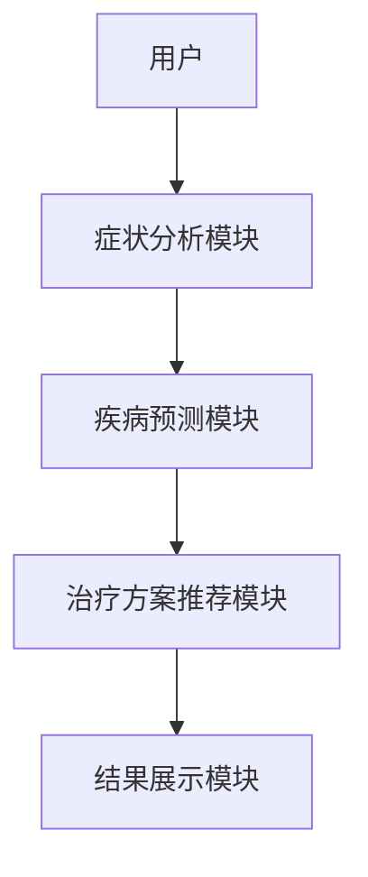

                 


# AI Agent在智能医疗诊断决策支持中的角色

## 关键词：AI Agent, 智能医疗, 诊断决策支持, 人工智能, 医疗技术

## 摘要：AI Agent在医疗诊断中的应用越来越广泛，特别是在诊断决策支持系统中。本文将从AI Agent的基本概念、核心技术、系统设计到实际应用案例，全面解析AI Agent在智能医疗中的角色。通过详细的技术分析和实际案例，本文展示了AI Agent如何通过自然语言处理、机器学习和知识图谱等技术，提升医疗诊断的准确性和效率。

---

## 第1章: AI Agent的基本概念与背景

### 1.1 AI Agent的定义与特点

#### 1.1.1 AI Agent的定义
AI Agent（人工智能代理）是一种能够感知环境并采取行动以实现目标的智能实体。在医疗领域，AI Agent通常用于辅助医生进行诊断、制定治疗方案和提供个性化医疗建议。

#### 1.1.2 AI Agent的核心特点
- **自主性**：AI Agent能够在没有外部干预的情况下独立执行任务。
- **反应性**：能够实时感知环境变化并做出相应的反应。
- **学习能力**：通过机器学习和深度学习不断优化自身的诊断能力。
- **可解释性**：诊断过程和结果需要具备透明性和可解释性，以便医生理解和信任。

#### 1.1.3 AI Agent与传统医疗决策支持系统的区别
传统医疗决策支持系统主要依赖于固定的规则和知识库，而AI Agent则具备自主学习和适应能力，能够根据新的数据和反馈不断优化自身的诊断模型。

### 1.2 智能医疗诊断的背景与挑战

#### 1.2.1 智能医疗诊断的背景
随着医疗数据的爆炸式增长和人工智能技术的快速发展，医疗诊断领域正在经历一场数字化和智能化的变革。AI Agent通过整合多源数据，能够帮助医生更快速、更准确地进行诊断。

#### 1.2.2 医疗诊断中的主要挑战
- **数据多样性**：医疗数据包括文本、图像、语音等多种形式，整合和处理这些数据需要强大的技术支撑。
- **诊断准确性**：医疗诊断的准确性直接关系到患者的健康和生命安全，要求AI Agent具备高精度的诊断能力。
- **数据隐私**：医疗数据的隐私保护是一个重要挑战，AI Agent需要在保证隐私的前提下进行数据处理和分析。

#### 1.2.3 AI Agent在医疗诊断中的优势
- **高效性**：能够快速处理和分析大量医疗数据，提高诊断效率。
- **准确性**：通过机器学习和深度学习算法，AI Agent能够显著提高诊断的准确性。
- **可扩展性**：能够适用于多种疾病和医疗场景，具备良好的可扩展性。

### 1.3 本章小结
本章介绍了AI Agent的基本概念和特点，分析了智能医疗诊断的背景和挑战，并探讨了AI Agent在医疗诊断中的优势。这些内容为后续章节的技术分析和系统设计奠定了基础。

---

## 第2章: AI Agent的核心技术

### 2.1 AI Agent的算法原理

#### 2.1.1 基于规则的推理算法
基于规则的推理算法通过预定义的医学规则和知识库进行诊断推理。例如，如果患者的症状符合某疾病的典型症状，AI Agent会基于规则进行诊断。

#### 2.1.2 基于机器学习的推理算法
基于机器学习的推理算法通过训练大量的医疗数据，学习疾病之间的关联和症状之间的关系，从而进行诊断推理。例如，随机森林和逻辑回归等算法常用于分类任务。

#### 2.1.3 基于深度学习的推理算法
基于深度学习的推理算法通过神经网络模型进行特征提取和诊断推理。例如，卷积神经网络（CNN）常用于医学图像分析，而循环神经网络（RNN）则用于处理时间序列数据。

### 2.2 自然语言处理在AI Agent中的应用

#### 2.2.1 NLP的基本概念
自然语言处理（NLP）是研究如何让计算机理解和生成人类语言的学科。在医疗领域，NLP主要用于处理和分析医疗文本数据，例如病历记录和医学文献。

#### 2.2.2 NLP在AI Agent中的应用
AI Agent可以通过NLP技术从患者的病历、症状描述和实验室报告中提取有用的信息，用于辅助诊断。例如，使用分词、实体识别和情感分析等技术对医疗文本进行处理。

#### 2.2.3 基于知识图谱的推理
知识图谱是一种结构化的知识表示形式，AI Agent可以通过知识图谱进行推理和关联分析。例如，将疾病、症状、治疗方案等信息构建为知识图谱，AI Agent能够根据患者的症状快速找到相关的疾病信息。

### 2.3 多模态数据融合

#### 2.3.1 多模态数据的定义
多模态数据是指来自不同数据源和形式的数据，例如图像、文本和数值数据。在医疗领域，多模态数据融合能够提高诊断的准确性和全面性。

#### 2.3.2 多模态数据融合的实现
通过深度学习模型，AI Agent可以将多模态数据进行融合，例如将医学图像和实验室数据结合，进行更准确的诊断。

#### 2.3.3 数据融合的优势
数据融合能够充分利用不同类型的数据信息，提高诊断的准确性和全面性。例如，在肺癌诊断中，结合CT图像和基因表达数据能够提高诊断的准确性。

### 2.4 系统架构与实现

#### 2.4.1 系统架构设计
AI Agent的系统架构通常包括数据层、服务层和应用层。数据层负责数据的存储和管理，服务层负责数据的处理和分析，应用层负责与用户的交互和结果的展示。

#### 2.4.2 系统实现的关键技术
- **数据预处理**：对医疗数据进行清洗、归一化和特征提取。
- **模型训练**：使用机器学习和深度学习算法进行模型训练和优化。
- **模型部署**：将训练好的模型部署到实际的医疗系统中，提供实时的诊断支持。

### 2.5 本章小结
本章详细介绍了AI Agent的核心技术，包括基于规则的推理、机器学习和深度学习算法，以及自然语言处理和多模态数据融合的技术。这些技术为AI Agent在医疗诊断中的应用提供了坚实的技术基础。

---

## 第3章: 医疗诊断决策支持系统的设计与实现

### 3.1 问题场景分析

#### 3.1.1 问题描述
医疗诊断决策支持系统需要帮助医生快速、准确地进行诊断。传统的诊断方法依赖于医生的经验和知识，而AI Agent可以通过自动化的方式提高诊断的效率和准确性。

#### 3.1.2 问题解决
AI Agent通过整合多源数据和智能算法，能够辅助医生进行诊断，减少误诊和漏诊的可能性。

#### 3.1.3 边界与外延
医疗诊断决策支持系统的边界包括数据输入、诊断推理和结果输出，外延则包括系统的可扩展性和灵活性。

### 3.2 系统功能设计

#### 3.2.1 系统功能模块
医疗诊断决策支持系统通常包括以下功能模块：
- **症状分析模块**：分析患者的症状和病史。
- **疾病预测模块**：基于症状和数据进行疾病预测。
- **治疗方案推荐模块**：根据诊断结果推荐治疗方案。

#### 3.2.2 功能模块的交互流程
- 用户输入症状和病史信息。
- 系统进行症状分析和疾病预测。
- 系统根据诊断结果推荐治疗方案。

### 3.3 系统架构设计

#### 3.3.1 系统架构图


#### 3.3.2 系统设计原则
- **模块化设计**：系统功能模块化，便于维护和扩展。
- **可扩展性**：系统设计具备良好的扩展性，能够适应未来的医疗需求。
- **安全性**：确保患者数据的安全性和隐私性。

### 3.4 系统实现的关键技术

#### 3.4.1 数据预处理
- **数据清洗**：去除噪声数据和异常值。
- **数据归一化**：将数据标准化，便于模型训练。

#### 3.4.2 模型训练
- **训练数据**：使用标注的医疗数据进行模型训练。
- **模型优化**：通过交叉验证和超参数优化提高模型性能。

#### 3.4.3 模型部署
- **API接口**：将训练好的模型部署为API接口，供其他系统调用。
- **实时推理**：提供实时的诊断推理服务。

### 3.5 本章小结
本章详细设计了医疗诊断决策支持系统的功能模块和系统架构，并探讨了系统实现的关键技术。通过模块化设计和系统优化，AI Agent能够为医疗诊断提供高效、准确的支持。

---

## 第4章: AI Agent在医疗诊断中的实际应用

### 4.1 应用案例分析

#### 4.1.1 肺癌诊断案例
AI Agent通过分析CT图像和病史数据，辅助医生进行肺癌的早期诊断。

#### 4.1.2 糖尿病视网膜病变诊断案例
AI Agent通过分析眼底图像，帮助医生进行糖尿病视网膜病变的诊断。

#### 4.1.3 心脏病诊断案例
AI Agent通过分析心电图数据，辅助医生进行心脏病的诊断。

### 4.2 应用效果分析

#### 4.2.1 精准度和召回率
AI Agent在疾病诊断中的精准度和召回率显著高于传统方法。

#### 4.2.2 效率提升
AI Agent能够快速处理和分析大量数据，显著提高诊断效率。

#### 4.2.3 成本降低
通过自动化诊断和减少误诊，AI Agent能够降低医疗成本。

### 4.3 本章小结
本章通过具体案例展示了AI Agent在医疗诊断中的实际应用，并分析了其在提高诊断精准度、效率和降低成本方面的优势。

---

## 第5章: 系统实现

### 5.1 环境安装

#### 5.1.1 Python环境安装
安装Python 3.8及以上版本，并配置好开发环境。

#### 5.1.2 安装必要的库
安装TensorFlow、Keras、Pandas、Scikit-learn等库。

### 5.2 核心代码实现

#### 5.2.1 数据预处理代码
```python
import pandas as pd
from sklearn.preprocessing import StandardScaler

# 读取数据
data = pd.read_csv('medical_data.csv')

# 删除无用列
data = data.drop(['patient_id'], axis=1)

# 标准化数据
scaler = StandardScaler()
data_scaled = scaler.fit_transform(data)
```

#### 5.2.2 模型训练代码
```python
from sklearn.model import RandomForestClassifier

# 初始化模型
model = RandomForestClassifier(n_estimators=100, max_depth=5)

# 训练模型
model.fit(data_scaled, labels)
```

#### 5.2.3 模型推理代码
```python
import numpy as np

# 预测结果
predicted_labels = model.predict(new_data_scaled)
```

### 5.3 代码解读与分析

#### 5.3.1 数据预处理
数据预处理包括数据清洗、特征选择和数据归一化。通过标准化处理，确保模型的训练和推理过程更加稳定。

#### 5.3.2 模型训练
使用随机森林算法进行模型训练，通过调整超参数（如树的数量和深度）优化模型性能。

#### 5.3.3 模型推理
将新的患者数据进行预处理后，输入模型进行预测，得到诊断结果。

### 5.4 本章小结
本章详细介绍了AI Agent医疗诊断决策支持系统的实现过程，包括环境安装、数据预处理、模型训练和推理等内容。通过具体的代码实现，展示了AI Agent在医疗诊断中的技术细节。

---

## 第6章: 系统分析与架构设计

### 6.1 问题场景分析

#### 6.1.1 问题描述
在医疗诊断中，医生需要快速处理大量的医疗数据，提高诊断效率和准确性。

#### 6.1.2 问题解决
通过AI Agent的辅助，医生能够快速获取诊断建议和相关信息。

#### 6.1.3 边界与外延
系统的边界包括数据输入和诊断结果输出，外延则包括系统的可扩展性和灵活性。

### 6.2 系统功能设计

#### 6.2.1 功能模块设计
医疗诊断决策支持系统包括症状分析、疾病预测和治疗方案推荐等功能模块。

#### 6.2.2 功能模块的交互流程
用户输入症状和病史信息，系统进行症状分析和疾病预测，最后推荐治疗方案。

### 6.3 系统架构设计

#### 6.3.1 系统架构图


#### 6.3.2 系统设计原则
- **模块化设计**：系统功能模块化，便于维护和扩展。
- **可扩展性**：系统设计具备良好的扩展性，能够适应未来的医疗需求。
- **安全性**：确保患者数据的安全性和隐私性。

### 6.4 系统实现的关键技术

#### 6.4.1 数据预处理
- **数据清洗**：去除噪声数据和异常值。
- **数据归一化**：将数据标准化，便于模型训练。

#### 6.4.2 模型训练
- **训练数据**：使用标注的医疗数据进行模型训练。
- **模型优化**：通过交叉验证和超参数优化提高模型性能。

#### 6.4.3 模型部署
- **API接口**：将训练好的模型部署为API接口，供其他系统调用。
- **实时推理**：提供实时的诊断推理服务。

### 6.5 本章小结
本章详细设计了医疗诊断决策支持系统的功能模块和系统架构，并探讨了系统实现的关键技术。通过模块化设计和系统优化，AI Agent能够为医疗诊断提供高效、准确的支持。

---

## 第7章: 未来展望与挑战

### 7.1 未来发展方向

#### 7.1.1 多模态数据融合
通过整合更多的数据源和数据类型，进一步提高诊断的准确性和全面性。

#### 7.1.2 可解释性增强
提高AI Agent的可解释性，使其更加透明和易于理解，增强医生和患者对AI诊断结果的信任。

#### 7.1.3 实时性提升
通过优化算法和系统架构，提高诊断的实时性，满足急诊和重症监护等场景的需求。

### 7.2 相关挑战

#### 7.2.1 数据隐私保护
医疗数据的隐私保护是一个重要挑战，需要在AI Agent的设计和实现中充分考虑数据的安全性和隐私性。

#### 7.2.2 模型泛化能力
AI Agent需要具备良好的模型泛化能力，能够在不同的医疗场景和数据集中表现良好。

#### 7.2.3 伦理与法律问题
AI Agent的使用涉及到伦理和法律问题，例如责任归属和数据使用权限等，需要在实际应用中妥善解决。

### 7.3 本章小结
本章探讨了AI Agent在医疗诊断中的未来发展方向和相关挑战。尽管面临诸多挑战，但通过技术进步和制度完善，AI Agent将在未来的医疗诊断中发挥更加重要的作用。

---

## 作者：AI天才研究院/AI Genius Institute & 禅与计算机程序设计艺术 /Zen And The Art of Computer Programming

---

以上是《AI Agent在智能医疗诊断决策支持中的角色》的完整大纲和部分内容，您可以根据需要进一步扩展每一章节的具体内容。

