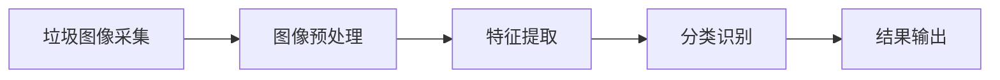
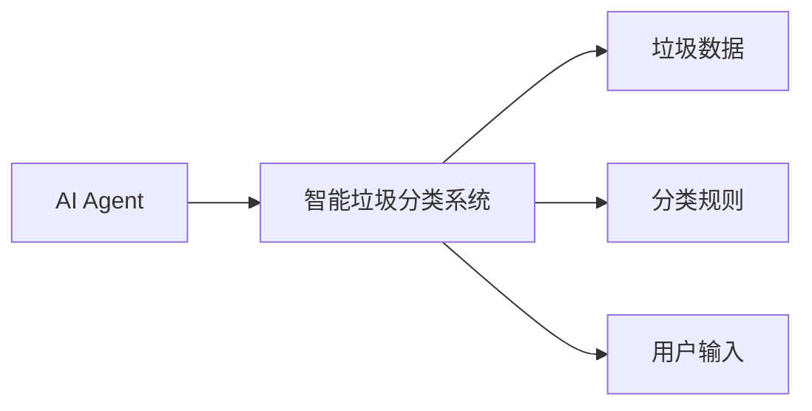
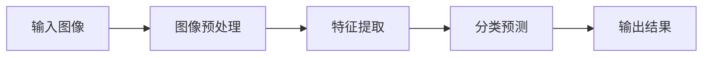
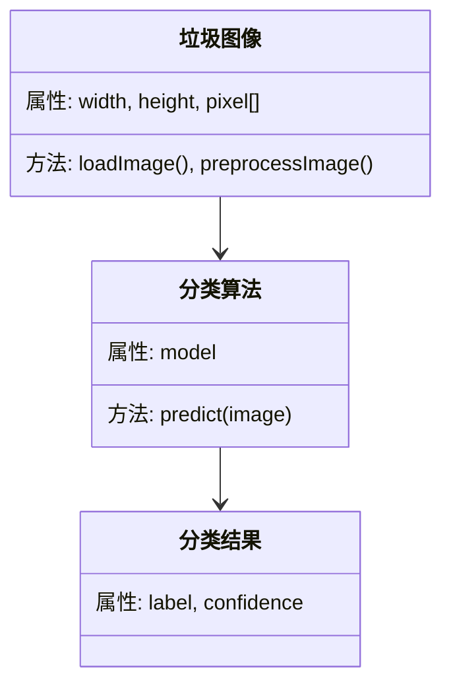
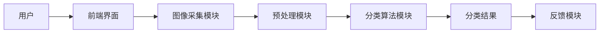
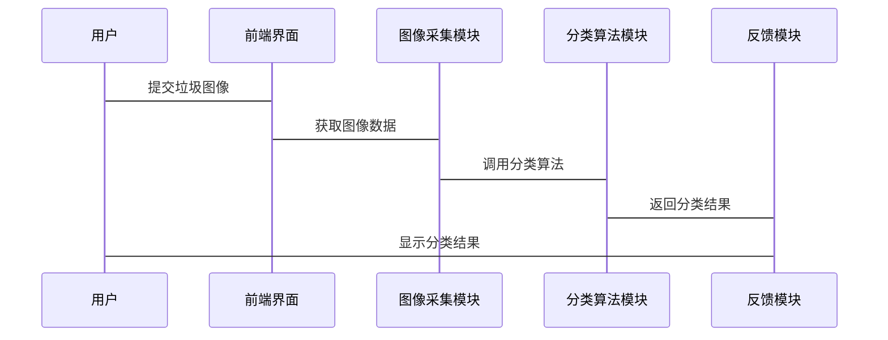

                 


# AI Agent在智能垃圾分类系统中的实践

> 关键词：AI Agent，智能垃圾分类系统，深度学习，图像分类，系统架构设计，Python实现

> 摘要：本文详细探讨了AI Agent在智能垃圾分类系统中的实践应用。通过分析系统背景、核心概念、算法原理、系统架构设计、项目实战等多个方面，系统地介绍了如何利用AI技术实现高效的垃圾分类。本文旨在为读者提供一个全面的技术视角，帮助他们理解AI Agent在智能垃圾分类系统中的工作原理和实际应用。

---

## 目录

1. [背景介绍](#背景介绍)
2. [AI Agent的核心概念与原理](#AI-Agent的核心概念与原理)
3. [智能垃圾分类系统的算法原理](#智能垃圾分类系统的算法原理)
4. [系统分析与架构设计](#系统分析与架构设计)
5. [项目实战](#项目实战)
6. [总结与展望](#总结与展望)
7. [附录与参考文献](#附录与参考文献)

---

## 第1章: 背景介绍

### 1.1 问题背景与描述

#### 1.1.1 当前垃圾分类的现状与挑战
随着城市化进程的加快，垃圾量急剧增加，垃圾分类成为全球关注的焦点。传统的人工分类方式效率低、成本高，且容易出错。如何利用人工智能技术实现高效、智能的垃圾分类，成为当前研究的热点。

#### 1.1.2 垃圾分类的重要性与意义
垃圾分类是资源回收、环境保护的重要环节。通过智能垃圾分类系统，可以大幅提高分类效率，减少环境污染，实现资源的循环利用。

#### 1.1.3 AI Agent在垃圾分类中的应用价值
AI Agent（智能体）是一种能够感知环境并采取行动以实现目标的智能系统。在垃圾分类中，AI Agent可以通过图像识别、模式识别等技术，实现对垃圾的自动分类和处理。

### 1.2 问题解决与边界定义

#### 1.2.1 AI Agent如何解决垃圾分类问题
AI Agent可以通过深度学习算法，对垃圾图像进行分类，识别出垃圾的类型，并将其分类到相应的垃圾桶中。

#### 1.2.2 系统边界与功能范围
智能垃圾分类系统的功能包括：垃圾图像采集、图像处理、分类识别、结果输出等。系统的边界包括前端的图像采集设备和后端的分类算法。

#### 1.2.3 垃圾分类系统的外延与限制
智能垃圾分类系统适用于家庭、社区、公共场所等多种场景，但目前仍存在一些限制，如分类精度受数据质量和算法的影响。

### 1.3 核心概念与结构

#### 1.3.1 AI Agent的基本概念
AI Agent是一种能够感知环境、自主决策并采取行动的智能系统。它可以分为简单反射型、基于模型的反应型、目标驱动型和实用驱动型四种类型。

#### 1.3.2 智能垃圾分类系统的组成要素
智能垃圾分类系统主要包括图像采集设备、AI Agent算法模块、分类规则库、用户交互界面等组成部分。

#### 1.3.3 系统的核心功能与流程
系统的核心功能包括：垃圾图像采集、图像预处理、特征提取、分类识别、结果输出等。系统流程如下：



---

## 第2章: AI Agent的核心概念与原理

### 2.1 AI Agent的基本原理

#### 2.1.1 AI Agent的定义与分类
AI Agent是一种智能实体，能够感知环境并采取行动以实现目标。根据智能体的智能水平，可以分为反应式智能体和基于模型的智能体。

#### 2.1.2 AI Agent的核心特征
AI Agent具有自主性、反应性、目标导向性和学习能力等核心特征。

#### 2.1.3 AI Agent与传统算法的区别
AI Agent不仅仅是简单的算法实现，它具有自主决策和动态适应的能力，能够根据环境的变化调整自身的行为。

### 2.2 智能垃圾分类系统中的AI Agent设计

#### 2.2.1 系统需求分析
智能垃圾分类系统需要实现以下功能：图像采集、图像处理、分类识别、结果输出等。

#### 2.2.2 AI Agent的功能模块划分
AI Agent的功能模块包括：感知模块、决策模块、执行模块和学习模块。

#### 2.2.3 系统的输入输出定义
系统的输入包括垃圾图像和分类规则，输出包括分类结果和反馈信息。

### 2.3 AI Agent与智能垃圾分类系统的实体关系



---

## 第3章: 智能垃圾分类系统的算法原理

### 3.1 算法原理概述

#### 3.1.1 垃圾分类的常用算法
常用的垃圾分类算法包括：K-近邻算法（KNN）、支持向量机（SVM）、随机森林（Random Forest）和卷积神经网络（CNN）等。

#### 3.1.2 AI Agent的核心算法选择
在智能垃圾分类系统中，卷积神经网络（CNN）是一种常用的核心算法，具有较高的分类精度和较强的鲁棒性。

#### 3.1.3 算法的优缺点分析
CNN算法的优点是分类精度高、能够处理图像数据；缺点是需要大量的训练数据和计算资源。

### 3.2 基于深度学习的垃圾分类算法

#### 3.2.1 CNN网络在图像分类中的应用
卷积神经网络（CNN）通过卷积操作、池化操作和全连接层，实现对垃圾图像的特征提取和分类。

#### 3.2.2 网络结构设计与优化
常用的CNN网络结构包括LeNet、AlexNet、VGGNet、ResNet等。在实际应用中，可以根据具体需求选择合适的网络结构并进行优化。

#### 3.2.3 算法实现的数学模型和公式
CNN网络的卷积操作可以表示为：

$$
f(x) = \sum_{i=1}^{k} w_i \cdot x_i + b
$$

其中，\( w_i \) 是权重，\( x_i \) 是输入，\( b \) 是偏置。

### 3.3 算法流程图



---

## 第4章: 系统分析与架构设计

### 4.1 问题场景介绍

#### 4.1.1 问题场景描述
智能垃圾分类系统需要处理大量的垃圾图像数据，实现对垃圾的自动分类。

#### 4.1.2 项目介绍
本项目旨在开发一个基于AI Agent的智能垃圾分类系统，利用深度学习算法实现垃圾的自动分类。

### 4.2 系统功能设计

#### 4.2.1 领域模型类图


#### 4.2.2 系统架构设计


#### 4.2.3 系统接口设计
系统接口包括图像采集接口、分类算法接口和结果反馈接口。

#### 4.2.4 系统交互序列图


---

## 第5章: 项目实战

### 5.1 环境安装

#### 5.1.1 Python环境安装
安装Python 3.x及以上版本。

#### 5.1.2 深度学习框架安装
安装TensorFlow或Keras框架。

#### 5.1.3 数据集准备
准备垃圾图像数据集，包括训练集、验证集和测试集。

### 5.2 系统核心实现

#### 5.2.1 垃圾图像预处理
```python
import cv2
import numpy as np

def preprocess_image(image_path):
    image = cv2.imread(image_path)
    image = cv2.resize(image, (224, 224))
    image = image / 255.0  # Normalization
    return image
```

#### 5.2.2 分类算法实现
```python
import tensorflow as tf
from tensorflow.keras.models import Sequential
from tensorflow.keras.layers import Conv2D, MaxPooling2D, Flatten, Dense

model = Sequential()
model.add(Conv2D(32, (3, 3), activation='relu', input_shape=(224, 224, 3)))
model.add(MaxPooling2D((2, 2)))
model.add(Conv2D(64, (3, 3), activation='relu'))
model.add(MaxPooling2D((2, 2)))
model.add(Flatten())
model.add(Dense(128, activation='relu'))
model.add(Dense(num_classes, activation='softmax'))
model.compile(optimizer='adam', loss='categorical_crossentropy', metrics=['accuracy'])
```

#### 5.2.3 分类结果输出
```python
from sklearn.metrics import classification_report

# 假设labels是真实标签，predictions是预测结果
print(classification_report(labels, predictions))
```

### 5.3 代码应用解读与分析

#### 5.3.1 代码功能模块分析
上述代码实现了垃圾图像的预处理、模型构建和分类结果输出。

#### 5.3.2 算法实现细节
在分类算法中，使用了卷积神经网络（CNN）进行图像特征提取和分类。

#### 5.3.3 项目实现中的注意事项
需要注意数据集的均衡性和模型的泛化能力，避免过拟合。

### 5.4 案例分析与详细讲解

#### 5.4.1 案例分析
以一张垃圾图像为例，展示系统的分类过程和结果。

#### 5.4.2 系统实现中的常见问题及解决方案
常见的问题包括数据不足、分类精度低等，可以通过增加数据量、优化模型结构等方式进行解决。

### 5.5 本章小结

#### 5.5.1 本章内容总结
本章通过实际项目展示了AI Agent在智能垃圾分类系统中的实现过程。

#### 5.5.2 下一章的预

