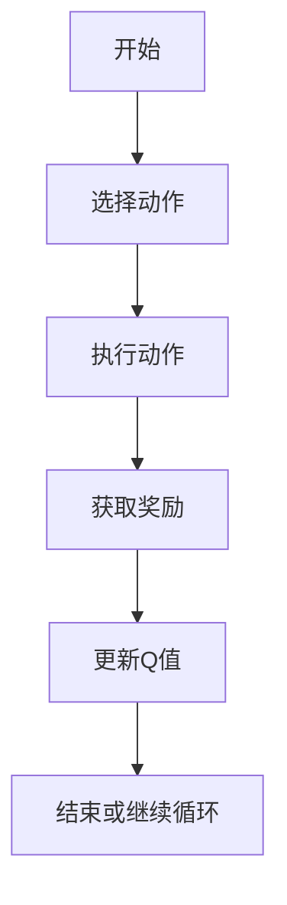
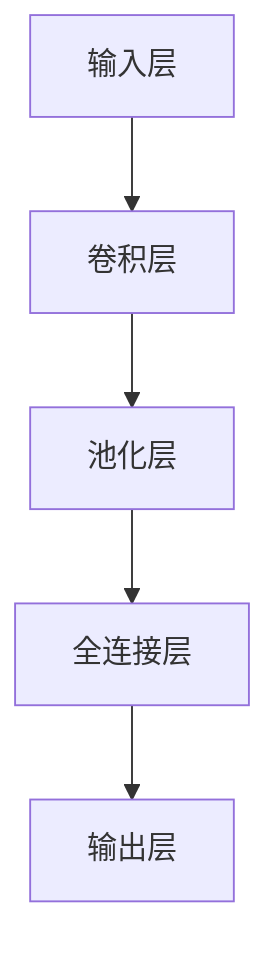
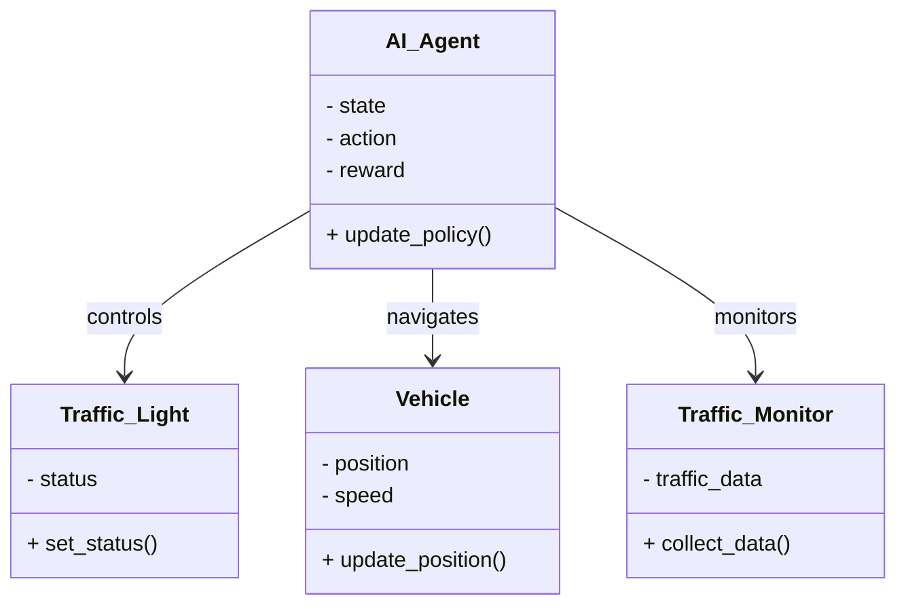
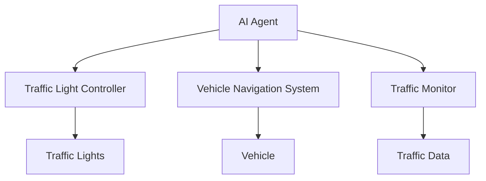

                 


```markdown
# AI Agent在智能城市交通优化中的应用

> 关键词：AI Agent, 智能交通系统, 强化学习, 城市交通优化, 数学模型

> 摘要：本文探讨了AI Agent在智能城市交通优化中的应用，通过分析AI Agent的核心原理、算法实现、系统架构设计以及实际项目案例，详细阐述了AI Agent如何帮助解决城市交通中的复杂问题，优化交通流量，提高道路使用效率。文章结合理论与实践，提供了一套完整的解决方案，并给出了未来研究方向的展望。

---

# 第一部分: AI Agent在智能城市交通优化中的应用概述

## 第1章: 问题背景与核心概念

### 1.1 问题背景

#### 1.1.1 城市交通面临的挑战
城市化进程的加速导致交通流量急剧增加，传统的交通管理方式难以应对日益复杂的交通问题。城市交通系统面临以下主要挑战：
- **交通拥堵**：高峰时段交通流量超负荷，导致道路利用率低下。
- **资源浪费**：车辆空驶、停车位资源浪费现象普遍。
- **环境污染**：交通尾气排放加剧城市空气污染。
- **安全性问题**：交通事故频发，尤其是人为因素导致的安全隐患。

#### 1.1.2 AI Agent在交通优化中的作用
AI Agent（智能体）通过实时感知、分析和决策，能够有效优化交通流量，提高道路使用效率。其主要作用包括：
- **实时优化**：根据交通流量动态调整信号灯配时，优化路口通行效率。
- **路径规划**：为驾驶员提供最优行驶路线，减少拥堵和延误。
- **资源分配**：动态分配停车位资源，提高资源利用率。

#### 1.1.3 智能城市交通的定义与目标
智能城市交通系统（ITS）是利用先进的信息技术、数据通信、传感器和控制技术，实现交通系统的智能化管理。其目标是：
- 提高交通系统的运行效率。
- 减少交通事故的发生。
- 降低能源消耗和环境污染。

### 1.2 核心概念与联系

#### 1.2.1 AI Agent的定义与特征
AI Agent是一种具有感知、推理、规划和执行能力的智能实体。其主要特征包括：
- **自主性**：能够在没有外部干预的情况下独立运作。
- **反应性**：能够实时感知环境变化并做出反应。
- **学习能力**：能够通过经验改进自身的决策能力。

#### 1.2.2 AI Agent与智能交通系统的关系
AI Agent是智能交通系统的核心组件之一，负责实时感知交通状态、分析数据并做出决策。AI Agent通过与其他智能体（如车辆、交通信号灯）协同工作，实现交通系统的整体优化。

#### 1.2.3 核心概念对比表格
以下是AI Agent与传统交通管理系统的对比：

| 对比维度       | AI Agent                  | 传统交通管理系统       |
|----------------|---------------------------|-----------------------|
| 感知能力       | 强大，实时感知交通状态     | 有限，依赖人工监控     |
| 决策能力       | 智能，动态调整策略         | 固定，基于预设规则     |
| 反应速度       | 快速，实时响应             | 较慢，依赖人工干预     |

#### 1.2.4 ER实体关系图
以下是AI Agent在交通系统中的实体关系图：

```mermaid
er
actor: AI Agent
participant: 交通信号灯
participant: 车辆
participant: 交通监控系统
participant: 用户

actor --> "监控" --> 交通监控系统
actor --> "控制" --> 交通信号灯
actor --> "规划" --> 车辆
actor --> "反馈" --> 用户
```

---

## 第2章: AI Agent的核心原理

### 2.1 AI Agent的基本原理

#### 2.1.1 感知层
AI Agent通过多种传感器和数据源实时感知交通状态，包括：
- **交通流量检测**：使用摄像头、雷达等设备检测道路流量。
- **交通信号灯状态**：获取信号灯的实时状态。
- **天气状况**：考虑雨、雪等天气对交通的影响。

#### 2.1.2 决策层
基于感知到的数据，AI Agent通过算法进行分析和决策。常用的算法包括：
- **强化学习**：通过试错不断优化决策策略。
- **深度学习**：利用神经网络模型分析复杂数据。

#### 2.1.3 执行层
根据决策结果，AI Agent通过控制信号灯、发布导航指令等方式实现优化目标。

### 2.2 AI Agent的算法原理

#### 2.2.1 强化学习算法
强化学习是一种通过试错学习优化策略的算法。以下是Q-learning算法的流程图：



Q-learning算法的数学公式为：
$$ Q(s,a) = Q(s,a) + \alpha (r + \gamma \max Q(s',a') - Q(s,a)) $$

其中：
- \( Q(s,a) \) 表示状态 \( s \) 下采取动作 \( a \) 的价值。
- \( \alpha \) 表示学习率。
- \( r \) 表示奖励。
- \( \gamma \) 表示折扣因子。
- \( Q(s',a') \) 表示下一个状态 \( s' \) 下的最大价值。

#### 2.2.2 深度学习算法
深度学习通过神经网络模型分析交通数据，预测交通流量和拥堵情况。以下是典型的卷积神经网络（CNN）结构：



---

## 第3章: AI Agent的数学模型与公式

### 3.1 强化学习模型

#### 3.1.1 Q-learning算法
Q-learning算法通过不断更新Q值表来优化决策策略。以下是Q值表的更新过程：

$$ Q(s,a) = Q(s,a) + \alpha (r + \gamma \max Q(s',a') - Q(s,a)) $$

其中，\( \alpha \) 是学习率，\( \gamma \) 是折扣因子，\( r \) 是奖励。

#### 3.1.2 状态转移矩阵
状态转移矩阵描述了从当前状态转移到下一个状态的概率：

$$ P_{s' | s,a} = \text{概率从状态 } s \text{ 采取动作 } a \text{ 转移到状态 } s' $$

#### 3.1.3 奖励函数设计
奖励函数用于衡量AI Agent的决策效果。例如，当AI Agent成功优化交通流量时，给予正奖励：

$$ r(s,a) = \begin{cases}
    +1 & \text{优化成功} \\
    -1 & \text{优化失败}
\end{cases} $$

---

## 第4章: 系统分析与架构设计

### 4.1 问题场景介绍

#### 4.1.1 智能交通系统的应用场景
AI Agent在智能交通系统中的应用场景包括：
- **交通信号灯优化**：动态调整信号灯配时，减少等待时间。
- **路径规划**：为驾驶员提供最优行驶路线，避开拥堵路段。
- **应急响应**：在交通事故或恶劣天气下快速调整交通流量。

#### 4.1.2 AI Agent在交通优化中的具体问题
AI Agent需要解决以下具体问题：
- 如何实时感知交通状态。
- 如何动态调整信号灯配时。
- 如何优化交通流量。

### 4.2 系统架构设计

#### 4.2.1 领域模型类图
以下是智能交通系统的领域模型类图：



#### 4.2.2 系统架构图
以下是智能交通系统的系统架构图：



#### 4.2.3 接口设计
以下是AI Agent与其他组件的接口设计：

- **AI Agent与交通信号灯控制器接口**：
  ```python
  def control_traffic_light(light_id, status):
      # 控制交通信号灯的状态
  ```

- **AI Agent与车辆导航系统接口**：
  ```python
  def navigate_vehicle(vehicle_id, route):
      # 为车辆规划最优路线
  ```

- **AI Agent与交通监控系统接口**：
  ```python
  def monitor_traffic():
      # 监测交通数据
  ```

---

## 第5章: 项目实战

### 5.1 环境安装与配置

#### 5.1.1 开发环境搭建
- 操作系统：Linux或Windows。
- 开发工具：PyCharm或VS Code。
- 依赖库安装：
  ```bash
  pip install numpy
  pip install matplotlib
  pip install scikit-learn
  ```

### 5.2 核心代码实现

#### 5.2.1 Q-learning算法实现
以下是Q-learning算法的Python实现：

```python
import numpy as np

class QLearning:
    def __init__(self, state_space, action_space, learning_rate=0.1, gamma=0.9):
        self.state_space = state_space
        self.action_space = action_space
        self.learning_rate = learning_rate
        self.gamma = gamma
        self.q_table = np.zeros((state_space, action_space))
    
    def choose_action(self, state, epsilon=0.1):
        if np.random.random() < epsilon:
            return np.random.randint(self.action_space)
        else:
            return np.argmax(self.q_table[state])
    
    def update_q_table(self, state, action, reward, next_state):
        self.q_table[state][action] = self.q_table[state][action] + \
            self.learning_rate * (reward + self.gamma * np.max(self.q_table[next_state]) - self.q_table[state][action])
```

---

## 第6章: 最佳实践与总结

### 6.1 小结
本文详细探讨了AI Agent在智能城市交通优化中的应用，通过理论分析和实际案例，展示了AI Agent如何帮助解决城市交通中的复杂问题。

### 6.2 注意事项
- 在实际应用中，需要考虑算法的实时性和计算效率。
- 需要处理大量数据，确保系统的稳定性和安全性。
- 需要结合实际情况调整算法参数，以达到最佳效果。

### 6.3 拓展阅读
- 《强化学习：理论与应用》
- 《深度学习：方法与实践》
- 《智能交通系统：算法与实现》

---

# 作者

作者：AI天才研究院/AI Genius Institute & 禅与计算机程序设计艺术 /Zen And The Art of Computer Programming

---

以上是完整的技术博客文章目录大纲，涵盖了从理论到实践的各个方面，确保内容详实且逻辑清晰。

