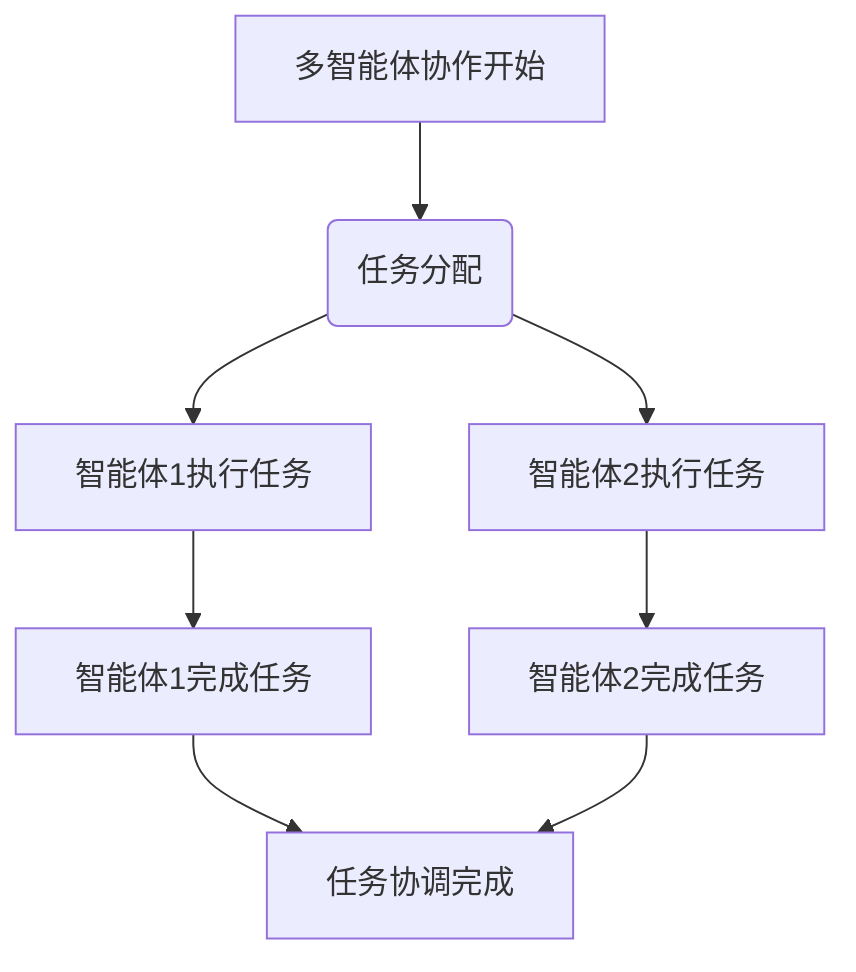
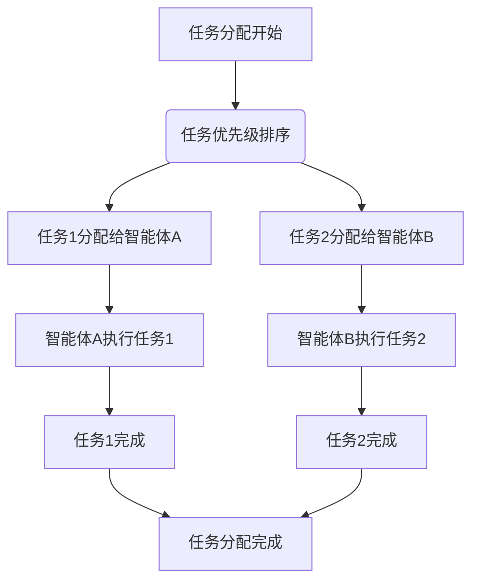
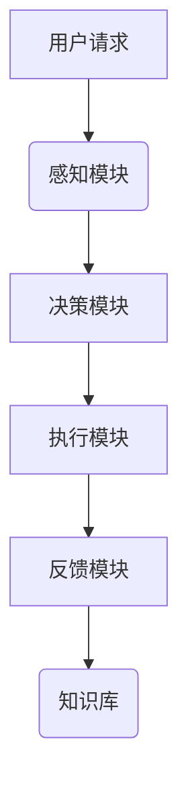

                 


# AI Agent在智能城市应急响应中的角色

## 关键词：AI Agent, 智能城市, 应急响应, 多智能体协作, 城市安全, 实时响应

## 摘要：  
在智能城市中，AI Agent（人工智能代理）作为连接物理世界与数字世界的桥梁，在应急响应中扮演着越来越重要的角色。通过分析AI Agent的核心概念、算法原理、系统架构以及实际应用案例，本文深入探讨了AI Agent在智能城市应急响应中的具体作用，揭示了其在提升城市安全、优化资源分配、实时响应突发事件等方面的优势。本文还结合实际场景，详细介绍了AI Agent的实现技术，并提出了未来发展的建议。

---

# 第一部分: AI Agent在智能城市应急响应中的背景与概念

## 第1章: AI Agent与智能城市应急响应概述

### 1.1 AI Agent的基本概念  
AI Agent是一种能够感知环境、自主决策并执行任务的智能实体。它具备以下核心特征：  
1. **自主性**：无需外部干预，自主完成任务。  
2. **反应性**：能够实时感知环境变化并做出响应。  
3. **目标导向性**：基于目标驱动行为，优化决策过程。  
4. **学习能力**：通过数据和经验不断优化自身能力。  

### 1.2 智能城市应急响应的背景  
智能城市通过整合物联网、大数据、人工智能等技术，实现城市资源的高效管理和突发事件的快速响应。应急响应在智能城市中涵盖火灾、地震、交通事故等多种场景，要求响应系统具备实时性、准确性和高效性。  

### 1.3 AI Agent在智能城市应急响应中的作用  
AI Agent通过多智能体协作、实时数据分析和智能决策，显著提升了应急响应的效率和准确性。它能够：  
- 协调多个应急资源，优化资源配置。  
- 实时分析海量数据，快速制定应对策略。  
- 在复杂场景中做出最优决策，降低人员伤亡和财产损失。  

---

# 第二部分: AI Agent的核心概念与技术原理

## 第2章: AI Agent的核心概念与体系结构  

### 2.1 AI Agent的体系结构  
AI Agent的体系结构可分为以下几类：  
1. **反应式架构**：基于当前感知做出实时反应。  
2. **基于模型的架构**：依赖知识库进行推理和决策。  
3. **混合式架构**：结合反应式和基于模型的特性，兼顾实时性和全局性。  

### 2.2 AI Agent的核心技术  
AI Agent的核心技术包括：  
1. **自然语言处理（NLP）**：用于理解和生成人类语言，实现人机交互。  
2. **机器学习（ML）**：通过数据训练模型，提升AI Agent的学习和决策能力。  
3. **知识图谱**：构建城市实体的知识网络，支持复杂场景下的推理和决策。  

### 2.3 AI Agent与多智能体协作  
多智能体协作是AI Agent在应急响应中的关键能力。通过博弈论和强化学习，多个AI Agent可以协同完成复杂任务。例如，在火灾应急中，消防机器人、救护车和救援人员可以协同工作，优化救援路径和资源分配。  

---

# 第三部分: AI Agent的算法原理与数学模型  

## 第3章: AI Agent的算法原理  

### 3.1 多智能体协作算法  
多智能体协作算法是AI Agent的核心算法之一。以下是其实现流程：  



数学模型如下：  
$$ \text{团队收益} = \sum_{i=1}^{n} v_i $$
其中，\( v_i \) 表示第i个智能体的贡献值。  

### 3.2 应急响应中的任务分配算法  
任务分配算法是AI Agent在应急响应中的关键算法。以下是其实现流程：  



数学模型如下：  
$$ \text{总收益} = \sum_{j=1}^{m} w_j \cdot v_j $$
其中，\( w_j \) 表示任务j的权重，\( v_j \) 表示任务j的价值。  

---

# 第四部分: AI Agent的系统分析与架构设计  

## 第4章: AI Agent的系统分析与架构设计  

### 4.1 应急响应场景介绍  
在智能城市中，应急响应场景包括火灾、地震、交通事故等多种类型。以火灾为例，AI Agent需要协调消防人员、救护车和无人机等资源，快速制定救援方案。  

### 4.2 系统功能设计  
以下是系统的功能模块：  
1. **感知模块**：实时采集环境数据（如温度、烟雾浓度等）。  
2. **决策模块**：基于数据和知识库，制定应急方案。  
3. **执行模块**：协调各智能体执行任务。  
4. **反馈模块**：实时反馈执行结果，优化后续决策。  

### 4.3 系统架构设计  
以下是系统的架构图：  



### 4.4 系统接口设计  
系统接口包括：  
1. **感知接口**：与传感器、摄像头等设备对接。  
2. **决策接口**：与城市管理系统对接。  
3. **执行接口**：与应急设备（如无人机、消防车）对接。  

---

# 第五部分: AI Agent的项目实战  

## 第5章: AI Agent的项目实战  

### 5.1 环境安装  
需要安装以下工具和库：  
- Python 3.8+  
- TensorFlow 2.0+  
- OpenAI API  
- Mermaid CLI  

### 5.2 核心代码实现  
以下是AI Agent的核心代码示例：  

```python
class AI-Agent:
    def __init__(self, knowledge_base):
        self.knowledge_base = knowledge_base
        self.sensors = []
        self.executors = []
    
    def perceive(self):
        # 获取传感器数据
        data = [s感知数据 for s in self.sensors]
        return data
    
    def decide(self, data):
        # 基于数据和知识库进行决策
        action = self.knowledge_base推理(data)
        return action
    
    def execute(self, action):
        # 执行动作
        executor = 随机选择一个executors
        executor.execute(action)
```

### 5.3 代码应用解读与分析  
AI Agent通过感知环境、决策和执行动作，实现对应急场景的实时响应。代码中，感知模块负责采集数据，决策模块基于知识库进行推理，执行模块协调各智能体完成任务。  

### 5.4 实际案例分析  
以火灾应急为例，AI Agent可以协调消防人员和无人机，快速制定救援方案，优化资源分配，降低人员伤亡和财产损失。  

---

# 第六部分: AI Agent的最佳实践  

## 第6章: 最佳实践  

### 6.1 小结  
AI Agent在智能城市应急响应中的应用前景广阔，其核心能力包括多智能体协作、实时数据分析和智能决策。  

### 6.2 注意事项  
1. 数据隐私保护：确保用户数据的安全性和隐私性。  
2. 系统可靠性：在复杂场景中，确保系统的稳定性和容错性。  
3. 人机协作：在AI Agent辅助下，确保人类专家的最终决策权。  

### 6.3 拓展阅读  
推荐阅读以下书籍和论文：  
1. 《多智能体系统》（Multi-Agent Systems）  
2. 《人工智能与应急响应》（AI and Emergency Response）  

---

# 结语  
AI Agent作为智能城市应急响应的核心技术，正在推动城市安全和应急响应能力的全面提升。未来，随着人工智能和多智能体技术的进一步发展，AI Agent将在智能城市中发挥更大的作用。

---

# 作者：AI天才研究院/AI Genius Institute & 禅与计算机程序设计艺术 /Zen And The Art of Computer Programming  

---

（本文结束，如需引用，请注明出处）

