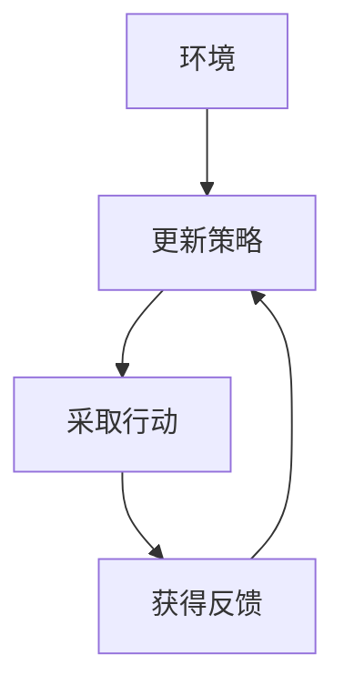

                 

<think>
嗯，用户希望我写一篇关于《AI Agent在智能城市规划决策中的角色》的技术博客文章。看起来用户已经提供了一个详细的目录大纲，现在我需要根据这个大纲来撰写整篇文章。首先，我需要理解每个章节的内容，然后逐步展开每个部分，确保逻辑清晰，内容详尽。

首先，文章的结构分为六个部分，每个部分有多个章节。我需要按照这个结构来组织内容。第一部分是背景与概念，介绍AI Agent和智能城市的基本概念。第二部分是核心概念与技术原理，详细讲解AI Agent的工作原理和相关算法。第三部分是应用与系统架构，讨论AI Agent在智能城市中的具体应用场景和系统设计。第四部分是项目实战，通过案例展示AI Agent的实际应用。第五部分是最佳实践，总结经验和教训。最后是附录，提供参考文献和工具资源。

在撰写过程中，我需要确保每个章节都有足够的细节，比如在第二章，我需要解释强化学习、监督学习和无监督学习，并用Mermaid流程图展示算法的工作流程。同时，提供Python代码示例，帮助读者理解如何实现这些算法。

第三章需要详细描述AI Agent在智能交通、能源管理和公共安全中的应用。例如，在智能交通部分，我可以讨论交通流量预测和优化，交通信号灯的智能控制，以及智能路径规划与导航。我需要使用Mermaid类图展示领域模型，系统架构图展示整体结构，以及接口设计和交互流程图。

项目实战部分，我需要选择一个具体的场景，比如交通信号优化，展示如何安装环境，编写核心代码，分析结果，并给出案例分析。这部分需要详细的代码解释和实际效果展示。

最后，最佳实践部分需要总结项目中的经验和教训，给出一些建议，比如数据质量和模型泛化能力的重要性，并推荐一些扩展阅读的资料。

总的来说，我需要按照用户提供的大纲，逐步展开每个部分，确保每个章节都详细且有深度，同时使用适当的图表和代码示例来增强文章的可读性和专业性。这样，读者不仅能理解AI Agent在智能城市中的角色，还能掌握相关的技术细节和实际应用方法。
</think>

# AI Agent在智能城市规划决策中的角色

## 关键词：AI Agent, 智能城市, 规划决策, 强化学习, 多智能体协作, 交通优化, 能源管理

## 摘要：  
随着城市化进程的加速，智能城市的建设已成为全球关注的焦点。AI Agent（人工智能代理）作为一种能够自主感知、决策和行动的智能体，正在成为智能城市规划与决策中的重要角色。本文将从AI Agent的基本概念、技术原理、应用场景、系统架构到项目实战，全面探讨AI Agent在智能城市中的作用与实现。通过分析强化学习、监督学习和多智能体协作算法，结合实际案例，本文旨在为读者提供一份系统而深入的技术指南，帮助理解并应用AI Agent技术解决智能城市中的复杂问题。

---

# 第一部分: AI Agent 在智能城市规划决策中的背景与概念

## 第1章: AI Agent 的基本概念与智能城市规划的背景

### 1.1 AI Agent 的定义与特点

#### 1.1.1 AI Agent 的定义  
AI Agent（人工智能代理）是一种能够感知环境、自主决策并采取行动以实现特定目标的智能系统。它可以看作是一个智能体，通过传感器获取信息，利用算法处理信息，并通过执行器与环境交互。

#### 1.1.2 AI Agent 的核心特点  
- **自主性**：AI Agent能够在没有外部干预的情况下独立运行。  
- **反应性**：能够实时感知环境变化并做出快速响应。  
- **目标导向**：所有行动均以实现预设目标为导向。  
- **学习能力**：通过数据和经验不断优化自身行为。  

#### 1.1.3 AI Agent 与传统自动化系统的主要区别  
| 特性         | AI Agent                          | 传统自动化系统                     |  
|--------------|-----------------------------------|------------------------------------|  
| 智能性       | 高                                | 低                                |  
| 自适应能力   | 强                                | 弱                                |  
| 决策能力     | 能够自主决策                     | 需要人工干预或固定规则             |  

---

### 1.2 智能城市规划的背景与挑战

#### 1.2.1 智能城市的概念与发展现状  
智能城市是指通过广泛应用信息技术，优化城市资源分配、提升居民生活质量、降低运营成本的城市发展模式。目前，全球许多城市已经开始尝试将AI、大数据、物联网等技术应用于城市规划与管理。

#### 1.2.2 智能城市规划中的主要挑战  
- **数据复杂性**：城市系统涉及交通、能源、环境等多个领域，数据来源多样且复杂。  
- **决策复杂性**：城市规划需要综合考虑经济、社会、环境等多方面的因素。  
- **实时性要求**：许多城市问题需要实时响应，例如交通拥堵、公共安全事件等。  
- **系统集成难度**：不同部门和系统的协同工作需要高度集成化的解决方案。  

#### 1.2.3 AI Agent 在智能城市中的潜在作用  
AI Agent可以通过实时数据处理、智能决策和自动化行动，帮助城市实现资源优化、服务提升和问题快速解决。例如，在交通管理中，AI Agent可以实时调整信号灯配时以缓解拥堵；在能源管理中，AI Agent可以动态优化能源分配以降低消耗。

---

### 1.3 本章小结  
本章主要介绍了AI Agent的基本概念及其在智能城市中的潜在作用。通过对比AI Agent与传统自动化系统的区别，强调了AI Agent在智能城市规划中的重要性。接下来，我们将深入探讨AI Agent的核心技术原理及其在智能城市中的具体应用。

---

## 第2章: AI Agent 的核心概念与工作原理

### 2.1 AI Agent 的核心概念

#### 2.1.1 感知层: 数据采集与处理  
AI Agent通过传感器、摄像头、数据库等设备获取环境数据，并利用数据处理技术（如特征提取、数据清洗）对数据进行分析。  

#### 2.1.2 决策层: 策略制定与优化  
AI Agent基于感知层提供的数据，结合预设的目标和算法（如强化学习、监督学习）制定决策策略，并对策略进行优化。  

#### 2.1.3 执行层: 行动与反馈  
AI Agent根据决策层的指令执行具体行动，并通过执行器（如信号灯控制器、能源调节器）与环境交互，同时收集反馈信息以改进后续决策。

---

### 2.2 AI Agent 的技术原理

#### 2.2.1 基于强化学习的决策机制  
强化学习是一种通过试错方式优化决策策略的技术。AI Agent通过与环境交互，不断尝试不同的行动以获得最大化的累积奖励。  

**算法流程图（强化学习）：**  


#### 2.2.2 基于监督学习的模式识别  
监督学习通过训练数据学习输入与输出之间的映射关系，帮助AI Agent识别特定模式（如交通流量模式、能源消耗模式）。  

#### 2.2.3 基于无监督学习的知识发现  
无监督学习用于发现数据中的潜在模式或结构，例如发现用户行为模式或设备故障模式。  

---

### 2.3 AI Agent 的核心算法与实现

#### 2.3.1 强化学习算法: Q-learning  
Q-learning是一种经典的强化学习算法，通过维护Q值表（Q-table）记录状态-动作对的期望奖励，逐步优化决策策略。  

**数学模型: Q-learning**  
$$ Q(s, a) = Q(s, a) + \alpha \cdot [r + \gamma \cdot \max Q(s', a) - Q(s, a)] $$  
其中，$\alpha$是学习率，$\gamma$是折扣因子。  

#### 2.3.2 监督学习算法: 支持向量机  
支持向量机（SVM）是一种常用的监督学习算法，用于分类和回归问题。  

#### 2.3.3 多智能体协作算法  
多智能体协作算法通过协调多个AI Agent的行为，实现复杂任务的协同完成。  

---

### 2.4 本章小结  
本章详细介绍了AI Agent的核心概念和技术原理，包括感知层、决策层和执行层的工作流程，以及强化学习、监督学习和多智能体协作算法的实现原理。这些技术为AI Agent在智能城市中的应用奠定了理论基础。

---

## 第3章: 智能城市规划中的 AI Agent 应用场景

### 3.1 智能交通管理中的 AI Agent

#### 3.1.1 交通流量预测与优化  
AI Agent可以通过分析历史交通数据，预测未来交通流量，并优化信号灯配时以减少拥堵。  

#### 3.1.2 交通信号灯智能控制  
AI Agent可以根据实时交通状况动态调整信号灯配时，例如在高峰时段优先放行公交车或紧急车辆。  

#### 3.1.3 智能路径规划与导航  
AI Agent可以帮助自动驾驶车辆或行人实时规划最优路径，避开拥堵或危险区域。  

---

### 3.2 智能能源管理中的 AI Agent

#### 3.2.1 能源消耗预测与优化  
AI Agent可以通过分析能源消耗数据，预测未来能源需求，并优化能源分配策略。  

#### 3.2.2 智能电网调度  
AI Agent可以根据实时电力需求和发电能力，动态调整电网负荷分配，确保电力供应的稳定性。  

#### 3.2.3 可再生能源接入与管理  
AI Agent可以帮助城市优化可再生能源（如太阳能、风能）的接入和使用，降低能源消耗。  

---

### 3.3 智能公共安全中的 AI Agent

#### 3.3.1 公共安全事件预警与响应  
AI Agent可以通过分析社交媒体、摄像头等数据，实时监测公共安全事件（如火灾、恐怖袭击），并快速启动应急响应。  

#### 3.3.2 灾害应急管理  
AI Agent可以帮助城市制定灾害应急预案，并在灾害发生时协调各部门资源，优化救援行动。  

---

### 3.4 本章小结  
本章通过具体案例展示了AI Agent在智能交通、能源管理和公共安全等领域的广泛应用。AI Agent通过实时感知、智能决策和自动化行动，显著提升了城市规划与管理的效率和效果。

---

## 第4章: AI Agent 的系统架构与实现

### 4.1 系统分析与架构设计

#### 4.1.1 问题场景介绍  
以智能交通管理为例，假设某城市面临严重的交通拥堵问题，希望通过部署AI Agent优化信号灯配时。  

#### 4.1.2 系统功能设计  
- 数据采集模块：收集交通流量、信号灯状态等数据。  
- 决策模块：基于强化学习算法优化信号灯配时。  
- 执行模块：将优化后的信号灯配时发送至交通控制系统。  

#### 4.1.3 系统架构图  


---

### 4.2 项目实战: AI Agent 在交通信号优化中的实现

#### 4.2.1 环境安装  
- 安装Python 3.8及以上版本。  
- 安装相关库：`numpy`, `scipy`, `matplotlib`, `pymoo`。  

#### 4.2.2 核心代码实现  
```python
import numpy as np
from pymoo.optimize import minimize

# 定义优化问题
class TrafficSignalOptimizer:
    def __init__(self, traffic_data):
        self.traffic_data = traffic_data
    
    def objective_function(self, x):
        # x 是信号灯配时参数
        # 计算交通流量
        traffic_flow = np.sum(self.traffic_data)
        # 计算拥堵程度
        congestion_level = np.max(self.traffic_data) - np.min(self.traffic_data)
        return traffic_flow + congestion_level

# 初始化优化问题
optimizer = TrafficSignalOptimizer(traffic_data)

# 调用优化算法
result = minimize(optimizer.objective_function, 
                  method='nelder-mead',
                  options={'maxiter': 100})

# 输出最优解
print(result)
```

---

### 4.3 本章小结  
本章通过一个具体的项目案例，展示了AI Agent在交通信号优化中的实现过程。从环境安装到代码实现，详细介绍了AI Agent技术的实际应用。

---

## 第5章: 最佳实践与注意事项

### 5.1 项目经验与教训

#### 5.1.1 数据质量的重要性  
在实际项目中，数据的准确性和完整性直接影响AI Agent的性能。因此，在部署AI Agent之前，需要确保数据来源可靠且数据清洗充分。  

#### 5.1.2 模型泛化能力的优化  
AI Agent的决策模型需要具备良好的泛化能力，以应对各种不确定性。可以通过增加训练数据量、优化算法参数等方式提升模型的泛化能力。  

---

### 5.2 注意事项与建议

#### 5.2.1 数据隐私与安全  
在智能城市中，AI Agent可能涉及大量敏感数据（如交通数据、能源数据），需要特别注意数据隐私与安全问题。  

#### 5.2.2 系统集成与协同  
AI Agent需要与城市现有系统（如交通管理系统、能源管理系统）进行深度集成，确保各系统协同工作。  

#### 5.2.3 人机协作的平衡  
AI Agent可以显著提高城市规划与管理的效率，但其决策过程需要与人类专家的判断相结合，确保决策的合理性和透明性。  

---

### 5.3 拓展阅读  
- 《强化学习：理论与应用》  
- 《多智能体系统：原理与实践》  
- 《智能城市：AI 技术的应用与挑战》  

---

## 附录

### 附录A: 参考文献  
1. Russell, S., & Norvig, P. (2010). *Artificial Intelligence: A Modern Approach*.  
2. Lapan, S. (2018). *Deep Reinforcement Learning in Python*.  
3. Sun, G., et al. (2020). *Intelligent Urban Planning Using AI Agents*.  

### 附录B: 工具与资源  
- Python库: `pymoo`, `scikit-learn`, `tensorflow`  
- 开发平台: Google Colab, AWS SageMaker  
- 数据来源: 公共交通数据集、能源数据集  

---

## 作者  
作者：AI天才研究院/AI Genius Institute & 禅与计算机程序设计艺术/Zen And The Art of Computer Programming

