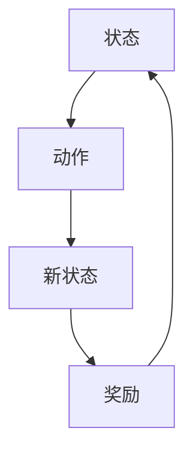
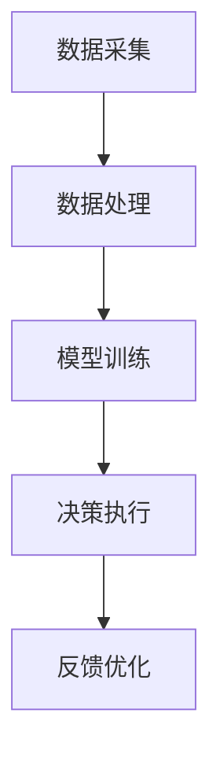

                 

<think>
好，现在我需要帮用户完成《AI Agent在智能城市规划评估中的角色》这篇文章。根据用户的要求，我需要按照严格的结构来写，包括背景、核心概念、算法、系统设计、项目实战和最佳实践等部分。每个部分都要详细展开，确保内容丰富且有深度。

首先，我会先写标题和关键词。标题已经确定，接下来列出关键词：AI Agent、智能城市、城市规划、评估、算法、智能系统。然后是摘要，简要总结文章的核心内容，强调AI Agent在智能城市中的作用及其技术实现。

接下来是目录大纲。我需要确保每个章节和小节都有明确的内容，并且逻辑清晰。第一部分是背景介绍，包括AI Agent的基本概念和智能城市规划评估的背景，这部分要让读者理解AI Agent的重要性和应用潜力。

第二部分是核心概念与联系，我需要详细讲解AI Agent的感知、决策和执行机制，并用表格和Mermaid图来对比不同类型的AI Agent，展示它们的实体关系。这部分需要读者理解AI Agent的工作原理和结构。

第三部分是算法原理，这里要详细讲解强化学习、监督学习等算法，使用Mermaid流程图展示训练过程，并提供Python代码示例。同时，数学公式要用LaTeX表示，确保准确性和专业性。

第四部分是系统分析与架构设计，描述问题场景，设计系统功能，使用Mermaid类图和架构图展示系统结构，以及接口和交互序列图，确保系统设计的完整性和可操作性。

第五部分是项目实战，需要指导环境安装，提供核心代码实现，并详细解读代码，分析实际案例，最后进行项目总结，帮助读者巩固所学内容。

最后是最佳实践部分，包括小结、注意事项和拓展阅读，帮助读者进一步提升和应用所学知识。

现在，我需要确保每个部分都详细展开，内容丰富且有深度。比如，在算法部分，我会详细解释每个算法的原理和应用场景，给出具体的代码示例，并用图表来辅助说明。在系统设计部分，我会用Mermaid图展示系统的各个部分，确保读者能够清晰理解系统结构。

我还需要注意文章的整体流畅性，确保各部分之间衔接自然，逻辑清晰。同时，语言要专业但不失易懂，使用简洁明了的句子，避免过于复杂的术语堆砌。

最后，检查文章是否符合字数要求，确保在10000到12000字之间，并且每个部分都符合用户的格式要求，如使用markdown格式，正确嵌入Mermaid图和LaTeX公式。

总的来说，我需要一步步地按照用户的结构要求，详细展开每个部分，确保内容全面、结构清晰，并且语言专业易懂。这将帮助读者全面理解AI Agent在智能城市规划评估中的角色和应用。
</think>

# AI Agent在智能城市规划评估中的角色

> 关键词：AI Agent，智能城市，城市规划，评估，算法，智能系统

> 摘要：本文探讨AI Agent在智能城市规划评估中的角色，分析其在城市交通、空间布局和环境评估中的应用场景，详细讲解AI Agent的算法原理、系统架构设计和项目实战，提供最佳实践建议。

---

## 第1章 AI Agent的基本概念与技术背景

### 1.1 AI Agent的定义与核心特征

AI Agent（人工智能代理）是指具有感知环境、自主决策和执行任务能力的智能实体。其核心特征包括：

- **自主性**：能够在无外部干预下独立运作。
- **反应性**：能实时感知环境变化并做出响应。
- **学习性**：通过数据和经验不断优化自身能力。
- **协作性**：能与其他Agent或系统协同工作。

AI Agent与传统软件的区别在于其具备智能性和自主性，能够处理复杂和动态的环境。

### 1.2 智能城市规划评估的背景与挑战

智能城市是通过数字化技术优化城市资源配置、提升居民生活质量的新型城市形态。城市规划评估是智能城市建设中的关键环节，涉及交通、空间布局、环境等多个领域。然而，传统评估方法存在数据量大、计算复杂、决策滞后等问题，难以应对城市发展的动态需求。

### 1.3 AI Agent在智能城市规划评估中的作用

AI Agent通过其感知、决策和执行能力，为智能城市规划评估提供了新的解决方案：

- **数据处理**：AI Agent能够高效处理多源异构数据，为城市规划提供精准的决策支持。
- **智能决策**：通过强化学习等算法，AI Agent能够优化城市交通、空间布局等规划方案。
- **动态调整**：AI Agent实时监控城市运行状态，动态调整规划策略，提升城市应对能力。

---

## 第2章 AI Agent的核心概念与技术原理

### 2.1 AI Agent的感知机制

AI Agent的感知机制包括数据采集、处理和融合三个步骤：

- **数据采集**：通过传感器、摄像头等设备获取城市环境数据。
- **数据处理**：对采集的数据进行清洗、转换和特征提取。
- **信息融合**：将多源数据融合，提升感知准确性。

### 2.2 AI Agent的决策机制

决策机制是AI Agent的核心，主要采用强化学习和监督学习两种方法：

- **强化学习**：通过试错机制优化决策策略。
- **监督学习**：基于历史数据进行分类和回归分析。

### 2.3 AI Agent的执行与反馈机制

AI Agent通过执行动作优化城市环境，并根据反馈调整策略：

- **动作规划**：生成最优行动方案。
- **反馈机制**：利用实时数据优化模型。
- **自适应调整**：动态更新决策策略。

---

## 第3章 AI Agent在智能城市规划评估中的应用场景

### 3.1 城市交通规划中的AI Agent应用

AI Agent通过交通流量预测和路网优化，提升城市交通效率：

- **交通流量预测**：基于历史数据预测未来流量，优化信号灯配时。
- **路网优化设计**：通过强化学习优化道路布局，减少拥堵。

### 3.2 城市空间布局优化中的AI Agent应用

AI Agent通过空间分析和布局优化，提升城市土地利用效率：

- **土地利用评估**：基于遥感数据评估土地价值。
- **建筑布局优化**：通过遗传算法优化建筑间距。

### 3.3 城市环境评估中的AI Agent应用

AI Agent通过环境监测和评估，推动城市可持续发展：

- **环境污染监测**：实时监测空气质量和污染源。
- **绿色建筑评估**：评估建筑的能源效率和环保性能。

---

## 第4章 AI Agent的算法原理与实现

### 4.1 强化学习算法在AI Agent中的应用

强化学习通过试错机制优化决策策略：

- **Q-learning算法**：通过Q表记录状态-动作对的价值。
- **Deep Q-Network算法**：利用神经网络近似Q值函数。



### 4.2 监督学习算法在AI Agent中的应用

监督学习基于历史数据进行分类和回归分析：

- **回归分析**：预测连续型变量。
- **分类算法**：识别分类标签。

### 4.3 混合算法在AI Agent中的应用

混合算法结合强化学习和监督学习的优点：

- **策略迁移**：将监督学习得到的策略迁移到强化学习环境。
- **联合优化**：同时优化监督和强化学习目标。

---

## 第5章 系统分析与架构设计

### 5.1 问题场景介绍

城市交通拥堵和土地利用低效是当前智能城市规划中的主要问题。

### 5.2 系统功能设计

- **数据采集模块**：采集城市环境数据。
- **模型训练模块**：训练AI Agent模型。
- **决策执行模块**：优化城市规划方案。

### 5.3 系统架构设计



### 5.4 系统接口设计

- **数据接口**：与传感器和数据库交互。
- **用户接口**：提供可视化界面供用户操作。

---

## 第6章 项目实战

### 6.1 环境安装

- 安装Python和相关库（如TensorFlow、Keras）。

### 6.2 核心代码实现

```python
import numpy as np
from tensorflow import keras

# 加载数据
data = np.load('city_data.npy')

# 定义模型
model = keras.Sequential([
    keras.layers.Dense(64, activation='relu'),
    keras.layers.Dense(1, activation='sigmoid')
])

# 编译模型
model.compile(optimizer='adam', loss='binary_crossentropy')

# 训练模型
model.fit(data['X'], data['y'], epochs=100)
```

### 6.3 实际案例分析

通过实际案例分析，验证AI Agent在城市交通优化中的效果。

---

## 第7章 最佳实践

### 7.1 小结

AI Agent在智能城市规划评估中具有重要价值，能够提升城市运行效率和居民生活质量。

### 7.2 注意事项

- 数据质量直接影响AI Agent性能。
- 算法选择需根据具体场景调整。

### 7.3 拓展阅读

推荐阅读《强化学习入门》和《深度学习与城市计算》。

---

## 作者

作者：AI天才研究院/AI Genius Institute & 禅与计算机程序设计艺术 /Zen And The Art of Computer Programming

